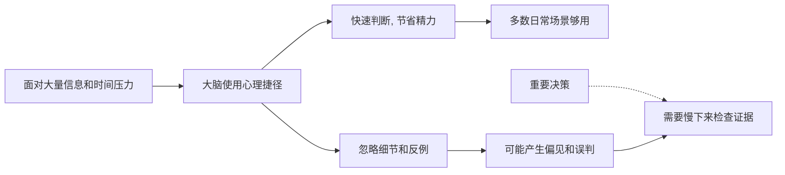

## 心理学思维筑基课: 人会使用心理捷径
  
### 作者  
digoal  
  
### 日期  
2026-05-05 
  
### 标签  
心理捷径 , 效率 , 准确性 , 平衡 , 心理捷径证据 , 偏见 , 刻板影响 , 加一道检查 , 经验法则 , 逻辑推理 
  
----  
  
## 背景 
为了快速判断，人会依赖经验法则，但这也会产生偏见和误判。  
  
> 面向对象: 初中到高中学生  
> 核心问题: 为什么人经常不经过完整分析，就快速判断一个人、一件事或一个选择？  
> 先说结论: 人会使用心理捷径，是因为现实信息太多、时间有限、注意力有限，大脑必须用经验法则快速做判断。这些捷径能提高效率，但也会带来偏见、误判和过度自信。

## 一张图先看懂



## 求真讲法

### 它到底说了什么

“人会使用心理捷径”可以先用一句话理解：

> 大脑不会每次都从零开始做完整推理，而会借助过去经验、明显线索和简单规则，快速得出一个大概判断。

心理学里常把这类捷径叫作**启发式**。  
启发式不是严格证明，而是“通常还算管用的快速判断方法”。

比如：

| 心理捷径 | 快速判断方式 | 可能问题 |
|---|---|---|
| 可得性启发 | 最近听到很多，就觉得更常见 | 新闻越吓人，越容易高估概率 |
| 代表性启发 | 看起来像哪类人，就归到哪类 | 容易刻板印象 |
| 锚定效应 | 先看到的数字影响后续判断 | 容易被起始信息带偏 |
| 光环效应 | 一个优点让人觉得整体都好 | 容易以偏概全 |

所以，这条原则真正表达的是：

**人不是纯粹理性计算机器，而是常在有限信息下，用快速、节能、近似的方法做判断。**

### 它是怎么来的

这条原则来自认知心理学和判断决策研究。

第一，**信息太多，不能全部处理。**  
每天看到的人、消息、任务、选择太多，如果每件事都完整分析，大脑会被压垮。

第二，**时间常常不允许慢慢推理。**  
过马路、回答问题、判断对方情绪、决定先做哪件事，都需要快速反应。

第三，**过去经验能帮助快速预测。**  
如果某种线索过去常常意味着危险或机会，大脑会优先利用它。

第四，**快速判断有生存价值。**  
在很多场景里，反应够快比分析够完美更重要。

可以用一个简单的 ASCII 图理解：

```text
完整推理:
收集信息 -> 比较证据 -> 分析概率 -> 得出结论

心理捷径:
抓住明显线索 -> 套用经验规则 -> 快速判断
```

这就是为什么心理捷径不是“人太笨”，而是大脑在有限资源下的现实策略。

### 它依赖哪些假设

“人会使用心理捷径”成立，依赖几个关键前提。

| 假设 | 含义 | 如果不成立会怎样 |
|---|---|---|
| 注意力和时间有限 | 不能事事完整分析 | 如果资源无限，就不需要捷径 |
| 环境中有可利用线索 | 经验规则有时能帮忙 | 如果线索完全无效，捷径会经常失败 |
| 大脑追求效率 | 会在准确和省力之间取平衡 | 如果只追求绝对准确，决策会很慢 |
| 人会受经验和情绪影响 | 判断不是纯计算 | 如果完全不受影响，偏见会少很多 |

这也说明一句关键的话：

> 心理捷径不是敌人，未经检查的心理捷径才危险。

### 常见误解

**误解一：心理捷径都是坏的。**  
不对。没有心理捷径，人很难高效生活。

**误解二：聪明人就不会用心理捷径。**  
不对。聪明人也会用，只是更可能在关键时刻检查它。

**误解三：凭直觉一定不可靠。**  
不对。在熟悉领域里，长期训练形成的直觉可能很有价值。

**误解四：只要多想想，就一定不会偏见。**  
不对。有些偏见很隐蔽，需要证据、反馈和外部校正。

## 求存讲法

### 它有什么用

这条原则最大的作用，是让你学会区分：

- 哪些场景可以快速判断。
- 哪些场景必须慢下来。

日常小事可以用捷径：

- 走熟悉路线。
- 快速判断饭菜是否合口味。
- 根据经验安排普通任务。

重要事情就要检查捷径：

- 评价一个人。
- 做升学和职业选择。
- 判断复杂新闻。
- 处理冲突和误会。

因为越重要的判断，越不能只靠“看起来像”“我感觉是”“大家都这么说”。

### 它怎么迁移到熟悉领域

这个原则在学生生活里非常常见。

| 场景 | 心理捷径 | 可能误判 |
|---|---|---|
| 看到同学沉默 | “他肯定不喜欢我” | 也许只是累或在想事 |
| 一次考试失败 | “我就是不适合这科” | 可能只是复习方法有问题 |
| 看到热门视频很多人转发 | “这一定是真的” | 热度不等于真实性 |
| 老师批评一次 | “老师针对我” | 可能只是指出具体问题 |

迁移后的核心意思是：

> 第一反应很有用，但第一反应不一定就是事实。

### 它的适用范围和边界

这条原则适合用于：

- 理解直觉、偏见、刻板印象和快速判断。
- 提醒自己在重要决策中慢下来。
- 分析为什么人会被标题、热度、第一印象和数字锚点影响。
- 训练更清醒的判断习惯。

但它也有边界。

第一，不是所有捷径都会导致错误。  
有些经验规则在熟悉环境里非常有效。

第二，不能因为有偏见，就否定所有直觉。  
关键是看直觉来自训练，还是来自未经检验的印象。

第三，慢思考也不一定总正确。  
如果信息错误、逻辑混乱，想很久也会错。

第四，心理捷径常和情绪绑在一起。  
恐惧、愤怒、喜欢和厌恶，会让某些捷径更强。

### 正例: 怎么用它提升能力

假设一个学生看到一条网上消息，标题很吓人，评论区也很多人附和。

第一反应可能是：

- 这么多人说，应该是真的。
- 标题这么严重，事情一定很大。

如果他知道“人会使用心理捷径”，就会意识到自己可能被可得性、从众和情绪带动。

更好的做法是：

- 看来源是否可靠。
- 找原始信息。
- 看有没有相反证据。
- 等情绪降一点再判断。

这不是让人变慢，而是把快速反应交给证据复核。

### 反例: 前提不成立会怎样

假设有人说：“我第一眼觉得这个同学很冷漠，所以他一定不好相处。”

这个判断的问题，是把第一印象当成完整事实。

可能真实情况是：

- 他只是当天心情不好。
- 他不擅长主动表达。
- 他在陌生环境里比较紧张。
- 你把“安静”直接解释成了“冷漠”。

这里失败的根本原因，是忽略了“环境中线索不一定可靠”和“人会受经验和情绪影响”这两个前提。  
心理捷径帮你快速分类，但分类太快，就会把复杂的人看扁。

## 思考

为什么人明知道自己可能误判，还是会相信第一感觉？

因为第一感觉来得快，而且很省力。  
它不像一个猜测，感觉更像事实本身。  
大脑会说：“我就是觉得不对。”  
但这个“觉得”，可能只是过去经验、情绪、社会印象和当下线索混合后的产物。

这也引出几个更深的问题：

- 你的判断是来自证据，还是来自熟悉感？
- 你讨厌一个人，是因为他真的伤害了你，还是因为他像某类你不喜欢的人？
- 你相信一件事，是因为它真实，还是因为它出现得太频繁？

成熟的心理学思维，不是消灭心理捷径，而是给它加一道检查：

- 我现在是不是在以偏概全？
- 有没有反例？
- 有没有其他解释？
- 这个判断如果错了，代价大不大？

“人会使用心理捷径”真正教人的，是既尊重直觉的效率，也警惕直觉的偷懒。

## 最后记住

1. 心理捷径是大脑在信息多、时间少、注意力有限时使用的快速判断方法。
2. 它能提高效率，但也会带来偏见、刻板印象和过度自信。
3. 第一反应很有用，但第一反应不一定就是事实。
4. 熟悉领域的直觉可能可靠，陌生复杂场景里的直觉更需要检查。
5. 真正成熟的判断，不是不用捷径，而是知道什么时候该停下来核对证据。

## 参考资料

- Daniel Kahneman, *Thinking, Fast and Slow*, 关于快思考、慢思考、启发式和认知偏差的通俗框架。
- Amos Tversky 与 Daniel Kahneman 关于启发式和偏差的经典研究，说明可得性、代表性和锚定等捷径如何影响判断。
- David G. Myers, *Psychology*, 关于判断、决策、认知偏差和社会认知的通用教材体系。
- 本文为面向学生的简化解释，基于通用认知心理学与社会心理学教材框架，不用于诊断或替代专业心理帮助。

  
  
#### [PostgreSQL 解决方案集合](../201706/20170601_02.md "40cff096e9ed7122c512b35d8561d9c8")
  
  
#### [德哥 / digoal's Github - 公益是一辈子的事.](https://github.com/digoal/blog/blob/master/README.md "22709685feb7cab07d30f30387f0a9ae")
  
  
#### [About 德哥](https://github.com/digoal/blog/blob/master/me/readme.md "a37735981e7704886ffd590565582dd0")
  
  

  
