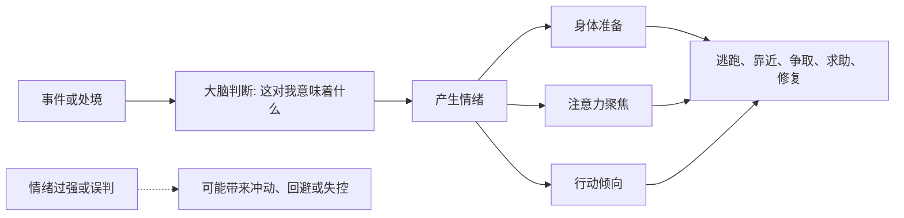

## 心理学思维筑基课: 情绪具有适应功能
  
### 作者  
digoal  
  
### 日期  
2026-05-05 
  
### 标签  
环境影响 , 情绪 , 提醒需求 , 威胁 , 边界 , 关系变化 , 身体准备 , 注意力聚焦 , 行动倾向  
  
----  
  
## 背景 
恐惧、愤怒、悲伤、羞耻、快乐都不是“没用的反应”，它们通常在提醒需求、威胁、边界或关系变化。  
  
  

> 面向对象: 初中到高中学生  
> 核心问题: 为什么恐惧、愤怒、悲伤、羞耻这些让人不舒服的情绪，并不只是“坏东西”？  
> 先说结论: 情绪具有适应功能，意思是情绪不是随机的麻烦，而是大脑和身体对环境、关系、需要和威胁作出的快速反应。情绪会提醒我们发生了什么、什么重要、要靠近还是远离、要保护边界还是寻求帮助。

## 一张图先看懂



## 求真讲法

### 它到底说了什么

“情绪具有适应功能”可以先用一句话理解：

> 情绪像身体和心理的提示系统，告诉你此刻有什么重要事情需要处理。

情绪不只是“心情好不好”，它通常包含三部分：

- 身体反应，比如心跳加快、肌肉紧张、想哭、脸红。
- 注意力变化，比如特别盯着危险、损失、评价或机会。
- 行动倾向，比如想逃开、靠近、解释、反击、求助、修复关系。

不同情绪常常有不同功能：

| 情绪 | 可能提醒什么 | 常见行动倾向 |
|---|---|---|
| 恐惧 | 有威胁、不安全 | 逃离、躲避、求保护 |
| 愤怒 | 边界被侵犯、不公平 | 反抗、表达、保护边界 |
| 悲伤 | 失去、重要连接断裂 | 停下来、哀悼、寻求支持 |
| 羞耻 | 自我形象或群体位置受威胁 | 隐藏、修正、重新获得接纳 |
| 快乐 | 有收获、有连接、有进展 | 靠近、重复、分享 |

所以，这条原则真正表达的是：

**情绪不是没用的噪音，而是帮助人适应环境的信号和行动准备。**

### 它是怎么来的

这条原则来自进化心理学、情绪心理学和临床心理学的共同观察。

第一，**情绪能帮助快速反应。**  
遇到危险时，如果先写一篇分析报告再行动，可能已经来不及。恐惧能让身体迅速进入警觉状态。

第二，**情绪能帮助分配注意力。**  
人在害怕时会盯着威胁，在愤怒时会盯着不公平，在悲伤时会反复想失去的东西。这些都说明情绪会告诉大脑“这里重要”。

第三，**情绪能帮助社会沟通。**  
哭泣可能让别人知道你需要支持；愤怒可能告诉别人你的边界被侵犯；微笑可能传递友好和接近。

第四，**情绪能帮助学习。**  
一次痛苦经历会让人记住危险，一次快乐体验会让人愿意重复有益行为。

可以用一个简单的 ASCII 图理解：

```text
环境变化
  -> 情绪信号
  -> 身体和注意力准备
  -> 行动
  -> 适应或调整
```

这就是为什么心理学不会简单把情绪分成“好情绪”和“坏情绪”。更准确的说法是：情绪有功能，但功能可能用得合适，也可能用得过头。

### 它依赖哪些假设

“情绪具有适应功能”成立，依赖几个关键前提。

| 假设 | 含义 | 如果不成立会怎样 |
|---|---|---|
| 情绪和处境有关 | 情绪通常回应某种需要、威胁或意义 | 如果情绪完全随机，功能性就很弱 |
| 情绪会影响身体和行动 | 情绪能推动准备和反应 | 如果情绪不改变行为，就难说有适应作用 |
| 情绪能传递信息 | 自己和别人都能从情绪中读到线索 | 如果情绪不能被理解，社会功能会变弱 |
| 情绪可能误报 | 情绪有用但不总是准确 | 如果把情绪当绝对事实，就容易误判 |

这也说明一句关键的话：

> 情绪值得被倾听，但不一定值得被直接服从。

### 常见误解

**误解一：负面情绪都是坏的。**  
不对。恐惧保护安全，愤怒保护边界，悲伤帮助处理失去。

**误解二：情绪越强，说明事情越真实。**  
不对。强烈情绪说明事情对你很重要，但不保证判断一定准确。

**误解三：成熟就是没有情绪。**  
不对。成熟不是没情绪，而是能识别、理解、调节和表达情绪。

**误解四：情绪有功能，所以冲动行为都合理。**  
不对。情绪可以解释冲动来源，但不自动证明冲动行为正确。

## 求存讲法

### 它有什么用

这条原则最大的作用，是让你从“压掉情绪”转向“读懂情绪”。

当情绪出现时，不要只问：

- 我怎么赶紧别难受？

还要问：

- 这个情绪在提醒我什么？
- 我有什么需要没有被看见？
- 我的边界是不是被侵犯了？
- 我是不是把旧经验投射到了现在？
- 这个情绪给出的行动冲动，适合现在的场景吗？

这会让情绪从敌人，变成一个需要翻译的信号。

### 它怎么迁移到熟悉领域

这个原则在学生生活中非常常见。

| 场景 | 情绪 | 可能功能 |
|---|---|---|
| 上台前紧张 | 焦虑 | 提醒你准备、关注风险 |
| 被同学误解 | 愤怒/委屈 | 提醒你边界和公平感受损 |
| 和朋友疏远 | 悲伤 | 提醒关系对你重要 |
| 考试失败后难受 | 失落 | 提醒目标重要，也推动复盘 |
| 完成难题后开心 | 快乐 | 强化继续学习和尝试 |

迁移后的核心意思是：

> 情绪不是要么压住、要么爆发，而是可以先读懂，再决定怎么行动。

### 它的适用范围和边界

这条原则适合用于：

- 理解恐惧、愤怒、悲伤、羞耻、快乐的心理意义。
- 改善情绪管理和人际沟通。
- 帮助自己识别需要、边界和压力来源。
- 区分情绪信号和冲动行为。

但它也有边界。

第一，情绪有功能，不代表情绪永远准确。  
有时焦虑是误报，有时愤怒来自误解。

第二，情绪过强时可能压倒理性。  
这时先稳定身体和环境，比立刻分析更重要。

第三，长期强烈情绪可能需要专业支持。  
持续抑郁、惊恐、创伤反应，不该只靠自我解释硬扛。

第四，同一种情绪可能有多种含义。  
愤怒可能来自边界被侵犯，也可能来自羞耻被触发。

### 正例: 怎么用它提升能力

假设一个学生考试前很焦虑。

如果他只说“我不能焦虑”，焦虑可能反而更强。  
如果用“情绪具有适应功能”去看，他可以这样拆：

- 焦虑说明这件事对我重要。
- 焦虑在提醒我准备风险。
- 但焦虑不等于我一定会失败。

接下来可以采取更合适的行动：

- 把复习任务拆成小块。
- 做一套模拟题检查漏洞。
- 睡前停止刷题，保护状态。

这样，情绪没有被否认，也没有直接接管行为，而是变成了行动线索。

### 反例: 前提不成立会怎样

假设一个人很愤怒，于是立刻断定：“我这么生气，说明对方一定错了。”

这个判断的问题，是把情绪信号当成了事实判决。

可能真实情况是：

- 对方确实越界了。
- 也可能是自己误解了对方意思。
- 还可能是旧经历触发了特别强的防御反应。

这里失败的根本原因，是忽略了“情绪可能误报”这个前提。  
愤怒值得被认真看见，但还需要事实核对和表达方式选择。

## 思考

为什么很多人害怕自己的情绪？

因为他们只看见情绪带来的失控、痛苦和麻烦，却没有学会读懂情绪背后的信息。  
如果一个人从小被教育“别哭”“别生气”“别害怕”，他可能会把情绪当成错误，而不是信号。

这也引出几个更深的问题：

- 你最常压住的情绪，可能在替你守护什么需要？
- 你最常爆发的情绪，可能在提醒什么边界？
- 哪些情绪已经不适合现在，却还在沿用过去的保护方式？

成熟的心理学思维，不是让情绪消失，而是学会三步：

- 识别它是什么。
- 理解它在提醒什么。
- 选择一个对当下有帮助的行动。

“情绪具有适应功能”真正教人的，是把情绪从敌人变成信号，但不要让信号直接变成命令。

## 最后记住

1. 情绪不是随机噪音，而常常是在提醒威胁、需要、边界、失去、连接和机会。
2. 恐惧、愤怒、悲伤、羞耻、快乐都有可能具备适应功能。
3. 情绪值得被倾听，但不一定要被直接服从。
4. 成熟不是没有情绪，而是能识别、理解、调节和表达情绪。
5. 真正有效的情绪管理，不是压掉情绪，而是读懂信号后选择合适行动。

## 参考资料

- Paul Ekman 相关基本情绪研究，关于情绪表达、识别和适应功能的经典框架。
- Richard S. Lazarus, *Emotion and Adaptation*, 关于情绪评估、意义和适应功能的重要理论。
- David G. Myers, *Psychology*, 关于情绪、生理唤醒、认知评估和行为反应的通用教材体系。
- 本文为面向学生的简化解释，基于通用情绪心理学教材框架，不用于诊断或替代专业心理帮助。

  
  
#### [PostgreSQL 解决方案集合](../201706/20170601_02.md "40cff096e9ed7122c512b35d8561d9c8")
  
  
#### [德哥 / digoal's Github - 公益是一辈子的事.](https://github.com/digoal/blog/blob/master/README.md "22709685feb7cab07d30f30387f0a9ae")
  
  
#### [About 德哥](https://github.com/digoal/blog/blob/master/me/readme.md "a37735981e7704886ffd590565582dd0")
  
  

  
