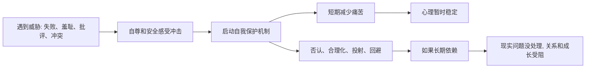

## 心理学思维筑基课: 自我保护机制普遍存在
  
### 作者  
digoal  
  
### 日期  
2026-05-05 
  
### 标签  
遇到威胁 , 自我保护 , 短期回避 , 长期需处理  
  
----  
  
## 背景 
人会通过否认、合理化、投射、压抑、回避等方式保护自尊和心理稳定。  
  
  

> 面向对象: 初中到高中学生  
> 核心问题: 为什么人在面对失败、羞耻、冲突和痛苦时，常常会下意识找理由、逃避、否认或把问题推到别人身上？  
> 先说结论: 自我保护机制是人在心理受到威胁时，为了保护自尊、安全感和内在稳定而自动启动的反应。它们很普遍，也有短期保护作用；但如果长期依赖，就可能让人逃避现实、误解自己、伤害关系。

## 一张图先看懂



## 求真讲法

### 它到底说了什么

“自我保护机制普遍存在”可以先用一句话理解：

> 当现实让人太难受时，大脑会自动找办法，让自己少一点羞耻、害怕、内疚或崩溃。

这些机制有时也叫“防御机制”。  
它们不一定是故意的，很多时候是自动发生的。

常见例子：

| 机制 | 通俗解释 | 例子 |
|---|---|---|
| 否认 | 不承认让自己难受的事实 | 明明成绩退步，却说“这次考试不算数” |
| 合理化 | 给失败找一个听起来合理的解释 | “我不是没努力，是这科本来就没用” |
| 投射 | 把自己难接受的感受放到别人身上 | 自己嫉妒别人，却说“他肯定嫉妒我” |
| 回避 | 避开让自己痛苦的场景 | 不敢看成绩、不回消息、不谈冲突 |
| 压抑 | 把难受感受压到意识外或很深处 | 一直说“没事”，但身体很紧绷 |

所以，这条原则真正表达的是：

**人不是总能直接面对现实；当现实太刺痛时，心理会先保护自己。**

### 它是怎么来的

这条原则来自精神分析传统、临床心理学和日常心理观察。

第一，**人需要维持自我稳定。**  
如果每次失败、批评、冲突都直接打到心里，人会很难承受。

第二，**自尊受威胁时，大脑会自动减压。**  
比如被指出错误时，第一反应可能不是反思，而是辩解。这不一定是人品差，常常是自尊先在防守。

第三，**防御机制能短期保护功能。**  
人在突然失去、重大打击或强烈羞耻中，短期否认或麻木，有时能避免心理系统一下子崩掉。

第四，**长期防御会带来代价。**  
如果一直否认问题，就不会修正；如果一直投射，就会误解别人；如果一直回避，就会让问题变大。

可以用一个简单的 ASCII 图理解：

```text
现实太痛
  -> 自我保护启动
  -> 短期舒服一点
  -> 如果不回到现实处理
  -> 长期问题变大
```

这就是为什么自我保护机制既不是纯坏事，也不是可以无限依赖的好东西。

### 它依赖哪些假设

“自我保护机制普遍存在”成立，依赖几个关键前提。

| 假设 | 含义 | 如果不成立会怎样 |
|---|---|---|
| 人有自尊和心理稳定需求 | 内在稳定需要被保护 | 如果人完全不怕受伤，保护机制会弱 |
| 有些现实会带来强烈痛苦 | 失败、羞耻、冲突会冲击心理 | 如果现实不带来痛苦，就不需要防御 |
| 心理反应很多是自动的 | 人不总是有意识地选择 | 如果所有反应都完全自觉，防御会更容易控制 |
| 短期减压和长期成长可能冲突 | 保护自己不等于解决问题 | 如果两者永远一致，防御就不会有代价 |

这也说明一句关键的话：

> 自我保护机制的存在，不等于人虚伪；它说明人需要在痛苦和现实之间维持心理平衡。

### 常见误解

**误解一：有防御机制就是心理有病。**  
不对。每个人都会有防御机制，关键是程度、频率和后果。

**误解二：自我保护都是坏事。**  
不对。短期保护能帮人承受冲击，问题在于长期逃避现实。

**误解三：指出别人防御，就能让他马上改变。**  
不对。直接戳穿防御常会让对方更防御。

**误解四：成熟的人完全没有防御。**  
不对。成熟不是没有防御，而是更能觉察、承认和逐步面对现实。

## 求存讲法

### 它有什么用

这条原则最大的作用，是帮助你理解自己和别人为什么会“明明不合理，却还是这样反应”。

面对强烈反应时，可以多问几句：

- 我现在是在保护什么？
- 我最不想承认的是什么？
- 我是在解决问题，还是只是在减少难受？
- 这个解释让我舒服了，但它真的帮助我成长了吗？

这会让你从“我为什么这么差”转向“我正在用什么方式保护自己”。

### 它怎么迁移到熟悉领域

这个原则在学生生活里很常见。

| 场景 | 可能的自我保护 |
|---|---|
| 考试没考好 | “这次题太怪，不算” |
| 被同学拒绝 | “我本来也不想和他们玩” |
| 被老师批评 | “老师就是针对我” |
| 和朋友冲突 | 不回消息，假装没事 |
| 看到别人优秀 | 贬低对方来减轻自己的失落 |

迁移后的核心意思是：

> 很多反应表面上是在讲道理，实际上是在保护自己别太痛。

### 它的适用范围和边界

这条原则适合用于：

- 理解否认、合理化、投射、回避等日常心理反应。
- 帮助自己从防御走向觉察。
- 改善冲突沟通和自我反思。
- 区分短期减压和长期解决问题。

但它也有边界。

第一，不要随便给别人贴防御标签。  
你看到的只是表面行为，不一定知道对方内在发生了什么。

第二，有时所谓“防御”其实是合理保护。  
遇到危险、霸凌或侵犯时，回避和警惕可能是必要的。

第三，面对重大创伤时，防御可能是生存策略。  
不应该用“你在逃避”粗暴要求别人立刻面对。

第四，自我保护机制需要安全环境才能慢慢松动。  
没有支持和安全感，强行面对可能造成更大伤害。

### 正例: 怎么用它提升能力

假设一个学生考试失败后，第一反应是：“这门课没意义，我不想学了。”

如果他知道自我保护机制，就可以停一下，继续问：

- 我是真的认为这门课没意义，还是因为失败太难受？
- 我是不是在用贬低这门课来保护自尊？
- 如果先承认难受，我还能不能找出一个具体改进点？

这时，他可能从合理化里走出来：

- 承认“我这次确实没掌握好”。
- 找出错题类型。
- 设定下一次的小目标。

这不是自我攻击，而是把保护自尊的能量，转回解决问题。

### 反例: 前提不成立会怎样

假设一个人在人际关系里总说：“所有人都不可靠，所以我不需要任何人。”

这句话可能有一部分来自真实经验，但也可能是一种自我保护。

如果他曾经被伤害过，那么“我不需要任何人”可以短期减少期待和失望。  
但长期看，它也可能让他避开所有亲密关系，连安全的支持也进不来。

这里失败的根本原因，是“短期减压和长期成长可能冲突”这个前提被忽略了。  
保护机制让人暂时不痛，却也可能让人一直被困在旧伤里。

## 思考

为什么人很难承认自己在防御？

因为防御机制最核心的功能，就是让人“不必立刻看见太痛的东西”。  
如果一个人马上就能轻松承认，那它反而不太像防御了。

这也引出几个更深的问题：

- 你最常用哪种方式让自己不难受？
- 它短期保护了你什么？
- 它长期让你错过了什么？

成熟的心理学思维，不是粗暴拆掉防御，而是温和地看见它：

- 谢谢它曾经保护过自己。
- 看清它现在是否还适用。
- 在更安全的条件下，慢慢练习面对现实。

“自我保护机制普遍存在”真正教人的，是不要只问“我为什么逃避”，也要问“我当时为什么需要这样保护自己”。

## 最后记住

1. 自我保护机制是人在心理受威胁时，为了保护自尊和稳定而启动的反应。
2. 否认、合理化、投射、回避、压抑等机制都很常见，不等于心理有病。
3. 自我保护短期能减轻痛苦，但长期过度依赖会妨碍面对现实和成长。
4. 成熟不是完全没有防御，而是能逐渐觉察自己的防御方式。
5. 真正有效的改变，不是粗暴拆掉保护，而是在安全中慢慢学习面对。

## 参考资料

- Anna Freud, *The Ego and the Mechanisms of Defence*, 关于自我防御机制的经典系统阐述。
- George E. Vaillant 相关防御机制研究，关于防御机制成熟度与适应功能的临床框架。
- David G. Myers, *Psychology*, 关于人格、压力应对和心理防御的通用教材体系。
- 本文为面向学生的简化解释，基于通用心理学与临床心理学教材框架，不用于诊断或替代专业心理帮助。

  
  
#### [PostgreSQL 解决方案集合](../201706/20170601_02.md "40cff096e9ed7122c512b35d8561d9c8")
  
  
#### [德哥 / digoal's Github - 公益是一辈子的事.](https://github.com/digoal/blog/blob/master/README.md "22709685feb7cab07d30f30387f0a9ae")
  
  
#### [About 德哥](https://github.com/digoal/blog/blob/master/me/readme.md "a37735981e7704886ffd590565582dd0")
  
  

  
