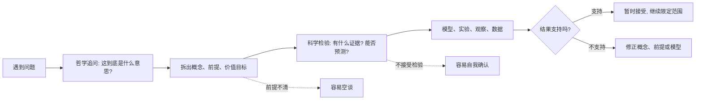
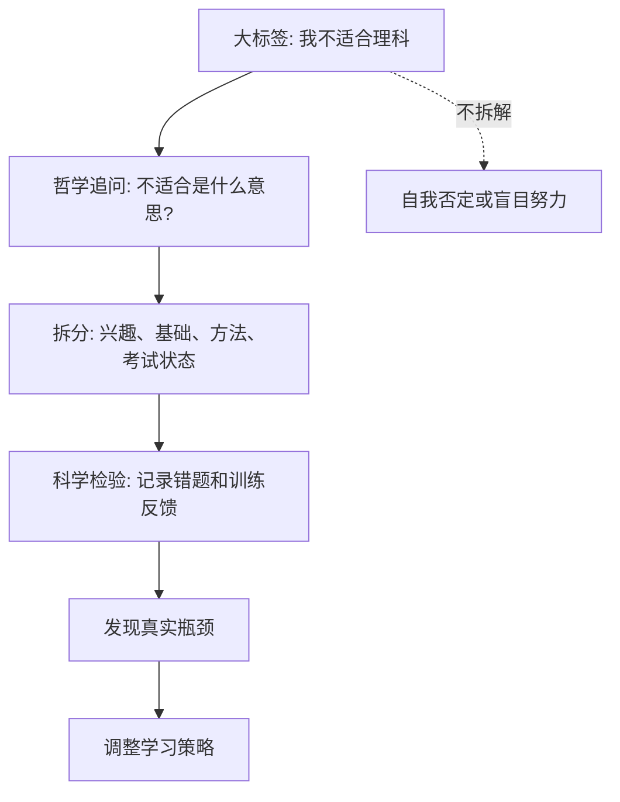

## 元认知思维筑基课: 哲科思维
  
### 作者  
digoal  
  
### 日期  
2026-05-06  
  
### 标签  
哲科思维 , 哲学追问 , 拆概念 , 前提 , 价值 , 科学检验 , 建立模型 , 实验 , 观察 , 数据 
  
----  
  
## 背景  
  
  
> 面向对象: 初中到高中学生  
> 核心问题: 为什么有些人既能想得深, 又不容易陷入空想?  
> 先说结论: 哲科思维是一种把哲学追问和科学检验结合起来的思考方式: 先追问概念、前提、价值和边界, 再用证据、模型、实验和反馈检查判断。它不是让人变得会辩论, 而是让想法更清楚、更可靠、更能改错。

## 一张图先看懂



再用一个极简表看:

| 思维部分 | 主要问题 | 典型动作 | 容易失败的地方 |
| --- | --- | --- | --- |
| 哲学 | 我们到底在说什么? 为什么要这样判断? | 定义概念、追问前提、辨析价值 | 只追问不落地, 变成空转 |
| 科学 | 世界实际怎样? 证据是否支持? | 观察、实验、建模、预测、复盘 | 只看数据不问前提, 变成机械套用 |
| 哲科结合 | 这个判断在什么前提下可靠? | 先澄清, 再检验, 再修正 | 把观点当信仰, 或把数据当答案本身 |

## 求真讲法

### 它到底说了什么

“哲科思维”可以理解为“哲学思维 + 科学思维”的合成框架。

哲学思维不是背名言, 而是追问:

```text
这个词是什么意思?
这个判断依赖什么前提?
这个目标为什么值得追求?
如果换一个角度, 结论还成立吗?
```

科学思维不是只会做实验, 而是坚持:

```text
有没有可观察证据?
能不能提出可检验预测?
有没有反例?
别人能不能复查这个过程?
如果错了, 怎样修正?
```

合在一起, 哲科思维就是:

> 先把问题想清楚, 再把判断交给现实检查; 既不迷信抽象道理, 也不迷信零散数据。

### 它是怎么来的

哲科思维不是某一个单独定理, 更像一种从人类求知历史中总结出来的方法。

人类理解世界时, 常常会遇到两种危险。

第一种危险是“想得很深, 但无法检查”。比如有人说“成功来自气场”, 听起来玄妙, 但如果不说明什么叫气场、如何观察、什么结果会反驳它, 这个说法就很难帮助人变得更清醒。

第二种危险是“数据很多, 但不知道在回答什么”。比如一个同学记录了每天学习时长、刷题数量、错题数, 但没有先问清楚“我真正要提高的是理解、速度、准确率, 还是考试稳定性”, 数据就可能变成一堆数字。

哲学传统提醒人们: 概念、逻辑、价值和前提不能糊涂。科学传统提醒人们: 判断必须接受经验世界的检查。二者结合, 就形成了一种可纠错的思维路线:

```text
问题 -> 概念澄清 -> 前提识别 -> 假设提出 -> 证据检验 -> 模型修正 -> 新问题
```

这篇文章采用的是通用教育版本的“哲科思维”, 不是某个固定学派的专有术语。

### 它依赖哪些假设

哲科思维要有效, 依赖几个前提:

| 假设 | 含义 | 如果不成立会怎样 |
| --- | --- | --- |
| 语言可以被澄清 | 讨论者愿意把关键词说清楚 | 词语越辩越大, 问题越来越模糊 |
| 世界有可观察约束 | 不是任何说法都一样对 | 判断无法被事实纠正 |
| 证据需要解释 | 数据不会自己说话, 必须放进概念和模型里 | 容易把相关性当因果 |
| 人会犯错 | 直觉、记忆、立场和利益都会影响判断 | 不复盘, 不修正, 只找支持自己的证据 |
| 问题有边界 | 一个方法不可能解决所有问题 | 把科学方法误用到价值选择, 或把哲学讨论当实验结论 |

这些假设不是“哲科思维证明出来的真理”, 而是使用这套方法时默认接受的工作规则。它们让讨论可以从争吵变成检查。

### 常见误解

**误解一: 哲科思维就是把简单问题复杂化。**  
不对。它的目标不是复杂, 而是把关键点找出来。有些问题用一句话就能澄清, 有些问题必须拆前提。复杂度应该由问题本身决定。

**误解二: 哲学负责空想, 科学负责事实。**  
不对。哲学也讲严密论证, 科学也需要概念和假设。没有概念澄清, 实验可能测错对象; 没有经验证据, 哲学判断也可能脱离现实。

**误解三: 有数据就科学。**  
不对。数据必须回答明确问题, 还要考虑采样、测量、因果、干扰变量和解释框架。错误问题上的精确数据, 仍然可能导出错误结论。

**误解四: 凡事都要证明到绝对确定。**  
不对。现实决策常常只能达到“在当前证据下更可靠”。哲科思维追求的是清楚、可检验、可修正, 不是全知全能。

## 求存讲法

### 它有什么用

哲科思维最重要的用处, 是减少三类常见错误:

1. 概念错误: 还没说清楚“公平”“效率”“努力”“成功”是什么意思, 就开始争论。
2. 前提错误: 结论看似有逻辑, 但建立在假的或漏掉的前提上。
3. 检验错误: 只收集支持自己的例子, 不愿面对反例和边界。

它让一个人从“我觉得”升级为:

```text
我说的关键词是什么?
我的判断依赖哪些前提?
有什么证据支持或削弱它?
如果现实结果不同, 我准备怎样修改?
```

### 它怎么迁移到熟悉领域

以学习为例, 很多人会说:

> “我数学不好, 所以我不适合理科。”

哲科思维会先做哲学追问:

```text
"数学不好"是指概念不懂、计算慢、考试紧张, 还是题目读不懂?
"不适合理科"是能力判断、兴趣判断, 还是短期成绩判断?
```

再做科学检验:

```text
用两周时间记录错题类型。
把错误分成概念、审题、计算、时间管理四类。
针对最高频错误训练。
两周后用同难度小测看是否改善。
```

这样, 原来的大标签就被拆成了可处理的小问题。



### 它的适用范围和边界

哲科思维适合这些场景:

| 场景 | 为什么适合 |
| --- | --- |
| 学习困难 | 可以区分概念不清、方法无效、练习不足和情绪干扰 |
| 争论问题 | 可以先澄清关键词和价值冲突, 避免鸡同鸭讲 |
| 科技判断 | 可以追问证据、机制、预测和适用条件 |
| 人生选择 | 可以把目标、代价、风险和证据分开看 |
| 产品或项目复盘 | 可以区分“想法错了”“执行错了”“环境变了”“指标选错了” |

它也有边界:

1. 时间很紧的简单任务, 不需要完整展开。比如今天带不带伞, 看天气预报就够了。
2. 价值选择不能完全靠实验解决。比如“我要成为什么样的人”, 需要证据, 但不只是证据问题。
3. 人际关系不能只当成模型。人的感受、尊严和信任不能被简化成几条变量。
4. 数据不足时, 结论要保持暂定, 不能假装已经确定。

### 正例: 怎么用它提升能力

假设你发现自己上课听懂了, 作业却经常错。

普通反应可能是:

> “我太粗心了。”

哲科思维会先追问概念:

```text
"粗心"到底是什么?
是看错题干、漏写条件、公式记错、计算失误, 还是时间压力下慌了?
```

然后设计检验:

| 步骤 | 做法 | 目的 |
| --- | --- | --- |
| 记录 | 连续一周把错题原因写在题旁 | 避免靠印象判断 |
| 分类 | 分成审题、概念、公式、计算、时间四类 | 找出主要瓶颈 |
| 干预 | 对最高频类别做针对训练 | 不把所有错误都叫粗心 |
| 复测 | 一周后用同类题限时测试 | 看方法是否真的有效 |

如果最后发现 60% 的错来自“题干条件漏读”, 那策略就不是多刷难题, 而是训练标注关键词和复述题意。这个例子里, 哲学部分负责拆清“粗心”的含义, 科学部分负责用记录和复测验证原因。

### 反例: 前提不成立会怎样

假设一个学生听说“番茄钟学习法很科学”, 于是每天强迫自己学习 25 分钟、休息 5 分钟。但他做的是一篇需要长时间进入状态的作文, 每次刚有思路就被闹钟打断, 最后效率更低。

这里失败不是因为他“不自律”, 而是因为一个前提不成立:

> 前提: 任务可以被切成短时间块, 且频繁中断不会破坏思路。

对背单词、刷基础题, 这个前提可能成立。对写作文、做复杂证明、编程调试, 这个前提未必成立。

```text
方法有效
  需要匹配:
    任务类型
    注意力节奏
    反馈周期
    中断成本

前提不匹配
  结果:
    看似用了科学方法
    实际破坏了深度思考
```

这个反例说明: 科学方法不是把一个流行技巧到处套。哲科思维要求先问“这个方法依赖什么条件”, 再问“我的问题是否满足这些条件”。

## 思考

哲科思维真正训练的, 是一种“可纠错的清醒”。

你可以用四个问题检查自己的判断:

1. 我现在使用的关键词, 能不能被一个没听过的人复述?
2. 如果别人不同意我, 我们是在争事实、争定义, 还是争价值?
3. 什么证据会让我改变看法? 如果没有, 我的观点是不是已经变成了信念?
4. 我看到的数据, 是在回答我的问题, 还是只是让我感觉更有把握?

它也提醒我们: 深刻不等于模糊, 科学不等于冰冷。一个好的判断, 往往既能说清“我为什么这样理解”, 也能说明“现实怎样会让我修正”。

## 最后记住

1. 哲科思维 = 哲学追问前提 + 科学检验证据。
2. 哲学让问题变清楚, 科学让判断受约束。
3. 没有概念澄清, 数据可能测错对象; 没有现实检验, 思辨可能脱离世界。
4. 它适合学习、争论、科技判断、复盘和复杂决策, 但不能替代所有价值选择。
5. 真正可靠的思维, 不是永远不犯错, 而是能发现自己错在哪里并修正。

## 参考资料

1. Karl Popper, *The Logic of Scientific Discovery*, 1959 English edition; original German edition published in 1934.
2. John Dewey, *How We Think*, revised edition, 1933.
3. Thomas S. Kuhn, *The Structure of Scientific Revolutions*, 1962.
4. Bertrand Russell, *The Problems of Philosophy*, 1912.
5. Stanford Encyclopedia of Philosophy, entries on scientific method, Karl Popper, and philosophy of science.
6. Alan Chalmers, *What Is This Thing Called Science?*, introductory text on scientific method and philosophy of science.

  
  
  
#### [PostgreSQL 解决方案集合](../201706/20170601_02.md "40cff096e9ed7122c512b35d8561d9c8")
  
  
#### [德哥 / digoal's Github - 公益是一辈子的事.](https://github.com/digoal/blog/blob/master/README.md "22709685feb7cab07d30f30387f0a9ae")
  
  
#### [About 德哥](https://github.com/digoal/blog/blob/master/me/readme.md "a37735981e7704886ffd590565582dd0")
  
  

  
