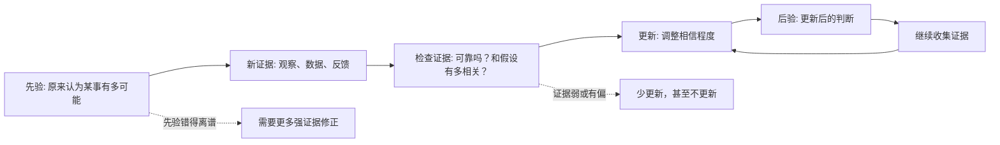
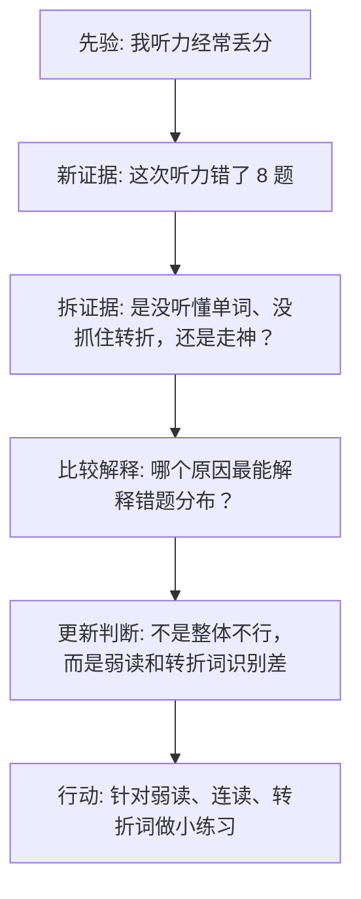

## 元认知思维筑基课: 贝叶斯思维: 用新证据更新判断
  
### 作者  
digoal  
  
### 日期  
2026-05-06  
  
### 标签  
不确定性 , 逼近真相 , 新证据 , 更新判断
  
----  
  
## 背景  
  
  

> 面向对象: 初中到高中学生  
> 核心问题: 为什么聪明人也会判断错？我们怎样在不确定中逐步接近真相？  
> 先说结论: 贝叶斯思维是一种“带着旧判断看新证据，然后更新判断”的方法。它提醒我们: 判断不是一次性喊对错，而是在先验、证据质量和更新规则之间不断校准。  

## 一张图先看懂



## 求真讲法

### 它到底说了什么

贝叶斯思维来自概率论中的贝叶斯定理。用学生能懂的话说，它讲的是:

> 你对一件事原本有一个相信程度。后来出现了新证据。你不能只看新证据有多显眼，还要看这个证据在不同解释下出现的可能性，然后更新自己的判断。

例如，一个同学一次考试考差了。普通判断可能是:

> 他不适合学数学。

贝叶斯思维会慢一点:

```text
原判断: 他平时数学中等，说明数学能力不一定差。
新证据: 这次考差。
证据检查: 是所有题都不会，还是粗心、没睡好、题型刚好不熟？
更新后: 他的某些题型或考试状态有问题，但不能只凭一次考试断定“不适合学数学”。
```

贝叶斯思维的核心不是“永远怀疑”，而是“按证据强弱更新，而不是被单个事件带着跑”。

### 它是怎么来的

贝叶斯定理通常写成:

```text
P(H | E) = P(E | H) × P(H) / P(E)
```

这里的字母可以这样理解:

| 符号 | 含义 | 学生版解释 |
| --- | --- | --- |
| H | 假设 | 我正在判断的一种解释 |
| E | 证据 | 我新看到的现象或数据 |
| P(H) | 先验概率 | 看到新证据前，我认为 H 有多可能 |
| P(E \| H) | 似然 | 如果 H 为真，E 出现的可能性有多大 |
| P(E) | 证据总体概率 | E 本身出现的总体可能性 |
| P(H \| E) | 后验概率 | 看到 E 之后，我应该多相信 H |

公式看起来抽象，但它解决的是一个很普通的问题: 新证据来了，我到底该改变多少？

比如班里有人说“某同学最近变懒了”，证据是“他今天作业没交”。贝叶斯思维会问:

```text
假设 H: 他变懒了。
证据 E: 今天作业没交。

如果他真的变懒，没交作业的概率可能上升。
但如果他生病、家里有事、忘带作业，也会出现同样证据。

所以，E 支持 H，但支持力度有限。
```

这就是贝叶斯思维的直觉: 一个证据能不能强烈支持某个结论，要看它是不是也很容易被其他解释说明。

### 它依赖哪些假设

贝叶斯思维要用得好，至少依赖这些假设:

| 假设 | 含义 | 如果不成立会怎样 |
| --- | --- | --- |
| 可以列出候选解释 | 至少知道几种可能原因 | 只盯着一个解释，容易把所有证据都往里面塞 |
| 先验不是乱猜 | 原判断来自历史数据、常识、经验或可靠背景 | 先验太离谱，会让更新变慢或方向错误 |
| 证据质量可评估 | 能判断证据是否可靠、是否有偏、是否相关 | 容易被谣言、极端案例、情绪化信息误导 |
| 更新幅度要匹配证据强度 | 强证据大幅更新，弱证据小幅更新 | 一点风吹草动就改结论，或铁证如山仍不改 |
| 愿意继续更新 | 后验不是终点，而是下一轮先验 | 容易把阶段性判断当成最终真理 |

### 常见误解

**误解一: 贝叶斯思维就是主观猜概率。**

不对。先验可以有主观成分，但好的贝叶斯更新会尽量使用历史频率、实验数据、可验证事实和清楚的证据质量判断。

**误解二: 新证据一出现，原判断就该推翻。**

不对。新证据应该改变判断，但改变多少取决于证据强度。一次偶然事件通常不该推翻大量稳定证据。

**误解三: 先验会让人固执。**

有可能，但那是坏用法。贝叶斯思维不是保护旧观点，而是让旧观点接受新证据的定量或半定量校准。

**误解四: 贝叶斯思维只适合数学和统计。**

不对。公式属于概率论，但“根据证据更新相信程度”可以迁移到学习、判断他人、投资、科研、医学检测、产品实验和日常决策中。

## 求存讲法

### 它有什么用

贝叶斯思维的原生作用，是在不确定条件下做更好的推断。它尤其适合这些问题:

- 医学检测: 检测阳性后，真正患病的概率是多少？
- 科学研究: 新实验结果是否足以支持某个假设？
- 机器学习: 模型如何利用已有信息和新数据更新判断？
- 日常决策: 新反馈出现后，原计划要不要调整？

它把“我觉得”变成更清楚的三步:

```text
我原来为什么这么想？
这个新证据有多强？
我应该更新多少？
```

### 它怎么迁移到熟悉领域

以学习为例，假设你觉得自己“英语听力不行”。



这个过程比“我太差了”更有用，因为它把情绪化结论变成了可更新、可训练的判断。

### 它的适用范围和边界

贝叶斯思维适合:

- 信息会逐步增加的问题。
- 有多个可能解释的问题。
- 不能一次性得到确定答案的问题。
- 需要避免被单个案例带偏的问题。

它不适合被滥用在这些场景:

- 证据完全无法观察，只能空想。
- 价值选择问题，比如“我应该成为什么样的人”，不能只靠概率决定。
- 变量太多但数据太少，精确数字会制造假确定感。
- 你只想用“先验”当借口拒绝新证据。

### 正例: 怎么用它提升能力

假设你想判断一个学习方法是否有效: “每天睡前复习 20 分钟，能不能提高记忆？”

可以这样用贝叶斯思维:

| 步骤 | 问法 | 示例 |
| --- | --- | --- |
| 先验 | 这个方法原本有多可能有效？ | 间隔复习通常有效，所以先验偏正面 |
| 证据 | 我能观察什么？ | 一周后默写正确率、错题重复率 |
| 比较解释 | 成绩变好是否可能由别的原因造成？ | 题目变简单、老师刚复习过、当天状态好 |
| 更新 | 证据足够强吗？ | 连续三周同类内容保持率提高，才明显增加信心 |
| 行动 | 更新后怎么做？ | 保留睡前复习，同时测试复习间隔 |

这里的能力提升不在于算出一个精确数字，而在于你开始用证据管理学习方法，而不是凭感觉换来换去。

### 反例: 前提不成立会怎样

假设一个同学刷到三条短视频，都说“某个专业毕业就失业”，于是立刻断定:

> 这个专业不能选。

这个判断失败，是因为几个贝叶斯前提不成立:

| 出问题的前提 | 具体问题 | 后果 |
| --- | --- | --- |
| 证据质量可评估 | 短视频可能只展示极端案例 | 把少数故事当成整体规律 |
| 可以列出候选解释 | 没区分学校、城市、能力、行业周期 | 把复杂结果归因到单一专业 |
| 更新幅度匹配证据强度 | 三个案例不足以大幅推翻长期数据 | 判断被情绪和算法推荐带偏 |

更好的做法是:

```text
先验: 查看该专业过去几年就业、升学、行业需求和课程结构。
新证据: 收集真实毕业生访谈、学校就业报告、招聘岗位变化。
更新: 如果多来源证据都显示需求下降，再降低选择概率。
行动: 同时比较自己的兴趣、能力、学校层次和备选路径。
```

这个反例说明: 贝叶斯思维不是让你“不要改变观点”，而是让你别被弱证据过度改变观点。

## 思考

贝叶斯思维最深的地方，是它改变了我们对“正确”的理解。

很多人以为成熟判断是:

```text
我一开始就说对。
```

贝叶斯思维更接近:

```text
我一开始有一个可解释的判断；
新证据出现后，我知道该更新多少；
如果证据继续变化，我还能继续修正。
```

你可以用三个问题训练它:

1. 我现在的判断，先验来自哪里: 数据、经验、权威、情绪，还是别人反复说？
2. 这个新证据如果支持我的观点，它是不是也同样支持其他解释？
3. 我是因为证据强才更新，还是因为这个证据让我情绪很强才更新？

贝叶斯思维也可以和其他元认知方法配合:

- 和第一性原理配合: 先把问题拆到基本变量，再估计每个变量的证据强度。
- 和逻辑三洽配合: 先看判断是否自洽，再看证据是否他洽，最后看能否持续更新。
- 和证伪思维配合: 主动寻找会让自己降低信心的证据。
- 和系统思维配合: 警惕反馈延迟、样本偏差和幸存者偏差。

真正会用贝叶斯思维的人，不是永远说“也许吧”，而是能清楚说出:

> 我现在有多相信，为什么这么相信，什么证据会让我改变。

## 最后记住

1. 贝叶斯思维是一种根据新证据更新相信程度的方法。
2. 它由先验、证据、似然和后验组成，但日常使用不一定要精确计算。
3. 一个证据有多强，要看它是否更支持某个解释，而不是所有解释都能说明。
4. 强证据大幅更新，弱证据小幅更新；不要被单个案例和情绪带偏。
5. 后验不是终点，而是下一轮判断的先验。

## 参考资料

- Thomas Bayes, "An Essay towards solving a Problem in the Doctrine of Chances", 1763.
- Pierre-Simon Laplace, *A Philosophical Essay on Probabilities*, 1814.
- E. T. Jaynes, *Probability Theory: The Logic of Science*, Cambridge University Press, 2003.
- Sharon Bertsch McGrayne, *The Theory That Would Not Die*, Yale University Press, 2011.
- 本文未联网检索；解释基于通用概率论、统计学和批判性思维教材体系，公式和概念采用常见贝叶斯定理表述。

  
  
#### [PostgreSQL 解决方案集合](../201706/20170601_02.md "40cff096e9ed7122c512b35d8561d9c8")
  
  
#### [德哥 / digoal's Github - 公益是一辈子的事.](https://github.com/digoal/blog/blob/master/README.md "22709685feb7cab07d30f30387f0a9ae")
  
  
#### [About 德哥](https://github.com/digoal/blog/blob/master/me/readme.md "a37735981e7704886ffd590565582dd0")
  
  

  
