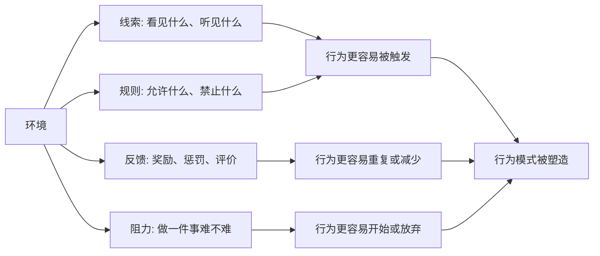

## 心理学思维筑基课: 行为会被环境塑造
  
### 作者  
digoal  
  
### 日期  
2026-05-06  
  
### 标签  
环境 , 塑造 , 行为 , 规则 , 反馈 , 阻力 , 触发  
  
----  
  
## 背景  
同一个人，在不同环境、规则、奖励结构和压力下，可能表现出完全不同的行为。

  

> 面向对象: 初中到高中学生  
> 核心问题: 为什么同一个人换了环境，行为可能立刻变得不一样？  
> 先说结论: 行为会被环境塑造，意思是人的行为不只来自性格和意志力，也会受到周围线索、规则、奖励、惩罚、同伴氛围和行动难度影响。想改变行为，不能只喊“我要自律”，还要设计一个更容易做对事、更难做错事的环境。

## 一张图先看懂



## 求真讲法

### 它到底说了什么

“行为会被环境塑造”可以先用一句话理解：

> 人不是在真空里行动的，周围环境会不断提示你、奖励你、阻止你、诱惑你或支持你。

这里的“环境”不只是房间和桌椅，还包括：

- 物理环境：手机放哪里、桌面乱不乱、光线好不好。
- 社会环境：身边的人在做什么、班级氛围怎样。
- 规则环境：哪些行为会被允许、鼓励或禁止。
- 反馈环境：什么行为会被表扬、奖励、批评或忽视。
- 难度环境：一件事开始起来容易还是很麻烦。

比如同一个学生：

| 环境 | 更可能出现的行为 |
|---|---|
| 手机放桌上，消息一直弹出 | 更容易分心 |
| 手机放到另一个房间 | 更容易持续学习 |
| 同伴都在认真做题 | 更容易进入学习状态 |
| 同伴都在聊天玩闹 | 更容易跟着松散 |

所以，这条原则真正表达的是：

**行为不是只靠个人意志决定的，它也会被周围的提示、阻力和后果一点点塑造。**

### 它是怎么来的

这条原则和行为主义、社会心理学、行为经济学都有关系。

第一，**行为主义强调后果会塑造行为。**  
如果一个行为之后得到奖励，它更容易重复；如果之后带来痛苦或代价，它更可能减少。

第二，**环境线索会触发行为。**  
看到零食会想吃，看到手机会想刷，坐到书桌前可能更容易进入学习状态。很多行为不是突然出现，而是被线索唤起。

第三，**同伴和群体会改变行为。**  
人在不同群体里会采用不同语言、姿态和行动方式。这不是单纯“没主见”，而是社会环境在塑造行为。

第四，**行动阻力会影响选择。**  
如果一件事很容易开始，人更可能做；如果它步骤复杂、成本很高，人就更容易拖延。

可以用一个简单的 ASCII 图理解：

```text
线索出现 -> 行为启动 -> 结果反馈
    ^                     |
    |                     v
    环境反复强化这个循环
```

这就是为什么行为改变常常不是“下决心一次”就够，而是要改变行为出现的环境条件。

### 它依赖哪些假设

“行为会被环境塑造”成立，依赖几个关键前提。

| 假设 | 含义 | 如果不成立会怎样 |
|---|---|---|
| 人会对线索作出反应 | 环境能触发注意和行动 | 如果人完全不受线索影响，环境作用会弱 |
| 行为后果会影响重复概率 | 奖励和惩罚会改变行为 | 如果后果不影响行为，塑造作用会弱 |
| 人会受社会氛围影响 | 群体规范会改变选择 | 如果人完全不在意他人，社会环境影响会弱 |
| 行动难度会影响选择 | 越容易开始越可能做 | 如果难度无关紧要，环境设计意义会小 |

这也说明一句关键的话：

> 环境不是替人承担责任，但它会改变“负责任”这件事的难度。

### 常见误解

**误解一：环境影响行为，所以人不用负责。**  
不对。环境会影响行为，但人仍然要学习选择和调整环境。

**误解二：只要意志力够强，环境无所谓。**  
不对。长期依赖意志力很耗能，好的环境能减少不必要的消耗。

**误解三：改变环境就是逃避问题。**  
不对。改变环境常常是解决问题的一部分。

**误解四：环境只能影响坏习惯。**  
不对。好习惯也需要环境支持，比如固定学习位置、清晰反馈和同伴监督。

## 求存讲法

### 它有什么用

这条原则最大的作用，是把行为改变从“责怪自己”转向“设计条件”。

如果你想改变一个行为，可以问：

- 什么线索会触发它？
- 它带来了什么即时奖励？
- 我能不能让好行为更容易开始？
- 我能不能让坏行为更麻烦一点？
- 身边的人是在支持它，还是破坏它？

这比单纯说“我要更自律”更具体。

### 它怎么迁移到熟悉领域

这个原则在学生生活里非常常见。

| 目标 | 环境设计 |
|---|---|
| 少刷手机 | 手机放远，关闭通知，设定固定查看时间 |
| 多读书 | 把书放在桌面，把娱乐入口移远 |
| 认真写作业 | 清空桌面，一次只放当前任务 |
| 坚持运动 | 提前摆好运动鞋，约同伴一起 |
| 减少拖延 | 把任务拆小，降低开始门槛 |

迁移后的核心意思是：

> 想让行为改变更稳定，就要让正确行为更顺手，让错误行为更费劲。

### 它的适用范围和边界

这条原则适合用于：

- 改善学习习惯。
- 管理手机和娱乐诱惑。
- 设计班级、家庭和团队规则。
- 理解为什么换环境后人会变。
- 训练习惯养成和行为改变。

但它也有边界。

第一，环境不是唯一原因。  
情绪、认知、气质、身体状态和早期经验也会影响行为。

第二，环境改变不一定立刻生效。  
旧习惯可能很强，需要重复和反馈。

第三，有些环境不是个人能完全控制。  
家庭、学校、社会规则有时需要集体改变。

第四，过度依赖环境也有风险。  
真正成熟的能力，是在好环境中养成习惯，也逐渐提高在复杂环境中的自我调节。

### 正例: 怎么用它提升能力

假设一个学生想每天晚饭后写 40 分钟作业，但总是刷手机。

如果只靠意志力，他可能每天都要和手机打架。  
如果用“行为会被环境塑造”来做，就可以这样调整：

- 晚饭前把手机放到客厅充电。
- 书桌上只放当天作业和笔。
- 坐下后先写最简单的第一题。
- 完成 40 分钟后再统一看消息。

这样做的关键，不是突然变得更有毅力，而是减少了坏行为线索，提高了好行为启动率。

### 反例: 前提不成立会怎样

假设有人说：“一个人学不好，就是因为不够努力，环境不重要。”

这个判断可能忽略了很多现实因素：

- 桌面杂乱，任务总被打断。
- 家里噪音大，无法持续专注。
- 同伴环境把认真学习当成“装”。
- 手机通知不断提供即时奖励。

如果只要求他更努力，却不改变环境，行为很容易回到旧模式。

这里失败的根本原因，是忽略了“人会对线索作出反应”“行为后果会影响重复概率”这两个前提。  
努力很重要，但环境会决定努力是顺流，还是逆流。

## 思考

为什么很多人明明知道该怎么做，却总是做不到？

因为知道道理只是认知层面的事情，而真实行为发生在具体环境里。  
如果环境不断提示旧习惯、奖励旧行为、增加新行为阻力，那么知道道理也很容易被打败。

这也引出几个更深的问题：

- 你的环境是在帮你成为想成为的人，还是在不断把你拉回旧习惯？
- 你把失败归咎于自己之前，有没有检查过行为发生的条件？
- 你能不能把目标变成环境里的默认选项？

成熟的心理学思维，不是把人看成环境的奴隶，也不是把人想成纯靠意志运行的机器，而是同时看到：

- 人可以选择行为。
- 环境会塑造选择的难度。

“行为会被环境塑造”真正教人的，是别只改变决心，也要改变系统。

## 最后记住

1. 行为不只来自性格和意志力，也会被线索、规则、奖励、惩罚、同伴和阻力塑造。
2. 环境不是背景板，而是行为发生的触发器和反馈系统。
3. 想改变行为，常常要让好行为更容易，让坏行为更困难。
4. 环境影响行为，不等于人不用负责，而是说明责任也包括设计环境。
5. 真正稳定的改变，不只是靠一时决心，而是靠持续改变行为条件。

## 参考资料

- B. F. Skinner, *Science and Human Behavior*, 关于强化、后果和环境如何塑造行为的行为主义框架。
- Albert Bandura, *Social Learning Theory*, 关于观察学习、社会环境和行为形成的理论。
- Richard H. Thaler, Cass R. Sunstein, *Nudge*, 关于选择架构和环境设计如何影响行为的通俗框架。
- David G. Myers, *Psychology*, 关于学习、行为、社会影响和环境塑造的通用教材体系。
- 本文为面向学生的简化解释，基于通用心理学与行为科学教材框架，不用于诊断或替代专业心理帮助。

  
  
#### [PostgreSQL 解决方案集合](../201706/20170601_02.md "40cff096e9ed7122c512b35d8561d9c8")
  
  
#### [德哥 / digoal's Github - 公益是一辈子的事.](https://github.com/digoal/blog/blob/master/README.md "22709685feb7cab07d30f30387f0a9ae")
  
  
#### [About 德哥](https://github.com/digoal/blog/blob/master/me/readme.md "a37735981e7704886ffd590565582dd0")
  
  

  
