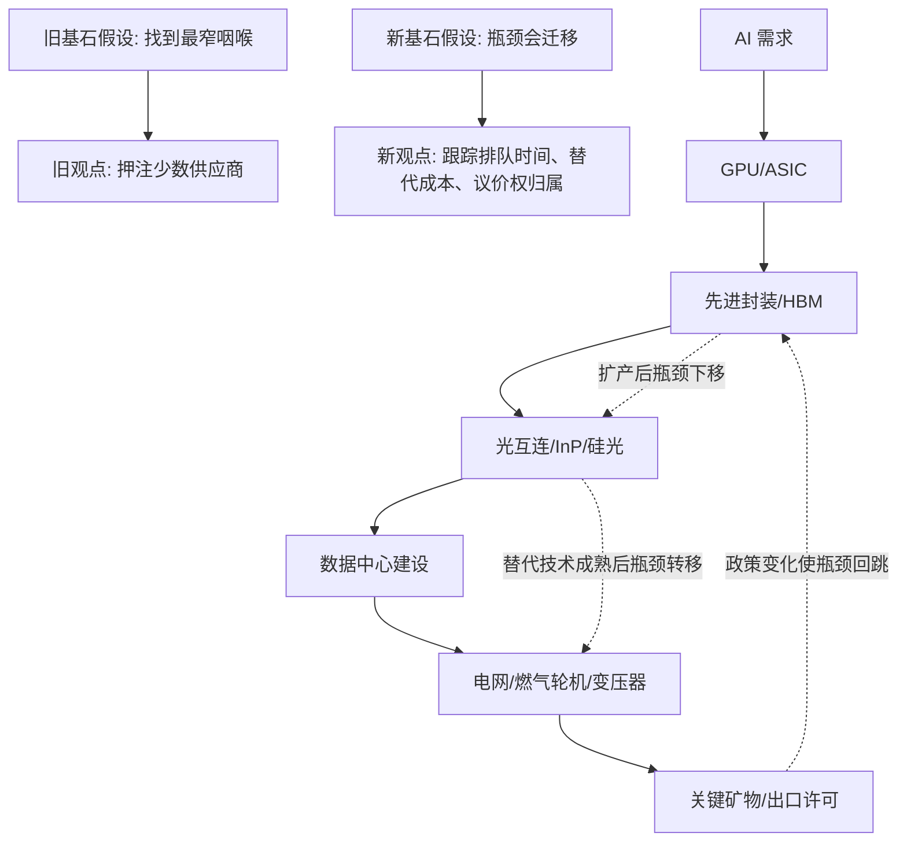
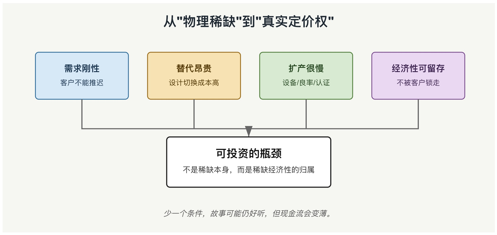

## AI 投资圈押注的不是英伟达, 而是瓶颈迁移
  
### 作者  
digoal  
  
### 日期  
2026-05-07  
  
### 标签  
AI , 瓶颈 , 迁移 , 投资 
  
----  
  
## 背景  
早上读了一篇文章: AI 的命门, 不在英伟达 

https://mp.weixin.qq.com/s/H6AX4I3Rm4UmYZDgnN8OJQ

观点非常犀利, 但是我觉得可以再拔高一下.

> 一句话新结论: AI 资本开支真正考验的不是“谁发现了四个 narrow places”，而是谁能判断瓶颈会从算力、封装、光互连、电力、关键矿物和政策许可之间怎样迁移；静态咽喉名单会诱人赚钱，也会诱人误判。
  
## 旧文真正说了什么

旧文的锋利之处，不在酒馆叙事，而在一个正确提醒: AI 不是纯软件问题，前沿模型的增量能力越来越受物理供给约束。

它的核心论点大致有六个:

1. AI 的决定性变量不是模型 benchmark，而是 hyperscaler 把巨额 capex 转化为晶圆、封装、光模块、数据中心和电力的能力。
2. EUV 光刻机代表现代工业的极端复杂性，ASML、蔡司、光源、供应链协同构成先进芯片的上游天花板。
3. AI 产业链越往下拆，供应商越少，真正风险藏在少数供应链承重柱里。
4. InP 磷化铟、先进封装、燃气轮机、电网设备和关键矿物，是比模型公司更值得追踪的窄门。
5. 2026 年 11 月 27 日前后，中国对镓、锗、锑、超硬材料相关对美出口管制的暂停窗口，是一个重要政策催化日期。
6. 投资上，真正的超额收益来自比大众更早识别物理边界。

旧文的基石假设是: “供给最窄的物理环节，会自然变成最强的投资标的。” 它的证据链是: AI capex 暴涨 -> 上游物理供给无法同步扩张 -> 少数供应商获得定价权 -> 股票重估。这个逻辑方向有价值，但还不够完整。

## 旧逻辑的关键漏洞

第一，瓶颈不是静态清单，而是动态排队系统。

ASML 的 EUV、TSMC 的 CoWoS、InP 衬底、电力设备、燃气轮机、关键矿物都可能成为瓶颈，但不会永远同时成为最紧瓶颈。只要某一环节涨价足够高，资本、替代技术、客户设计、政策补贴和库存行为都会被激活。真正的问题不是“哪里窄”，而是“哪个窄点正在从技术约束变成现金流约束，又会被谁绕开”。

第二，短缺不等于利润。

一个材料可以稀缺，但供应商可能被长约锁价、客户认证周期压制、扩产折旧吞掉毛利、出口许可卡住交付，或者被下游大客户用预付款换走经济性。供给窄只是必要条件，不是充分条件。

第三，政策日期不是二元开关。

商务部 2025 年第 72 号公告确实写明，自 2025 年 11 月 9 日起至 2026 年 11 月 27 日，暂停实施 2024 年第 46 号公告第二款。但这不等于镓、锗、锑从此自由流通，也不等于到期必然“一键重启”。第一款对美国军事用户或军事用途出口仍是约束，许可制度和政治谈判仍会改变实际供给。

第四，旧文忽略了反身性。

当所有聪明钱都开始寻找 narrow places，窄门本身会变成拥挤交易。价格上涨会提前透支利润，供应商融资会加速扩产，下游客户会提前囤货和改设计，政府会把商业瓶颈升级成产业政策。越被看见的咽喉，越快失去“被忽视”的属性。

## 如果基石假设崩塌: 新假设是什么

旧基石假设: AI 时代的胜负，由少数静态咽喉决定。

新基石假设: AI 时代的胜负，由“约束迁移速度”和“绕开约束的成本”决定。

从第一性原理看，AI 基础设施是一个多层排队系统。每一层都有自己的扩产周期、资本强度、认证周期、政策风险和替代路径。资本进入最快，软件迭代次之，服务器和网络较慢，先进制程和封装更慢，电网和发电设备最慢，矿物与地缘政策最不可线性外推。

## 新观点: 咽喉只有在四个条件同时成立时才有定价权

AI 物理瓶颈值得研究，但不能把“稀缺”直接翻译成“定价权”。真正有经济价值的咽喉，需要同时满足四个条件。

第一，需求是刚性的。客户不能轻易降低性能要求，也不能把需求推迟两年。

第二，替代路径很贵。换材料、换封装路线、换网络拓扑、换供电方案的代价足够高。

第三，扩产慢于需求。产能不是花钱就能立刻出来，设备交期、良率爬坡、客户认证和工程师经验都构成时间墙。

第四，供应商能保留经济性。短缺带来的超额价值不能全部被大客户、政府、融资稀释或长约锁走。

这四个条件可以解释为什么旧文有一半是对的，也解释为什么它可能误导。

<svg role="img" aria-label="AI 瓶颈经济性四条件图" viewBox="0 0 900 420" xmlns="http://www.w3.org/2000/svg">
  <defs>
    <!-- 定义箭头标记 -->
    <marker id="arrowhead" markerWidth="10" markerHeight="7" refX="10" refY="3.5" orient="auto">
      <polygon points="0 0, 10 3.5, 0 7" fill="#666666"/>
    </marker>
  </defs>
  <rect width="900" height="420" fill="#f7f7f2"/>
  <text x="450" y="42" text-anchor="middle" font-size="24" font-family="Arial, sans-serif" fill="#1f2933" font-weight="bold">从"物理稀缺"到"真实定价权"</text>
  <g font-family="Arial, sans-serif" font-size="16">
    <!-- 上方四个矩形 -->
    <rect x="60" y="90" width="170" height="86" rx="6" fill="#d7e8f7" stroke="#2f6f9f" stroke-width="1.5"/>
    <text x="145" y="125" text-anchor="middle" fill="#17324d" font-weight="bold">需求刚性</text>
    <text x="145" y="150" text-anchor="middle" font-size="13" fill="#17324d">客户不能推迟</text>
    <rect x="265" y="90" width="170" height="86" rx="6" fill="#f6e2b3" stroke="#9b6b16" stroke-width="1.5"/>
    <text x="350" y="125" text-anchor="middle" fill="#4f3300" font-weight="bold">替代昂贵</text>
    <text x="350" y="150" text-anchor="middle" font-size="13" fill="#4f3300">设计切换成本高</text>
    <rect x="470" y="90" width="170" height="86" rx="6" fill="#d9ead3" stroke="#4f7f3a" stroke-width="1.5"/>
    <text x="555" y="125" text-anchor="middle" fill="#23451d" font-weight="bold">扩产很慢</text>
    <text x="555" y="150" text-anchor="middle" font-size="13" fill="#23451d">设备/良率/认证</text>
    <rect x="675" y="90" width="170" height="86" rx="6" fill="#ead7f2" stroke="#7c4d91" stroke-width="1.5"/>
    <text x="760" y="125" text-anchor="middle" fill="#3d2450" font-weight="bold">经济性可留存</text>
    <text x="760" y="150" text-anchor="middle" font-size="13" fill="#3d2450">不被客户锁走</text>
    <!-- 连接线（带箭头） -->
    <!-- 从“需求刚性”底部到下方矩形顶部 -->
    <path d="M145 176 L145 230 L450 230 L450 245" stroke="#666" stroke-width="2" fill="none" marker-end="url(#arrowhead)"/>
    <!-- 从“替代昂贵”底部到下方矩形顶部 -->
    <path d="M350 176 L350 230 L450 230 L450 245" stroke="#666" stroke-width="2" fill="none"/>
    <!-- 从“扩产很慢”底部到下方矩形顶部 -->
    <path d="M555 176 L555 230 L450 230 L450 245" stroke="#666" stroke-width="2" fill="none"/>
    <!-- 从“经济性可留存”底部到下方矩形顶部 -->
    <path d="M760 176 L760 230 L450 230 L450 245" stroke="#666" stroke-width="2" fill="none" marker-end="url(#arrowhead)"/>
    <!-- 下方矩形 -->
    <rect x="300" y="245" width="300" height="92" rx="6" fill="#ffffff" stroke="#222" stroke-width="2"/>
    <text x="450" y="282" text-anchor="middle" font-size="20" fill="#111" font-weight="bold">可投资的瓶颈</text>
    <text x="450" y="310" text-anchor="middle" font-size="14" fill="#333">不是稀缺本身，而是稀缺经济性的归属</text>
    <!-- 底部提示文字 -->
    <text x="450" y="390" text-anchor="middle" font-size="14" fill="#555" font-style="italic">少一个条件，故事可能仍好听，但现金流会变薄。</text>
  </g>
</svg>

  

## 第一层: Capex 是需求，不是产能

2026 年 AI capex 的数量级确实夸张。公开报道汇总显示，美国大型科技公司 2026 年 AI 和数据中心相关 capex 计划已接近 7000 亿美元级别；其中 Meta 官方在 2026 年一季报中把全年资本开支指引上调到 1250-1450 亿美元，并明确提到更高的组件价格和支持未来产能的数据中心成本。Alphabet 在 2025 年四季度电话会中给出 2026 年 1750-1850 亿美元 capex 指引，用于 AI compute、DeepMind、Cloud 客户需求等。

但 capex 是付款意愿，不是物理产能。钱从资产负债表流出后，要穿过设备交期、工程施工、并网、机柜部署、芯片交付和软件调度，最后才变成可用 token。金融市场容易把 capex 当需求强度，工程世界会把 capex 拆成排队位置。

所以，7000 亿美元不是结论，而是问题: 这笔钱最先堵在哪一层，哪个堵点能涨价，哪个堵点只能加班，哪个堵点会被绕开？

## 第二层: EUV 是文明级设备，但不是 2026 年唯一边际瓶颈

ASML 的 2025 年报显示，2025 年净销售额 327 亿欧元，全年交付 48 台 EUV 系统。EUV 仍是先进制程的上游硬约束，也解释了为什么“AI 是软件”这个说法太轻。

但对 2026-2028 年 AI 增量来说，EUV 不是唯一答案。因为先进芯片的可用供给还取决于晶圆代工、HBM、先进封装、基板、测试、网络和电力。TSMC 2025 年报明确把 CoWoS、InFO、SoIC 等先进封装和 3D 堆叠列为支撑客户需求的关键能力，并称将继续投资先进封装设施。

这意味着一个更准确的判断是: EUV 决定长期先进制程边界，封装和电力更可能决定近中期 AI 集群交付节奏。

## 第三层: InP 是信号，不是终局

InP 磷化铟在 AI 数据中心光互连中确实值得看。AXT 在 2026 年一季度公告中称，InP 衬底是 AI 数据中心高速光传输的关键材料，公司完成 6.325 亿美元融资以支持 Tongmei 的 InP 扩产和 6 英寸 InP 等研发。

这说明旧文抓到了一个真实变化: 数据中心从“电连接为主”走向更高速、更长距离、更高密度的光互连，材料瓶颈会变得重要。

但 InP 的投资结论不能只看供应商数量。还要问四个问题:

1. InP 在 800G、1.6T、3.2T 路线中分别承担多少价值量？
2. 硅光、薄膜铌酸锂、共封装光学等替代路线会不会压低 InP 的长期议价权？
3. 扩产后的良率、客户认证和出口许可是否同步？
4. 下游大客户是否用预付款、长约和多供应商认证提前锁走利润？

如果这些问题答不出来，“两家供应商”只是故事开头，不是估值终点。

## 第四层: 电力是慢变量，也是最容易被误读的瓶颈

IEA 的《Energy and AI》估计，全球数据中心用电量 2024 年约 415 TWh，2030 年基准情景约 945 TWh；其中美国和中国贡献到 2030 年全球增量的近 80%。IEA 还提醒，数据中心本身可以两三年建成，但电力系统规划和建设通常需要更长周期。

这解释了为什么“缺电”比“缺 GPU”更难处理。GPU 可以空运，电网不能空运。并网、变压器、开关柜、燃气轮机、输电线路、PPA、地方许可和居民电价，都是同一个排队系统的不同窗口。

GE Vernova 2025 年全年业绩显示，订单 593 亿美元，年末 backlog 达 1500 亿美元，Gas Power 设备 backlog 和 slot reservation agreements 从 62 GW 增至 83 GW。这不是单纯的 AI 故事，而是电气化、老旧电网更新、制造回流、数据中心和能源转型叠加后的慢变量拥堵。

电力瓶颈最危险的地方在于，它会把 AI 公司从“买芯片的人”变成“参与能源基础设施的人”。谁能拿到电、谁承担并网成本、谁被监管要求为容量预留付费，都会改变 AI 产业链利润分配。

## 第五层: 关键矿物是政策期权，不是单日彩票

旧文把 2026 年 11 月 27 日称为最大催化剂，这个日期有事实依据。商务部公告 2025 年第 72 号写明，自 2025 年 11 月 9 日起至 2026 年 11 月 27 日，暂停实施 2024 年第 46 号公告第二款。该第二款涉及原则上不予许可镓、锗、锑、超硬材料相关两用物项对美国出口，以及对石墨两用物项对美国出口实施更严格的最终用户和最终用途审查。

但更高阶的理解不是“到期就暴涨”，而是把它看成政策期权:

1. 若暂停延长，短缺溢价回落，但非中国供应链仍会因国家安全逻辑获得融资。
2. 若部分恢复，许可、终端用途和客户身份会成为比产量更关键的变量。
3. 若全面收紧，下游会先抢库存，随后才轮到替代供应商放量。
4. 若谈判换来新条件，受益者可能不是矿商，而是拥有合规、库存、加工和客户认证能力的中间环节。

USGS 2026 年《Mineral Commodity Summaries》提醒，关键矿物数据覆盖生产、储量、贸易和净进口依赖；IEA 的《Global Critical Minerals Outlook 2025》则强调，很多战略矿物市场规模小、透明度低、价格波动高，并且镓、锗等常作为其他金属加工的副产品，供给弹性天然受限。

所以，关键矿物不是“一个日期”，而是“政策许可 + 副产品经济学 + 库存周期 + 军民两用审查”的组合。

## 真正的投资框架: 画三张图

如果要从旧文升级出可执行框架，不是找四个窄门，而是画三张图。

第一张图: 物理依赖图。

从模型训练需求往下拆到 GPU/ASIC、HBM、封装、基板、光模块、光纤、交换机、机柜、冷却、电力、土地、矿物和许可。每一层标注关键供应商、扩产周期、客户认证周期和替代路线。

第二张图: 经济性归属图。

短缺产生的超额价值，最后归谁？上游设备商、材料商、代工厂、云厂商、电力设备商、公共事业公司、土地所有者，还是政府税收和补贴体系？只看“谁稀缺”不够，必须看“谁能留下利润”。

第三张图: 迁移时间表。

2024-2025 年，瓶颈集中在 GPU、HBM、CoWoS、数据中心建设。2026-2027 年，瓶颈可能更多转向封装、光互连、变压器、并网和燃气发电设备。2028 之后，如果扩产兑现，新的瓶颈可能转向电价、利用率、推理需求质量、折旧压力和监管分摊。

这三张图比任何“神秘卡座里报出的四个 ticker”都重要。

## 逻辑三洽检验

- 自洽: 本文把 AI 基础设施定义为多层排队系统，因此“capex 增长”“上游短缺”“电力拥堵”“政策许可”都不是孤立事件，而是不同层级的排队时间变化。
- 他洽: 旧文关于 EUV、封装、InP、电力、关键矿物的重要性仍可被解释；但本文也能解释为什么单一咽喉不必然带来持久超额利润。
- 续洽: 如果本文正确，未来两三年市场叙事会从“买 GPU”逐渐转向“谁能交付可用算力”，观测指标会从芯片订单扩展到封装产能、光模块认证、并网排队、燃机 backlog、变压器交期、关键矿物许可和云厂商折旧压力。

## 未来主要观测信号

1. Hyperscaler capex 指引是否继续上调，但可用算力和云收入是否同步增长。
2. TSMC、ASE、Amkor、BESI 等先进封装链条的订单、交期、毛利和客户预付款变化。
3. InP、硅光、CPO、薄膜铌酸锂等光互连路线的客户认证进度，而不只是材料公司产能公告。
4. GE Vernova、西门子能源、三菱重工及变压器、开关柜厂商的 backlog、交付周期和价格条款。
5. 美国主要数据中心州的并网规则、容量预留收费、居民电价争议和公用事业资本开支。
6. 2026 年 11 月 27 日前后，中国对相关两用物项出口管制暂停安排是否延长、调整或恢复。
7. 云厂商折旧年限、利用率、AI 收入披露和自由现金流变化。

## 结论

旧文最有价值的一句话是: AI 不是纯软件问题。它最危险的暗示是: 只要找到物理咽喉，就找到了确定收益。

更高阶的说法应该是: AI 是一场把资本塞进物理世界的压力测试。压力会先挤向芯片，再挤向封装，再挤向光互连、电力、矿物和政策许可；每一次瓶颈迁移，都会重新分配利润、风险和叙事。

看见窄门只是第一层。看见窄门会如何被扩产、替代、管制、融资和下游议价重新塑形，才是第二层。

未来三年，真正重要的不是谁讲出了最刺激的 narrow place 名单，而是谁能持续回答一个冷问题:

这一次短缺创造的价值，最后到底留在谁的现金流里？

## 参考来源

- [Meta Reports First Quarter 2026 Results](https://investor.atmeta.com/investor-news/press-release-details/2026/Meta-Reports-First-Quarter-2026-Results/default.aspx)
- [Alphabet 2025 Q4 Earnings Call](https://abc.xyz/investor/events/event-details/2026/2025-Q4-Earnings-Call-2026-Dr_C033hS6/default.aspx)
- [Microsoft FY26 Q3 Earnings Release](https://www.microsoft.com/en-us/investor/earnings/fy-2026-q3/press-release-webcast)
- [ASML 2025 Annual Report](https://www.asml.com/investors/annual-report/2025)
- [TSMC 2025 Annual Report](https://investor.tsmc.com/static/annualReports/2025/english/index.html)
- [AXT Announces First Quarter 2026 Financial Results](https://investors.axt.com/Investors/news/news-details/2026/AXT-Inc--Announces-First-Quarter-2026-Financial-Results/default.aspx)
- [IEA: Energy demand from AI](https://www.iea.org/reports/energy-and-ai/energy-demand-from-ai)
- [IEA: Energy supply for AI](https://www.iea.org/reports/energy-and-ai/energy-supply-for-ai)
- [GE Vernova 2025 Full Year Results](https://www.gevernova.com/news/press-releases/ge-vernova-reports-fourth-quarter-full-year-2025-financial-results)
- [商务部公告2025年第72号](https://www.mofcom.gov.cn/zwgk/zcfb/art/2025/art_5c68985a6b1a46778e2e8dbff1bb1601.html)
- [USGS Mineral Commodity Summaries 2026](https://www.usgs.gov/publications/mineral-commodity-summaries-2026)
- [IEA Global Critical Minerals Outlook 2025 Executive Summary](https://www.iea.org/reports/global-critical-minerals-outlook-2025/executive-summary)
  
  
#### [PostgreSQL 解决方案集合](../201706/20170601_02.md "40cff096e9ed7122c512b35d8561d9c8")
  
  
#### [德哥 / digoal's Github - 公益是一辈子的事.](https://github.com/digoal/blog/blob/master/README.md "22709685feb7cab07d30f30387f0a9ae")
  
  
#### [About 德哥](https://github.com/digoal/blog/blob/master/me/readme.md "a37735981e7704886ffd590565582dd0")
  
  

  
