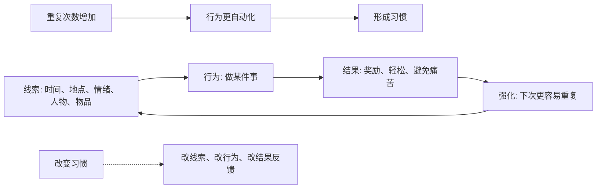

## 心理学思维筑基课: 习惯来自重复与强化
  
### 作者  
digoal  
  
### 日期  
2026-05-07  
  
### 标签  
习惯 , 重复 , 养成 , 环境 , 线索 , 行为 , 结果 , 反馈 , 强化 , 形成习惯 , 改变习惯 , 改变线索 , 改变行为 , 改变反馈 
  
----  
  
## 背景  
  
稳定行为往往不是靠意志力维持，而是靠线索、奖励、重复和环境设计形成。  

> 面向对象: 初中到高中学生  
> 核心问题: 为什么有些行为一开始很费劲，后来会变成“不用想就做”；而有些坏习惯明知道不好，却很难停下来？  
> 先说结论: 习惯不是一次决心形成的，而是在相似线索下反复做同一行为，并不断获得某种结果反馈后慢慢固定的。这个结果可能是奖励、轻松、被认可，也可能只是压力暂时下降。重复让行为熟练，强化让行为更愿意再出现。

## 一张图先看懂



## 求真讲法

### 它到底说了什么

“习惯来自重复与强化”可以先用一句话理解：

> 习惯是被反复练出来、又被结果不断“留住”的行为。

它通常包含三个环节：

| 环节 | 通俗解释 | 例子 |
|---|---|---|
| 线索 | 触发行为的开关 | 睡前、看到手机、感到无聊 |
| 行为 | 实际做出的动作 | 刷视频、背单词、吃零食 |
| 结果 | 行为之后得到的反馈 | 放松、成就感、逃开压力 |

比如“睡前刷手机”：

- 线索：躺到床上、觉得累。
- 行为：拿起手机刷。
- 结果：立刻轻松、有趣、不用面对白天压力。

只要这个循环反复发生，大脑就会学到：

> 一到这个场景，做这个行为，可以得到这个结果。

所以，这条原则真正表达的是：

**习惯不是单靠意志力决定的，而是由线索、重复行为和结果反馈共同养出来的。**

### 它是怎么来的

这条原则来自学习心理学、行为主义和习惯研究。

第一，**重复会降低行为难度。**  
第一次做一件事需要大量注意力，做多了以后，大脑会把它变成更省力的自动程序。

第二，**强化会增加行为重复概率。**  
如果一个行为之后带来好处，大脑会更愿意下次继续做。

第三，**负强化也会形成习惯。**  
这里的“负强化”不是惩罚，而是“做了某事以后，难受减少了”。  
比如拖延作业后，焦虑暂时下降，这种轻松感会让拖延更容易重复。

第四，**稳定线索会让习惯更牢。**  
每天同一时间、同一地点、同一情绪下重复行为，习惯更容易自动启动。

可以用一个简单的 ASCII 图理解：

```text
同一线索
  -> 同一行为
  -> 得到某种好处或减轻痛苦
  -> 下次更容易重复
  -> 慢慢自动化
```

这就是为什么坏习惯不是因为人“不懂道理”，而是因为它们往往给了很快的反馈。

### 它依赖哪些假设

“习惯来自重复与强化”成立，依赖几个关键前提。

| 假设 | 含义 | 如果不成立会怎样 |
|---|---|---|
| 行为会被重复练习改变 | 做多了会更熟、更自动 | 如果重复不改变行为，习惯难形成 |
| 行为结果会影响下次选择 | 好处或减压会强化行为 | 如果结果无影响，强化作用会弱 |
| 环境线索会触发行为 | 时间、地点、情绪能启动习惯 | 如果没有稳定线索，习惯较难自动化 |
| 大脑倾向节省精力 | 熟练行为会变成自动程序 | 如果大脑不追求省力，习惯价值会小 |

这也说明一句关键的话：

> 想改变习惯，不能只盯行为本身，还要看它被什么线索触发、被什么结果强化。

### 常见误解

**误解一：习惯就是靠意志力养成的。**  
不对。意志力能启动，但长期习惯更依赖环境、重复和反馈。

**误解二：坏习惯没有好处，所以应该很容易戒。**  
不对。坏习惯常有即时好处，比如放松、刺激、逃避压力。

**误解三：重复越多一定越好。**  
不对。错误方法重复多了，也会形成错误习惯。

**误解四：习惯一旦形成就改不了。**  
不对。习惯很顽固，但可以通过改变线索、替代行为和反馈来重塑。

## 求存讲法

### 它有什么用

这条原则最大的作用，是让你把习惯问题从“我太差了”改成“循环怎么设计”。

想养成一个习惯，可以问：

- 什么线索提醒我开始？
- 行为能不能足够小，容易重复？
- 做完以后有没有即时反馈？
- 我能不能每天在相似条件下做？

想改变一个坏习惯，可以问：

- 它通常在什么情境下出现？
- 它给了我什么即时好处？
- 我能不能保留好处，但换一个更健康的行为？

### 它怎么迁移到熟悉领域

这个原则在学生生活中非常常见。

| 目标 | 习惯循环设计 |
|---|---|
| 每天背单词 | 晚饭后立刻背 10 个，完成后打勾 |
| 少刷短视频 | 睡前手机放客厅，用纸质书替代 |
| 坚持运动 | 放学后换运动鞋，跑 10 分钟，记录进度 |
| 减少拖延 | 坐下后只做第一小步，先启动再说 |

迁移后的核心意思是：

> 习惯不是靠一次热血，而是靠小行为在稳定线索下反复出现，并得到反馈。

### 它的适用范围和边界

这条原则适合用于：

- 学习习惯养成。
- 手机和娱乐控制。
- 运动、阅读、睡眠等日常行为改变。
- 理解拖延、逃避和上瘾性行为。

但它也有边界。

第一，习惯不是所有行为的全部原因。  
情绪、价值观、现实压力、身体状态也会影响行为。

第二，强化不一定都健康。  
短期舒服可能强化长期有害的行为。

第三，改变习惯需要时间。  
不同习惯、不同人、不同环境，形成和改变速度都不同。

第四，有些强烈成瘾或心理困扰需要专业支持。  
不能只靠简单习惯技巧解决所有问题。

### 正例: 怎么用它提升能力

假设一个学生想每天阅读 20 分钟。

如果目标只是“我要多读书”，很容易忘。  
如果按习惯循环设计，可以这样做：

- 线索：每天洗完澡后。
- 行为：坐到书桌前读 10 页。
- 强化：读完在日历上画勾，并允许自己听一首歌。

刚开始不追求读很多，而是追求循环稳定。  
一旦“洗完澡 -> 坐下读书 -> 画勾”重复多次，行为就会越来越自然。

这就是用重复和强化，让好行为从“靠逼自己”变成“顺手去做”。

### 反例: 前提不成立会怎样

假设一个人说：“我每天都下决心不刷手机，但还是失败，所以我没有自制力。”

这个判断可能忽略了习惯循环：

- 线索：睡前躺下，手机就在枕边。
- 行为：打开手机。
- 结果：立刻轻松、有趣、逃开一天压力。

如果只责怪自制力，却不改变线索和强化，旧习惯会继续被触发。  
更有效的做法可能是：

- 手机睡前放到房间外。
- 床边放纸质书。
- 睡前固定做一个更轻的替代行为。

这里失败的根本原因，是忽略了“环境线索会触发行为”和“行为结果会影响下次选择”这两个前提。  
不是人完全没有自制力，而是旧循环设计得太强。

## 思考

为什么坏习惯常常比好习惯更容易形成？

因为很多坏习惯有即时强化：刷手机马上有趣，逃避马上轻松，吃甜食马上开心。  
而很多好习惯的回报来得慢：运动几周才明显，学习几个月才见效，早睡的好处也需要持续积累。

这也引出几个更深的问题：

- 你想养成的好习惯，有没有即时反馈？
- 你想戒掉的坏习惯，到底给了你什么短期好处？
- 你能不能不只靠忍，而是重新设计线索和奖励？

成熟的心理学思维，不是把习惯问题都归结为“我不够狠”，而是更具体地看：

- 线索在哪里？
- 行为是什么？
- 强化是什么？
- 替代循环怎么设计？

“习惯来自重复与强化”真正教人的，是把改变从口号变成可操作的行为系统。

## 最后记住

1. 习惯通常由线索、行为和结果反馈反复循环形成。
2. 重复让行为更熟练，强化让行为更愿意再次出现。
3. 强化不一定是奖励，也可能是焦虑下降、压力暂时减少。
4. 改变习惯不能只靠意志力，要改线索、改行为、改反馈。
5. 真正稳定的改变，来自小行为在稳定条件下持续重复。

## 参考资料

- B. F. Skinner, *Science and Human Behavior*, 关于强化和行为形成的经典行为主义框架。
- Wendy Wood, *Good Habits, Bad Habits*, 关于习惯、环境线索和重复行为的现代习惯研究综述。
- Charles Duhigg, *The Power of Habit*, 关于线索、惯常行为和奖赏循环的通俗框架。
- David G. Myers, *Psychology*, 关于学习、强化、行为塑造和习惯形成的通用教材体系。
- 本文为面向学生的简化解释，基于通用心理学与行为科学教材框架，不用于诊断或替代专业心理帮助。

  
  
  
#### [PostgreSQL 解决方案集合](../201706/20170601_02.md "40cff096e9ed7122c512b35d8561d9c8")
  
  
#### [德哥 / digoal's Github - 公益是一辈子的事.](https://github.com/digoal/blog/blob/master/README.md "22709685feb7cab07d30f30387f0a9ae")
  
  
#### [About 德哥](https://github.com/digoal/blog/blob/master/me/readme.md "a37735981e7704886ffd590565582dd0")
  
  

  
