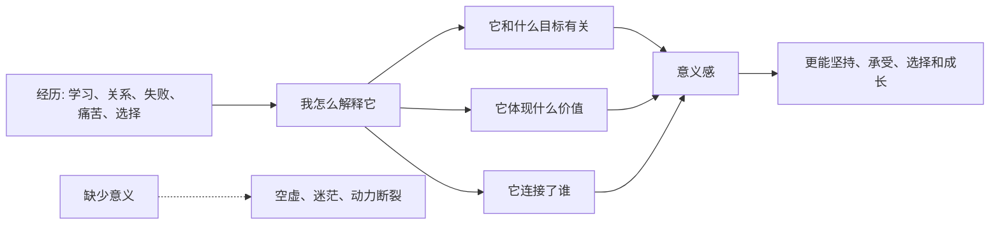

## 心理学思维筑基课: 人需要意义感
  
### 作者  
digoal  
  
### 日期  
2026-05-07  
  
### 标签  
意义感 , 为什么活 , 为什么坚持 , 为什么选择 , 坚持 , 承受 , 压力 , 困难 , 成长 , 长期主义  
  
----  
  
## 背景  
人不仅追求快乐，也需要解释痛苦、建立目标、感到自己的人生有方向。  
  
  

> 面向对象: 初中到高中学生  
> 核心问题: 为什么人不只是想开心、轻松和安全，还会追问“我为什么要做这些”“这件事对我有什么意义”？  
> 先说结论: 人需要意义感，意思是人不只追求快乐，也需要把自己的努力、痛苦、关系和目标放进一个能解释“我为什么活、为什么坚持、为什么选择”的框架里。意义感让人更能承受困难，也更容易把零散行动连成长期方向。

## 一张图先看懂



## 求真讲法

### 它到底说了什么

“人需要意义感”可以先用一句话理解：

> 人不只想知道“我能得到什么”，也想知道“这一切为什么值得”。

意义感不是一定要有伟大理想，也不是每天都热血。它更像一种内在连接感：

- 我知道自己在做什么。
- 我知道这件事和什么目标有关。
- 我觉得自己的努力不是完全白费。
- 我能把困难放进一个可以承受的解释里。
- 我觉得自己和他人、价值或未来有连接。

一个简单对比：

| 状态 | 感受 |
|---|---|
| 只有任务，没有意义 | 机械、疲惫、容易放弃 |
| 有目标和价值连接 | 辛苦但更能坚持 |
| 只有快乐，没有方向 | 当下舒服，但可能空虚 |
| 痛苦能被解释 | 仍然难受，但更能承受 |

所以，这条原则真正表达的是：

**人需要的不只是舒服，还需要把生活解释成“值得继续投入”的东西。**

### 它是怎么来的

这条原则来自存在主义心理学、人本主义心理学、积极心理学和临床观察。

第一，**人会追问“为什么”。**  
当一个人只是完成任务，却不知道任务和自己有什么关系时，动力会很容易断。

第二，**意义感能帮助人承受痛苦。**  
同样是辛苦训练，如果一个人觉得它通向重要目标，痛苦就更容易被承受。

第三，**意义感能把零散行动连成方向。**  
今天背单词、明天做题、后天复盘，如果都只是孤立任务，很容易烦；如果它们连接到“我想拥有更大的选择权”，就更容易坚持。

第四，**缺少意义会带来空虚感。**  
一个人可能有娱乐、有成绩、有物质条件，但如果不知道这些和自己真正重视的东西有什么关系，仍可能觉得空。

可以用一个简单的 ASCII 图理解：

```text
行为
  -> 如果只看当下成本: 很累
  -> 如果连接目标和价值: 更值得

痛苦
  -> 如果无法解释: 只是折磨
  -> 如果能放进意义框架: 仍痛, 但可承受
```

这就是为什么心理学不会只研究快乐，也会研究价值、目标、责任、连接和意义。

### 它依赖哪些假设

“人需要意义感”成立，依赖几个关键前提。

| 假设 | 含义 | 如果不成立会怎样 |
|---|---|---|
| 人会反思自己的生活 | 不只被即时刺激推动 | 如果人完全不反思，意义需求会弱 |
| 人能把行动和价值连接 | 会问“这件事为什么重要” | 如果行动无法连接价值，意义感难形成 |
| 痛苦需要解释 | 人想知道苦难为何值得承受 | 如果痛苦不需要解释，意义作用会小 |
| 人有长期目标和身份感 | 会把今天和未来的自己连起来 | 如果只活在当下，意义感结构会变弱 |

这也说明一句关键的话：

> 意义感不是装饰品，而是人承受困难、组织生活和维持方向的重要心理结构。

### 常见误解

**误解一：意义感必须很宏大。**  
不对。照顾家人、学会一门技能、认真完成一个作品，也可以有意义。

**误解二：有意义就不会痛苦。**  
不对。有意义的事也会累、会怕、会挫败，只是更可能值得承受。

**误解三：快乐比意义低级。**  
不对。快乐很重要，只是快乐不能完全替代意义。

**误解四：意义感只能靠别人给。**  
不对。别人能提供认可和连接，但意义常常需要自己参与建构。

## 求存讲法

### 它有什么用

这条原则最大的作用，是帮助你理解很多“明明不缺什么，却还是空”的状态。

当一个人缺少意义感时，常见表现可能是：

- 做事只剩应付。
- 成功之后也很快空掉。
- 容易问“然后呢”。
- 对未来没有方向感。
- 遇到困难时特别容易崩，因为不知道为什么要扛。

这时，问题不一定是懒，也不一定只是情绪差，可能是行动和意义断开了。

### 它怎么迁移到熟悉领域

这个原则在学生生活里很常见。

| 场景 | 没有意义感 | 有意义感 |
|---|---|---|
| 学习 | “只是为了考试” | “我在训练选择未来的能力” |
| 运动 | “很累很烦” | “我在保护身体和状态” |
| 做项目 | “老师布置的任务” | “这是我能做出东西的机会” |
| 帮助别人 | “浪费时间” | “我在建立连接和责任感” |

迁移后的核心意思是：

> 同一件事，如果能连接到价值和目标，就更容易从负担变成投入。

### 它的适用范围和边界

这条原则适合用于：

- 理解学习动力、职业选择和人生规划。
- 解释为什么只有快乐不一定让人满足。
- 帮助人在挫折和痛苦中寻找方向。
- 训练自己把日常行动和长期价值连接起来。

但它也有边界。

第一，不能用意义感强迫别人忍受不该忍受的伤害。  
如果环境有虐待、霸凌或压迫，解决现实问题比“寻找意义”更优先。

第二，意义感不是一次想明白就永远稳定。  
人生阶段变化后，意义也可能需要重新整理。

第三，意义感不能替代基本需要。  
长期缺睡、缺安全、缺支持时，单靠意义很难撑住。

第四，意义感可能被错误叙事利用。  
如果某个意义要求人长期否定自己、牺牲健康或失去判断，就需要警惕。

### 正例: 怎么用它提升能力

假设一个学生觉得每天学习很机械。

如果只是告诉自己“必须努力”，动力可能很快耗尽。  
如果他重新追问意义，可能会找到更具体的连接：

- 我学数学，不只是为了分数，也是为了训练严密思考。
- 我学英语，不只是为了考试，也是为了未来能读更多资料。
- 我认真完成项目，不只是交作业，也是为了证明自己能做成事。

这时学习仍然辛苦，但它不再只是外部要求，而开始连接到能力、选择权和自我成长。

### 反例: 前提不成立会怎样

假设有人说：“只要一件事有意义，就应该一直坚持，不能觉得累。”

这句话的问题，是把意义感误解成了万能燃料。

可能真实情况是：

- 这件事确实有意义。
- 但人也需要休息、支持和边界。
- 长期透支会让意义变成压力，甚至变成自我压迫。

这里失败的根本原因，是忽略了“意义感不能替代基本需要”这个前提。  
意义能帮助人承受困难，但不能取消人的身体、情绪和安全需求。

## 思考

为什么人会在生活顺利时突然感到空虚？

因为顺利不等于有意义。  
一个人可能完成了很多任务，得到了很多奖励，却没有回答“这些和我真正重视的东西有什么关系”。  
当目标只是一个接一个完成，生活就可能像清单，而不像故事。

这也引出几个更深的问题：

- 你现在努力的事情，和你真正看重的东西有连接吗？
- 哪些痛苦只是无意义消耗，哪些痛苦是在通向重要目标？
- 如果没人表扬你，这件事还值得做吗？

成熟的心理学思维，不是每天追问宏大使命，而是学会把日常行动和真实价值连接起来：

- 我为什么做这件事？
- 它服务于什么人、什么价值、什么未来？
- 我愿意为它承担多少成本？

“人需要意义感”真正教人的，是人不仅要活下去，也要知道自己为什么值得这样活。

## 最后记住

1. 人不只追求快乐和安全，也需要目标、价值、连接和可解释的生活方向。
2. 意义感能帮助人承受困难，把零散行动连成长期方向。
3. 意义不一定宏大，很多日常责任、创造、学习和关系都能有意义。
4. 意义感不是万能燃料，不能替代休息、安全、支持和现实问题解决。
5. 真正稳定的意义感，来自把自己正在做的事和真实重视的价值连接起来。

## 参考资料

- Viktor E. Frankl, *Man's Search for Meaning*, 关于人在苦难中寻找意义的经典存在主义心理学文本。
- Abraham H. Maslow, *Motivation and Personality*, 关于成长动机、自我实现和人本主义心理学的框架。
- Martin E. P. Seligman, *Flourish*, 关于积极心理学中意义、投入、关系和幸福感的框架。
- David G. Myers, *Psychology*, 关于动机、幸福感、意义和人本主义心理学的通用教材体系。
- 本文为面向学生的简化解释，基于通用心理学与存在主义心理学框架，不用于诊断或替代专业心理帮助。

  
  
  
#### [PostgreSQL 解决方案集合](../201706/20170601_02.md "40cff096e9ed7122c512b35d8561d9c8")
  
  
#### [德哥 / digoal's Github - 公益是一辈子的事.](https://github.com/digoal/blog/blob/master/README.md "22709685feb7cab07d30f30387f0a9ae")
  
  
#### [About 德哥](https://github.com/digoal/blog/blob/master/me/readme.md "a37735981e7704886ffd590565582dd0")
  
  

  
