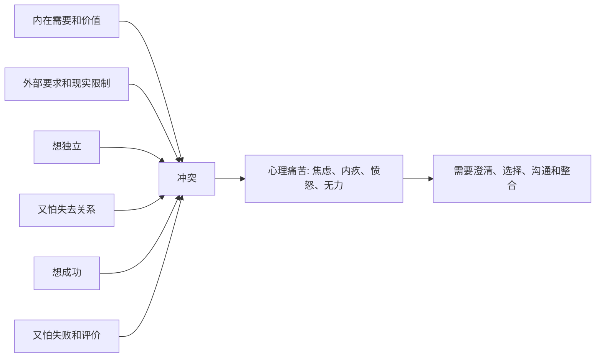

## 心理学思维筑基课: 心理痛苦常来自内外冲突
  
### 作者  
digoal  
  
### 日期  
2026-05-07  
  
### 标签  
内在需求 , 外部要求 , 冲突 , 痛苦 , 内耗  
  
----  
  
## 背景  
心理痛苦常来自内外冲突, 比如想独立又怕失去关系，想成功又怕失败，想被看见又怕被评价。
  
  

> 面向对象: 初中到高中学生  
> 核心问题: 为什么人有时不是因为单一坏事痛苦，而是因为心里有两个方向在拉扯，或者自己的需要和外部现实撞在一起？  
> 先说结论: 心理痛苦常来自内外冲突，意思是人的不同需要、价值、身份、情绪和现实要求之间发生拉扯时，内心会产生紧张、焦虑、内疚、愤怒或无力感。痛苦不一定说明人脆弱，有时是在提醒: 这里有重要东西没有被整合。

## 一张图先看懂



## 求真讲法

### 它到底说了什么

“心理痛苦常来自内外冲突”可以先用一句话理解：

> 人痛苦，常常不是因为只有一个问题，而是因为几个重要的东西同时在争夺你。

心理冲突大致可以分成两类。

| 类型 | 通俗解释 | 例子 |
|---|---|---|
| 内在冲突 | 自己心里有两个方向互相拉扯 | 想努力，又怕失败；想亲近，又怕受伤 |
| 外在冲突 | 自己的需要和外部现实发生碰撞 | 想休息，但考试快到了；想表达，但家人不允许 |

很多痛苦不是“我不知道该不该做”，而是“我知道每个选择都有代价”。

比如：

- 想拒绝别人，又怕被讨厌。
- 想坚持自己，又怕让父母失望。
- 想追求梦想，又担心现实压力。
- 想和朋友亲近，又害怕被伤害。

所以，这条原则真正表达的是：

**心理痛苦常常来自重要需求之间的冲突，而不是来自某一个简单错误。**

### 它是怎么来的

这条原则来自精神分析、认知心理学、人本主义心理学和压力研究中的共同观察。

第一，**人不是只有一个需要。**  
一个人可以同时想要安全、自由、关系、成就、尊严和意义。这些需要有时会合作，有时会冲突。

第二，**外部世界不会完全配合内在需要。**  
你想休息，现实可能要求你考试；你想被理解，别人可能暂时没有能力理解；你想做自己，环境可能要求你符合角色。

第三，**冲突会制造持续消耗。**  
如果一个人长期卡在“靠近还是远离”“坚持还是放弃”“表达还是沉默”之间，大脑会不断计算代价，情绪也会被反复拉扯。

第四，**痛苦有时是整合失败的信号。**  
不是说人“想太多”，而是不同部分没有被好好看见、排序和协调。

可以用一个简单的 ASCII 图理解：

```text
我想要 A
  但 A 会带来代价

我也想要 B
  但 B 又和 A 冲突

于是:
卡住 -> 焦虑 -> 内耗 -> 痛苦
```

这就是为什么很多心理困扰不是靠一句“别想了”就能解决，因为冲突中的每一边，往往都有它的理由。

### 它依赖哪些假设

“心理痛苦常来自内外冲突”成立，依赖几个关键前提。

| 假设 | 含义 | 如果不成立会怎样 |
|---|---|---|
| 人有多重需要 | 安全、自由、关系、成就等会同时存在 | 如果只有一个需要，就少有内在冲突 |
| 需要之间会竞争 | 满足一个需要可能牺牲另一个 | 如果所有需要永远一致，痛苦会少很多 |
| 外部现实有限制 | 世界不会完全按个人愿望运行 | 如果现实无限配合，外在冲突会减少 |
| 人会在意选择代价 | 放弃、失去和失败会带来情绪 | 如果选择没有代价，冲突不会强烈 |

这也说明一句关键的话：

> 心理痛苦不是单纯的软弱，很多时候是多个重要价值和需要正在同时发声。

### 常见误解

**误解一：痛苦就是想太多。**  
不对。很多痛苦来自真实冲突，不是简单停止思考就能消失。

**误解二：有冲突说明人不坚定。**  
不对。冲突常常说明你在乎的东西不止一个。

**误解三：只要选一边，痛苦就会立刻结束。**  
不一定。没有被处理的另一边，可能会以遗憾、内疚或反复纠结回来。

**误解四：内在冲突都要自己解决。**  
不对。有些冲突需要沟通、环境改变、支持系统或专业帮助。

## 求存讲法

### 它有什么用

这条原则最大的作用，是让你在痛苦时不只问：

- 我怎么才能不难受？

还要问：

- 我心里有哪些部分正在冲突？
- 我想保护什么？
- 我害怕失去什么？
- 外部现实给了我什么限制？
- 有没有办法重新排序、协商或整合？

这样，痛苦就不只是折磨，而变成了理解自己的入口。

### 它怎么迁移到熟悉领域

这个原则在学生生活里很常见。

| 场景 | 冲突在哪里 |
|---|---|
| 想玩又要学习 | 即时快乐 vs 长期目标 |
| 想拒绝同学请求 | 自我边界 vs 关系接纳 |
| 想选喜欢的方向 | 自我兴趣 vs 家长期待 |
| 想表现自己 | 成就需要 vs 害怕评价 |
| 想独立 | 自主需要 vs 安全和依赖 |

迁移后的核心意思是：

> 很多纠结不是因为你“不懂道理”，而是因为你同时在乎两个方向。

### 它的适用范围和边界

这条原则适合用于：

- 理解焦虑、纠结、内耗和关系痛苦。
- 分析选择困难背后的价值冲突。
- 帮助自己把模糊痛苦拆成具体拉扯。
- 训练沟通、排序和自我整合能力。

但它也有边界。

第一，不是所有痛苦都来自冲突。  
睡眠不足、疾病、创伤、现实损失，也可能直接带来痛苦。

第二，有些冲突无法完美解决。  
人生常常不是找到零代价答案，而是选择能承担的代价。

第三，冲突不一定要马上消除。  
有些复杂冲突需要时间、信息和支持来慢慢处理。

第四，不能用“内心冲突”掩盖现实伤害。  
如果外部环境确实有压迫、霸凌或侵犯，优先要处理现实安全和边界。

### 正例: 怎么用它提升能力

假设一个学生特别焦虑，因为他想选自己喜欢的专业方向，但父母希望他选更稳定的方向。

如果只说“我太纠结了”，问题会很模糊。  
如果按冲突拆开，就能看到：

- 自己想要兴趣、自主和长期热情。
- 父母看重安全、就业和现实风险。
- 自己也不是完全不在乎稳定，只是不想完全失去选择权。

这时更成熟的做法不是立刻对抗，也不是完全服从，而是进一步澄清：

- 我真正想要的是什么？
- 父母真正担心的是什么？
- 有没有同时保留兴趣和安全的路径？
- 哪些代价我愿意承担，哪些代价我承担不了？

痛苦没有马上消失，但它从混乱内耗，变成了可以讨论和决策的问题。

### 反例: 前提不成立会怎样

假设有人说：“你既然想成功，就不要害怕失败；害怕说明你不够想。”

这句话的问题，是把人简化成只有一个目标。

真实情况可能是：

- 他确实想成功。
- 他也害怕失败后的羞耻和评价。
- 他还担心努力后仍失败，会更伤自尊。

这里失败的根本原因，是忽略了“人有多重需要”和“选择有代价”这两个前提。  
想成功和怕失败可以同时存在，它们的冲突才是痛苦来源。

## 思考

为什么心理冲突特别消耗人？

因为它不像单一困难那样可以直接行动。  
单一困难是“我知道要爬山，只是很累”。  
冲突则是“我既想上山，又怕上山后失去别的东西，还担心不上山会后悔”。  
大脑会反复模拟不同选择的代价，于是人就被困在内耗里。

这也引出几个更深的问题：

- 你现在的痛苦，是来自一个问题，还是来自几个需要互相拉扯？
- 你最想保住的是什么？
- 你最害怕付出的代价是什么？
- 有没有一种选择，不是消灭某一边，而是重新安排优先级？

成熟的心理学思维，不是急着把冲突压平，而是先把冲突讲清楚：

- 哪些需要正在发声？
- 哪些现实限制不能忽略？
- 哪些代价可以承担？
- 哪些边界必须守住？

“心理痛苦常来自内外冲突”真正教人的，是把痛苦当作信号: 这里有重要的东西正在争夺位置，需要被看见、排序和整合。

## 最后记住

1. 心理痛苦常常来自多重需要、价值、身份和现实限制之间的冲突。
2. 冲突不等于软弱，很多时候说明你同时在乎多个重要东西。
3. 内在冲突发生在自己心里，外在冲突发生在自己的需要和现实环境之间。
4. 解决冲突不一定是找到完美答案，而是看清代价、排序需要、做出能承担的选择。
5. 真正有效的处理，不是压掉痛苦，而是把痛苦背后的冲突讲清楚。

## 参考资料

- Sigmund Freud 相关心理冲突理论，强调内在欲望、防御和现实要求之间的张力。
- Carl Rogers, *On Becoming a Person*, 关于自我概念、真实经验和一致性的心理成长框架。
- Irvin D. Yalom, *Existential Psychotherapy*, 关于自由、责任、孤独、死亡和意义等存在冲突的临床框架。
- David G. Myers, *Psychology*, 关于动机、冲突、压力和情绪调节的通用教材体系。
- 本文为面向学生的简化解释，基于通用心理学与心理治疗理论框架，不用于诊断或替代专业心理帮助。

  
  
  
#### [PostgreSQL 解决方案集合](../201706/20170601_02.md "40cff096e9ed7122c512b35d8561d9c8")
  
  
#### [德哥 / digoal's Github - 公益是一辈子的事.](https://github.com/digoal/blog/blob/master/README.md "22709685feb7cab07d30f30387f0a9ae")
  
  
#### [About 德哥](https://github.com/digoal/blog/blob/master/me/readme.md "a37735981e7704886ffd590565582dd0")
  
  

  
