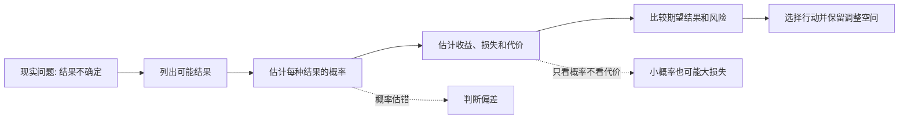
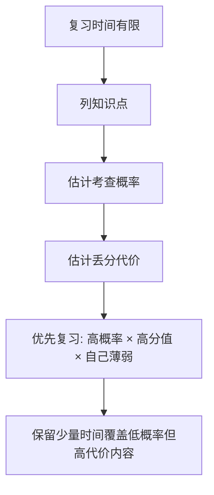

## 元认知思维筑基课: 概率思维: 用可能性替代绝对化判断
  
### 作者  
digoal  
  
### 日期  
2026-05-07  
  
### 标签  
列结果 , 估概率 , 看后果 , 做选择 
  
----  
  
## 背景  
概率思维：不用“对/错”看世界，而用可能性、置信度、风险区间。

> 面向对象: 初中到高中学生  
> 核心问题: 为什么很多问题不能只问“会不会”，而要问“多大可能、代价多大、证据多强”？  
> 先说结论: 概率思维是一种在不确定世界里做判断的方法。它不把事情简单分成“必然发生”和“绝不发生”，而是用可能性、区间、风险和期望结果来管理判断与行动。  

## 一张图先看懂



## 求真讲法

### 它到底说了什么

概率思维不是让人说话含糊，而是让人更准确地面对不确定。

很多人习惯用二分法判断:

```text
这件事会成功吗？会 / 不会
这次考试会考好吗？会 / 不会
这个人可靠吗？可靠 / 不可靠
```

概率思维会换一种问法:

```text
这件事有多大概率成功？
不同结果分别是什么？
如果判断错了，代价是什么？
我现在的证据能支持多高的信心？
```

例如，明天会不会下雨？普通说法是“会”或“不会”。概率说法是“有 70% 概率下雨”。这不是胆小，而是更接近真实: 天气系统复杂，预测只能给出在当前信息下的可能性。

在人生和学习中也是一样。很多结论不是 0% 或 100%，而是 20%、60%、85% 这样的信心程度。

### 它是怎么来的

概率思维来自人类对随机性和不确定性的认识。掷骰子、抽签、保险、天气、疾病、考试、投资、科学实验，都让人发现一个事实:

> 单次结果可能偶然，但大量事件背后常常有稳定规律。

比如掷一枚均匀硬币，下一次正面还是反面，我们不能确定。但如果掷很多次，正面比例通常会接近一半。

```text
单次事件: 不确定
多次重复: 有统计规律

一次考试发挥: 可能受状态影响
多次测验表现: 更能反映真实水平

一个顾客反馈: 可能很偶然
一百个顾客反馈: 更可能反映产品问题
```

概率思维的基本逻辑可以简化成四步:

| 步骤 | 问题 | 例子 |
| --- | --- | --- |
| 列结果 | 可能发生什么？ | 考好、正常、考差 |
| 估概率 | 每种结果大概多可能？ | 20%、60%、20% |
| 看后果 | 每种结果的收益或损失是什么？ | 成绩、信心、补救成本 |
| 做选择 | 哪个行动在概率和后果下更合理？ | 复习薄弱题型，而不是只押题 |

这里不要求每次都算得很精确。日常使用概率思维，关键是不要把不确定的问题伪装成确定问题。

### 它依赖哪些假设

概率思维要成立，至少依赖这些假设:

| 假设 | 含义 | 如果不成立会怎样 |
| --- | --- | --- |
| 结果可以被区分 | 你能说清楚有哪些可能结果 | 连结果都混在一起，概率就无从估计 |
| 信息有参考价值 | 历史数据、样本、经验能部分帮助判断未来 | 如果信息完全无关，估计会变成猜谜 |
| 样本不能太偏 | 用来判断的信息要尽量代表真实情况 | 只看极端案例，会严重误判概率 |
| 概率和代价都要看 | 高概率小收益与低概率大损失不能只看一边 | 容易为了小便宜承担大风险 |
| 估计需要更新 | 新信息出现后，概率判断要调整 | 旧判断会变成固执或过时 |

### 常见误解

**误解一: 概率低就可以忽略。**

不对。概率低不等于不重要。如果后果特别严重，小概率也值得重视。比如火灾概率不高，但学校仍要做消防演练。

**误解二: 概率高就一定会发生。**

不对。80% 概率成功，仍然意味着有 20% 可能失败。概率高只是更可能，不是保证。

**误解三: 一次结果可以证明概率判断错了。**

不一定。天气预报说 80% 概率下雨，最后没下雨，不代表预报一定错。因为 20% 的情况本来就可能发生。要判断预测质量，需要看很多次。

**误解四: 概率思维会让人不敢行动。**

不对。好的概率思维不是拖延，而是帮你知道哪些风险要防、哪些机会值得试、哪些损失要提前设上限。

## 求存讲法

### 它有什么用

概率思维最直接的用途，是让人在不确定中做更稳的选择。

它可以帮你:

- 少被单个案例吓到或诱惑。
- 区分“可能发生”和“值得为它付出代价”。
- 设计备用方案，而不是假设一切都会顺利。
- 对自己的判断保留信心区间。
- 在长期重复行动中提高胜率。

一个简单对比:

| 普通判断 | 概率思维 |
| --- | --- |
| 我这次一定能考好 | 我准备充分，考好的概率高，但仍要防粗心 |
| 这个方法肯定没用 | 目前证据显示效果弱，需要更多样本验证 |
| 这件事不可能出问题 | 出问题概率低，但一旦出问题代价很大，要预案 |
| 他一次失败，说明他不行 | 一次失败信息有限，要看长期表现和失败原因 |

### 它怎么迁移到熟悉领域

以考试复习为例。很多同学喜欢问:

> 老师会不会考这道题？

概率思维会把问题改成:



这比盲目押题更稳。因为真正影响复习优先级的，不只是“会不会考”，还有:

```text
考查概率 × 分值权重 × 自己掌握程度 × 补救成本
```

所以概率思维不是让你猜命运，而是让你分配注意力、时间和风险。

### 它的适用范围和边界

概率思维适合:

- 结果不确定的问题。
- 有历史数据、经验或样本可参考的问题。
- 可以比较收益、损失和风险的问题。
- 需要长期重复决策的问题。

它的边界是:

- 价值问题不能只用概率决定，比如“我是否应该诚实”不是简单算收益概率。
- 样本太少时，概率估计只能粗略使用。
- 极端事件可能被低估，尤其是罕见但影响巨大的风险。
- 人会根据预测改变行为，使原来的概率发生变化。

### 正例: 怎么用它提升能力

假设你要准备一次数学考试，只剩 3 天。

不用概率思维时，可能会这样:

> 我感觉函数难，就一直刷函数题。

用概率思维时，可以这样拆:

| 内容 | 考查概率 | 分值 | 我的薄弱程度 | 优先级 |
| --- | --- | --- | --- | --- |
| 函数基础题 | 高 | 中 | 中 | 高 |
| 几何证明 | 中 | 高 | 高 | 高 |
| 冷门竞赛技巧 | 低 | 低 | 高 | 低 |
| 计算准确性 | 高 | 高 | 中 | 高 |

然后安排:

```text
第 1 天: 几何证明常见模型 + 错题复盘
第 2 天: 函数基础题限时训练
第 3 天: 计算准确性训练 + 全卷模拟
```

这个方案不保证满分，但它提高了“把有限时间用在最可能丢分、最值得补救的地方”的概率。

### 反例: 前提不成立会怎样

假设一个同学看到网上有人说:

> 我只复习最后一套押题卷，就考了高分。

于是他也只刷一套押题卷，结果考试大面积失分。

这里失败的关键，不是他“运气不好”这么简单，而是概率思维的前提没有成立:

| 失效前提 | 问题 | 结果 |
| --- | --- | --- |
| 样本不能太偏 | 他只看到了成功案例，没看到押题失败的人 | 高估押题成功概率 |
| 结果可以被区分 | 没区分对方基础好、题目巧合、学校不同 | 把别人的结果误当成自己的概率 |
| 概率和代价都要看 | 押中收益大，但押不中代价也大 | 为小样本故事承担高风险 |

更好的做法是:

```text
把押题卷当作补充，而不是主计划。
主计划覆盖高频基础、常见题型和错题。
如果时间有余，再用押题卷检查热点。
```

这个反例说明: 概率思维不是让你不冒险，而是让你知道自己到底在冒多大的险。

## 思考

概率思维最重要的训练，不是会算复杂公式，而是改变说话和判断方式。

把这些句子换掉:

```text
一定会成功 -> 成功概率较高，但失败原因可能是哪些？
肯定没问题 -> 出问题概率低，但最坏后果是什么？
他就是不行 -> 这次失败说明了什么？还有哪些解释？
我运气太差 -> 是偶然波动，还是方法本身胜率低？
```

它还可以和其他元认知方法配合:

- 和贝叶斯思维配合: 概率判断不是固定的，要根据新证据更新。
- 和第一性原理配合: 先找影响结果的关键变量，再估计它们的概率。
- 和系统思维配合: 注意反馈、延迟和连锁反应会改变概率。
- 和安全边际配合: 概率再高，也要给错误和意外留缓冲。

有一个反事实问题很值得经常问:

> 如果我这次判断错了，最可能是因为我低估了什么概率，还是低估了什么代价？

很多成熟判断，不是因为它“永远正确”，而是因为它承认不确定，并提前安排了缓冲、验证和纠错。

## 最后记住

1. 概率思维用“多大可能”替代简单的“会或不会”。
2. 判断一件事不能只看概率，还要看收益、损失和最坏后果。
3. 一次结果不能轻易证明概率判断对错，要看长期样本。
4. 小概率不等于可以忽略，尤其当后果很严重时。
5. 概率思维的目的不是不行动，而是更清楚地行动、更稳地纠错。

## 参考资料

- Sheldon Ross, *A First Course in Probability*, Pearson.
- William Feller, *An Introduction to Probability Theory and Its Applications*, Wiley.
- Daniel Kahneman, *Thinking, Fast and Slow*, Farrar, Straus and Giroux, 2011.
- Nassim Nicholas Taleb, *Fooled by Randomness*, Random House, 2001.
- 本文未联网检索；解释基于通用概率论、统计学、风险决策和批判性思维教材体系。

  
  
#### [PostgreSQL 解决方案集合](../201706/20170601_02.md "40cff096e9ed7122c512b35d8561d9c8")
  
  
#### [德哥 / digoal's Github - 公益是一辈子的事.](https://github.com/digoal/blog/blob/master/README.md "22709685feb7cab07d30f30387f0a9ae")
  
  
#### [About 德哥](https://github.com/digoal/blog/blob/master/me/readme.md "a37735981e7704886ffd590565582dd0")
  
  

  
