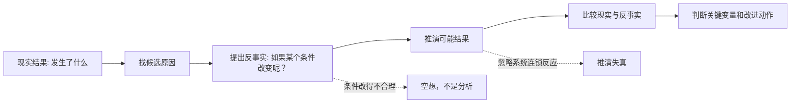
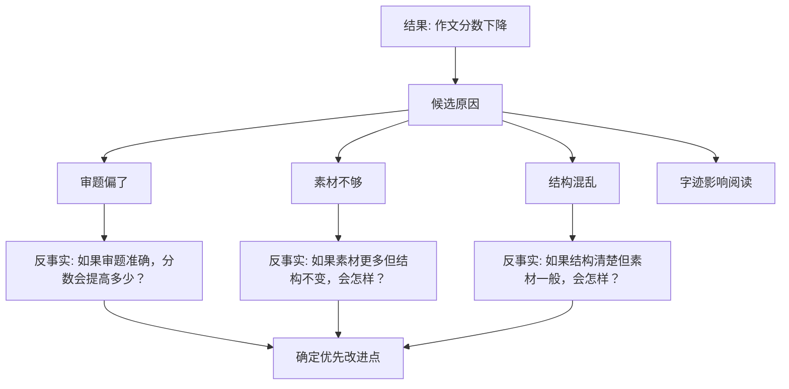

## 元认知思维筑基课: 反事实思维: 改变条件来检查判断
  
### 作者  
digoal  
  
### 日期  
2026-05-07  
  
### 标签  
现实 , 条件改变 , 重新推演 , 反事实比较  
  
----  
  
## 背景  
反事实思维：问“如果某个条件不存在，结论还成立吗？”

  

> 面向对象: 初中到高中学生  
> 核心问题: 为什么只看“已经发生的事”不够？怎样通过“如果当时不是这样”来理解因果、复盘错误、改进选择？  
> 先说结论: 反事实思维是一种把现实中的某个条件临时改掉，再观察结论是否还成立的思考方法。它能帮我们检查因果关系、发现关键变量、改进决策，但不能变成空想、后悔或随意编故事。  

## 一张图先看懂



## 求真讲法

### 它到底说了什么

“反事实”就是和已经发生的事实相反的设想。

事实是:

```text
我这次数学考试考差了。
```

反事实问题是:

```text
如果我考前一周没有只刷难题，而是先补基础题，结果会不会不同？
如果我考试时先做会做的题，而不是卡在第一道难题上，分数会不会更高？
如果这次题型没有变化，我还会考差吗？
```

反事实思维不是为了沉迷“如果当初怎样就好了”，而是为了回答一个更重要的问题:

> 哪些条件一变，结果就可能明显改变？这些条件就是值得关注的关键变量。

它的核心动作有三个:

1. 固定大部分背景。
2. 改变一个或少数几个关键条件。
3. 比较结果是否明显不同。

### 它是怎么来的

人在理解世界时，经常需要判断“到底是什么导致了结果”。但现实中，很多因素同时发生，很难直接看出因果。

比如一个班级成绩提高了，可能原因有:

- 老师讲得更清楚。
- 学生练习更多。
- 考试题变简单。
- 班级纪律变好。
- 这次刚好考到大家熟悉的内容。

如果只看事实“成绩提高了”，还不能知道真正原因。反事实思维会问:

```text
如果老师没换讲法，成绩还会提高吗？
如果练习量没增加，成绩还会提高吗？
如果试卷难度不变，成绩还会提高吗？
```

这就是反事实思维的动机: 用“假如某个条件不存在”来检验它是不是关键原因。

可以把它理解成一种思想实验:

```text
现实世界: A 条件存在，结果 R 发生。
反事实世界: 假设 A 条件不存在，其他条件尽量不变。
比较: R 是否还会发生？

如果 R 大概率不发生，A 可能是关键原因。
如果 R 仍然发生，A 可能不是主要原因。
```

### 它依赖哪些假设

反事实思维要有用，至少依赖这些假设:

| 假设 | 含义 | 如果不成立会怎样 |
| --- | --- | --- |
| 能识别候选条件 | 知道哪些因素可能影响结果 | 反事实会变成随便想象 |
| 只改变少量关键条件 | 尽量一次只改一个变量 | 同时改太多，分不清哪个条件起作用 |
| 背景条件大致可保持 | 其他因素在推演中尽量稳定 | 反事实世界和现实差太远，比较没有意义 |
| 因果链可以被解释 | 能说明条件怎样影响结果 | 只得到“可能会不同”，但不知道为什么 |
| 推演要接受证据约束 | 反事实不能违背已知事实、规律和常识 | 容易变成愿望、后悔或幻想 |

### 常见误解

**误解一: 反事实思维就是后悔。**

不对。后悔常常停在情绪里，反事实思维要走向改进动作。它问的不是“我为什么这么倒霉”，而是“哪个条件改变后，结果最可能改善”。

**误解二: 只要能想象，就算合理反事实。**

不对。合理反事实要受现实约束。比如“如果我昨天突然拥有超强记忆力就好了”不是有分析价值的反事实，因为这个条件不能被现实行动改变。

**误解三: 反事实可以证明因果。**

不完全对。反事实能帮助我们分析因果，但日常场景中通常只能提高判断可信度。严格因果判断还需要实验、对照、数据或更强证据。

**误解四: 反事实只用于失败复盘。**

不对。成功也需要反事实。问“如果没有这个条件，我还会成功吗”，可以防止把运气误认为能力。

## 求存讲法

### 它有什么用

反事实思维最直接的用途，是让复盘从“描述结果”走向“识别因果”。

它能帮助你:

- 找到真正影响结果的关键变量。
- 区分能力、努力、方法、运气和环境。
- 防止从一次成功或失败中得出过度结论。
- 设计下一次可以改变的行动。
- 检查一个观点是否依赖隐藏前提。

一个简单对比:

| 普通复盘 | 反事实复盘 |
| --- | --- |
| 我这次没考好，因为我不行 | 如果只改变复习顺序，结果是否会不同？ |
| 我们小组成功了，因为我领导得好 | 如果没有队友补漏洞，项目还会成功吗？ |
| 这个方法有效，因为用了以后成绩提高 | 如果不用这个方法，但练习量一样，成绩还会提高吗？ |
| 他这次迟到，说明他不负责 | 如果交通没堵，他还会迟到吗？ |

### 它怎么迁移到熟悉领域

以学习复盘为例。假设你语文作文分数下降。



你可以把反事实复盘写成一个固定模板:

```text
现实结果:
我以为的原因:
如果这个原因不存在，结果是否还会发生？
还有哪些原因也能解释结果？
下一次我能改变哪个条件？
```

这个模板能把复盘从“责怪自己”变成“修改变量”。

### 它的适用范围和边界

反事实思维适合:

- 复盘考试、项目、比赛、沟通和决策。
- 检查一个原因是否真的是关键原因。
- 设计实验、对照和改进方案。
- 从成功中识别运气和外部条件。

它的边界是:

- 已经无法改变的过去不能被反事实本身改变，只能服务于未来行动。
- 条件之间会互相影响，不能假设所有变量都能独立改变。
- 反事实推演需要证据支持，不能只选自己喜欢的版本。
- 情绪很强时，反事实容易变成自责或甩锅，需要先冷静再分析。

### 正例: 怎么用它提升能力

假设你这次英语听力错得多。你原本想:

> 我听力太差了。

用反事实思维，可以拆成:

| 反事实问题 | 可能发现 | 下一步动作 |
| --- | --- | --- |
| 如果我提前读题，错题会减少吗？ | 有些题是没抓住问题重点 | 训练听前快速圈关键词 |
| 如果我认识所有关键词，错题还会发生吗？ | 部分错误来自词汇不熟 | 建立听力高频词表 |
| 如果播放速度慢一点，我能听懂吗？ | 主要问题是连读和弱读 | 做慢速到正常速度训练 |
| 如果我没有紧张，错题会少吗？ | 情绪影响前几题 | 模拟考试开头 5 题 |

这样复盘后，你不会只得到“我不行”，而会得到几个可训练变量: 读题、词汇、连读、考试开头状态。

### 反例: 前提不成立会怎样

假设一个同学考试失利后说:

> 如果我出生在更好的家庭，我肯定就考好了。

这个反事实可能包含部分现实因素，但它在复盘中容易失效，因为它违反了两个关键前提:

| 失效前提 | 问题 | 后果 |
| --- | --- | --- |
| 条件要可用于行动 | 出生条件无法被下一次考试前改变 | 复盘不能转化为具体改进 |
| 一次只改少量变量 | 家庭条件会同时影响资源、习惯、情绪、机会 | 分不清真正影响这次考试的因素 |

更可用的反事实是:

```text
如果我提前两周开始复习，而不是前三天突击，会怎样？
如果我每天把错题原因分类，而不是只看答案，会怎样？
如果我考前保证睡眠，前半小时的失误会不会减少？
```

这些问题没有否认环境影响，但它们更适合指导下一次行动。

这个反例说明: 反事实思维要服务于理解和改进，而不是把人困在无法改变的设想里。

## 思考

反事实思维最有价值的地方，是它能同时拆穿两种常见错觉:

```text
失败错觉: 结果差，所以我全都错。
成功错觉: 结果好，所以我全都对。
```

失败时，要问:

> 如果只改变一个关键条件，结果会不会变好？

成功时，也要问:

> 如果少了某个外部条件，我还会成功吗？

它还可以和其他元认知方法配合:

- 和第一性原理配合: 先找底层变量，再对变量做反事实替换。
- 和逻辑三洽配合: 检查一个解释在不同条件下是否还能自洽、他洽、续洽。
- 和概率思维配合: 不问“必然怎样”，而问“条件改变后概率怎样变化”。
- 和证伪思维配合: 主动构造能推翻自己解释的反事实。

一个高级训练是:

```text
如果我的结论是错的，最可能是哪一个条件被我误判了？
如果我把这个条件拿掉，结论还成立吗？
如果我换一个人、换一个时间、换一个环境，结论还成立吗？
```

反事实思维让人从“解释过去”走向“设计未来”。它真正训练的不是想象力，而是因果敏感度。

## 最后记住

1. 反事实思维是通过改变某个条件，检查结果是否会变化。
2. 它的目标不是后悔，而是识别关键原因和改进行动。
3. 合理反事实要受现实证据约束，不能随意幻想。
4. 失败和成功都需要反事实复盘，避免把运气、环境、方法和能力混在一起。
5. 最有用的反事实，是能转化为下一次具体行动的反事实。

## 参考资料

- David Lewis, *Counterfactuals*, Harvard University Press, 1973.
- Judea Pearl, *Causality: Models, Reasoning, and Inference*, Cambridge University Press, 2000.
- Judea Pearl and Dana Mackenzie, *The Book of Why*, Basic Books, 2018.
- Daniel Kahneman and Amos Tversky, "The Simulation Heuristic", 1982.
- 本文未联网检索；解释基于通用因果推理、认知心理学、批判性思维和学习复盘方法体系。

  
  
#### [PostgreSQL 解决方案集合](../201706/20170601_02.md "40cff096e9ed7122c512b35d8561d9c8")
  
  
#### [德哥 / digoal's Github - 公益是一辈子的事.](https://github.com/digoal/blog/blob/master/README.md "22709685feb7cab07d30f30387f0a9ae")
  
  
#### [About 德哥](https://github.com/digoal/blog/blob/master/me/readme.md "a37735981e7704886ffd590565582dd0")
  
  

  
