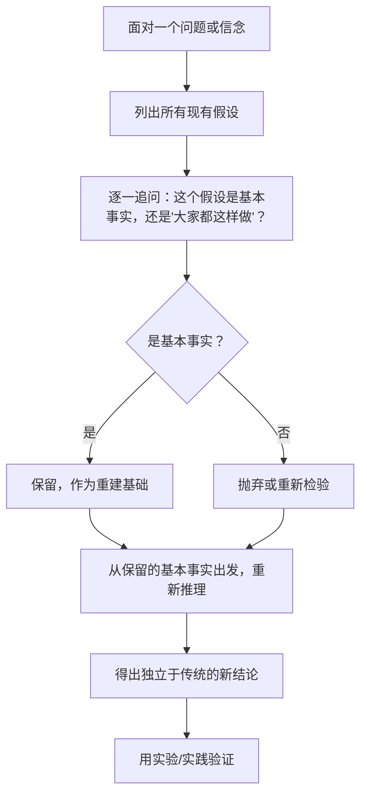
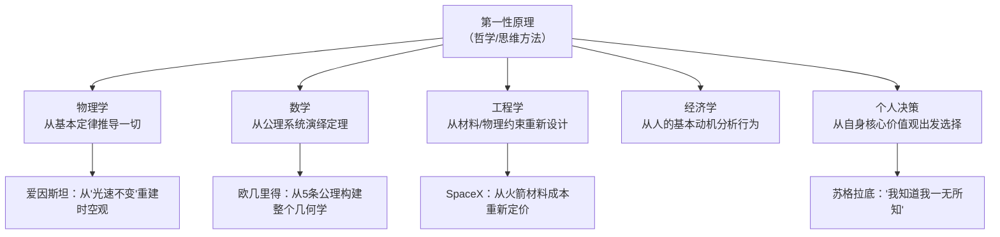

## 元认知思维筑基课: 第一性原理 v2
  
### 作者  
digoal  
  
### 日期  
2026-05-07  
  
### 标签  
第一性原理 , 拆解 , 事实 , 假设 , 剥离假设 , 重新推导 , 推翻事实 , 颠覆创新 
  
----  
  
## 背景  
   
> 剥去所有假设，回到事物最底层的基本事实，再从那里重新出发思考一切。

  

## 🔍 求真讲法：第一性原理从哪里来？

### 背景与动机

公元前 4 世纪，希腊哲学家**亚里士多德**第一次正式提出这个概念。

当时哲学家们争论不休：人类的知识到底有没有一个"终点"？能不能无限往下追问"为什么"？亚里士多德说——不能无限追问，因为最终你会抵达一些**无法再被证明、只能被直接感知的基本事实**，那就是"第一性原理"（希腊语：ἀρχή，arché，意为"起点"）。

两千年后，埃隆·马斯克在 2013 年的一次访谈里把这个概念带回大众视野。他被问到：为什么你敢做电动汽车、火箭这些"不可能"的事？他说：

> "我倾向于用'第一性原理'去思考，而不是'类比推理'。类比推理就是'别人怎么做，我也怎么做'；第一性原理就是把问题拆解到物理层面，再从零开始重建答案。"

这句话让"第一性原理"成了创业圈、思维圈最热门的词汇之一。

  

### 核心假设

第一性原理能够成立，依赖于以下几个前提：

- **世界是可分析的**：任何复杂现象都可以被逐层拆解，直到抵达基本单元
- **基本事实是稳定的**：物理定律、数学公理等底层规律不会随人的偏好而改变
- **从基础重建是可行的**：人类有能力从基本事实出发，经过推理，重新构建有效的结论
- **类比会制造盲点**：沿用他人经验虽然高效，但会让我们继承他人的假设和错误

> ⚠️ 注意：第一性原理**不是万能的**，它的成本极高——从零构建比类比推理慢得多，只在"类比失效"或"需要突破性创新"时才值得动用。

  

### 推导过程

第一性原理的核心逻辑链如下：



**马斯克的电池案例**是教科书级示范：

1. **传统类比思路**：电池很贵 → 电动车成本高 → 电动车不可能大众化  
2. **第一性原理拆解**：
   - 问：电池为什么贵？
   - 答：因为市场上就是这个价格（这是类比，不是基本事实）
   - 再问：电池是由什么材料组成的？
   - 答：碳、镍、铝、钢铁、聚合物……伦敦金属交易所的原材料价格是多少？
   - 算：原材料成本 ≈ \$80/kWh，而当时电池售价 ≈ \$600/kWh
   - 结论：电池贵是因为制造和商业模式问题，**不是物理规律决定的**，可以改变

  

### 直觉理解

想象你继承了一栋**用旧砖头随意堆砌的房子**。

- **类比思维**：这里本来就有一堵墙，那我在旁边再加一堵墙吧（继承旧结构）
- **第一性原理**：把房子拆掉，检查每一块砖——哪些是好砖？哪些已经碎了？然后按照你真正想要的房子，重新设计、重新盖

拆房子很累、很慢，但你最终盖出来的，是**你真正想要的房子**，而不是"在别人的旧房子上打补丁"。

---

## 🛠️ 求存讲法：第一性原理能做什么？

### 核心用途

| 用途 | 说明 |
|------|------|
| **突破行业定价** | 找出成本结构的物理下限，绕过行业"潜规则" |
| **打破思维定势** | 识别"大家都这样"背后的隐藏假设 |
| **创新设计** | 从用户真实需求出发，而非从"现有产品改良"出发 |
| **解决卡脖子问题** | 当外部资源断供，从底层自研路径 |

  

### 跨领域迁移

第一性原理的思想并不局限于商业，它在多个领域都有对应形态：



  

### 适用边界（假设再探）

第一性原理不是在所有场景都合适，以下是边界说明：

| 场景 | 适合用第一性原理？ | 理由 |
|------|-------------------|------|
| 颠覆性创新 | ✅ 非常适合 | 旧类比全部失效时最有价值 |
| 日常小决策 | ❌ 不适合 | 成本太高，类比更高效 |
| 行业规则理解 | ✅ 部分适合 | 识别哪些规则是物理约束，哪些是习惯 |
| 完全没有先验知识 | ⚠️ 有风险 | 连"基本事实"都认不清时，容易错把假设当公理 |
| 时间紧迫的决策 | ❌ 不适合 | 来不及拆解，类比救场 |

  

### ✅ 正例：生活/学习/工作中的运用

**例 1：为什么我学不好英语？**

- 类比思路："大家都说英语难学，我可能没有天赋"
- 第一性原理：语言学习的基本要素是什么？——大量输入、高频重复、即时反馈、真实使用场景
- 重新思考：我每天的学习有没有满足这 4 个条件？哪个缺失了？

```
类比思维路径：
  "英语难" → "我没天赋" → 放弃

第一性原理路径：
  基本事实：学习 = 输入 × 重复 × 反馈
  检查：我有没有做到？→ 发现问题 → 修正方法
```

**例 2：创业定价**

一个咖啡创业者不问"星巴克怎么定价"，而问：
- 一杯咖啡的原材料成本是多少？（咖啡豆、牛奶、杯子）
- 房租、人工分摊到每杯是多少？
- 我的目标利润率是多少？
- → 得出独立的定价逻辑，不被竞争对手绑架

**例 3：个人时间管理**

不问"时间管理大师怎么做"，而问：
- 时间管理的本质是什么？（在有限时间内产出最大价值）
- 我的时间去哪了？（记录 3 天，找真实数据）
- 哪些事情真正创造了价值？（而不是"感觉很忙"）

  

### ❌ 反例：假设不成立时会怎样？

**反例 1：把"偏见"当成"基本事实"**

有人用"第一性原理"分析：
- "人的本性是自私的"（这是假设，不是基本事实）
- → 推导出：所有合作都是利益驱动的
- → 设计出冷漠的管理制度

错误在于：**把一个未经验证的哲学假设当成了物理定律**，第一性原理要求你追问"自私是基本事实吗"，而不是接受它。

**反例 2：马斯克的"隧道交通"**

马斯克用第一性原理分析城市拥堵：
- "地面空间有限" → "向地下要空间" → The Boring Company 挖隧道
- 但忽略了：**地铁已经解决了这个问题**，且效率更高

第一性原理并不意味着忽视现有经验的**全部价值**——有时"类比"就是对的，因为它包含了前人踩坑的经验。

---

## 💡 思考：值得深究的问题

1. **如何区分"基本事实"和"被广泛接受的假设"？** 当一个观念被 99% 的人相信，它是否就成了"基本事实"？

2. **第一性原理是否有认知成本门槛？** 如果你对一个领域毫无了解，你能判断什么是"基本事实"吗？——一个物理学盲人能用第一性原理重新发明飞机吗？

3. **类比思维真的是"低级"的吗？** 人类文明的大部分进步是靠类比和继承，从零构建的反而是少数——第一性原理适合"局部突破"，还是适合"整体重建"？

4. **如果所有人都用第一性原理，世界会变成什么样？** 每个人都从零开始重新发明轮子，社会协作效率会如何？

5. **你上一次真正质疑自己的"理所当然"是什么时候？** 那个被你当作"常识"接受的东西，有没有可能只是一个历史遗留的假设？

  

## 📚 延伸阅读

- **亚里士多德《物理学》**（Physica）——第一性原理的哲学起源
- **Charlie Munger《穷查理宝典》**——"多元思维模型"，与第一性原理互补的思维体系
- **相关概念**：奥卡姆剃刀原理 / 科学哲学中的"基础主义" / 笛卡尔的"方法论怀疑"

---

*"如果你真的想理解某件事，你必须能从零开始重建它。"*  
*——理查德·费曼*
  
  
#### [PostgreSQL 解决方案集合](../201706/20170601_02.md "40cff096e9ed7122c512b35d8561d9c8")
  
  
#### [德哥 / digoal's Github - 公益是一辈子的事.](https://github.com/digoal/blog/blob/master/README.md "22709685feb7cab07d30f30387f0a9ae")
  
  
#### [About 德哥](https://github.com/digoal/blog/blob/master/me/readme.md "a37735981e7704886ffd590565582dd0")
  
  

  
