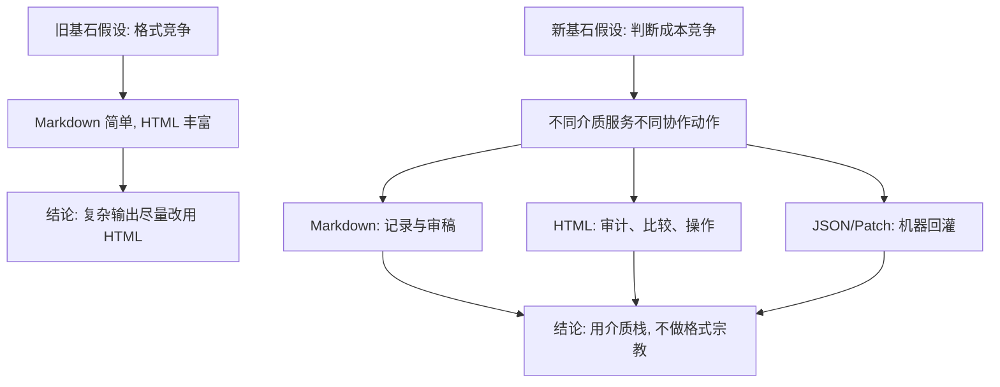
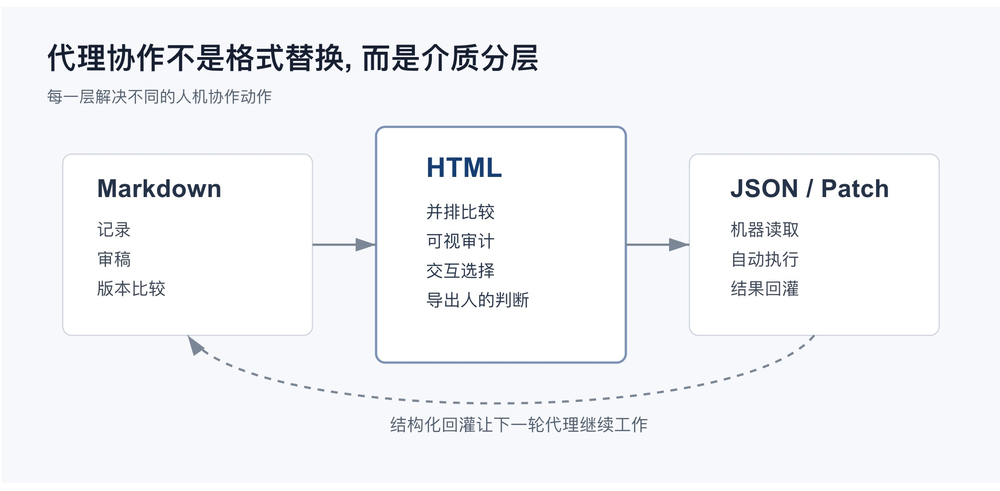

## 人机协作新突破: HTML 替代 Markdown 成为 AI Agent 人机交流界面
  
### 作者  
digoal  
  
### 日期  
2026-05-09  
  
### 标签  
html , markdown , 意图 , 语言局限 , 图 , 低代码 , 人机协作  
  
----  
  
## 背景  
从“佛祖拈花，迦叶一笑”到维特根斯坦提出“语言的边界与思想的无界”, 人类早就认识到语言的局限性.

如果你使用AI Agent多的话, 一定会遇到与Agent交流时语言局限性的瓶颈.

我之前写过一篇文章分析[《为什么 SVG 能走红? AI时代, 一场关于"图文并茂"的格式革命》](../202604/20260418_01.md)  , 其实也属于语言局限性的范畴.

今天这个问题更加紧迫了, 因为AI提供“图文并茂”的内容还不够, 如果人类也要参与修改, 给出意见呢? 人类如何图文并茂的返回给AI修改意见? 

这下 markdown 抓瞎了. 有没有解法?  

HTML, 没错, 它不仅能呈现, 还是拖拽、编辑、勾选开关等(类比于低代码), 使得人类能够更好的通过图文diff来体现意图. 突破语言的局限性, 同时还能节约token, 清晰直接了当的表达意图. 

如何做? 我看了2篇比较火的文章, 以及他提供的 demo .  

https://www.techtwitter.com/articles/using-claude-code-the-unreasonable-effectiveness-of-html

https://thariqs.github.io/html-effectiveness/

但是, 照旧, 咱得升华一下.  

# 代理时代, HTML 不是文档格式, 是人机协作界面

> 一句话新结论: HTML 的真正优势不在于比 Markdown 更漂亮, 而在于它把 AI 输出从"可读文本"升级为"可审计、可比较、可操作、可回灌的协作界面"。

## 旧文真正说了什么

Thariq 在 Tech Twitter 的文章 [Using Claude Code: The Unreasonable Effectiveness of HTML](https://www.techtwitter.com/articles/using-claude-code-the-unreasonable-effectiveness-of-html) 里, 讲的是一个非常实用的经验: 当 Claude Code 这类编码代理越来越强, Markdown 开始不够用了。

旧文的核心观点可以压缩成五条:

1. Markdown 曾经适合代理输出, 因为它简单、可移植、可编辑, 也方便模型生成。
2. 但随着代理输出的计划、规格、研究报告越来越长, 人类很难认真阅读超过百行的 Markdown。
3. HTML 能承载更高的信息密度: 表格、CSS、SVG、图片、交互控件、Canvas、绝对定位、工作流图都可以放在同一份文件里。
4. HTML 更容易分享和阅读。上传成网页后, 团队成员点开链接就能看, 而不是在聊天、邮件或代码仓库里处理一个原始 Markdown 文件。
5. HTML 可以变成双向界面: 用户可以拖拽、调参数、筛选、标注, 再把结果导出为 JSON、Markdown、diff 或 prompt, 回灌给 Claude Code。

这些观点背后的基石假设是: **代理输出的主要瓶颈已经从"模型能不能生成内容", 变成"人能不能有效吸收和反馈内容"。**

它的证据主要来自作者自己的 Claude Code 使用经验: 用 HTML 做规格文档、代码审查解释器、设计原型、研究报告、一次性编辑器, 再把这些 HTML 文件作为下一轮代理工作的上下文。Anthropic 官方文档也支持这个大背景: Claude Code 是一个能读取项目、编辑文件、运行命令、接入 MCP 数据源的终端代理, 不只是聊天窗口里的文本生成器; 它的能力边界天然连接本地文件系统、代码库和外部工具。[Claude Code overview](https://docs.anthropic.com/en/docs/claude-code/overview)

所以旧文真正说的不是"请把所有 Markdown 换成 HTML", 而是: 当代理能做复杂工作时, 单纯线性文本会让人类失去对复杂输出的掌控感。

## 旧逻辑的关键漏洞

旧文有洞见, 但它把一个更深的问题讲成了格式偏好。

第一, 它把"更容易读"和"更值得信任"混在了一起。HTML 的视觉组织能力很强, 但视觉清晰不等于逻辑清晰。一个漂亮的 HTML 报告可能隐藏来源缺口、假设跳跃、选择性证据和不可复现的图表。Markdown 的朴素反而有时能暴露逻辑骨架。

第二, 它低估了 HTML 的治理成本。HTML 可以包含 CSS、JavaScript、外链资源、内嵌图片、交互状态和浏览器行为。MDN 对 HTML 的定义很清楚: HTML 定义内容结构, CSS 描述呈现, JavaScript 处理行为。[MDN HTML](https://developer.mozilla.org/en-US/docs/Web/HTML) 一旦代理输出从 Markdown 变成 HTML, 审查对象就从"一段文本"变成"一个小型网页应用"。

第三, 它没有把安全边界讲透。Anthropic 的 Claude Code 安全文档强调, 代理需要权限边界、命令审批、网络请求控制和防提示注入设计。[Claude Code security](https://docs.anthropic.com/en/docs/claude-code/security) 如果让代理频繁生成带脚本的 HTML, 新风险不是"HTML 难看", 而是"人类以为自己在读文档, 实际上在运行界面"。MDN 的 CSP 文档也提醒, 内联脚本是常见 XSS 风险来源, CSP 的目标之一就是限制它的 uncontrolled use。[MDN CSP](https://developer.mozilla.org/en-US/docs/Security/CSP/Introducing_Content_Security_Policy)

第四, 它把 token 成本当成次要问题。旧文提到更长上下文让 HTML 的额外 token 不那么明显。这个判断在部分场景成立: Anthropic 的 Claude Opus 4.7 页面显示该模型具备 1M 上下文窗口。[Claude Opus 4.7](https://www.anthropic.com/claude/opus) 但 Anthropic 的上下文窗口文档同时提醒, 长上下文会涉及计费、速率限制和 token 规划。[Context windows](https://docs.anthropic.com/en/docs/build-with-claude/context-windows) 对个人探索而言, 多花 token 换理解度可能划算; 对组织级流程而言, HTML 不是免费升级。

第五, 它没有区分三类产物: 文档、界面、协议。Markdown 是好文档, HTML 是好界面, JSON/YAML/SQL/patch 才是好协议。把三者混在一个 HTML 文件里, 初期很爽, 后期可能难以版本管理、测试和自动化。

## 如果基石假设崩塌: 新假设是什么

旧基石假设是: **输出格式的优劣取决于信息密度和阅读体验。**

这个假设不够稳。因为代理协作里最稀缺的不是页面空间, 而是人的判断带宽。

新基石假设应该是: **代理输出格式的优劣, 取决于它能否降低人类判断成本, 并把判断结果结构化地反馈给下一轮代理。**

从这个假设出发, HTML 的地位会被重新定义。

HTML 不是 Markdown 的替代品。HTML 是代理工作流里的"审计控制台"。

## 新观点: HTML 胜出的地方是闭环

AI 代理的输出大致有四个阶段:

1. 解释: 让人知道系统发生了什么。
2. 比较: 让人看见多个方案的差异。
3. 决策: 让人选择、标注、排序、删改。
4. 回灌: 把人的选择变成下一轮代理可消费的结构化输入。

Markdown 擅长第一阶段。它适合写结论、记录证据、展示代码块、保留审稿痕迹。它的优势是线性、朴素、可 diff、可复制。

HTML 真正擅长第二和第三阶段。它可以把多个方案并排展示, 把代码 diff 和注释放在同一视野, 把系统状态做成图, 把参数调节做成滑块, 把复杂依赖做成可折叠网络。SVG 作为 HTML 中可嵌入的图形容器, 能定义自己的坐标系和 viewport, 适合承载技术图、流程图和结构化可视化。[MDN SVG](https://developer.mozilla.org/en-US/docs/Web/SVG/Reference/Element/svg)

但第四阶段才是关键。一次性 HTML 编辑器的价值不在"好看", 而在它能导出结构化结果: copy as JSON、copy as patch、copy as prompt、copy as markdown。没有这个出口, HTML 只是报告; 有了这个出口, HTML 才是协作界面。

<svg role="img" aria-label="代理输出介质栈: Markdown, HTML, JSON/Patch 分别承担记录、判断、回灌" viewBox="0 0 880 420" xmlns="http://www.w3.org/2000/svg">
  <title>代理输出介质栈</title>
  <rect width="880" height="420" fill="#f7f8fb"/>
  <text x="40" y="54" font-size="26" font-family="Arial, sans-serif" font-weight="700" fill="#172033">代理协作不是格式替换, 而是介质分层</text>
  <text x="40" y="84" font-size="14" font-family="Arial, sans-serif" fill="#526071">每一层解决不同的人机协作动作</text>

  <rect x="54" y="130" width="220" height="160" rx="8" fill="#ffffff" stroke="#ccd3df"/>
  <text x="84" y="168" font-size="22" font-family="Arial, sans-serif" font-weight="700" fill="#24324a">Markdown</text>
  <text x="84" y="202" font-size="15" font-family="Arial, sans-serif" fill="#3b4658">记录</text>
  <text x="84" y="228" font-size="15" font-family="Arial, sans-serif" fill="#3b4658">审稿</text>
  <text x="84" y="254" font-size="15" font-family="Arial, sans-serif" fill="#3b4658">版本比较</text>

  <rect x="330" y="106" width="220" height="208" rx="8" fill="#ffffff" stroke="#7b91b8" stroke-width="2"/>
  <text x="374" y="150" font-size="24" font-family="Arial, sans-serif" font-weight="700" fill="#153e75">HTML</text>
  <text x="374" y="186" font-size="15" font-family="Arial, sans-serif" fill="#26364f">并排比较</text>
  <text x="374" y="212" font-size="15" font-family="Arial, sans-serif" fill="#26364f">可视审计</text>
  <text x="374" y="238" font-size="15" font-family="Arial, sans-serif" fill="#26364f">交互选择</text>
  <text x="374" y="264" font-size="15" font-family="Arial, sans-serif" fill="#26364f">导出人的判断</text>

  <rect x="606" y="130" width="220" height="160" rx="8" fill="#ffffff" stroke="#ccd3df"/>
  <text x="642" y="168" font-size="22" font-family="Arial, sans-serif" font-weight="700" fill="#24324a">JSON / Patch</text>
  <text x="642" y="202" font-size="15" font-family="Arial, sans-serif" fill="#3b4658">机器读取</text>
  <text x="642" y="228" font-size="15" font-family="Arial, sans-serif" fill="#3b4658">自动执行</text>
  <text x="642" y="254" font-size="15" font-family="Arial, sans-serif" fill="#3b4658">结果回灌</text>

  <path d="M274 210 L330 210" stroke="#7b8798" stroke-width="2" marker-end="url(#arrow)"/>
  <path d="M550 210 L606 210" stroke="#7b8798" stroke-width="2" marker-end="url(#arrow)"/>
  <path d="M716 290 C650 370 220 370 164 290" fill="none" stroke="#7b8798" stroke-width="2" stroke-dasharray="6 6" marker-end="url(#arrow)"/>
  <text x="342" y="374" font-size="15" font-family="Arial, sans-serif" fill="#526071">结构化回灌让下一轮代理继续工作</text>

  <defs>
    <marker id="arrow" markerWidth="10" markerHeight="10" refX="9" refY="3" orient="auto" markerUnits="strokeWidth">
      <path d="M0,0 L0,6 L9,3 z" fill="#7b8798"/>
    </marker>
  </defs>
</svg>
  
  

因此, 更高阶的判断不是"以后都让 Claude Code 输出 HTML", 而是建立一套介质选择规则:

- 要长期保存、审稿、引用、进入知识库: 用 Markdown。
- 要比较多个方案、解释复杂系统、展示设计或代码结构: 用 HTML。
- 要让人通过界面做选择: 用 HTML, 但必须提供导出口。
- 要让代理继续执行: 导出 JSON、YAML、patch、SQL、测试用例或明确 prompt。
- 要进入团队生产流程: HTML 应该静态优先、脚本最小化、来源显式、导出可复现。

## 为什么这比"HTML 更好读"更重要

代理越强, 人类越容易退化成审批按钮。旧文最后说 HTML 让作者重新"在循环里"。这句话比格式争论更重要。

在传统软件开发里, 人通过读代码、读 diff、跑测试来保持控制权。到了代理工作流, 人面对的不再只是代码 diff, 还有模型生成的计划、研究、假设、界面、原型、任务拆分和执行记录。如果这些都塞进线性 Markdown, 人会偷懒; 如果全部变成绚丽 HTML, 人可能被视觉说服; 如果只输出结构化 JSON, 人又很难理解。

所以真正可持续的代理协作, 应该把输出拆成三种可验证对象:

1. 证据对象: 来源、代码位置、数据口径、测试结果。
2. 判断对象: 方案差异、风险、权衡、用户选择。
3. 执行对象: patch、命令、配置、任务队列。

HTML 最适合承载第二种对象。它不是证据本身, 也不是执行本身, 而是让人类做判断的仪表盘。

## 逻辑三洽检验

- 自洽: 如果目标是降低判断成本, 那么 Markdown、HTML、JSON/Patch 的分工自然成立。三者不是同一维度的竞争关系。
- 他洽: 这个框架能解释旧文观察到的现象: 长 Markdown 不被读, HTML 报告更容易分享, 交互界面更让人有参与感, 一次性编辑器有价值。
- 续洽: 这个框架也能解释未来趋势: 越复杂的代理任务, 越需要可视审计界面; 越严肃的团队流程, 越不会接受不可审计、不可 diff、不可复现的"漂亮 HTML"。

## 未来主要观测信号

如果这个新观点成立, 接下来会出现几个信号:

1. 编码代理会内置更多"生成审计界面"能力, 而不是只输出长计划。
2. 团队会沉淀 HTML 报告模板, 但同时要求静态化、无外链、可复现、可归档。
3. PR、事故复盘、架构评审会出现配套 HTML explainer, 但最终变更仍回到 patch、测试和审查记录。
4. 代理生成的一次性工具会越来越多, 但优秀工具的共同点是"导出结构化结果", 而不是"界面丰富"。
5. 安全规范会更明确地区分"可阅读 HTML"和"可执行 HTML", 对脚本、外链、CSP、权限提出要求。

反过来, 如果未来团队只是偶尔把报告做成网页, 却没有把人的选择结构化回灌给代理, 那就说明 HTML 只是展示层升级, 不是协作范式升级。

## 结论

Markdown 让代理能把想法写下来。

HTML 让代理能把复杂判断摆到人面前。

JSON、patch 和测试让代理能把人的判断继续执行下去。

所以, HTML 的"不合理有效"不是因为它战胜了 Markdown, 而是因为它补上了代理工作流里最薄弱的一环: **人类判断界面**。

真正成熟的团队不会问"以后用 Markdown 还是 HTML"。它会问:

这次输出是为了记录、理解、选择, 还是执行?

答案不同, 介质就不同。

## 参考来源

- [Using Claude Code: The Unreasonable Effectiveness of HTML](https://www.techtwitter.com/articles/using-claude-code-the-unreasonable-effectiveness-of-html)
- [Claude Code overview - Anthropic](https://docs.anthropic.com/en/docs/claude-code/overview)
- [Claude Code security - Anthropic](https://docs.anthropic.com/en/docs/claude-code/security)
- [Output styles - Anthropic](https://docs.anthropic.com/en/docs/claude-code/output-styles)
- [Context windows - Anthropic](https://docs.anthropic.com/en/docs/build-with-claude/context-windows)
- [Claude Opus 4.7 - Anthropic](https://www.anthropic.com/claude/opus)
- [HTML: HyperText Markup Language - MDN](https://developer.mozilla.org/en-US/docs/Web/HTML)
- [SVG element - MDN](https://developer.mozilla.org/en-US/docs/Web/SVG/Reference/Element/svg)
- [Content Security Policy - MDN](https://developer.mozilla.org/en-US/docs/Security/CSP/Introducing_Content_Security_Policy)

  
  
#### [PostgreSQL 解决方案集合](../201706/20170601_02.md "40cff096e9ed7122c512b35d8561d9c8")
  
  
#### [德哥 / digoal's Github - 公益是一辈子的事.](https://github.com/digoal/blog/blob/master/README.md "22709685feb7cab07d30f30387f0a9ae")
  
  
#### [About 德哥](https://github.com/digoal/blog/blob/master/me/readme.md "a37735981e7704886ffd590565582dd0")
  
  

  
