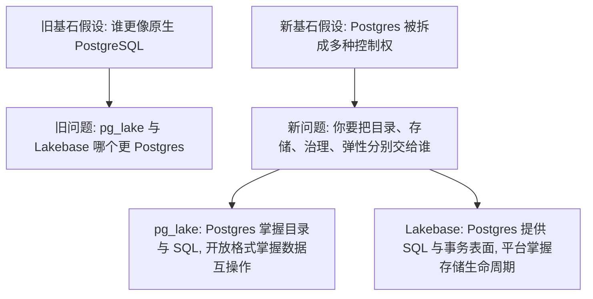
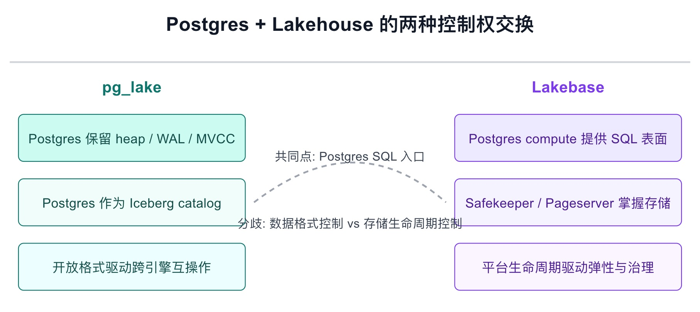

## Snowflake和Databricks打起来了, 又是因为PG
  
### 作者  
digoal  
  
### 日期  
2026-05-10  
  
### 标签  
PostgreSQL , lakehouse , pg_lake , lakebase , Snowflake , Databricks 
  
----  
  
## 背景  
Snowflake 和 Databricks 打起来了, 又是因为 PG. 

Snowflake 的 `pg_lake` 和 Databricks 的 Lakebase 都在讲 “Postgres + Lakehouse”, 但架构方向几乎相反。

实际上他两根本不是竞品, 别打了, 但是一般人劝不住啊, 《pg_lake vs Lakebase: Two Very Different Things Called "Postgres + Lakehouse"》这篇文章尝试劝架, 但是深度还不够. 

得靠我了. 

`pg_lake` 和 Lakebase 不是同类竞品, 它们分别把 Postgres 放在湖仓的两个不同位置: 一个让 Postgres 成为开放数据格式的控制平面, 一个让 Postgres 成为云原生存储系统的 SQL 外壳。选型的关键不是“谁更像 Postgres”, 而是你愿意把事务、目录、存储、运维和生态互操作的控制权交给哪一层。

原文有五个关键主张: 

1. `pg_lake` 是“Postgres 向外扩展”。Postgres 本体、heap、MVCC、WAL、索引和常规运维方式保持不变, 额外增加 Iceberg/Parquet/object storage 的访问与写入能力。
2. Lakebase 是“Postgres 向下替换”。SQL、MVCC、锁和扩展表面尽量保持 Postgres 体验, 但存储管理层被 Neon 式的 compute、safekeeper、pageserver、object storage 架构替换。
3. `pg_lake` 的边界在 FDW/Iceberg 侧。heap 表仍是完整 Postgres, Iceberg 表遵循 Iceberg 的快照、manifest 和列式文件语义。
4. Lakebase 的边界在 storage manager 侧。SQL 表面像 Postgres, 但传统 `pg_wal`、`pg_basebackup`、物理复制、文件级备份和部分依赖本地文件假设的运维工具不再适用。
5. 因此二者不应因为营销里都出现 “Postgres” 和 “lakehouse” 而被当作可互换方案。

原文的假设是: 判断这类系统的第一尺度, 是“哪里仍然是 PostgreSQL, 哪里不再是 PostgreSQL”。它用执行位置、事务模型、WAL 路径、页面读取路径和扩展兼容性来支撑这个判断。

这个判断有价值。它提醒架构师不要被同一个词骗了。但它仍停留在“Postgres 纯度测试”: 哪些层还像 Postgres, 哪些层已经不是。

真正的选型问题比这更深。

## 旧逻辑的关键漏洞

旧文没有错但不完整。它有三个隐含前提需要被拆开。

第一, 它默认“越接近原生 Postgres, 风险越小”。这对 DBA 运维迁移成立, 但对湖仓和 AI 应用不总成立。对于需要分支、scale-to-zero、秒级恢复、统一权限和应用/分析协同的团队, 原生存储栈反而可能是约束。

第二, 它把“Postgres 是否仍是 Postgres”当作主问题, 但企业真正买的是控制权分配。谁负责目录? 谁负责事务提交? 谁负责冷热数据? 谁负责跨引擎读取? 谁负责权限和审计? 这些比“底层是不是 heap 文件”更接近架构决策。

第三, 它没有充分区分两种“湖仓集成”:

- 数据格式集成: 让 Postgres 直接管理或读取 Iceberg/Parquet 等开放格式。
- 平台生命周期集成: 让 Postgres 进入 Databricks/Snowflake 这类云数据平台的治理、弹性、分支、恢复、同步和应用生态。

这两种集成解决的是不同问题。把它们都叫 “Postgres lakehouse” 会制造误解; 但只说“一个保留存储, 一个替换存储”也还不够。

## 新假设应该是

旧基石假设是: 这场竞争的本质是“谁更接近 PostgreSQL 原型”。

新的基石假设应该是: 在湖仓时代, Postgres 的价值正在从“一个完整数据库实例”拆成五种可重新组合的控制权: SQL 接口、事务语义、目录控制、存储控制、平台治理控制。

由此推出的新观点是:

`pg_lake` 和 Lakebase 的真正差异, 不是 Postgres 纯度差异, 而是控制权交换模型差异。`pg_lake` 用较小的存储改造换取开放数据格式互操作; Lakebase 用较大的存储改造换取云原生数据库生命周期能力。前者适合“湖仓数据要进入 Postgres 工作流”, 后者适合“Postgres 应用要进入云数据平台生命周期”。

## 新观点: 控制权比相似度更重要

先把两套架构放到同一个控制权坐标系里看。

`pg_lake` 的官方 README 说得很直接: 它把 Iceberg 和数据湖文件集成进 Postgres, 让用户可以直接在 PostgreSQL 中创建、修改、查询 Iceberg 表, 查询 object storage 里的 Parquet/CSV/JSON/Iceberg 文件, 也可以用 `COPY` 在 Postgres 和 object storage 之间导入导出数据。Snowflake 的工程博客也强调, `pg_lake` 让 Postgres 直接管理 Iceberg 表, 并让 Postgres 自己扮演 Iceberg catalog。

这意味着 `pg_lake` 的核心不是“把 Postgres 变成分布式数据库”, 而是“让 Postgres 成为开放湖仓格式的协调者”。它保留原来的事务数据库, 再把 Iceberg/Parquet/object storage 接进 SQL 工作流。Postgres 没有把自己的存储主权交出去; 它只是把外部数据格式纳入自己的目录和查询路径。

Lakebase 则相反。Databricks 官方文档把 Lakebase Postgres 定义为 fully managed、cloud-native 的 PostgreSQL 数据库, 给 Lakehouse 带来 OLTP 能力; Autoscaling 版本提供自动扩缩、scale-to-zero、branching、instant restore、read replicas、high availability、Data API 以及与 Unity Catalog、同步表、查询联邦等平台能力的集成。Neon 架构文档说明了这类能力的底层来源: compute 与 storage 分离, Postgres 将 WAL 流式发送给 safekeepers, pageservers 根据 WAL 和分层存储服务页面读取, cloud object storage 作为持久层。

这意味着 Lakebase 的核心不是“让 Postgres 读 Iceberg 文件”, 而是“让 Postgres 数据库拥有云原生平台生命周期”。它把底层存储控制权交给 Neon/Databricks 风格的分离式存储系统, 换来分支、暂停、恢复、弹性和平台治理。

两者都叫湖仓, 但它们进入湖仓的门不同:

- `pg_lake` 从数据格式进入: Iceberg/Parquet 是中心, Postgres 是控制和访问入口。
- Lakebase 从数据库生命周期进入: OLTP 应用是中心, Databricks 平台负责治理、同步、弹性和恢复。

<svg role="img" aria-label="pg_lake 与 Lakebase 的控制权分配对比" viewBox="0 0 920 390" xmlns="http://www.w3.org/2000/svg">
  <rect width="920" height="390" fill="#ffffff"/>
  <text x="460" y="34" text-anchor="middle" font-family="Arial, sans-serif" font-size="22" font-weight="700" fill="#111827">Postgres + Lakehouse 的两种控制权交换</text>
  <line x1="70" y1="70" x2="850" y2="70" stroke="#d1d5db" stroke-width="2"/>
  <text x="210" y="105" text-anchor="middle" font-family="Arial, sans-serif" font-size="18" font-weight="700" fill="#0f766e">pg_lake</text>
  <text x="710" y="105" text-anchor="middle" font-family="Arial, sans-serif" font-size="18" font-weight="700" fill="#7c3aed">Lakebase</text>
  <rect x="80" y="130" width="260" height="54" rx="6" fill="#ccfbf1" stroke="#0f766e"/>
  <text x="210" y="163" text-anchor="middle" font-family="Arial, sans-serif" font-size="15" fill="#134e4a">Postgres 保留 heap / WAL / MVCC</text>
  <rect x="80" y="204" width="260" height="54" rx="6" fill="#f0fdfa" stroke="#0f766e"/>
  <text x="210" y="237" text-anchor="middle" font-family="Arial, sans-serif" font-size="15" fill="#134e4a">Postgres 作为 Iceberg catalog</text>
  <rect x="80" y="278" width="260" height="54" rx="6" fill="#ecfeff" stroke="#0f766e"/>
  <text x="210" y="311" text-anchor="middle" font-family="Arial, sans-serif" font-size="15" fill="#134e4a">开放格式驱动跨引擎互操作</text>
  <rect x="580" y="130" width="260" height="54" rx="6" fill="#ede9fe" stroke="#7c3aed"/>
  <text x="710" y="163" text-anchor="middle" font-family="Arial, sans-serif" font-size="15" fill="#4c1d95">Postgres compute 提供 SQL 表面</text>
  <rect x="580" y="204" width="260" height="54" rx="6" fill="#f5f3ff" stroke="#7c3aed"/>
  <text x="710" y="237" text-anchor="middle" font-family="Arial, sans-serif" font-size="15" fill="#4c1d95">Safekeeper / Pageserver 掌握存储</text>
  <rect x="580" y="278" width="260" height="54" rx="6" fill="#faf5ff" stroke="#7c3aed"/>
  <text x="710" y="311" text-anchor="middle" font-family="Arial, sans-serif" font-size="15" fill="#4c1d95">平台生命周期驱动弹性与治理</text>
  <path d="M350 231 C430 170 500 170 570 231" fill="none" stroke="#9ca3af" stroke-width="2" stroke-dasharray="6 5"/>
  <text x="460" y="183" text-anchor="middle" font-family="Arial, sans-serif" font-size="14" fill="#374151">共同点: Postgres SQL 入口</text>
  <text x="460" y="260" text-anchor="middle" font-family="Arial, sans-serif" font-size="14" fill="#374151">分歧: 数据格式控制 vs 存储生命周期控制</text>
</svg>

## 选型不问品牌, 问五个控制权

第一问: 谁控制事务边界?

如果核心业务依赖单机 PostgreSQL 事务、触发器、扩展、备份和物理运维习惯, `pg_lake` 的变化面更小。你的 OLTP heap 表仍由 Postgres 控制, 湖仓能力主要落在 Iceberg/外部文件一侧。

如果核心需求是应用数据库的云生命周期, 例如开发环境按分支复制、计算自动缩放、空闲自动暂停、秒级恢复, Lakebase 的代价更合理。它保留 Postgres 事务表面, 但把持久化路径交给平台。

第二问: 谁控制数据格式?

`pg_lake` 的开放性来自 Iceberg/Parquet。数据放在标准湖仓格式里, 其他引擎理论上可以读同一批数据。它更适合“我的数据资产已经或应该成为开放湖仓表”的组织。

Lakebase 的开放性来自 Postgres 协议、同步、联邦和平台接口, 不是来自“底层文件就是 Delta 或 Iceberg”。Databricks 文档强调 Lakebase 与 Lakehouse 的集成包括 Unity Catalog registration、synced tables、Lakehouse Sync 和 query federation。也就是说, 分析侧访问通常通过平台能力完成, 不是绕过平台直接读底层存储。

第三问: 谁控制运维剧本?

`pg_lake` 更接近传统 Postgres 运维剧本。你仍需要理解 autovacuum、WAL、heap 膨胀、索引、备份、扩展兼容和服务器资源。额外复杂性来自 Iceberg catalog、object storage、DuckDB sidecar、外部文件权限和跨边界一致性。

Lakebase 更接近云服务运维剧本。传统物理备份、WAL 目录、文件系统监控、底层复制路径会被平台抽象替代。你获得了托管弹性和恢复, 也失去了部分底层可见性和可控性。

第四问: 谁控制性能瓶颈?

`pg_lake` 的瓶颈分裂为两类: OLTP 仍看 Postgres 本体; lakehouse 查询看 Parquet/Iceberg 文件布局、object storage 延迟、DuckDB 执行、predicate pushdown 和网络吞吐。它的优势在分析扫描和开放文件互操作, 不是把所有 OLTP 都变成无限弹性。

Lakebase 的瓶颈也分裂: SQL 执行在 Postgres compute, 持久化写入受 safekeeper quorum 往返影响, 冷页读取受 pageserver/object storage 层级影响, 热数据依赖 shared buffers 和本地/服务端缓存。它的优势在 compute 弹性、分支和恢复, 不是让所有读写都像本地 NVMe 上的单机 Postgres。

第五问: 谁控制锁定风险?

`pg_lake` 的锁定风险较低地落在数据格式侧, 因为 Iceberg/Parquet 是开放生态; 但如果你依赖 Snowflake Postgres 的托管能力、特定扩展组合或 `pg_lake` catalog 语义, 仍会形成实现锁定。

Lakebase 的锁定风险更多落在平台生命周期侧。SQL 表面是 Postgres, 但分支、恢复、弹性、同步、治理、权限和联邦都和 Databricks 平台绑定。迁出时你保留的是逻辑数据和 SQL 模型, 不一定保留运维模型。

## 逻辑三洽检验

- 自洽: 新观点把二者放在同一个“控制权分配”框架下, 能解释为什么一个保留本地 heap/WAL 仍可称湖仓集成, 另一个替换存储层也仍可称 Postgres。
- 他洽: 它兼容旧文的有效观察: `pg_lake` 的边界在 FDW/Iceberg, Lakebase 的边界在 storage manager。同时也解释了官方文档强调的能力差异: `pg_lake` 强调 Iceberg/Parquet/COPY/catalog, Lakebase 强调 autoscaling、scale-to-zero、branching、restore、Unity Catalog 和同步。
- 续洽: 未来可观测信号应该不是“谁宣传得更像 Postgres”, 而是谁能在自己的控制权模型里补齐短板: `pg_lake` 是否能证明跨 heap/Iceberg 的一致性、性能和运维边界足够清晰; Lakebase 是否能证明存储抽象后的延迟、扩展兼容、SLA、迁移与可观测性足够可靠。

## 验证我的结论, 未来可看这几点

1. `pg_lake` 是否出现更多跨引擎真实案例: 同一 Iceberg 表被 Postgres、Spark、Trino、DuckDB、Snowflake 等稳定共享, 且权限、schema evolution、事务提交和故障恢复边界清楚。
2. Lakebase Autoscaling 的 GA/区域/HA/合规/限制变化是否持续收敛, 尤其是 autoscaling、branching、instant restore、read replica、Lakehouse Sync 等能力在生产负载里的稳定性。
3. 两边是否公开更细的性能与故障语义: object storage 抖动、safekeeper quorum 延迟、pageserver 冷读、Iceberg manifest 冲突、DuckDB sidecar 失效等场景的行为。
4. 扩展兼容性清单是否从“常见扩展可用”走向“依赖 WAL、background worker、本地文件、logical decoding 的扩展边界明确”。
5. 企业是否把二者用于不同场景: `pg_lake` 偏数据平台和开放湖仓表, Lakebase 偏应用状态、AI agent state、feature serving 与 Databricks 内部应用。

## 结论

原文最有价值的提醒是: 不要把 `pg_lake` 和 Lakebase 当成同一种东西。更高一层的判断是: 也不要只问它们“哪里还是 PostgreSQL”。

在湖仓时代, Postgres 不再只是一个数据库产品名, 它正在变成一组可拆分能力: SQL 入口、事务语义、扩展生态、目录控制、存储生命周期和平台治理。

`pg_lake` 的答案是: 保住 Postgres 本体, 让它伸手管理开放湖仓数据。

Lakebase 的答案是: 保住 Postgres 表面, 让云平台重写它的存储生命周期。

所以正确选型不是“pg_lake vs Lakebase”。正确问题是:

你要的是 Postgres 控制湖仓数据, 还是湖仓平台控制 Postgres 生命周期?

这个问题回答清楚, 架构选择自然会收敛。

## 参考来源

- [pg_lake vs Lakebase: Two Very Different Things Called "Postgres + Lakehouse"](https://thebuild.com/blog/2026/05/08/pglake-vs-lakebase-two-very-different-things-called-postgres-lakehouse/)
- [Snowflake Engineering Blog: Introducing pg_lake](https://www.snowflake.com/en/engineering-blog/pg-lake-postgres-lakehouse-integration/)
- [Snowflake-Labs/pg_lake README](https://github.com/Snowflake-Labs/pg_lake)
- [Databricks Docs: Lakebase Postgres](https://docs.databricks.com/aws/en/oltp/)
- [Databricks Docs: What is Lakebase Autoscaling?](https://docs.databricks.com/aws/en/oltp/projects/about)
- [Databricks Docs: Core concepts](https://docs.databricks.com/aws/en/oltp/projects/core-concepts)
- [Neon Docs: Architecture overview](https://neon.com/docs/introduction/architecture-overview)
- [Neon Blog: A Deep Dive Into Neon's Instant PITR](https://neon.com/blog/pitr-deep-dive/)

  
  
#### [PostgreSQL 解决方案集合](../201706/20170601_02.md "40cff096e9ed7122c512b35d8561d9c8")
  
  
#### [德哥 / digoal's Github - 公益是一辈子的事.](https://github.com/digoal/blog/blob/master/README.md "22709685feb7cab07d30f30387f0a9ae")
  
  
#### [About 德哥](https://github.com/digoal/blog/blob/master/me/readme.md "a37735981e7704886ffd590565582dd0")
  
  

  
