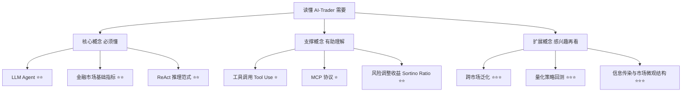
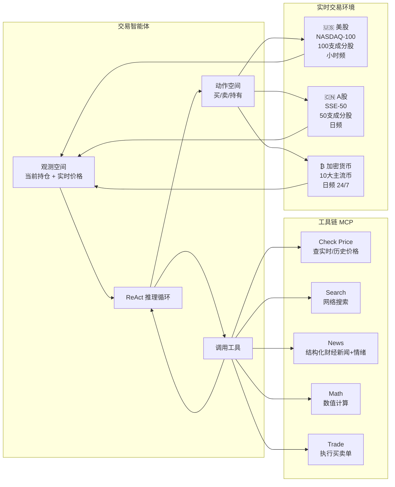

## AI论文解读 | AI-Trader — 在真实金融市场中对自主智能体进行基准测试

### 作者
digoal

### 日期
2026-05-10

### 标签
AI , AI-Trader , AI 交易员 

----

## 背景

   
> **原文信息**：Tianyu Fan, Yuhao Yang, Yangqin Jiang et al. | 2025年12月 | arXiv:2512.10971v1 [q-fin.CP]
> **机构**：香港大学
> **解读日期**：2026年5月10日

---

## 📍 论文定位

**一句话**：本文构建了全球首个**全自主、实时、无数据污染**的 LLM 智能体金融交易基准——AI-Trader，跨越美股、A股、加密货币三大市场，系统揭示了"通用智能 ≠ 交易能力"这一核心发现。

**🎓 学术价值**：填补了 LLM Agent 评测体系中"真实动态金融环境"这一关键空白。现有基准大多依赖静态历史数据或模拟环境，无法真实反映智能体在市场压力下的实时决策能力。AI-Trader 率先实现了"活体评测"——Agent 在真实市场中用真实时间做真实决策。

**🏭 工业价值**：为金融机构评估"哪款大模型更适合做量化策略"提供了客观的多维基准。同时，代码与评测数据开源，使研究者可以在真实市场条件下测试自研策略，而无需从零搭建交易环境。

**💡 直觉类比**：这篇论文就像是给六位来自不同背景的"实习交易员"（大模型）安排了同一岗位的"实习考核"——只给他们一台电脑和基本的交易工具，不提供任何指导，让他们在真实股市里自己搜集信息、独立决策、真金白银地买卖，最后看谁赚钱最多、谁亏损最惨，从中找规律。

---

## 🗺️ 知识地图



**核心概念讲解：**

**LLM Agent（大语言模型智能体）** ⭐⭐
- **是什么**：在 LLM 基础上增加"感知—推理—行动"循环的自主系统，能调用外部工具完成复杂任务。
- **为什么重要**：本文的 Agent 不是被动回答问题，而是主动搜索信息、决定买卖、执行交易。
- **现实类比**：就像把 ChatGPT 从"顾问"升级成"可以自己下单的基金经理"。

**ReAct 推理范式** ⭐⭐
- **是什么**：Reasoning + Acting 的缩写，Agent 先思考（生成中间推理链），再行动（调用工具或做决策），交替进行。
- **为什么重要**：确保每一笔交易背后都有可追溯的逻辑，而不是黑盒输出。
- **现实类比**：就像一个分析师先写研报（推理），再向基金经理汇报并执行（行动）。

**Sortino Ratio（索提诺比率）** ⭐⭐
- **是什么**：风险调整后收益指标，只惩罚下行波动（亏损），不惩罚上涨波动。公式为 $SR = \frac{\bar{r} - r_{target}}{\sigma_d}$ ，其中 $\sigma_d$ 是下行标准差。
- **为什么重要**：比夏普比率更贴近投资者真实关切——我们担心亏钱，不担心赚太多。
- **现实类比**：就像评价一个司机不只看平均速度，而是专门扣除"急刹车次数"的分数。

**MCP 协议（Model Context Protocol）** ⭐
- **是什么**：标准化的 LLM 与外部工具交互接口协议，类似 API 的"统一电源插座"。
- **为什么重要**：AI-Trader 所有工具（查价格、搜新闻、下单）都通过 MCP 实现，确保不同模型调用相同工具时行为一致。

---

## 🔬 论文精读

### Why — 研究动机

**现有评测体系的三大痛点：**

| 维度 | 传统静态基准（SWE-Bench、MMLU等） | AI-Trader |
|---|---|---|
| 数据新鲜度 | 固定历史数据集，存在污染风险 | 实时市场数据，无法预先泄露 |
| 环境动态性 | 确定性环境，无真实不确定性 | 真实市场波动、政策冲击、黑天鹅事件 |
| 人工介入 | 依赖固定 Prompt 和预设流程 | 零人工干预，Agent 完全自主 |
| 评测指标 | 准确率/F1等离散指标 | 真实金融收益，客观且连续 |
| 跨域能力 | 单一场景 | 跨三大市场、两种频率 |

金融市场天然具备"好的 Agent 测试场"所需的所有特质： **动态演化、信息噪声高、决策时效性强、结果可量化**。且市场不会"配合"Agent——它是无情的真实世界。

---

### What — 核心方法：AI-Trader 框架



**最小信息范式（Minimal Information Paradigm）** 是本文最关键的设计哲学：Agent 仅获得三样东西——**可用工具列表、当前持仓状态、实时市场价格**，其他一切信息必须自己通过工具获取。这彻底杜绝了"外挂信息"的可能性，确保评测的是 Agent 的真实自主能力。

---

### How — 技术细节

**观测空间**：Agent 在每个时间步的完整感知为：

$$o_t = f(p, s, \{\pi_i\}, i)$$

其中 $p$ 是资产实时价格向量， $s$ 是持仓状态向量， $\pi_i$ 是通过工具主动获取的个股详细数据， $i$ 是宏观信息（新闻、经济指标等）。

白话解释：Agent 先看到"手里有什么股票、各自现价多少"，然后自己去查自己想查的信息，最终形成完整的"市场视野"。

**行动空间**：对每个可交易资产，Agent 只能执行三种离散操作：

```
at ∈ { 买入(Buy), 卖出(Sell), 持有(Hold) }
```

若提交的订单超过可用流动资金，系统**拒绝执行并触发自我纠错**——Agent 必须重新推理并生成合规订单。这模拟了真实交易中的资金约束。

**关键评估指标：**

| 指标 | 公式 | 白话含义 |
|---|---|---|
| 累计收益 CR | $\prod_{t=1}^T(1+r_t) - 1$ | 整个评测期总共赚了多少 |
| 索提诺比率 SR | $\frac{\bar{r}-r_{target}}{\sigma_d}$ | 每承担一单位下行风险，获得多少超额回报 |
| 波动率 Vol | $\sqrt{\frac{1}{T-1}\sum(r_t-\bar{r})^2}$ | 收益的稳定性（越低越好） |
| 最大回撤 MDD | $\min_t\frac{V_t - \max_{s\leq t}V_s}{\max_{s\leq t}V_s}$ | 从最高点跌到最低点有多惨 |

---

### So What — 实验结果

**评测周期**：美股 & A股：2025年10月1日—11月7日；加密：2025年11月1日—11月14日。

**六大模型**：DeepSeek-v3.1、MiniMax-M2、Claude-3.7-Sonnet、GPT-5、Qwen3-Max、Gemini-2.5-Flash。

#### 核心数据表

| 市场 | 指标 | DeepSeek | MiniMax | Claude | GPT-5 | Qwen3 | Gemini | 基准 |
|---|---|---|---|---|---|---|---|---|
| **美股** | CR ↑ | 8.39% | **9.56%** | 3.11% | 1.56% | 0.39% | -0.06% | 1.87% |
| | SR ↑ | 3.73 | **4.42** | 1.13 | 0.70 | 0.32 | 0.09 | 1.51 |
| | MDD ↓ | -8.58% | **-4.92%** | -8.13% | -10.55% | -9.39% | -7.73% | -3.94% |
| **A股** | CR ↑ | -1.23% | **1.31%** | 0.84% | -3.53% | -3.86% | -1.53% | 1.65% |
| | SR ↑ | -0.18 | **1.00** | 0.29 | -1.54 | -1.40 | -0.29 | 2.19 |
| | MDD ↓ | -5.88% | **-2.15%** | -4.49% | -3.78% | -5.49% | -4.81% | -2.01% |
| **加密** | CR ↑ | **-12.18%** | -14.80% | -15.30% | -16.41% | -16.85% | -18.63% | -14.30% |
| | SR ↑ | **-2.85** | -4.30 | -2.27* | -4.38 | -6.54 | -5.55 | -12.71 |

> *加密市场整体处于下跌周期，所有 Agent 均亏损，但部分优于基准。SR最优由Claude持有（-2.27），CR最优由DeepSeek持有（-12.18%，唯一跑赢基准-14.30%）。

#### 四大核心发现

**① 通用智能 ≠ 有效交易**
GPT-5、Qwen3-Max 在 NLP 任务上表现顶尖，但在两个股市均录得负收益。智能体在受控任务中表现优秀，并不代表能在嘈杂、动态的真实市场中盈利。

**② 风控能力决定跨市场鲁棒性**
MiniMax-M2 是唯一在美股和 A 股双双表现稳定的模型。其优势不来自激进追涨，而是来自**下行风险控制**——美股最小回撤仅 -4.92%，A 股波动率最低（6.72%）。

**③ 高流动性市场更利于 AI 超额收益**
在美股（成熟、透明、连续交易），三个 Agent 跑赢 QQQ 基准；但在 A 股（政策驱动、情绪主导），无一 Agent 跑赢 SSE-50。结论：当前 AI 更擅长在信息透明、机制稳定的市场中寻找 alpha。

**④ 单市场优化无法跨市场迁移**
DeepSeek 在美股（+8.39%）表现亮眼，但在 A 股录得 -1.23%；而在加密市场中凭借高仓位现金管理（现金占比峰值约41%）反而成为唯一跑赢基准的模型。说明当前模型缺乏真正的跨市场泛化能力。

---

### Now What — 对我们意味着什么？

**学术界**：
- 开辟了"活体评测（Live Evaluation）"这一新的研究范式，使静态基准无法触及的能力（实时适应、信息验证、跨市场泛化）进入可研究范畴。
- 为 Agent 的"认知偏差"研究提供素材——Case Study 展示了 LLM 会出现类似人类的"情绪化交易"和"锚定偏误"。

**工业界**：
- 金融机构可参考本框架评估哪款模型更适合特定市场的自动化策略；
- "风控优先"的设计哲学（MiniMax-M2 的成功）对实际量化产品有直接指导意义；
- 开源的 MCP 工具链可被复用于构建合规的 AI 交易系统原型。

---

## 📖 术语词典

### 最小信息范式（Minimal Information Paradigm）
- **是什么**：Agent 仅获得工具列表、当前持仓和实时价格，所有其他信息必须通过工具自主获取，零人工干预。
- **为什么重要**：这是 AI-Trader 区别于所有现有金融基准的核心设计——消除了"喂数据"带来的虚假表现。
- **现实类比**：就像考驾照不给你提前看题，直接把你放上真实路况考试。

### 数据无污染（Data-Uncontaminated）
- **是什么**：评测使用评测期内产生的真实实时数据，模型在训练时不可能见过这些数据。
- **为什么重要**：避免 LLM 因"记住"历史数据而表现出虚假的预测能力。
- **现实类比**：就像用明年的考题考学生，而不是去年已经泄露的题。

### 累计收益（Cumulative Return, CR）
- **是什么**：评测期内策略的总盈亏百分比， $CR = \prod(1+r_t) - 1$ 。
- **为什么重要**：最直观的"赚没赚钱"指标，但不考虑风险。
- **现实类比**：你投了100块，最后剩了多少。

### 最大回撤（Maximum Drawdown, MDD）
- **是什么**：评测期内从峰值到谷底的最大跌幅，永远是负数。
- **为什么重要**：衡量"最坏情况"，决定投资者心理承受力和资金安全边际。
- **现实类比**：你账户最高涨到120块，后来跌到90块，MDD就是 -25%。

### ReAct 范式
- **是什么**：交替执行"思考（Reasoning）"和"行动（Acting）"的 Agent 决策框架，确保行动有明确推理支撑。
- **为什么重要**：让 Agent 的每一笔交易都有可解释的逻辑链，支持审计和改进。
- **现实类比**：就像医生先做诊断报告（推理），再开药方（行动），而不是随机猜测。

### 索提诺比率（Sortino Ratio, SR）
- **是什么**：用下行波动（只计亏损方向的标准差）衡量风险调整收益的指标。
- **为什么重要**：比夏普比率更公平——策略因为大涨而波动高，不应被惩罚。
- **现实类比**：一个驾驶员只因"紧急刹车"扣分，不因"加速超车"扣分。

### MCP（Model Context Protocol）
- **是什么**：标准化的 LLM 工具接口协议，让不同模型以统一方式调用外部工具。
- **为什么重要**：保证六个模型在完全相同的工具条件下公平竞争，结果差异只来自模型本身。
- **现实类比**：就像所有选手用同款球拍打比赛。

### 跨市场泛化（Cross-Market Generalization）
- **是什么**：在一个市场训练/优化的策略，能否在另一个市场同样有效。
- **为什么重要**：真正通用的 AI 交易系统必须在不同市场微结构下都能适应。
- **现实类比**：一个在上海炒股赚钱的策略，拿到纽约或币圈还能赚钱吗？

---

## ⚖️ 批判性评估

### 1. 假设前提的合理性

**评测周期过短**：美股和 A 股仅评测约5周（38个交易日），加密仅两周。金融策略的有效性通常需要跨越多个市场周期（牛熊转换）才能验证。本文的评测恰逢美股上涨期和加密下跌期，这一特定市场环境可能系统性地偏袒某类策略（如 MiniMax-M2 的防御风格在美股上涨期自然表现出色）。

**"最小信息"设计的双刃剑**：让 Agent 从零开始搜集信息，是真实模拟，但也引入了"工具调用效率"这一干扰变量。擅长高效搜索的模型可能比"思维更深邃"的模型表现更好，评测的究竟是推理能力还是信息检索效率？

**基准选择的局限**：以 QQQ（大盘 ETF）作为 baseline 是合理的，但没有对比传统量化策略（如均值回归、动量策略），也没有对比更简单的"等权持有所有成分股"策略，难以判断 AI 是否真的带来了方法论上的价值。

### 2. 实验设计的可质疑之处

**仅六个模型**：选取的六个模型（DeepSeek、MiniMax、Claude、GPT-5、Qwen3、Gemini）版本选择时间点不同，且 GPT-5 和 Claude-3.7 处于不同的代际——这不是真正的同期公平对比，更像是"近期最强模型大乱斗"。

**Prompt 设计的影响**：论文展示了统一的系统 Prompt，但不同模型对相同指令的理解和响应方式存在显著差异。Prompt 工程本身可能比模型本身的差异更影响结果，这是一个未受控的变量。

**单次运行无置信区间**：金融市场本身具有随机性，同一策略不同时间运行结果可能差异巨大。论文未报告多次运行的方差，也未做统计显著性检验，难以判断结果是否稳健。

### 3. 方法的适用边界

**真实资金规模问题**：本实验显然是小规模虚拟资金测试。一旦 Agent 管理大额资金，其自身交易行为会显著影响市场价格（市场冲击），当前框架完全没有考虑这一现实约束。

**监管合规盲区**：Agent 的完全自主决策在许多司法管辖区涉及合规问题（如 MiFID II 要求人类监督）。论文将这个问题完全忽略，但对工业落地至关重要。

**对极端事件的脆弱性**：Case Study 显示 Agent 会被单一新闻源误导（"结构性慢牛"案例），在信息对抗（fake news、市场操纵）场景下，当前 Agent 的鲁棒性存疑。

### 4. 未来改进方向

**作者提出的方向**：
- 引入多智能体协作（如分析师+风控+执行多角色分工）；
- 增强信息验证模块，避免单一信息源触发决策；
- 研究更复杂的连续动作空间（而非买/卖/持三选一）。

**我们认为还可以从以下角度改进**：
- **对抗性评测**：注入错误信息、噪声新闻，测试 Agent 的信息甄别能力；
- **长周期评测**：延长到6个月以上，覆盖完整的市场周期；
- **成本建模**：纳入交易手续费、滑点、市场冲击成本，使结果更贴近真实盈利能力；
- **可解释性研究**：对 Agent 的推理日志做系统性分析，量化不同信息类型（宏观/公司/情绪）对决策的贡献比例；
- **人机协作**：研究"AI建议+人类审核"的混合范式是否优于纯自主决策。

---

## 📚 参考资料

- 原文：[arXiv:2512.10971](https://arxiv.org/abs/2512.10971)
- 项目主页：[https://ai4trade.ai/](https://ai4trade.ai/)
- 开源代码：[https://github.com/HKUDS/AI-Trader](https://github.com/HKUDS/AI-Trader)
- 相关基准：LiveCodeBench（动态代码评测）、StockBench（早期 LLM 股票基准）、InvestorBench（金融决策基准）
- 关键技术：[ReAct: Synergizing Reasoning and Acting in Language Models](https://arxiv.org/abs/2210.03629)、[Model Context Protocol](https://modelcontextprotocol.io/)
  
  
#### [PostgreSQL 解决方案集合](../201706/20170601_02.md "40cff096e9ed7122c512b35d8561d9c8")
  
  
#### [德哥 / digoal's Github - 公益是一辈子的事.](https://github.com/digoal/blog/blob/master/README.md "22709685feb7cab07d30f30387f0a9ae")
  
  
#### [About 德哥](https://github.com/digoal/blog/blob/master/me/readme.md "a37735981e7704886ffd590565582dd0")
  
  

  
