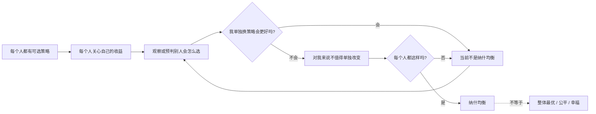
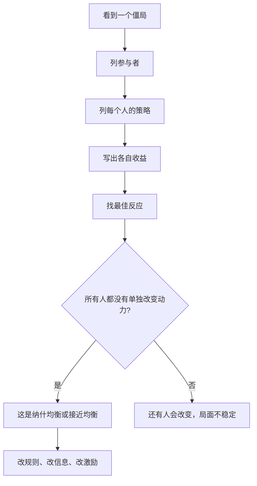

## 博弈思维筑基课: 纳什均衡
  
### 作者  
digoal  
  
### 日期  
2026-05-12
  
### 标签  
纳什均衡 , 多人决策  
  
----  
  
## 背景 
  

> 面向对象: 初中生到高中生  
> 核心问题: 为什么有些局面明明大家都不满意，却谁也不愿意先改变？  
> 先说结论: 纳什均衡是一种“互相锁住”的策略状态: 在别人策略不变的情况下，每个人单独改变都不能让自己变得更好。

## 一张图先看懂



## 求真讲法

### 它到底说了什么

纳什均衡来自博弈论。这里的“博弈”不是只指游戏，而是指多人决策: 每个人的结果不只取决于自己怎么选，也取决于别人怎么选。

最通俗的说法是:

> 如果大家都知道彼此的选择，并且没有人能靠“自己单独换一个选择”获得更好结果，这个局面就是纳什均衡。

它强调三个点:

- **多人互动**: 你的选择会影响我，我的选择也会影响你。
- **策略稳定**: 不是没人想更好，而是单独改没好处。
- **个人角度**: 判断的是“我单方面改变是否更好”，不是“大家合起来能不能更好”。

一个常见例子是“囚徒困境”。两个同伴被分别审问，每个人都有两个选择: 保持沉默，或者背叛对方。若两人都沉默，整体结果最好；但在某些收益设置下，不管对方沉默还是背叛，自己选择背叛都更有利。于是“两人都背叛”会成为纳什均衡，虽然它不是两人的整体最佳结果。

### 它是怎么来的

纳什均衡的核心问题是: 在一个多人互相影响的世界里，什么样的策略组合是稳定的？

如果只看一个人，选择很简单: 选对自己收益最高的。但多人决策更麻烦，因为你的最好选择取决于别人怎么选。例如:

- 同学抢座位: 你想坐前排，但别人也想坐前排。
- 商店定价格: 你降价会影响对手，对手降价也会影响你。
- 小组分工: 你是否努力，取决于你相信别人是否也努力。

纳什的贡献，可以简单理解为把“稳定”写成一个清楚的判断标准:

```text
一个策略组合是纳什均衡，当且仅当:
  对每一个参与者来说，
  在其他参与者策略不变时，
  他都找不到一个能让自己收益更高的单方面改法。
```

注意，这不是说纳什均衡一定会自然出现，也不是说人们一定完全理性。它先给我们一个分析工具: 如果一个局面满足这个条件，它就有一种“单人无法打破”的稳定性。

### 它依赖哪些假设

纳什均衡要有意义，至少依赖这些前提:

| 前提 | 含义 | 如果不成立会怎样 |
|---|---|---|
| 参与者明确 | 知道是谁在做决策 | 漏掉关键参与者，会误判稳定性 |
| 策略集合明确 | 每个人有哪些可选行动 | 如果还有隐藏选项，均衡判断不完整 |
| 收益可比较 | 能判断某个选择对自己更好还是更差 | 如果收益模糊或变化太快，很难判断最佳反应 |
| 别人策略暂时不变 | 判断“我单独改变”时，先固定别人选择 | 如果别人会立刻反击，单步分析可能不够 |
| 参与者会追求自身目标 | 每个人会避免明显让自己更差的选择 | 如果人会冲动、报复或误判，实际行为可能偏离均衡 |

可以把它想成一个“互相卡住”的结构:

```text
甲的选择: A
乙的选择: B

甲想: 如果乙仍选 B，我改成 A' 会更好吗? 不会。
乙想: 如果甲仍选 A，我改成 B' 会更好吗? 不会。

所以:
甲不动，乙也不动。
这就是稳定，不一定是最好。
```

### 常见误解

**误解一: 纳什均衡就是最好的结果。**  
不对。它只说明没人愿意单方面改变，不说明大家合起来最幸福。囚徒困境里的“两人都背叛”就是典型例子。

**误解二: 纳什均衡一定只有一个。**  
不对。有些博弈有多个纳什均衡。例如两个人约见面，都去图书馆或都去操场可能都稳定，关键是双方要选到同一个地方。

**误解三: 纳什均衡就是大家商量后的结果。**  
不一定。纳什均衡可以是不合作、不沟通条件下的稳定状态。合作协议、承诺、惩罚机制可能改变博弈结构，从而改变均衡。

**误解四: 只要是均衡，就不可能改变。**  
不对。均衡可能被外部规则、信息变化、重复互动、奖励惩罚打破。它只是说在当前规则和收益下，单个人没有改的动力。

## 求存讲法

### 它有什么用

纳什均衡的用处，是帮我们看见“坏局面为什么稳定”。

很多问题不是没人知道更好的结果，而是每个人都担心: 如果我先变好，别人不变，我反而吃亏。于是大家一起停在一个较差但稳定的状态里。

例如班级自习:

- 如果大家都安静，每个人学习效率高。
- 如果有人讲话，他自己轻松，别人受影响。
- 如果别人都讲话，你一个人安静也很难学进去。

最后可能变成“大家都讲话”。这不一定是大家最想要的结果，却可能是一个稳定局面，因为在别人都讲话时，单独安静未必让自己明显更好。

### 它怎么迁移到熟悉领域

纳什均衡可以迁移到学习、合作、管理、商业和技术系统中。使用时可以问四个问题:

1. 谁是参与者？
2. 每个人有哪些选择？
3. 每种组合下，每个人得到什么、失去什么？
4. 在别人不变时，谁有动力单独改变？



一个小表格可以帮助判断:

| 判断问题 | 如果答案是“是” | 说明 |
|---|---|---|
| 每个人都知道自己能选什么吗 | 策略集合较清楚 | 可以开始分析 |
| 每个人都知道自己更喜欢哪个结果吗 | 收益结构较清楚 | 能判断最佳反应 |
| 有人能靠单独换策略变好吗 | 当前不是均衡 | 这个人有改变动力 |
| 所有人单独换都不会更好吗 | 可能是纳什均衡 | 局面具有稳定性 |

### 它的适用范围和边界

适用时:

- 多个人的选择互相影响。
- 每个人都有自己的目标。
- 你想解释为什么某个局面稳定存在。
- 可以大致写出选择和收益。

要谨慎时:

- 人的目标不只是个人收益，还包括道德、关系、身份、情绪。
- 信息不完整，大家不知道别人真正想法。
- 参与者可以沟通、签协议、建立长期信任。
- 规则会变化，比如老师介入、平台改算法、政府改监管。
- 这是重复博弈，今天吃亏可能换来明天信任。

### 正例: 怎么用它提升能力

**例子: 小组作业中的“搭便车”。**

四个人做小组作业。如果评分只给小组总分，而且老师看不见每个人贡献，那么每个人都可能想: “如果别人努力，我少做一点也能拿分；如果别人不努力，我努力也救不了多少。”

结果可能变成大家都少做。这不是因为所有人都懒，而是激励结构让“少做”变成稳定选择。

用纳什均衡分析后，改法不是简单喊口号，而是改变博弈结构:

- 把任务拆成可见模块。
- 记录每个人贡献。
- 设置同伴评价。
- 让个人分数和个人贡献相关。

这样一来，“认真做”才可能成为更稳定的选择。

这个例子成立，是因为几个假设大致满足:

- 参与者明确: 四个组员。
- 策略明确: 多做或少做。
- 收益明确: 分数、时间、同伴评价。
- 原规则下，单个人努力可能不划算。

### 反例: 前提不成立会怎样

**反例: 把朋友之间的帮助误判成利益博弈。**

假设一个同学帮朋友补课。你只从短期收益看，会觉得他“付出时间、没有回报”，所以不符合个人最优。但现实中，他可能看重友谊、共同进步、未来互助，甚至只是认为帮助别人是对的。

如果你把他的收益只写成“少花时间 = 好，多花时间 = 差”，就会误判他的选择。

这里失败的前提是: “收益可比较”没有被正确建模。人的收益不只有金钱、分数、时间，还可能包括信任、尊严、道德感、长期关系。纳什均衡不是不能分析这些东西，而是你必须先把真正的收益结构写对。

## 思考

纳什均衡最值得记住的地方，不是它能帮你找到“最佳答案”，而是它能帮你看懂“为什么坏答案会稳定”。

很多社会问题、团队问题、市场问题，都像一个锁:

```text
大家都知道 A 更好
但每个人都担心:
  如果只有我选 A，别人还选 B，
  我会吃亏。
于是大家继续选 B。
```

真正的改变，常常不是劝某个人“勇敢一点”，而是改变规则，让好选择不再让先行动的人吃亏。

你可以继续追问:

1. 如果一个坏局面是纳什均衡，应该责怪个人，还是检查规则？
2. 怎样的承诺、监督和奖励，能把坏均衡改成好均衡？
3. 为什么“大家都懂道理”仍然不够？
4. 在学习和合作中，你有没有见过“单独做好事会吃亏”的结构？

## 最后记住

1. 纳什均衡是“别人不变时，我单独改变不会更好”的稳定状态。
2. 它不等于整体最优，也不等于公平或道德上最好。
3. 它依赖参与者、策略、收益和信息等前提。
4. 很多坏局面稳定存在，不是因为没人懂，而是因为激励结构锁住了人。
5. 改变均衡，往往要改规则、改信息、改激励，而不是只劝人改变。

## 参考资料

- John F. Nash Jr., "Equilibrium Points in N-Person Games", Proceedings of the National Academy of Sciences, 1950: 纳什均衡概念的经典论文之一。
- John F. Nash Jr., "Non-Cooperative Games", Annals of Mathematics, 1951: 对非合作博弈均衡存在性的系统表述。
- Robert Gibbons, *Game Theory for Applied Economists*, Princeton University Press, 1992: 应用博弈论入门教材，解释最佳反应和纳什均衡。
- Avinash K. Dixit, Susan Skeath, David H. Reiley Jr., *Games of Strategy*, W. W. Norton: 常用博弈论教材，包含囚徒困境、协调博弈和战略互动案例。
- Encyclopaedia Britannica, "Game theory" / "Nash equilibrium": 用百科方式解释博弈论和纳什均衡的基本含义。
  
  
#### [PostgreSQL 解决方案集合](../201706/20170601_02.md "40cff096e9ed7122c512b35d8561d9c8")
  
  
#### [德哥 / digoal's Github - 公益是一辈子的事.](https://github.com/digoal/blog/blob/master/README.md "22709685feb7cab07d30f30387f0a9ae")
  
  
#### [About 德哥](https://github.com/digoal/blog/blob/master/me/readme.md "a37735981e7704886ffd590565582dd0")
  
  

  
