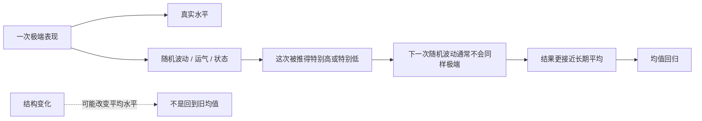
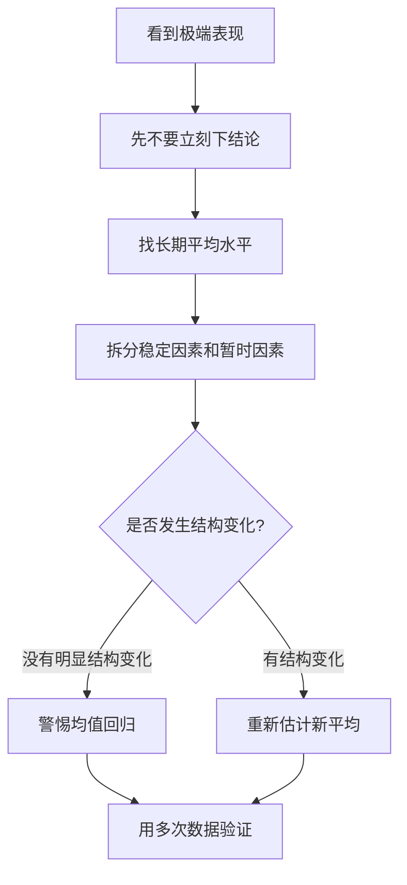

## 思维筑基课: 均值回归
  
### 作者  
digoal  
  
### 日期  
2026-05-12
  
### 标签  
均值回归 , 多次水平 , 波动  
  
----  
  
## 背景 
> 面向对象: 初中生到高中生  
> 核心问题: 为什么特别高或特别低的表现，下一次常常会没那么极端？  
> 先说结论: 均值回归是说，当一次结果特别偏离平常水平时，下一次结果往往会更接近长期平均水平；它不是魔法反转，而是“真实水平 + 随机波动”共同作用后的常见现象。

## 一张图先看懂



## 求真讲法

### 它到底说了什么

均值回归，也叫“向平均数回归”。它说的是:

> 如果一个结果特别高或特别低，其中往往包含一部分偶然因素。下一次偶然因素不一定继续同方向、同强度出现，所以结果常常会往长期平均水平靠近。

先看一个学生能理解的例子。

一个同学平时数学大概 80 分。有一次考了 98 分。这个 98 分可能来自三部分:

- 他本来基础不错。
- 最近复习得很好。
- 这次题型刚好适合他，临场状态也很好。

下一次考试，他仍然可能考得不错，但不一定还能遇到同样合适的题型和状态。所以分数可能回到 85 分、88 分，而不是继续 98 分。这不是“退步必然发生”，而是极端成绩里常常混有不可持续的波动。

反过来，一次考了 55 分，也不一定代表他真实水平只有 55 分。可能是睡眠差、紧张、题型不熟。下一次这些不利因素减弱，分数也可能回到更接近日常水平。

### 它是怎么来的

均值回归最早是统计学里的重要发现。英国科学家弗朗西斯·高尔顿研究身高时发现: 个子特别高的父母，孩子通常也偏高，但往往没有父母那么极端；个子特别矮的父母，孩子通常也偏矮，但往往没有父母那么极端。高尔顿把这种现象称为“回归”。

这不是说高个父母的孩子会变成普通人，也不是说矮个父母的孩子一定变高。它真正说明的是:

> 极端观察值通常由稳定因素和偶然因素共同造成；当偶然因素不再同样极端时，下一次观察值会更接近总体平均。

可以用一个简单模型理解:

```text
一次表现 = 真实水平 + 暂时波动

特别高 = 真实水平不错 + 暂时波动也很有利
特别低 = 真实水平一般 + 暂时波动很不利

下一次:
暂时波动重新抽取，不一定继续那么极端
所以表现常常更接近平均水平
```

这就是均值回归的直觉基础。

### 它依赖哪些假设

均值回归要成立，至少依赖这些前提:

| 前提 | 含义 | 如果不成立会怎样 |
|---|---|---|
| 存在相对稳定的长期水平 | 有一个可参考的平均水平 | 如果系统已经换轨，旧平均会失效 |
| 单次结果含有随机波动 | 运气、状态、测量误差会影响结果 | 如果结果完全由能力决定，回归会弱很多 |
| 极端结果被特别挑出来观察 | 我们常常关注最高分、最低分、最热产品 | 选择极端样本后，更容易看到回归 |
| 下一次波动不总是同方向 | 好运或坏运不会永远同等强度持续 | 如果趋势因素持续增强，可能继续偏离 |
| 衡量方式相对一致 | 两次考试、两次测量大致可比 | 如果标准变了，不能简单比较 |

这也说明，均值回归不是一句“涨多必跌、跌多必涨”的口号。它真正讨论的是: 当一个极端值里含有暂时因素时，后续结果为什么常常没那么极端。

### 常见误解

**误解一: 均值回归就是必然反转。**  
不对。均值回归说的是“极端之后常常更接近平均”，不是“一定反方向大幅变化”。

**误解二: 只要表现下降，就是被惩罚或表扬造成的。**  
不一定。一个人上次超常发挥后，下次回落，可能只是随机波动减少。把这种回落误认为“表扬让人退步”，就是忽略了均值回归。

**误解三: 平均水平永远不变。**  
不对。学习方法改变、训练强度提高、身体成长、技术进步，都可能改变真实平均水平。

**误解四: 看到一次极端结果，就能判断一个人的真实水平。**  
不对。单次结果常常混有波动。判断真实水平，需要看多次表现和稳定证据。

## 求存讲法

### 它有什么用

均值回归最有用的地方，是帮你避免被单次极端结果骗到。

它提醒你:

- 不要因为一次高分就以为自己永久变强。
- 不要因为一次低分就以为自己彻底不行。
- 不要因为一个产品突然爆火就以为它会永远增长。
- 不要因为一个运动员某场比赛超神就把它当成长期常态。

它训练的是一种更稳的判断方式: 先问“这个结果里有多少是稳定能力，有多少是暂时波动？”

### 它怎么迁移到熟悉领域

| 场景 | 极端结果 | 均值回归提醒你 |
|---|---|---|
| 学习考试 | 一次特别高分或低分 | 看多次成绩，不只看一次 |
| 体育比赛 | 某场超常发挥 | 区分真实实力和临场状态 |
| 情绪状态 | 一天特别兴奋或沮丧 | 不把短期情绪当永久人生判断 |
| 产品热度 | 突然爆红 | 检查是否能持续复购和留存 |
| 投资市场 | 价格极端上涨或下跌 | 分辨短期情绪和长期价值变化 |

也可以用一个判断流程:



### 它的适用范围和边界

适用时:

- 结果受能力和运气共同影响。
- 你观察到的是特别高或特别低的样本。
- 系统没有发生明显结构变化。
- 多次测量口径基本一致。

要谨慎时:

- 真实水平正在快速提高，比如系统训练刚开始见效。
- 外部环境改变，比如考试难度、规则、技术条件变了。
- 极端结果不是随机波动，而是新能力或新机制的证据。
- 数据太少，无法估计平均水平。

最关键的边界是:

> 均值回归不能替你证明“什么都没变”。它只提醒你，极端值里可能有暂时因素，必须用更多证据判断。

### 正例: 怎么用它提升能力

**例子: 分析一次考试超常发挥。**

你平时英语 85 分，这次考了 98 分。更成熟的分析不是说“我已经稳定 98 分了”，也不是说“这只是运气”。可以拆成三类:

- 稳定进步: 背单词更扎实，阅读速度提高。
- 可复制方法: 考前复盘错题，作文模板更熟。
- 暂时波动: 题型刚好熟悉，听力状态特别好。

下一步不是盲目自信，而是把可复制部分固定下来。这样，即使 98 分回落到 90 分，你也知道真实水平已经提高，而不是被一次回落吓到。

这个例子成立，是因为你承认了两个前提: 单次成绩含有波动，长期水平需要多次观察。

### 反例: 前提不成立会怎样

**反例: 把真正的进步误判成“迟早会回去”。**

一个学生以前数学 70 分，后来换了学习方法，每天整理错题、补基础概念、定期复盘。连续三个月都在 85 分以上。

如果你只说“高于过去平均，所以会回归 70 分”，这就是误用均值回归。

这里失败的前提是: “长期平均水平稳定”。实际上，学习方法改变后，他的真实水平可能已经上移。此时应该重新估计新均值，而不是死守旧平均。

## 思考

均值回归最容易让人震动的地方，是它揭穿了一个常见错觉: 我们太喜欢给极端结果找故事。

一次高分后，我们说“这个人突然开窍了”。一次低分后，我们说“这个人不行了”。一个老板批评员工后，员工表现变好，就以为批评有效；表扬员工后，员工表现回落，就以为表扬有害。可很多时候，极端表现本来就更可能向平均靠近。

这不代表努力没用，也不代表评价没意义。它只是要求我们更严谨:

- 判断一个人，看长期表现，不看一次极端。
- 评价一个方法，看对照和多次结果，不看一次前后变化。
- 面对好结果，保留清醒；面对坏结果，保留耐心。
- 发现持续变化时，承认均值本身可能已经改变。

你可以继续追问:

1. 我现在看到的是一次极端表现，还是稳定水平变化？
2. 这个结果里，哪些部分可复制，哪些只是暂时波动？
3. 如果我要评价一个教学方法，怎样避免被均值回归骗到？
4. 什么时候应该相信“会回归”，什么时候应该承认“新均值形成了”？

## 最后记住

1. 均值回归是极端结果后常常更接近长期平均的现象。
2. 它背后的核心是: 一次表现通常等于真实水平加暂时波动。
3. 它不是必然反转，也不是预测具体时间点的工具。
4. 使用它时，要检查平均水平是否稳定、是否存在结构变化。
5. 面对极端结果，成熟做法是拆分稳定因素和暂时因素，再用多次数据验证。

## 参考资料

- Francis Galton, "Regression Towards Mediocrity in Hereditary Stature", Journal of the Anthropological Institute, 1886: 均值回归概念的经典来源之一。
- Daniel Kahneman, *Thinking, Fast and Slow*, 2011: 讨论人们如何误解回归现象，以及表扬、批评和表现变化之间的错觉。
- David Freedman, Robert Pisani, Roger Purves, *Statistics*, W. W. Norton: 经典统计学教材，解释相关、回归和随机波动。
- Larry Wasserman, *All of Statistics*, Springer, 2004: 统计推断入门教材，可用于理解平均、方差、抽样波动和回归相关概念。
- Encyclopaedia Britannica, "Regression to the mean": 对均值回归概念、历史和统计含义的百科式说明。
  
  
#### [PostgreSQL 解决方案集合](../201706/20170601_02.md "40cff096e9ed7122c512b35d8561d9c8")
  
  
#### [德哥 / digoal's Github - 公益是一辈子的事.](https://github.com/digoal/blog/blob/master/README.md "22709685feb7cab07d30f30387f0a9ae")
  
  
#### [About 德哥](https://github.com/digoal/blog/blob/master/me/readme.md "a37735981e7704886ffd590565582dd0")
  
  

  
