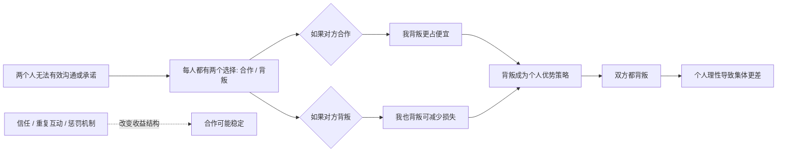
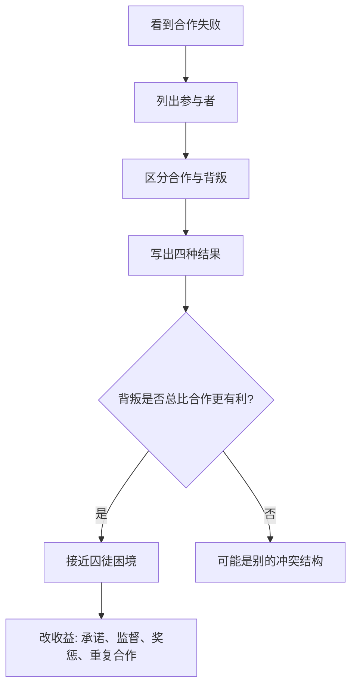

## 博弈思维筑基课: 囚徒困境
  
### 作者  
digoal  
  
### 日期  
2026-05-12
  
### 标签  
博弈 , 奖励背叛 , 惩罚合作 , 缺少沟通 , 承诺 , 监督 , 惩罚 , 长期关系  
  
----  
  
## 背景 

> 面向对象: 初中生到高中生  
> 核心问题: 为什么两个都想少受损的人，最后反而一起得到更差结果？  
> 先说结论: 囚徒困境是一种博弈结构: 对每个人来说，“背叛”都是更安全或更有利的个人选择，但两个人都这样选时，整体结果比彼此合作更差。

## 一张图先看懂



## 求真讲法

### 它到底说了什么

囚徒困境是博弈论里的经典模型。这里的“困境”不是指人不知道怎么选，而是指:

> 从个人角度看，每个人都有理由选择背叛；但如果两个人都背叛，结果反而比两个人都合作更差。

最常见的故事是两个嫌疑人被分开审问，不能沟通。每个人都有两个选择:

- **合作**: 对同伴保持沉默。
- **背叛**: 出卖同伴，换取自己更轻的处罚。

一个简化的收益表可以这样写:

|  | 乙合作 | 乙背叛 |
|---|---:|---:|
| 甲合作 | 甲 2 年，乙 2 年 | 甲 10 年，乙 0 年 |
| 甲背叛 | 甲 0 年，乙 10 年 | 甲 6 年，乙 6 年 |

从甲的角度看:

- 如果乙合作，甲背叛能从 2 年变成 0 年，更好。
- 如果乙背叛，甲背叛能从 10 年变成 6 年，也更好。

乙也会做同样推理。于是两人都背叛，结果是各 6 年。可是如果两人都合作，本来只要各 2 年。个人理性把他们推向了集体更差的结果。

### 它是怎么来的

囚徒困境不是在证明“人性本恶”，而是在刻画一种特定结构: 当信任、沟通、承诺和长期惩罚都很弱时，个人会优先防止自己吃亏。

它的逻辑链条很清楚:

```text
不能可靠沟通
  |
不能确认对方会合作
  |
背叛在两种情况下都更保险:
  对方合作 -> 我背叛赚更多
  对方背叛 -> 我背叛少吃亏
  |
双方都按同样逻辑背叛
  |
整体结果差于双方合作
```

在博弈论中，如果一个选择无论对方怎么选都比另一个选择更好，就叫**优势策略**。在标准囚徒困境里，“背叛”是每个人的优势策略。两人都背叛，也是一个纳什均衡: 在对方背叛时，自己单独改成合作会更糟。

### 它依赖哪些假设

囚徒困境要成立，需要一组严格前提。不是所有冲突都叫囚徒困境。

| 前提 | 含义 | 如果不成立会怎样 |
|---|---|---|
| 参与者通常是两个或少数几个 | 每个人的选择会直接影响对方 | 人太多时可能变成公共品困境或集体行动问题 |
| 每人都有合作与背叛两类选择 | 合作有共同好处，背叛有个人诱惑 | 如果没有背叛收益，就不是囚徒困境 |
| 背叛是个人优势策略 | 不管对方怎样，背叛对自己更划算 | 如果合作在某些情况下更好，结构就变了 |
| 双方合作优于双方背叛 | 集体最优不是背叛 | 如果双方背叛也最好，就没有困境 |
| 缺少可靠承诺或惩罚 | 不能保证对方合作后不被占便宜 | 如果有强契约和惩罚，合作可能稳定 |
| 通常是一轮或关系很弱 | 未来报复、声誉和信任很弱 | 如果长期重复互动，合作可能成为理性选择 |

用一个标准顺序表示收益，囚徒困境通常满足:

```text
诱惑收益 T > 互相合作收益 R > 互相背叛收益 P > 被出卖收益 S

T: 我背叛、对方合作
R: 双方合作
P: 双方背叛
S: 我合作、对方背叛
```

### 常见误解

**误解一: 囚徒困境说明人一定自私。**  
不对。它说明在某种规则下，自保和占便宜的激励会压过合作。换规则后，行为可能改变。

**误解二: 只要两个人不合作，就是囚徒困境。**  
不对。必须满足“背叛对个人总是更有利，但双方合作整体更好”这类收益结构。

**误解三: 囚徒困境只能出现在犯罪故事里。**  
不对。它可以出现在价格战、军备竞赛、小组作业、公共卫生、环境保护等很多场景。

**误解四: 合作只靠道德教育就够了。**  
不够。道德很重要，但囚徒困境真正提醒我们: 如果制度让合作的人吃亏，合作就很难稳定。

## 求存讲法

### 它有什么用

囚徒困境最有用的地方，是帮你看清“为什么大家都知道合作更好，却还是互相伤害”。

比如两个商家都知道不打价格战更赚钱。但如果对方不降价，自己降价能抢顾客；如果对方降价，自己不降价会丢顾客。于是双方都降价，利润一起下降。

这时问题不只是“商家不够理性”，恰恰相反，是各自从个人角度太理性，结果把系统推向了更差状态。

### 它怎么迁移到熟悉领域

可以用四步识别一个局面是不是接近囚徒困境:

1. 找参与者: 谁在互相影响？
2. 找选择: 每个人的“合作”和“背叛”分别是什么？
3. 写收益: 谁会因为背叛得到短期好处？谁会因为合作被占便宜？
4. 找机制: 有没有信任、监督、惩罚、重复互动，能让合作不吃亏？



### 它的适用范围和边界

适用时:

- 合作能让整体更好。
- 单个人背叛能获得短期好处。
- 合作者可能被背叛者占便宜。
- 缺少可靠承诺、监督或长期关系。

要谨慎时:

- 参与者能签订有效合同。
- 关系长期重复，背叛会损害声誉。
- 人们重视道德、身份、友谊或共同目标。
- 收益不是固定的，规则可以被老师、平台、法律或组织改变。
- 问题涉及很多人，可能更像“公地悲剧”或公共品问题。

### 正例: 怎么用它提升能力

**例子: 小组作业里的努力困境。**

四个人做小组展示。如果所有人认真准备，展示质量高，每个人都学到东西。但如果评分只看整体，不看个人贡献，某个成员可能想: “别人都努力时，我少做一点也能拿高分；别人都不努力时，我努力也很亏。”

如果大家都这么想，结果就是没人认真做，最后全组表现差。

用囚徒困境分析后，改进方向不是只说“大家要自觉”，而是改变收益结构:

- 把任务拆成个人负责部分。
- 公开进度和贡献。
- 引入同伴评价。
- 让长期合作中的声誉产生影响。

这样，合作才不再是容易被占便宜的选择。

### 反例: 前提不成立会怎样

**反例: 两个长期搭档不是囚徒困境。**

两个同学长期一起训练辩论。今天一个人偷懒，短期看似省力；但对方以后会减少配合，老师也能看出表现下降，自己的声誉受损。更重要的是，他们以后还要一起打比赛。

如果把这个局面简单说成“囚徒困境，所以一定会互相背叛”，就是误用。

这里失败的前提是: “通常是一轮或关系很弱”。在重复互动中，未来惩罚、信任和声誉会进入收益表。合作可能从道德选择变成理性选择。

## 思考

囚徒困境真正刺痛人的地方，是它告诉我们: 坏结果不一定来自坏人，也可能来自坏结构。

如果一个系统让合作的人总是先吃亏，让背叛的人总是先占便宜，那么单靠喊“要团结”“要自觉”通常不够。更有效的问题是:

- 怎样让合作可被看见？
- 怎样让背叛承担代价？
- 怎样让一次性关系变成长期关系？
- 怎样让承诺可信，而不是只靠口头保证？

这也是为什么班级规则、商业合同、平台评分、法律制度、声誉系统都很重要。它们本质上是在改变收益表: 让“合作”不再是容易被出卖的傻选择，让“背叛”不再是无成本的聪明选择。

你可以继续追问:

1. 你身边有哪些“大家都知道合作更好，却没人先合作”的场景？
2. 这些场景里，背叛的短期收益是什么？
3. 合作者为什么会吃亏？
4. 如果你不能改变人性，能不能改变规则和激励？

## 最后记住

1. 囚徒困境是个人理性导致集体更差的典型结构。
2. 它不是说人天生坏，而是说某些规则会奖励背叛、惩罚合作。
3. 标准囚徒困境里，背叛是个人优势策略，但双方合作的整体结果更好。
4. 它成立依赖缺少沟通、承诺、监督、惩罚和长期关系等前提。
5. 要打破囚徒困境，关键是改变收益结构，让合作稳定、让背叛有代价。

## 参考资料

- Merrill M. Flood and Melvin Dresher, RAND Corporation experiments, 1950: 囚徒困境思想的早期实验背景。
- Albert W. Tucker, prisoner story formulation, 1950: 常见“囚徒困境”叙事版本通常归功于 Tucker 的课堂表述。
- Robert Axelrod, *The Evolution of Cooperation*, Basic Books, 1984: 通过重复博弈和竞赛研究合作如何在囚徒困境中出现。
- Robert Gibbons, *Game Theory for Applied Economists*, Princeton University Press, 1992: 应用博弈论教材，解释优势策略、纳什均衡和囚徒困境。
- Avinash K. Dixit, Susan Skeath, David H. Reiley Jr., *Games of Strategy*, W. W. Norton: 常用博弈论教材，包含囚徒困境、协调和战略互动案例。
  
  
#### [PostgreSQL 解决方案集合](../201706/20170601_02.md "40cff096e9ed7122c512b35d8561d9c8")
  
  
#### [德哥 / digoal's Github - 公益是一辈子的事.](https://github.com/digoal/blog/blob/master/README.md "22709685feb7cab07d30f30387f0a9ae")
  
  
#### [About 德哥](https://github.com/digoal/blog/blob/master/me/readme.md "a37735981e7704886ffd590565582dd0")
  
  

  
