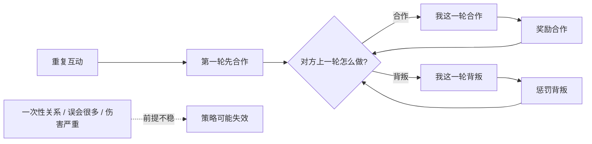
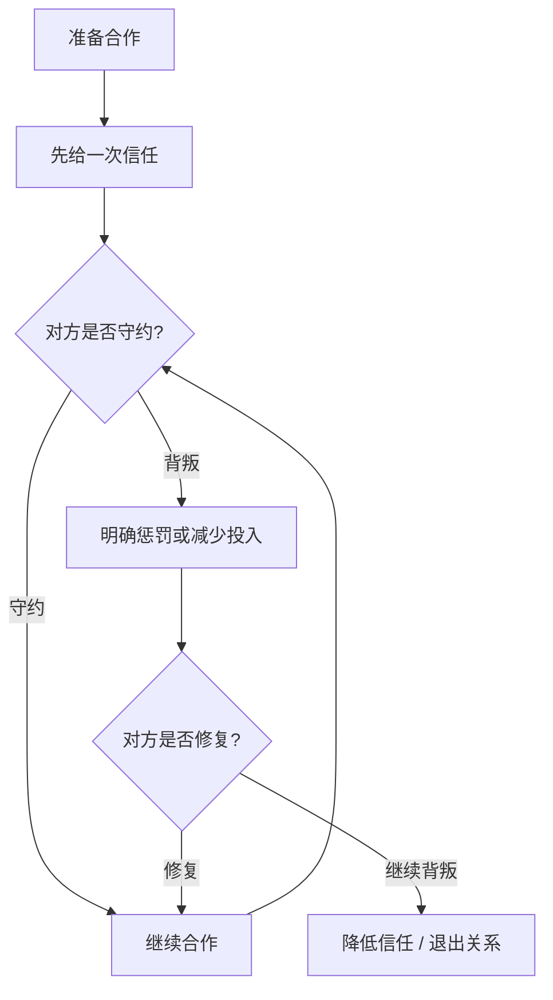

## 博弈思维筑基课: 以牙还牙博弈策略
  
### 作者  
digoal  
  
### 日期  
2026-05-12
  
### 标签  
重复博弈 , 以牙还牙 
  
----  
  
## 背景 
> 面向对象: 初中生到高中生  
> 核心问题: 在容易互相背叛的关系里，怎样既不做冤大头，也不把关系推向长期报复？  
> 先说结论: 以牙还牙是一种重复博弈策略: 第一轮先合作，之后对方上一轮合作我就合作，对方上一轮背叛我就背叛；它用清晰回应惩罚背叛，也用及时恢复给合作留下路。

## 一张图先看懂



## 求真讲法

### 它到底说了什么

“以牙还牙”听起来像报复，其实在博弈论里它更像一条简单规则:

> 第一次先合作；以后每一轮，都模仿对方上一轮的行为。

如果对方上次合作，你这次合作。  
如果对方上次背叛，你这次背叛。  
如果对方之后又恢复合作，你也马上恢复合作。

所以它不是“永远记仇”，也不是“无限忍让”。它有四个特点:

- **善意**: 不先背叛，第一步给合作机会。
- **报复**: 对方背叛后，立刻让他付出代价。
- **宽恕**: 对方重新合作后，自己也重新合作。
- **清晰**: 规则简单，对方容易看懂。

### 它是怎么来的

以牙还牙策略因政治学家 Robert Axelrod 对“重复囚徒困境”的计算机竞赛研究而广为人知。在重复囚徒困境里，两个参与者不是只博弈一次，而是一轮又一轮地选择合作或背叛。

一次性囚徒困境里，背叛往往更有吸引力，因为未来没有代价。但重复互动改变了问题:

```text
今天背叛
  |
短期占便宜
  |
对方下一轮惩罚我
  |
未来合作收益减少
  |
背叛未必划算
```

以牙还牙的强处，就在于它把“未来”变成了约束。它告诉对方:

- 你合作，我也合作，大家都能长期得益。
- 你背叛，我马上回应，让背叛不再免费。
- 你改回合作，我不继续报复，让关系能修复。

它不是在数学上保证永远最优的万能策略，而是在许多重复互动环境中表现很稳健的一种策略。

### 它依赖哪些假设

以牙还牙要有效，需要一组前提。如果这些前提不成立，它可能变得幼稚、粗暴，甚至危险。

| 前提 | 含义 | 如果不成立会怎样 |
|---|---|---|
| 关系会重复 | 双方未来还会继续互动 | 如果只见一次，未来惩罚没有力量 |
| 能观察对方行为 | 知道对方上一轮合作还是背叛 | 如果信息混乱，容易误伤 |
| 回应成本可承受 | 惩罚对方不会让自己付出过高代价 | 如果报复伤敌一千自损八百，策略不划算 |
| 对方能理解规则 | 对方知道背叛会被回应、合作会被回报 | 如果对方看不懂，就无法形成稳定预期 |
| 背叛不是不可原谅的伤害 | 关系还有修复空间 | 如果伤害触及底线，宽恕不一定合理 |
| 误会概率不高 | 偶然失误不会频繁发生 | 如果误会很多，双方可能陷入报复循环 |

可以用一个简化规则写出来:

```text
第 1 轮: 我合作
第 n 轮:
  如果对方第 n-1 轮合作 -> 我合作
  如果对方第 n-1 轮背叛 -> 我背叛
```

### 常见误解

**误解一: 以牙还牙就是有仇必报。**  
不对。它的关键不只是报复，还包括先合作和及时宽恕。没有宽恕，就会变成长期仇恨。

**误解二: 以牙还牙永远是最优策略。**  
不对。它在某些重复博弈中很稳健，但不是所有环境的最佳答案。环境噪声、对手类型、收益结构都会影响结果。

**误解三: 对方背叛一次，就应该永久拉黑。**  
不一定。博弈论中的以牙还牙只惩罚一轮，然后观察对方是否恢复合作。永久惩罚是另一种更严厉策略。

**误解四: 善良就是一直合作。**  
不对。在容易被利用的环境里，只合作不回应会奖励背叛。以牙还牙的善意，是有边界的善意。

## 求存讲法

### 它有什么用

以牙还牙的作用，是帮助重复互动中的人建立一种可预测的合作秩序。

它解决的不是“怎样赢一次”，而是“怎样让长期合作不被背叛者破坏”。如果你永远合作，对方可能占便宜；如果你永远报复，关系会崩掉。以牙还牙处在中间:

- 先释放合作信号。
- 对背叛快速回应。
- 对修复及时开放。
- 用简单规则减少猜疑。

### 它怎么迁移到熟悉领域

在学习、合作、家庭、社交、商业中，可以把它翻译成一句话:

> 我先真诚合作；你守规则，我继续合作；你破坏规则，我会让你承担后果；你恢复合作，我也恢复合作。

一个简单对照表:

| 对方行为 | 你的回应 | 目的 |
|---|---|---|
| 第一次互动 | 先合作 | 给关系一个正向起点 |
| 对方合作 | 继续合作 | 奖励好行为 |
| 对方背叛 | 明确回应 | 让背叛有代价 |
| 对方修复 | 恢复合作 | 防止报复循环 |
| 对方反复背叛 | 降低合作或退出 | 保护自己 |



### 它的适用范围和边界

适用时:

- 双方会长期反复互动。
- 合作能创造长期收益。
- 背叛能被观察和回应。
- 惩罚适度，不会把关系彻底毁掉。
- 对方还有修复关系的意愿。

要谨慎时:

- 对方伤害严重，已经触碰安全、尊严或法律底线。
- 双方误会很多，报复会不断升级。
- 对方不是理性合作者，而是持续利用你。
- 你没有能力承受报复成本。
- 关系本身不值得继续。

### 正例: 怎么用它提升能力

**例子: 小组合作中的贡献规则。**

一个小组长期一起做项目。你第一轮认真完成自己的部分，也主动帮别人对齐进度。如果某个同学也按时交付，你继续共享资料、互相补位。

如果他故意拖延、把任务推给你，你下一轮就不再替他兜底，而是把分工和进度公开，让他承担后果。若他之后恢复按时交付，你也恢复正常合作。

这个做法有效，是因为几个前提成立:

- 小组关系会重复。
- 每个人贡献能被看见。
- 公开进度是适度惩罚，不是恶意攻击。
- 对方修复后，关系仍有继续合作价值。

### 反例: 前提不成立会怎样

**反例: 在误会很多的关系里机械以牙还牙。**

假设两个人合作做实验，网络经常断、消息经常漏、任务记录也不清楚。甲以为乙故意不回复，于是下一次故意不配合；乙又以为甲先背叛，于是也开始反击。几轮之后，双方都觉得对方不可信。

这里失败的前提是: “能观察对方行为”和“误会概率不高”。当信息噪声很大时，机械以牙还牙会把误会当背叛，制造报复循环。

更好的做法是先增加确认机制，例如共享任务板、明确截止时间、重要信息二次确认。只有行为更可观察，回应才更准确。

## 思考

以牙还牙给人的启发，不是“别人打你一下，你就打回去一下”这么简单。它真正强调的是: 合作需要边界，边界需要可预期，惩罚之后还要留下修复通道。

一个只有善意、没有回应的人，容易被利用。  
一个只有报复、没有宽恕的人，容易把关系拖进长期消耗。  
一个规则模糊、情绪化回应的人，会让对方不知道怎样才能恢复合作。

这也解释了为什么很多长期关系需要明确规则:

- 家庭里，谁负责什么事要讲清楚。
- 班级里，贡献和责任要能被看见。
- 商业里，合同和违约责任要明确。
- 平台里，信用记录和惩罚机制要可预测。

你可以继续追问:

1. 我是在一次性关系里，还是重复关系里？
2. 对方的“背叛”是故意，还是误会、能力不足或信息不清？
3. 我的回应是适度惩罚，还是情绪报复？
4. 对方修复后，我是否给了恢复合作的路径？
5. 如果对方反复背叛，退出是否比继续博弈更好？

## 最后记住

1. 以牙还牙策略是“先合作，再模仿对方上一轮行为”。
2. 它的强处不只是报复，而是善意、报复、宽恕和清晰结合在一起。
3. 它适合重复互动，不适合简单套用到一次性关系或严重伤害场景。
4. 信息噪声很大时，机械以牙还牙容易把误会变成报复循环。
5. 成熟的合作策略，是先释放善意，同时让背叛有代价、让修复有通道。

## 参考资料

- Robert Axelrod, *The Evolution of Cooperation*, Basic Books, 1984: 以重复囚徒困境竞赛解释以牙还牙策略为何能促进合作。
- Anatol Rapoport: Axelrod 竞赛中著名的 Tit for Tat 策略提交者，策略规则为先合作、之后复制对方上一轮行动。
- Robert Axelrod and William D. Hamilton, "The Evolution of Cooperation", Science, 1981: 从重复互动和演化角度讨论合作如何出现。
- Robert Gibbons, *Game Theory for Applied Economists*, Princeton University Press, 1992: 解释重复博弈、策略和激励结构的应用博弈论教材。
- Avinash K. Dixit, Susan Skeath, David H. Reiley Jr., *Games of Strategy*, W. W. Norton: 常用博弈论教材，包含囚徒困境、重复互动和策略分析。
  
  
#### [PostgreSQL 解决方案集合](../201706/20170601_02.md "40cff096e9ed7122c512b35d8561d9c8")
  
  
#### [德哥 / digoal's Github - 公益是一辈子的事.](https://github.com/digoal/blog/blob/master/README.md "22709685feb7cab07d30f30387f0a9ae")
  
  
#### [About 德哥](https://github.com/digoal/blog/blob/master/me/readme.md "a37735981e7704886ffd590565582dd0")
  
  

  
