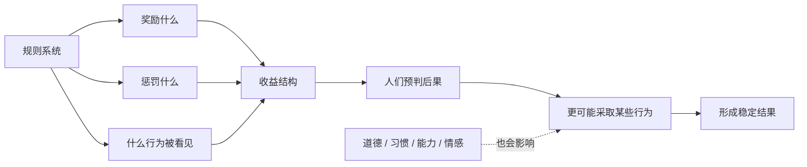
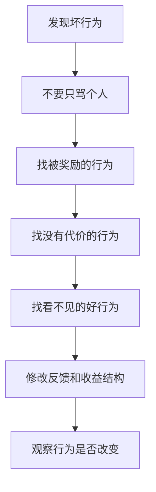

## 博弈思维筑基课: 激励决定行为
  
### 作者  
digoal  
  
### 日期  
2026-05-12
  
### 标签  
激励 , 惩罚 , 塑造行为 , 概率  
  
----  
  
## 背景 
不要先问“人好不好”，先问“这样做会得到什么后果”。  
  
如果一个系统奖励偷懒，就会产生偷懒；奖励短期业绩，就会牺牲长期质量；奖励背叛，就会破坏合作。  
  
这条是博弈论最底层的定律：  
> 改变行为，先改收益结构。
    
> 面向对象: 初中生到高中生  
> 核心问题: 为什么很多人明明知道什么是对的，却还是做出看起来短视、偷懒或互相伤害的选择？  
> 先说结论: “激励决定行为”不是说人像机器一样被奖励控制，而是说在一个规则系统里，什么行为被奖励、什么行为要付代价，会强烈塑造人们更可能选择什么。

## 一张图先看懂



## 求真讲法

### 它到底说了什么

“激励决定行为”是博弈论、经济学和制度设计里的高层原则。更准确的说法是:

> 在多人互动中，人们会根据规则、收益、风险、惩罚、声誉和未来机会来调整行为；长期看，被奖励的行为会变多，被惩罚的行为会变少。

这里的“激励”不只是钱。它可以是:

- 分数、奖金、排名。
- 表扬、声誉、信任。
- 处罚、损失、被排除。
- 时间成本、机会成本。
- 未来合作机会。
- 道德感和身份认同。

比如小组作业只给小组总分，不看个人贡献，就容易有人少做事。不是因为所有人都坏，而是规则让“少做也拿同样分”变得有吸引力。

### 它是怎么来的

博弈论研究的是多人互相影响时，每个人怎样选择。它会先问几个问题:

```text
谁在参与?
每个人能选择什么?
每种选择会带来什么后果?
别人会怎么反应?
这个结果会不会反复发生?
```

当你把这些问题写清楚，就会发现: 很多行为不是单纯由“品德”解释的，而是由收益结构推动的。

举个简单例子:

```text
规则 A:
  只看小组总分
  不记录个人贡献
  偷懒也不扣分
结果:
  搭便车更容易出现

规则 B:
  任务拆分清楚
  贡献公开可见
  个人贡献影响分数
结果:
  认真合作更容易稳定
```

这不是说规则能决定每一个人的每一次行动，而是说规则会改变行为的概率。好的制度不是假设人人完美，而是让普通人在追求自己目标时，也更容易做出对整体有益的选择。

### 它依赖哪些假设

这条原则要成立，需要一些前提。否则就容易把复杂的人误解成简单的“奖励机器”。

| 前提 | 含义 | 如果不成立会怎样 |
|---|---|---|
| 人会对后果有反应 | 奖励、惩罚和成本会影响选择 | 如果人完全不在乎后果，激励作用会弱 |
| 人能感知激励 | 知道什么行为会带来什么结果 | 如果规则不透明，行为可能混乱 |
| 行为和结果有关联 | 做什么会影响得到什么 | 如果努力和回报脱钩，激励会失真 |
| 反馈足够及时 | 行为后果不会太遥远或太模糊 | 如果反馈太慢，人很难调整 |
| 激励没有严重副作用 | 奖励指标没有扭曲真实目标 | 如果指标设计错，会鼓励错误行为 |
| 人还有其他动机 | 道德、习惯、关系、身份也在起作用 | 只看物质激励，会误判真实行为 |

可以把它写成一个判断式:

```text
如果一种行为:
  更容易得到奖励
  更少承担代价
  更容易被看见和承认
  更符合参与者目标
那么这种行为出现的概率会上升。
```

### 常见误解

**误解一: 激励决定行为，就是人只认钱。**  
不对。金钱只是激励之一。声誉、尊重、归属感、信任、自由、成就感也都是激励。

**误解二: 有奖励就一定有好行为。**  
不一定。如果奖励指标设计错，反而会把行为带偏。比如只奖励刷题数量，学生可能追求数量而不理解概念。

**误解三: 只要讲道理，人就会改变。**  
不一定。道理能改变认知，但如果现实规则持续奖励坏行为，很多人还是会被拉回旧行为。

**误解四: 激励能解释一切。**  
不能。人的行为还受情绪、价值观、能力、信息、习惯、关系和环境影响。激励是强解释框架，不是唯一解释框架。

## 求存讲法

### 它有什么用

这条定律最有用的地方，是让你在看到问题时少一点空泛责备，多一点结构分析。

看到学生不愿意参与小组作业，不要只说“他们不自觉”，还要问:

- 认真做的人有没有被看见？
- 偷懒的人有没有代价？
- 分工是否清楚？
- 反馈是否及时？
- 合作是否真的比单干更划算？

看到团队只追求短期数字，也不要只说“大家浮躁”，还要问:

- 考核是不是只看短期？
- 长期质量有没有奖励？
- 失败是否被允许？
- 说真话有没有风险？

### 它怎么迁移到熟悉领域

| 场景 | 被奖励的行为 | 可能出现的结果 | 更好的激励设计 |
|---|---|---|---|
| 学习 | 只奖励做题数量 | 机械刷题，不复盘 | 奖励错题订正和概念解释 |
| 小组作业 | 只给小组总分 | 搭便车 | 记录个人贡献 |
| 班级纪律 | 只惩罚被抓到的人 | 学会躲避检查 | 让规则稳定、透明、可预期 |
| 公司管理 | 只看短期销售额 | 牺牲服务和质量 | 同时看复购、投诉和长期利润 |
| 平台内容 | 只奖励点击率 | 标题党、低质内容 | 纳入停留、满意度和举报 |



### 它的适用范围和边界

适用时:

- 行为会反复发生。
- 人会根据后果调整选择。
- 奖励、惩罚、成本和声誉比较清楚。
- 你想改进一个班级、团队、平台或制度。

要谨慎时:

- 问题来自能力不足，不是激励不足。
- 问题来自信息不清，不是动机错误。
- 激励过强会挤出内在动机，比如把兴趣变成纯任务。
- 指标容易被钻空子。
- 涉及尊严、伦理和安全底线，不能只算收益。

### 正例: 怎么用它提升能力

**例子: 改进自己的学习系统。**

如果你只奖励自己“今天学了几小时”，你可能会坐在书桌前很久，但效率很低。这个激励奖励的是时长，不是理解。

更好的做法是改成:

- 能不能把一个概念讲给别人听？
- 错题是否归因到具体知识点？
- 一周后还能不能做对同类题？
- 有没有减少同类错误？

这样，激励从“假装努力”转向“真实掌握”。行为也会跟着变: 你会更愿意复盘、解释、测试自己，而不是只堆时间。

这个例子成立，是因为行为和反馈有关联，而且反馈足够及时。

### 反例: 前提不成立会怎样

**反例: 用奖金解决不会做的问题。**

假设一个学生物理基础很弱，公式含义没懂，题目也读不明白。家长说:“这次考到 90 分就奖励你 1000 元。”

这个激励可能没用，甚至会增加焦虑。原因不是奖励太少，而是失败前提在于“能力不足”，不是“动机不足”。如果没有补基础、拆题型、练反馈，再高的奖励也不能直接变成能力。

这里失败的前提是: “行为和结果有关联”。学生想拿奖励，但不知道怎样通过具体行为稳定提高成绩。

## 思考

“激励决定行为”最重要的启发，是把问题从“这个人怎么这么差”推进到“这个系统正在奖励什么”。

很多坏结果不是因为所有人都坏，而是因为系统把普通人推向了坏选择:

- 只看速度，就容易牺牲质量。
- 只看排名，就容易隐藏合作。
- 只看点击，就容易制造刺激。
- 只看短期利润，就容易透支信任。
- 只惩罚失败，就容易没人说真话。

但这条定律也不能被滥用。人不是只有激励反应的工具。真正好的制度，不是用奖励和惩罚操控人，而是让正确的事更容易发生，让偷懒、作假、背叛更难占便宜，同时保留人的尊严、成长和内在动机。

你可以继续追问:

1. 我想改变的行为，当前被什么奖励或惩罚？
2. 有没有好行为看不见，坏行为没代价？
3. 指标会不会把人带向错误目标？
4. 问题到底是动机不足、能力不足，还是信息不足？
5. 怎样设计规则，让个人追求自身目标时也帮助整体变好？

## 最后记住

1. 激励决定行为，准确说是激励强烈塑造行为的概率和方向。
2. 激励不只是钱，还包括声誉、信任、时间、风险、尊重和未来机会。
3. 看到坏行为，先检查系统奖励了什么、惩罚了什么、忽略了什么。
4. 错误指标会制造错误行为，甚至把好人推向坏选择。
5. 好机制的目标，是让正确行为更划算、更可见、更容易持续。

## 参考资料

- Robert Gibbons, *Game Theory for Applied Economists*, Princeton University Press, 1992: 用策略、收益和均衡解释参与者如何响应激励。
- Avinash K. Dixit, Susan Skeath, David H. Reiley Jr., *Games of Strategy*, W. W. Norton: 常用博弈论教材，包含策略互动、承诺、重复博弈和激励分析。
- Jean-Jacques Laffont and David Martimort, *The Theory of Incentives*, Princeton University Press, 2002: 机制设计和激励理论的系统教材。
- Steven Kerr, "On the Folly of Rewarding A, While Hoping for B", Academy of Management Journal, 1975: 经典文章，讨论奖励指标和真实目标错位带来的行为扭曲。
- Bengt Holmstrom and Paul Milgrom, "Multitask Principal-Agent Analyses", Journal of Law, Economics, & Organization, 1991: 解释多任务场景中单一指标激励可能导致的扭曲。
  
  
#### [PostgreSQL 解决方案集合](../201706/20170601_02.md "40cff096e9ed7122c512b35d8561d9c8")
  
  
#### [德哥 / digoal's Github - 公益是一辈子的事.](https://github.com/digoal/blog/blob/master/README.md "22709685feb7cab07d30f30387f0a9ae")
  
  
#### [About 德哥](https://github.com/digoal/blog/blob/master/me/readme.md "a37735981e7704886ffd590565582dd0")
  
  

  
