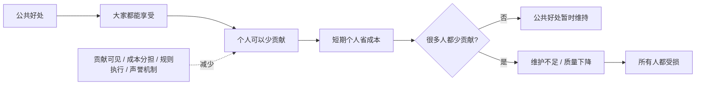
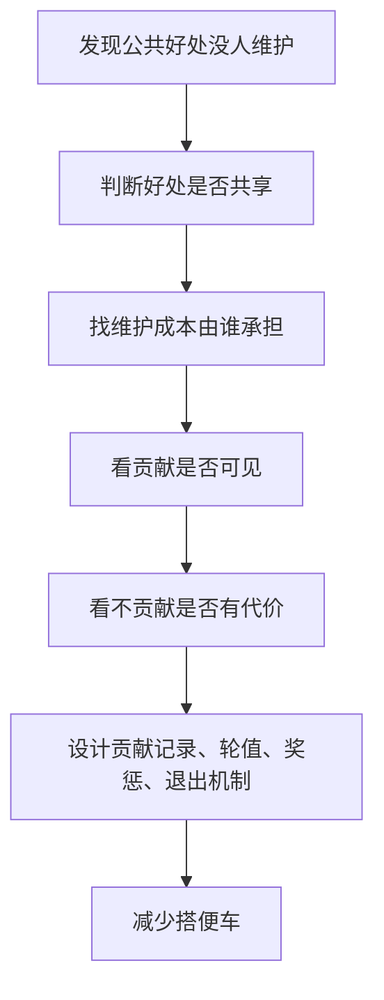

## 博弈思维筑基课: 搭便车问题
  
### 作者  
digoal  
  
### 日期  
2026-05-12
  
### 标签  
公共资源 , 搭便车 , 公共品 , 集体行动 , 贡献机制
  
----  
  
## 背景

> 面向对象: 初中生到高中生  
> 核心问题: 为什么大家都想享受公共好处，却常常不愿意承担维护成本？  
> 先说结论: 搭便车问题是“个人理性不等于集体理性”在公共资源和公共品场景中的典型现象: 个人不贡献也能享受成果时，少贡献对个人有利，但如果人人都这样，公共好处就会减少甚至消失。

## 一张图先看懂



## 求真讲法

### 它到底说了什么

搭便车问题，说的是一种很常见的公共合作困境:

> 一个好处大家都能享受，但维护它需要有人付出成本。于是每个人都可能想: “如果别人付出，我不付出也能享受；如果别人都不付出，我一个人付出也没用。”

比如班级有一个共享资料库。大家都能下载资料，但整理资料需要时间。如果每个人都只下载、不上传、不校对，资料库很快就会变旧、变乱、变没用。

这不是说每个人都坏，而是结构里有一个诱惑: **享受公共好处时很方便，承担公共成本时却可以逃开。**

### 它是怎么来的

搭便车问题通常出现在公共品或公共资源附近。

先理解两个词:

- **公共品**: 很多人可以同时享受，而且很难把不付费的人排除出去。比如公共安全、清洁空气、基础知识、开源软件的一部分成果。
- **公共资源**: 大家都能使用，但使用过多会变少或变差。比如草地、渔场、公共厨房、班级安静环境。

搭便车的逻辑很简单:

```text
我贡献:
  我付出成本
  大家一起受益

我不贡献:
  我省下成本
  只要别人贡献，我仍然受益

所以从个人短期看:
  不贡献可能更划算

但如果人人都这样:
  公共好处无法维持
```

这就是“个人理性不等于集体理性”的典型结构。个人少付一点成本看似合理，很多人都少付，公共系统就会塌。

### 它依赖哪些假设

搭便车问题要成立，通常需要这些前提:

| 前提 | 含义 | 如果不成立会怎样 |
|---|---|---|
| 好处具有公共性 | 不贡献的人也能享受成果 | 如果能轻松排除不贡献者，搭便车会减少 |
| 贡献有成本 | 出钱、出力、花时间、承担风险 | 如果贡献几乎无成本，搭便车诱惑较弱 |
| 个人贡献难以识别 | 不容易看出谁付出了多少 | 如果贡献可见，声誉和评价能约束行为 |
| 不贡献惩罚较弱 | 少出力也没什么后果 | 如果违规成本高，搭便车会减少 |
| 参与者人数较多 | 单个人影响看起来很小 | 人越少、越熟，越容易互相监督 |
| 公共好处需要持续维护 | 不是一次建好就永远存在 | 如果不需要维护，问题较弱 |

一句话判断:

```text
如果一个系统:
  好处大家共享
  成本可以逃避
  贡献难以看见
  不贡献也没代价
那么搭便车问题就容易出现。
```

### 常见误解

**误解一: 搭便车就是占小便宜的人品差。**  
不完全对。个人品质有影响，但搭便车首先是一种结构问题: 系统允许不贡献者享受同样好处。

**误解二: 只要大家有集体荣誉感，就不会搭便车。**  
不一定。荣誉感有用，但如果贡献者长期吃亏、偷懒者长期受益，荣誉感会被消耗。

**误解三: 搭便车只发生在大社会里。**  
不对。班级卫生、小组作业、宿舍公共物品、共享文档、开源项目都可能出现。

**误解四: 解决搭便车就是把所有东西都私有化。**  
不一定。排除机制、贡献记录、声誉、轮值、公共规则、渐进惩罚都可能减少搭便车。

## 求存讲法

### 它有什么用

理解搭便车问题，可以帮你看懂很多“公共好处为什么没人维护”的现象。

比如:

- 大家都想教室干净，但不想自己倒垃圾。
- 大家都想共享资料完整，但不想自己整理。
- 大家都想小区安静安全，但不愿参与公共事务。
- 大家都想使用开源软件，但不愿反馈问题、写文档或赞助维护。
- 大家都想空气清洁，但单个排污者想把治理成本转嫁给别人。

这些问题的共同点是: 好处共享，成本分散，贡献难看见，不贡献容易隐藏。

### 它怎么迁移到熟悉领域



| 场景 | 公共好处 | 搭便车行为 | 改进机制 |
|---|---|---|---|
| 班级卫生 | 干净教室 | 不值日也享受干净 | 轮值表和检查记录 |
| 小组作业 | 最终高分 | 不贡献也共享成绩 | 个人贡献评分 |
| 共享资料 | 完整笔记 | 只下载不上传 | 上传记录和互评 |
| 开源项目 | 免费软件 | 只使用不反馈 | 贡献榜、赞助、issue 规范 |
| 环境治理 | 清洁空气 | 排污不承担成本 | 排放监管和处罚 |

### 它的适用范围和边界

适用时:

- 好处可以被多人共同享受。
- 不贡献者难以被排除。
- 贡献有明显成本。
- 贡献和不贡献不容易被看见。
- 公共系统需要持续维护。

要谨慎时:

- 有人不是搭便车，而是没有能力贡献。
- 有人贡献的是隐性劳动，不容易被看见。
- 贡献标准不公平，弱者承担了过多义务。
- 过度监督会伤害信任和隐私。
- 公共好处本身分配不公平，有人享受少却被要求贡献多。

### 正例: 怎么用它提升能力

**例子: 让班级共享资料库持续有用。**

如果资料库只靠几个同学整理，其他人只下载，最后整理者会疲惫，资料质量下降。

可以设计机制:

- 每周每人至少上传一条有效资料或一道错题解析。
- 上传内容必须标注来源、适用章节和难度。
- 每周安排两人做校对。
- 高质量贡献在班级里公开署名。
- 长期不贡献者不能优先下载整理版合集。

这样，公共好处仍然共享，但贡献变得可见，不贡献也有一定代价。搭便车诱惑就会下降。

### 反例: 前提不成立会怎样

**反例: 把能力不足误判成搭便车。**

一个同学在小组作业里贡献少。大家以为他搭便车，但后来发现他并不是不想做，而是不知道怎么查资料，也不会做 PPT。只用惩罚解决，可能让他更沉默。

这里失败的前提是: “不贡献是为了逃避成本”。如果真实原因是能力不足，就应该先拆任务、给模板、安排可完成的小责任，再观察他是否愿意承担。

搭便车问题要解决，但不能把所有低贡献都简单等同于偷懒。

## 思考

搭便车问题最重要的启发，是让我们看到公共系统的脆弱性。

很多东西看起来“本来就在那里”:

```text
干净环境
公共秩序
共享资料
开源软件
社区安全
清洁空气
可靠知识
```

但它们其实都需要有人维护。问题是，维护成本常常落在少数人身上，享受好处的人却很多。如果没有规则保护贡献者，公共好处就会被一点点消耗。

成熟的解决方式，不是只说“大家要自觉”，而是设计机制:

- 让贡献可见。
- 让成本公平分担。
- 让长期不贡献有代价。
- 让能力不足者有参与路径。
- 让公共资源有边界、监督和修复机制。

你可以继续追问:

1. 这个公共好处是谁在维护？
2. 谁在享受但没有贡献？
3. 不贡献是偷懒、能力不足，还是规则不公平？
4. 贡献能不能被看见和承认？
5. 怎样让维护公共好处不再只靠少数人牺牲？

## 最后记住

1. 搭便车问题是公共好处共享、维护成本可逃避时的典型困境。
2. 它体现了个人理性不等于集体理性: 少贡献对个人有利，人人少贡献则公共好处崩坏。
3. 解决搭便车不能只靠道德劝说，还要让贡献可见、成本公平、违规有代价。
4. 也要区分搭便车和能力不足，不能把所有低贡献都当成偷懒。
5. 好的公共治理，是保护贡献者、约束长期不贡献者，并给更多人合理参与的路径。

## 参考资料

- Mancur Olson, *The Logic of Collective Action*, Harvard University Press, 1965: 分析集体行动、公共利益和搭便车问题的经典著作。
- Paul A. Samuelson, "The Pure Theory of Public Expenditure", Review of Economics and Statistics, 1954: 公共品理论的经典论文。
- Garrett Hardin, "The Tragedy of the Commons", Science, 1968: 公地悲剧经典论文，解释公共资源过度使用的结构性原因。
- Elinor Ostrom, *Governing the Commons*, Cambridge University Press, 1990: 研究社区如何通过边界、规则、监督和渐进惩罚治理公共资源。
- Robert Gibbons, *Game Theory for Applied Economists*, Princeton University Press, 1992: 用博弈论解释公共品、搭便车和集体行动困境。
  
#### [PostgreSQL 解决方案集合](../201706/20170601_02.md "40cff096e9ed7122c512b35d8561d9c8")
  
  
#### [德哥 / digoal's Github - 公益是一辈子的事.](https://github.com/digoal/blog/blob/master/README.md "22709685feb7cab07d30f30387f0a9ae")
  
  
#### [About 德哥](https://github.com/digoal/blog/blob/master/me/readme.md "a37735981e7704886ffd590565582dd0")
  
  

  
