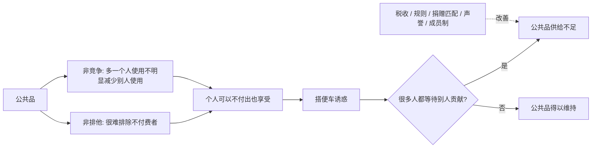
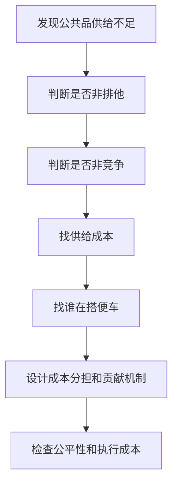

## 博弈思维筑基课: 公共品困境
  
### 作者  
digoal  
  
### 日期  
2026-05-12
  
### 标签  
公共品 , 公共资源 , 搭便车 , 供给不足 , 成本分担
  
----  
  
## 背景

> 面向对象: 初中生到高中生  
> 核心问题: 为什么有些对大家都好的东西，反而很难靠大家自发出钱出力来维持？  
> 先说结论: 公共品困境是“个人理性不等于集体理性”在公共品场景中的典型现象: 公共品很难排除不付出的人，而且多人共享不容易互相挤占，所以个人容易等待别人贡献，最终导致公共品供给不足。

## 一张图先看懂



## 求真讲法

### 它到底说了什么

公共品困境，说的是这样一种问题:

> 某个东西对很多人都有好处，但因为很难把不付出的人排除出去，所以每个人都可能想等别人来出钱出力。结果大家都想享受，真正愿意贡献的人却不够。

公共品有两个重要特征:

- **非排他**: 很难阻止没付费的人享受它。
- **非竞争**: 多一个人享受，不会明显减少别人享受。

比如干净空气。你很难只让交钱的人呼吸干净空气，也很难说一个人呼吸了干净空气，别人就明显少呼吸一点。正因为这样，每个人都希望别人承担治理污染的成本，自己坐享空气改善。

这就形成公共品困境。

### 它是怎么来的

公共品困境的核心，是收益和成本没有自然对齐。

```text
贡献公共品:
  我承担一部分成本
  大家共同受益

不贡献公共品:
  我省下成本
  只要别人贡献，我也能受益

个人短期看:
  不贡献更轻松

集体长期看:
  贡献不足，公共品变少
```

它和“搭便车问题”关系很近，但侧重点不同:

| 概念 | 关注重点 | 一句话区别 |
|---|---|---|
| 公共品困境 | 公共品为什么供给不足 | 从物品特征看问题 |
| 搭便车问题 | 个人为什么不愿贡献 | 从行为激励看问题 |
| 公地悲剧 | 公共资源为什么被过度使用 | 从资源消耗看问题 |

公共品困境常常不是“大家不需要”，而是“大家都需要，但没人想单独买单”。

### 它依赖哪些假设

公共品困境通常依赖这些前提:

| 前提 | 含义 | 如果不成立会怎样 |
|---|---|---|
| 非排他性强 | 不付出的人也能享受 | 如果能排除不付出者，付费和贡献会更容易 |
| 非竞争性强 | 多一个人享受不明显挤占别人 | 如果会明显拥挤，问题更像公共资源拥堵 |
| 供给需要成本 | 建设、维护、监督都要付出 | 如果成本很低，困境较弱 |
| 个人贡献影响有限 | 单个人觉得自己贡献不关键 | 如果个人贡献很明显，参与动力会增强 |
| 缺少协调机制 | 大家难以约定共同分担成本 | 如果有可靠协调，公共品更容易供给 |
| 缺少可信执行 | 不贡献者没有代价 | 如果规则可执行，搭便车会减少 |

一句话判断:

```text
如果一种好处:
  很难排除不付出的人
  多人共享不容易互相挤占
  但供给和维护需要成本
那么它就容易出现公共品困境。
```

### 常见误解

**误解一: 公共品就是政府提供的东西。**  
不对。政府常提供公共品，但公共品是按特征定义的，不是按提供者定义的。开源知识、公共卫生、社区安全也可能有公共品属性。

**误解二: 公共品一定免费。**  
不一定。公共品可能通过税收、会费、捐赠、基金或平台补贴来供给。使用时免费，不代表生产和维护免费。

**误解三: 大家都喜欢的东西自然会有人维护。**  
不一定。越是大家都能享受，越容易出现“等别人贡献”的心理。

**误解四: 公共品困境只能靠强制解决。**  
不一定。税收和法律是一种方式，声誉、成员制、匹配捐赠、社区规则、志愿组织也可能有效。

## 求存讲法

### 它有什么用

理解公共品困境，可以帮你看懂很多“明明重要却长期缺钱缺人维护”的事情。

比如:

- 公共卫生: 疫苗接种、传染病监测、卫生宣传。
- 基础知识: 免费教材、百科、开源教程。
- 公共安全: 路灯、消防、治安巡逻。
- 环境质量: 清洁空气、河流水质、碳减排。
- 数字公共品: 开源软件、公共数据集、基础协议。

这些东西对很多人都有好处，但如果没有稳定机制，就容易靠少数人长期支撑。

### 它怎么迁移到熟悉领域



| 场景 | 公共品 | 困境表现 | 改进机制 |
|---|---|---|---|
| 班级学习 | 共享错题库 | 大家下载，少数人整理 | 轮值、署名、贡献评分 |
| 社区生活 | 公共安全 | 都想安全，没人参与巡查 | 物业费、志愿队、公开记录 |
| 网络世界 | 开源软件 | 大量使用，维护者缺资源 | 赞助、贡献榜、企业支持 |
| 环境治理 | 清洁空气 | 人人受益，治理成本高 | 税收、监管、排放规则 |
| 公共知识 | 免费百科 | 人人查阅，编辑者不足 | 志愿编辑、捐赠、审核机制 |

### 它的适用范围和边界

适用时:

- 好处可以被很多人同时享受。
- 很难排除不付出的人。
- 供给和维护有真实成本。
- 个人贡献容易被低估。
- 自发贡献不足以维持质量。

要谨慎时:

- 某些物品只是“共同使用”，但会明显拥挤，更像公共资源问题。
- 有些人不是不愿贡献，而是支付能力不足。
- 强制收费可能伤害公平，需要考虑弱势群体。
- 过度排他会破坏公共品的社会价值。
- 供给机制设计不当，会造成浪费或权力滥用。

### 正例: 怎么用它提升能力

**例子: 维护班级公共错题库。**

一个班级想建立公共错题库。所有人都能从中受益，但整理题目、标注知识点、校对答案都需要时间。若完全靠自愿，很容易变成少数人维护、多数人下载。

可以这样设计机制:

- 每周每人提交一道高质量错题解析。
- 解析必须包含错误原因、正确思路和同类题提醒。
- 每组轮流校对一周内容。
- 高质量贡献者署名展示。
- 长期不贡献者不能优先获得精编版。

这样，公共品仍然服务全班，但供给成本被更公平地分担。

### 反例: 前提不成立会怎样

**反例: 把拥挤资源误当成纯公共品。**

学校有一个小自习室。大家都想使用，管理者说“学习空间是公共品，应该人人免费随便进”。结果座位被长期占用，真正需要的人进不去。

这里失败的前提是: “非竞争性强”。自习室座位是有限的，一个人占用会减少别人使用，严格说更像公共资源或俱乐部资源，而不是纯公共品。

这种场景需要预约、限时、规则和监督，而不能只按公共品逻辑处理。

## 思考

公共品困境最值得思考的地方，是它揭示了一个反直觉事实:

```text
越是大家都需要的东西，
越可能没人愿意单独承担成本。
```

因为每个人都觉得:

- 我一个人贡献太少，改变不了什么。
- 别人也会受益，凭什么我多付？
- 如果别人都贡献，我不贡献也能享受。
- 如果别人都不贡献，我贡献也没用。

这不是简单的人性批判，而是公共品结构带来的激励问题。

真正成熟的公共治理，不是只靠喊“大家要有公德心”，而是要设计机制:

- 让成本公平分担。
- 让贡献被看见。
- 让长期不贡献有代价。
- 让弱者不被排除在基本公共品之外。
- 让公共品维护者有稳定资源。

你可以继续追问:

1. 这个东西是不是具有非排他和非竞争特征？
2. 它的供给成本由谁承担？
3. 谁在享受但没有贡献？
4. 是否应该用税收、会费、捐赠、声誉或成员制来支持？
5. 怎样既减少搭便车，又不伤害公共品的开放价值？

## 最后记住

1. 公共品困境来自公共品的非排他和非竞争特征。
2. 公共品不是没有成本，而是成本和收益很难自然对齐。
3. 搭便车是公共品困境中的常见行为机制。
4. 解决公共品困境，需要成本分担、贡献可见、规则执行和公平保护。
5. 也要区分公共品和公共资源: 前者常供给不足，后者常过度使用或拥挤。

## 参考资料

- Paul A. Samuelson, "The Pure Theory of Public Expenditure", Review of Economics and Statistics, 1954: 公共品理论的经典论文。
- Mancur Olson, *The Logic of Collective Action*, Harvard University Press, 1965: 解释公共利益、集体行动和搭便车问题。
- Richard Cornes and Todd Sandler, *The Theory of Externalities, Public Goods, and Club Goods*, Cambridge University Press, 1996: 系统讨论公共品、外部性和俱乐部品。
- Elinor Ostrom, *Governing the Commons*, Cambridge University Press, 1990: 研究社区如何通过规则和治理机制解决公共资源与公共品相关困境。
- Robert Gibbons, *Game Theory for Applied Economists*, Princeton University Press, 1992: 用博弈论解释公共品供给、搭便车和集体行动问题。
  
#### [PostgreSQL 解决方案集合](../201706/20170601_02.md "40cff096e9ed7122c512b35d8561d9c8")
  
  
#### [德哥 / digoal's Github - 公益是一辈子的事.](https://github.com/digoal/blog/blob/master/README.md "22709685feb7cab07d30f30387f0a9ae")
  
  
#### [About 德哥](https://github.com/digoal/blog/blob/master/me/readme.md "a37735981e7704886ffd590565582dd0")
  
  

  
