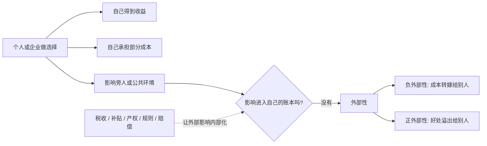
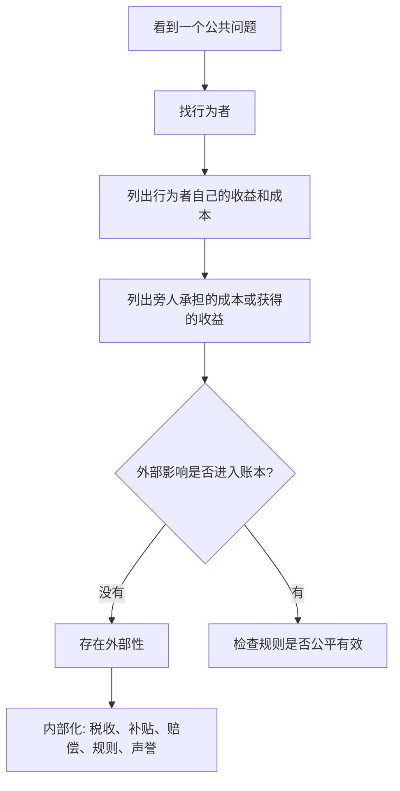

## 博弈思维筑基课: 外部性
  
### 作者  
digoal  
  
### 日期  
2026-05-12
  
### 标签  
外部性 , 公共资源 , 成本转嫁 , 正外部性 , 负外部性
  
----  
  
## 背景

> 面向对象: 初中生到高中生  
> 核心问题: 为什么有些人做选择时只看自己的收益和成本，却让别人承担了后果？  
> 先说结论: 外部性是指一个人的行为给旁人带来成本或收益，但这些成本或收益没有进入行为者自己的决策账本；它是“个人理性不等于集体理性”在公共资源场景中的典型现象。

## 一张图先看懂



## 求真讲法

### 它到底说了什么

外部性，说的是一种“影响没有算进账”的现象。

如果一个人的行为让别人受损，但他不用承担这部分损失，这叫**负外部性**。比如工厂排污，工厂省了处理成本，但下游居民承担水污染和健康损失。

如果一个人的行为让别人受益，但他得不到相应回报，这叫**正外部性**。比如有人种花美化街道，路过的人也享受了好环境，但他们未必给种花的人付费。

外部性的关键不是“有没有影响别人”，而是:

> 影响了别人，但这个影响没有被合理计入行为者的成本或收益。

### 它是怎么来的

普通个人决策往往只看自己的账:

```text
我做这件事:
  我得到什么?
  我付出什么?
  对我划不划算?
```

但社会系统里，一个行为常常会影响别人:

```text
我开大音量:
  我听得开心
  邻居被打扰

我乱丢垃圾:
  我省了几步路
  清洁工和其他人承担成本

我接种疫苗:
  我降低患病风险
  周围人也降低传播风险
```

如果这些外部影响没有进入个人决策，就会出现偏差:

- 负外部性太多: 因为制造者没有承担全部成本。
- 正外部性太少: 因为创造者没有获得全部收益。

可以这样对比:

| 类型 | 行为者看到的账 | 社会真实账 | 常见结果 |
|---|---|---|---|
| 负外部性 | 自己收益高、自己成本低 | 别人承担隐藏成本 | 过度制造 |
| 正外部性 | 自己收益有限、自己成本明确 | 别人也获得好处 | 供给不足 |

### 它依赖哪些假设

外部性要成立，通常需要这些前提:

| 前提 | 含义 | 如果不成立会怎样 |
|---|---|---|
| 行为影响第三方 | 行为影响了交易或决策之外的人 | 如果只影响自己，就不是外部性 |
| 影响没有被计价 | 受损者没有得到补偿，受益者没有付费 | 如果价格或补偿完整，外部性会减少 |
| 权责边界不清 | 谁有权使用资源、谁该承担损害不明确 | 如果产权和责任清楚，协商更容易 |
| 监督和执行不足 | 难以发现、证明或追责 | 如果能稳定追责，负外部性会减少 |
| 受影响者难以协调 | 受害者或受益者分散，组织成本高 | 如果能低成本协商，问题可能缓解 |
| 公共资源容易被影响 | 空气、水、噪音、秩序等容易被转嫁成本 | 如果影响完全私有化，外部性较弱 |

一句话判断:

```text
如果一个行为:
  让别人受损或受益
  但行为者没有承担相应成本
  或没有获得相应回报
那么这里就可能存在外部性。
```

### 常见误解

**误解一: 外部性只是不道德。**  
不完全对。道德有影响，但外部性首先是成本收益错位。治理重点是让影响被看见、被计价、被补偿或被约束。

**误解二: 外部性只有负面的。**  
不对。外部性有负外部性，也有正外部性。污染是负外部性，教育、疫苗、基础研究常有正外部性。

**误解三: 只要影响别人，就是外部性。**  
不一定。如果影响已经通过价格、合同、赔偿或规则处理了，就不一定是未解决的外部性。

**误解四: 外部性只能靠政府解决。**  
不一定。政府监管、税收和补贴很重要，但社区规则、产权安排、平台治理、声誉机制、合同赔偿也可能有效。

## 求存讲法

### 它有什么用

理解外部性，可以帮你看懂很多公共资源问题的底层结构:

- 污染: 企业降低处理成本，居民承担健康和环境成本。
- 噪音: 一个人娱乐，周围人失眠。
- 拥堵: 一辆车上路很方便，很多车一起让道路变慢。
- 公共卫生: 一个人不防护，传播风险由周围人承担。
- 教育: 一个人受教育，不只自己受益，社会也受益。
- 开源贡献: 一个人修复漏洞，很多使用者受益。

外部性让我们看到: 有些价格太便宜，是因为别人替你付了账；有些好事太少，是因为做好事的人没有得到足够回报。

### 它怎么迁移到熟悉领域



| 场景 | 外部成本或收益 | 可能机制 |
|---|---|---|
| 乱丢垃圾 | 清洁成本由别人承担 | 罚款、监控、垃圾桶便利性 |
| 夜间噪音 | 邻居睡眠被损害 | 安静时段规则、投诉机制 |
| 工厂排污 | 下游居民和生态受损 | 排污税、排放许可、赔偿 |
| 疫苗接种 | 降低他人感染风险 | 公共补贴、宣传、接种便利 |
| 基础研究 | 社会长期受益 | 政府资助、基金、开放共享 |

### 它的适用范围和边界

适用时:

- 行为影响了旁人或公共环境。
- 影响没有通过价格、合同或规则处理。
- 受影响者难以单独追责或协商。
- 公共资源、公共健康、公共秩序受到影响。

要谨慎时:

- 影响很小，治理成本可能高于收益。
- 外部影响难以准确测量。
- 强行计价可能伤害公平或隐私。
- 受益和受损的人群很复杂，不能简单归因。
- 有些正外部性来自自愿分享，不能过度行政化。

### 正例: 怎么用它提升能力

**例子: 班级自习噪音。**

一个同学在自习课小声聊天。他获得了放松和社交收益，但噪音成本被周围同学承担。每个人都觉得“我只说几句没事”，最后教室变吵，所有人学习效率下降。

用外部性分析，不是只说“这个人没素质”，而是看成本是否进入他的账本:

- 噪音是否被提醒和记录？
- 被打扰的人是否有反馈通道？
- 自习规则是否明确？
- 违反规则是否有适度后果？
- 有没有提供课间交流的替代空间？

当噪音成本被看见并有规则处理，个人选择才会更接近集体利益。

### 反例: 前提不成立会怎样

**反例: 把所有不喜欢都叫外部性。**

一个同学穿了颜色很亮的衣服，另一个同学觉得“不舒服”，于是说这是负外部性，要求禁止。

这里要谨慎。外部性分析需要关注真实、可讨论、可衡量的影响，而不是把所有个人不喜欢都变成公共成本。如果没有明显损害、没有侵占公共资源、没有破坏规则，就不应轻易用“外部性”限制他人自由。

这里失败的前提是: “行为造成了需要治理的第三方成本”。不是所有主观不适都足以构成需要制度介入的外部性。

## 思考

外部性最重要的启发，是让你学会问一句话:

> 这件事真正的成本和收益，落在了谁身上？

很多公共问题之所以难解决，是因为账本被拆开了:

```text
收益在我这里
成本在别人那里

成本在现在很小
损害在未来很大

好处扩散给大家
贡献者自己回报不足
```

这会造成两个方向的扭曲:

- 坏行为太多，因为成本被转嫁。
- 好行为太少，因为收益被外溢。

成熟的治理，不是简单禁止一切，也不是放任一切，而是让外部影响尽量回到决策者的账本里。污染要付成本，贡献要被回报，受害者要能发声，公共资源要有规则。

你可以继续追问:

1. 这个行为的收益是谁得到的？
2. 成本是谁承担的？
3. 有没有人被迫承担了自己没有选择的后果？
4. 有没有正外部性没有被奖励，导致好事供给不足？
5. 怎样让外部成本内部化、外部收益被合理支持？

## 最后记住

1. 外部性是行为的成本或收益转嫁给旁人，却没有进入行为者决策账本。
2. 负外部性会让坏行为过多，正外部性会让好行为供给不足。
3. 外部性是个人理性不等于集体理性的典型机制之一。
4. 治理外部性，核心是让影响被看见、被计价、被补偿或被约束。
5. 也要警惕滥用外部性概念，不能把所有主观不喜欢都变成限制他人的理由。

## 参考资料

- Arthur C. Pigou, *The Economics of Welfare*, 1920: 系统讨论外部成本、福利经济学和税收矫正思想。
- Ronald H. Coase, "The Problem of Social Cost", Journal of Law and Economics, 1960: 讨论产权、交易成本和外部性协商解决路径。
- Paul A. Samuelson, "The Pure Theory of Public Expenditure", Review of Economics and Statistics, 1954: 公共品理论经典论文，和外部性问题密切相关。
- Richard Cornes and Todd Sandler, *The Theory of Externalities, Public Goods, and Club Goods*, Cambridge University Press, 1996: 系统讨论外部性、公共品和俱乐部品。
- N. Gregory Mankiw, *Principles of Economics*: 经济学入门教材中对正负外部性、庇古税和公共政策有清晰介绍。
  
#### [PostgreSQL 解决方案集合](../201706/20170601_02.md "40cff096e9ed7122c512b35d8561d9c8")
  
  
#### [德哥 / digoal's Github - 公益是一辈子的事.](https://github.com/digoal/blog/blob/master/README.md "22709685feb7cab07d30f30387f0a9ae")
  
  
#### [About 德哥](https://github.com/digoal/blog/blob/master/me/readme.md "a37735981e7704886ffd590565582dd0")
  
  

  
