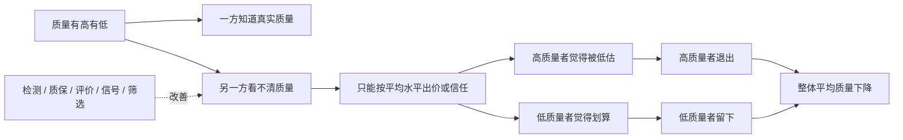
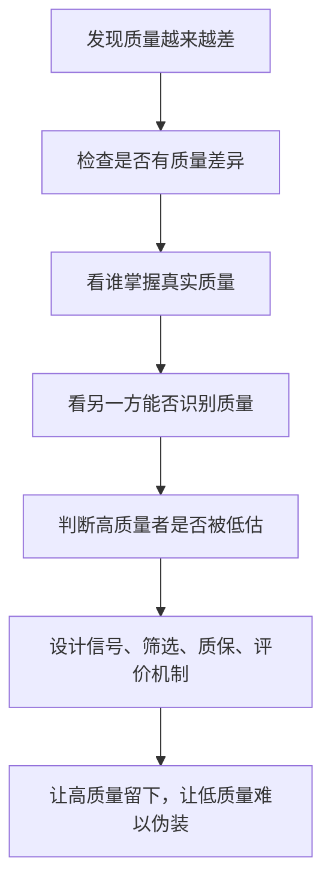

## 博弈思维筑基课: 逆向选择
  
### 作者  
digoal  
  
### 日期  
2026-05-12
  
### 标签  
逆向选择 , 信息不对称 , 质量筛选 , 柠檬市场 , 可信信号
  
----  
  
## 背景

> 面向对象: 初中生到高中生  
> 核心问题: 为什么有些市场或合作里，越是不容易判断质量，越容易把好产品、好人、好合作挤走？  
> 先说结论: 逆向选择是信息不对称导致的坏筛选: 买家或合作方看不清真实质量，只能按平均水平出价或信任，结果高质量一方觉得不划算退出，低质量一方反而留下。

## 一张图先看懂



## 求真讲法

### 它到底说了什么

逆向选择，说的是一种“看不清质量导致选错人、选错货、选错合作”的现象。

它的典型结构是:

> 一方知道真实质量，另一方不知道。看不清质量的人只能按平均水平判断。结果高质量者觉得自己被低估，不愿参与；低质量者觉得占便宜，更愿意参与。最后留下来的平均质量越来越差。

最经典的例子是二手车市场。卖家知道车是不是好车，买家不知道。买家担心买到坏车，就只愿意出一个偏低的平均价。好车车主觉得这个价格太低，不愿卖；坏车车主反而愿意卖。于是市场上坏车比例上升，买家更不信任，价格更低，好车更退出。

这就是“好产品被坏环境挤走”。

### 它是怎么来的

逆向选择来自信息不对称。它不是简单的“大家不诚实”，而是信息结构把市场推坏了。

可以用一个简单过程理解:

```text
第一步: 市场里有高质量和低质量。
第二步: 卖方知道质量，买方看不清。
第三步: 买方怕吃亏，只愿意按平均质量出价。
第四步: 高质量卖方觉得价格不值得，退出。
第五步: 剩下低质量更多，市场平均质量下降。
第六步: 买方更不信任，出价更低。
```

这个循环会让市场越来越差。

它和“搭便车”“公共品困境”不同。搭便车强调“不贡献也能享受”。逆向选择强调“质量不可见，导致好的一方被低估并退出”。

| 现象 | 核心问题 | 典型结果 |
|---|---|---|
| 搭便车 | 不贡献也能享受公共好处 | 贡献不足 |
| 公共品困境 | 公共品难排除不付出者 | 供给不足 |
| 外部性 | 成本或收益转嫁给旁人 | 过度制造坏影响或供给好影响不足 |
| 逆向选择 | 信息不对称，看不清质量 | 高质量退出，低质量留下 |

### 它依赖哪些假设

逆向选择通常依赖这些前提:

| 前提 | 含义 | 如果不成立会怎样 |
|---|---|---|
| 质量存在差异 | 有好产品、好人、好合作，也有低质量者 | 如果质量都一样，就不会因质量筛选失灵 |
| 一方知道更多 | 卖方、应聘者、投保人等更了解自己 | 如果双方信息一样，逆向选择减弱 |
| 另一方难以判断质量 | 买方或合作方无法低成本辨别 | 如果能准确检测，问题会减少 |
| 价格或信任按平均水平给出 | 不知情方只能用平均判断 | 高质量者会觉得被低估 |
| 高质量者有退出选择 | 好的一方可以不参与 | 如果不能退出，表现为压抑和低激励 |
| 低质量者更愿意留下 | 平均价格或信任对低质量者更划算 | 市场质量会继续下降 |

一句话判断:

```text
如果一个环境:
  质量差异很大
  真实质量难以观察
  大家只能按平均水平定价或信任
  高质量者因此被低估并退出
那么逆向选择就可能发生。
```

### 常见误解

**误解一: 逆向选择就是骗子太多。**  
不完全对。骗子会加重问题，但逆向选择的根源是信息不对称和筛选机制失灵。

**误解二: 压低价格可以保护买家。**  
不一定。价格压得太低，会先把好卖家赶走，最后买家更容易遇到低质量。

**误解三: 评价越多越能解决逆向选择。**  
不一定。评价如果能造假、刷分、被操纵，就会变成噪音，甚至让问题更严重。

**误解四: 逆向选择只发生在买卖市场。**  
不对。招聘、保险、交友、小组合作、平台内容、开源协作都可能出现。

## 求存讲法

### 它有什么用

理解逆向选择，可以帮你看懂很多“好人为什么不来了、好货为什么不卖了、好合作为什么消失了”的问题。

比如:

- 招聘中，如果无法识别真正有能力的人，优秀者可能不愿接受低薪平均报价。
- 小组合作中，如果认真者和偷懒者拿同样评价，认真者下次不愿参加。
- 平台内容中，如果优质内容和低质标题党得到类似曝光，优质创作者可能退出。
- 保险中，如果保费不区分风险，低风险者觉得贵而退出，高风险者更愿意留下。

这些现象背后都可能是逆向选择。

### 它怎么迁移到熟悉领域



| 场景 | 信息不对称 | 逆向选择结果 | 改进机制 |
|---|---|---|---|
| 二手交易 | 卖家更知道质量 | 好货退出，差货留下 | 检测、质保、退换 |
| 招聘 | 应聘者更知道真实能力 | 高能力者被平均价低估 | 作品集、试用、推荐 |
| 小组合作 | 个人贡献不透明 | 认真者退出 | 贡献记录、个人评价 |
| 内容平台 | 用户难判断质量 | 标题党挤出深内容 | 完读率、可信来源、人工审核 |
| 保险 | 投保人更知道自身风险 | 高风险者更多投保 | 风险分级、体检、免赔额 |

### 它的适用范围和边界

适用时:

- 质量、能力、风险或诚信存在差异。
- 一方比另一方知道更多。
- 不知情方难以低成本识别真实质量。
- 高质量者可以退出。
- 平均定价或平均信任让高质量者吃亏。

要谨慎时:

- 质量差异其实不大。
- 高质量者退出是因为分配不公，而不只是信息问题。
- 筛选机制本身可能歧视或误伤。
- 信号成本太高，会把没资源但有能力的人挡在外面。
- 过度怀疑会让所有合作都变得昂贵。

### 正例: 怎么用它提升能力

**例子: 让小组合作不把认真者挤走。**

一个班级小组作业长期只给小组总分。认真者花很多时间，偷懒者也拿一样分。几次之后，认真者会想: “我为什么还要加入这样的合作？”于是他们要么退出，要么也开始少做。

这就是合作中的逆向选择: 好合作成员被坏评价机制挤走。

改进办法不是只劝认真者“多包容”，而是设计筛选和记录机制:

- 每个人的任务写清楚。
- 过程文档保留修改记录。
- 展示时每个人讲自己部分。
- 同伴评价影响个人分数。
- 长期高质量贡献者优先选择队友。

这样，高质量贡献不再被平均评价淹没，认真者才更愿意留下。

### 反例: 前提不成立会怎样

**反例: 用过度筛选赶走潜力者。**

一个社团为了避免低质量成员加入，设置了很复杂的申请材料、昂贵培训费和多轮考试。结果确实筛掉了一些不认真者，但也把很多有潜力、资源少、暂时不熟悉流程的同学挡在门外。

这里的问题是: 筛选机制成本太高，误伤了高潜力者。逆向选择需要治理，但治理方式不能只让“有资源伪装的人”留下。

好的筛选机制应该尽量识别真实质量，而不是只识别谁更会包装、谁更有资源。

## 思考

逆向选择最值得警惕的地方，是它会悄悄改变一个系统的成员构成。

一开始，系统里可能好坏都有。后来，因为信息不透明、评价粗糙、价格压低、贡献不可见，高质量者逐渐离开，低质量者反而更适应。最后，系统真的变差了。

这时再说“你看，里面本来就没好人”就错了。很多时候，不是没有好人，而是机制把好人赶走了。

你可以继续追问:

1. 这个场景里，谁知道真实质量？
2. 谁看不清质量，只能按平均水平判断？
3. 高质量者有没有被低估？
4. 他们有没有退出选择？
5. 能不能用可信信号、低成本筛选、质保、评价和记录，让高质量者留下？

## 最后记住

1. 逆向选择来自信息不对称和筛选失灵。
2. 它的典型结果是: 高质量者被低估并退出，低质量者更愿意留下。
3. 压低价格或降低信任不一定保护自己，可能先赶走好的一方。
4. 治理逆向选择，需要可信信号、筛选、质保、记录和评价机制。
5. 筛选机制也要防止误伤，不能把没资源但有潜力的人排除掉。

## 参考资料

- George A. Akerlof, "The Market for Lemons", Quarterly Journal of Economics, 1970: 逆向选择和二手车市场“柠檬”问题的经典论文。
- Michael Spence, "Job Market Signaling", Quarterly Journal of Economics, 1973: 信号理论经典论文，解释教育等信号如何帮助区分能力。
- Joseph E. Stiglitz, "The Theory of Screening, Education, and the Distribution of Income", American Economic Review, 1975: 筛选理论的重要论文。
- Hal R. Varian, *Intermediate Microeconomics*: 中级微观经济学教材，对信息不对称、逆向选择和信号有清晰讲解。
- Robert Gibbons, *Game Theory for Applied Economists*, Princeton University Press, 1992: 用博弈论解释信息不对称、策略选择和市场筛选。
  
#### [PostgreSQL 解决方案集合](../201706/20170601_02.md "40cff096e9ed7122c512b35d8561d9c8")
  
  
#### [德哥 / digoal's Github - 公益是一辈子的事.](https://github.com/digoal/blog/blob/master/README.md "22709685feb7cab07d30f30387f0a9ae")
  
  
#### [About 德哥](https://github.com/digoal/blog/blob/master/me/readme.md "a37735981e7704886ffd590565582dd0")
  
  

  
