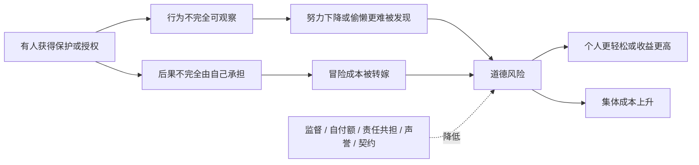
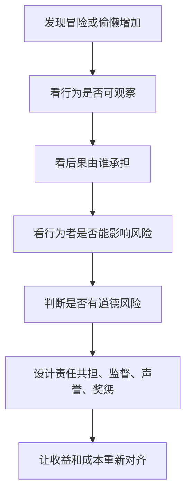

## 博弈思维筑基课: 道德风险
  
### 作者  
digoal  
  
### 日期  
2026-05-12
  
### 标签  
道德风险 , 信息不对称 , 责任共担 , 风险转嫁 , 激励机制
  
----  
  
## 背景

> 面向对象: 初中生到高中生  
> 核心问题: 为什么有人不用承担全部后果时，会更敢冒险、更容易偷懒或更少爱惜公共资源？  
> 先说结论: 道德风险是信息不对称和责任分离导致的行为扭曲: 当一个人做选择，却不用承担全部后果，或别人很难观察他的努力程度时，他就更可能冒险、偷懒或把成本转嫁给别人。

## 一张图先看懂



## 求真讲法

### 它到底说了什么

道德风险，说的是一种“后果不完全由行为者承担”带来的行为变化。

它的典型结构是:

> 一个人知道自己的行为细节，别人看不清；同时，他不用承担全部后果。于是他更可能少努力、多冒险，或不珍惜别人承担成本的资源。

比如一个同学借了别人的自行车。如果车坏了完全由车主自己修，借车的人可能就没那么小心。不是他一定坏，而是风险结构变了: 小心的收益不全归他，粗心的成本也不全由他承担。

道德风险里的“道德”不是单纯骂人品，而是说制度安排改变了人的行为诱因。

### 它是怎么来的

道德风险常见于保险、代理、雇佣、借用、公共资源和团队合作。

它通常发生在一个关系建立之后:

```text
关系建立前:
  逆向选择问题更突出
  难点是看不清对方类型或质量

关系建立后:
  道德风险问题更突出
  难点是看不清对方行为或努力
```

比如保险。买保险前，保险公司担心谁风险更高，这是逆向选择。买保险后，投保人如果知道损失大部分由保险赔付，可能更不注意防范，这就是道德风险。

可以这样理解:

```text
行为者自己决策
  |
收益可能归自己
  |
成本部分由别人承担
  |
个人看起来更划算
  |
系统总风险上升
```

### 它依赖哪些假设

道德风险通常依赖这些前提:

| 前提 | 含义 | 如果不成立会怎样 |
|---|---|---|
| 行为不完全可观察 | 别人看不清努力、谨慎或真实操作 | 如果行为完全透明，偷懒和冒险更难 |
| 后果不完全自担 | 损失由保险、团队、组织或公共系统分担 | 如果全部后果由本人承担，风险会下降 |
| 行为者能改变风险 | 更努力或更谨慎会降低损失 | 如果行为不影响结果，就不是道德风险 |
| 监督有成本 | 不能时时检查每个行为 | 如果监督免费且准确，问题较弱 |
| 奖惩没有对齐 | 好行为没有足够奖励，坏行为没有足够代价 | 如果责任和收益对齐，道德风险会减少 |
| 关系已经建立 | 保护、授权、委托或保险已经生效 | 如果发生在选择对象之前，更像逆向选择 |

一句话判断:

```text
如果一个人:
  能影响风险或努力
  但别人难以观察他的行为
  且他不用承担全部后果
那么道德风险就可能出现。
```

### 常见误解

**误解一: 道德风险就是这个人道德差。**  
不完全对。人品会影响行为，但道德风险首先是制度和激励问题: 后果承担不完整，行为就容易扭曲。

**误解二: 有保险、有保护就一定不好。**  
不对。保险和保护能分担真实风险，帮助人们抵御灾难。问题是保护太完整、责任太弱时，行为可能变得更冒险。

**误解三: 加强监督就能彻底解决。**  
不一定。监督有成本，也可能伤害信任。更好的办法通常是监督、责任共担、声誉和激励结合。

**误解四: 道德风险只发生在金融或保险里。**  
不对。小组作业、借东西、公共设施、公司管理、平台治理都可能出现。

## 求存讲法

### 它有什么用

理解道德风险，可以帮你看懂很多“为什么有人被保护后反而更不谨慎”的现象。

比如:

- 小组作业里，反正有人兜底，某些人就少做。
- 公司里，奖金只看短期收益，亏损由公司承担，有人就更敢冒险。
- 公共设施没人追责，有人就不爱惜。
- 平台退款规则太宽松，有人就滥用。
- 借来的东西坏了不用赔，有人就不小心使用。

这些不是单纯的“坏人问题”，而是责任和后果没有对齐。

### 它怎么迁移到熟悉领域



| 场景 | 道德风险 | 改进机制 |
|---|---|---|
| 小组作业 | 反正有人兜底，所以少做 | 个人贡献记录和评分 |
| 借用物品 | 损坏不用赔，所以不爱惜 | 押金、赔偿规则 |
| 保险 | 损失有人赔，所以少防范 | 自付额、风险分级 |
| 公司项目 | 成功归个人，失败由组织承担 | 风险审核、长期考核 |
| 公共设施 | 维护成本由大家承担 | 监控、赔偿、公共教育 |

### 它的适用范围和边界

适用时:

- 一方被委托、保护、保险或授权。
- 行为细节难以完全观察。
- 行为者能影响风险或努力程度。
- 后果由别人、组织或集体承担一部分。
- 责任和收益没有对齐。

要谨慎时:

- 失败不是偷懒或冒险，而是能力不足。
- 风险不是行为者能控制的。
- 过度追责会让人不敢尝试合理创新。
- 监督成本高于风险损失。
- 责任共担不能把弱者推向无法承受的风险。

### 正例: 怎么用它提升能力

**例子: 防止小组作业里的兜底依赖。**

一个小组里，A 总是最后帮大家整合。几次之后，B 和 C 可能觉得: “反正 A 会修，我晚一点、粗一点也没关系。”这就是道德风险。

改法不是让 A 继续忍，也不是简单骂 B 和 C，而是调整机制:

- 每个人负责的模块单独署名。
- 迟交内容不保证进入最终版本。
- 展示时每个人讲自己负责的部分。
- 同伴评价影响个人分数。
- 如果确实遇到困难，必须提前说明并请求调整。

这样，偷懒成本回到行为者身上，认真者不再无限兜底，合作更稳定。

### 反例: 前提不成立会怎样

**反例: 把失败都当成道德风险。**

一个同学负责做数据图表，但最终图表质量很差。小组认为他“反正有人会改，所以故意偷懒”。后来发现，他是真的不会用工具，也不知道图表标准。

这里失败的前提是: “行为者能通过努力控制结果”。如果问题是能力不足或信息不足，单纯加惩罚会让人更害怕。

正确做法应先给模板、示范和检查点。如果他有能力却仍反复不做，再考虑道德风险和责任机制。

## 思考

道德风险最重要的启发，是让我们看到保护和责任之间的张力。

没有保护，人会被一次坏运气击垮。  
保护太完整，人可能把风险推给别人。  
没有信任，合作成本太高。  
信任没有边界，认真者容易被消耗。

所以好的机制不是取消保险、取消兜底、取消保护，而是设计责任共担:

```text
真实灾难有人帮
可控风险自己担一部分
努力过程能被看见
长期行为影响声誉
改正错误有路径
故意转嫁成本有代价
```

你可以继续追问:

1. 这个人是否能控制风险或努力程度？
2. 他的行为是否难以被观察？
3. 成功收益和失败成本分别由谁承担？
4. 现在的保护是否让他更敢冒险或偷懒？
5. 怎样在保护弱者和防止滥用之间取得平衡？

## 最后记住

1. 道德风险是后果承担不完整导致的行为扭曲。
2. 它通常发生在保险、委托、授权、兜底或保护关系建立之后。
3. 它不等于单纯道德差，而是责任、信息和激励没有对齐。
4. 解决道德风险，需要行为可观察、责任共担、奖惩对齐和声誉机制。
5. 也要避免过度追责，不能把能力不足、不可控风险都误判成偷懒或冒险。

## 参考资料

- Kenneth J. Arrow, "Uncertainty and the Welfare Economics of Medical Care", American Economic Review, 1963: 讨论医疗保险、信息不对称和道德风险的重要论文。
- Mark V. Pauly, "The Economics of Moral Hazard", American Economic Review, 1968: 道德风险经济学讨论的经典文献。
- Bengt Holmstrom, "Moral Hazard and Observability", Bell Journal of Economics, 1979: 讨论行为不可观察时的激励契约问题。
- Jean-Jacques Laffont and David Martimort, *The Theory of Incentives*, Princeton University Press, 2002: 激励理论教材，系统讨论委托代理和道德风险。
- Hal R. Varian, *Intermediate Microeconomics*: 中级微观经济学教材，对信息不对称、道德风险和激励机制有清晰讲解。
  
#### [PostgreSQL 解决方案集合](../201706/20170601_02.md "40cff096e9ed7122c512b35d8561d9c8")
  
  
#### [德哥 / digoal's Github - 公益是一辈子的事.](https://github.com/digoal/blog/blob/master/README.md "22709685feb7cab07d30f30387f0a9ae")
  
  
#### [About 德哥](https://github.com/digoal/blog/blob/master/me/readme.md "a37735981e7704886ffd590565582dd0")
  
  

  
