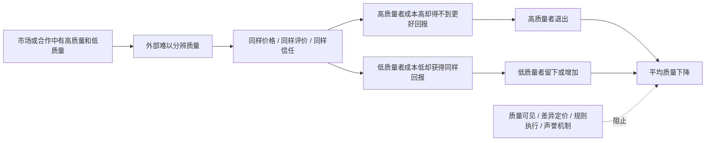
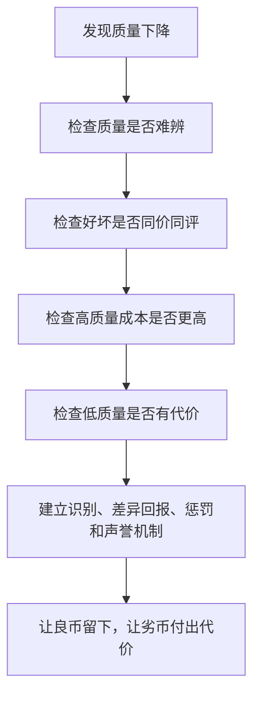

## 博弈思维筑基课: 劣币驱逐良币
  
### 作者  
digoal  
  
### 日期  
2026-05-12
  
### 标签  
劣币驱逐良币 , 逆向选择 , 质量识别 , 格雷欣法则 , 评价机制
  
----  
  
## 背景

> 面向对象: 初中生到高中生  
> 核心问题: 为什么有些环境里，低质量者反而越来越多，高质量者却慢慢退出？  
> 先说结论: “劣币驱逐良币”原本来自货币现象，后来常用来比喻一种筛选失灵: 当好坏难辨、价格或评价被压平、低质量成本更低时，低质量者更愿意留下，高质量者反而退出。

## 一张图先看懂



## 求真讲法

### 它到底说了什么

“劣币驱逐良币”最早对应的是格雷欣法则。简单说，当两种实际价值不同的货币被法律规定成同样面值时，人们更愿意把实际价值低的货币拿出去花，把实际价值高的货币藏起来、熔掉或退出流通。

后来人们把它迁移到更广的场景，用来说明:

> 如果高质量和低质量被当成一样对待，而高质量成本更高，那么高质量者会觉得不划算，低质量者反而更容易留下。

比如内容平台上，如果深度文章和标题党都按点击量奖励，而标题党成本更低、点击更快，那么认真创作者可能慢慢退出，低质内容反而增多。

它不是说“坏的一定打败好的”，而是说在某些规则下，坏的更适合生存。

### 它是怎么来的

这个现象背后通常有三步:

```text
第一步: 好坏质量不同，但外部难以识别。
第二步: 市场或规则把它们按同样价格、同样评价、同样待遇处理。
第三步: 高质量者成本高、回报低，退出；低质量者成本低、回报相对高，留下。
```

它和逆向选择关系很近。逆向选择强调“信息不对称导致高质量退出”；劣币驱逐良币更强调“低质量者在错误规则下挤走高质量者”。

| 现象 | 核心机制 | 典型结果 |
|---|---|---|
| 逆向选择 | 信息不对称，看不清质量 | 高质量被低估并退出 |
| 劣币驱逐良币 | 低质和高质被同样对待 | 低质量挤出高质量 |
| 道德风险 | 不承担全部后果 | 更敢冒险或偷懒 |
| 搭便车 | 不贡献也能享受 | 贡献不足 |

### 它依赖哪些假设

“劣币驱逐良币”要成立，通常依赖这些前提:

| 前提 | 含义 | 如果不成立会怎样 |
|---|---|---|
| 质量存在差异 | 有高质量和低质量 | 如果质量都一样，就谈不上驱逐 |
| 质量难以识别 | 外部人看不清谁更好 | 如果质量清楚，良币可获得更高回报 |
| 评价或价格被压平 | 好坏得到类似回报 | 如果能差异定价，良币未必退出 |
| 高质量成本更高 | 认真、真实、合规需要更多成本 | 如果高质量成本不高，退出压力较小 |
| 低质量有短期优势 | 更便宜、更快、更会包装 | 低质量更容易扩张 |
| 缺少惩罚和筛选 | 造假、低质、偷工减料代价低 | 如果低质有代价，驱逐会减弱 |

一句话判断:

```text
如果一个系统:
  好坏难辨
  好坏同价或同评价
  好的成本更高
  差的没有足够代价
那么劣币驱逐良币就容易发生。
```

### 常见误解

**误解一: 劣币驱逐良币说明坏东西天然更强。**  
不对。坏东西不是天然更强，而是在特定规则下成本更低、回报差不多，所以更容易留下。

**误解二: 只要提高道德要求就能解决。**  
不一定。如果规则继续奖励低质、压低高质回报，道德要求会被消耗。

**误解三: 便宜一定是劣币。**  
不对。低价可能来自效率提升，也可能来自偷工减料。关键看质量和成本是否真实。

**误解四: 良币退出就是不够坚持。**  
不一定。如果长期高成本低回报，退出可能是理性选择。问题在规则，不只在个人。

## 求存讲法

### 它有什么用

理解这个现象，可以帮你看懂很多“为什么环境越来越差”的问题。

比如:

- 内容平台只奖励点击，深度内容被标题党挤出。
- 小组作业不区分贡献，认真者被偷懒者挤出。
- 市场只看低价，合规企业被偷工减料者挤出。
- 招聘只看包装，真能力者被会包装者挤出。
- 社群只看活跃度，高质量讨论被刷屏灌水挤出。

这些问题都不是简单的“坏人太多”，而是系统没有让质量差异被看见。

### 它怎么迁移到熟悉领域



| 场景 | 劣币表现 | 良币为何退出 | 改进机制 |
|---|---|---|---|
| 内容平台 | 标题党、搬运、低质爆款 | 深度创作成本高但回报低 | 完读率、收藏、可信来源 |
| 小组合作 | 偷懒者共享成绩 | 认真者被平均评价 | 贡献记录、个人评分 |
| 商品市场 | 偷工减料低价竞争 | 合规产品显得贵 | 质检、认证、赔偿 |
| 招聘 | 包装强于能力 | 实干者被低估 | 作品集、试用任务 |
| 社群讨论 | 刷屏、情绪化发言 | 高质量成员离开 | 版规、审核、声誉 |

### 它的适用范围和边界

适用时:

- 系统中存在明显质量差异。
- 外部人难以判断真实质量。
- 评价、价格或奖励不能区分质量。
- 高质量生产成本更高。
- 低质量没有足够惩罚。

要谨慎时:

- 所谓“劣币”只是新形式，不一定低质量。
- 高质量标准可能被少数人垄断定义。
- 差异评价机制可能误伤新人和弱者。
- 低价可能来自技术进步，不一定来自偷工减料。
- 过度筛选会提高进入门槛，减少多样性。

### 正例: 怎么用它提升能力

**例子: 防止班级共享资料库变低质。**

如果共享资料库只看上传数量，不看质量，大家可能上传重复、错误、低价值资料。认真整理的人花很多时间，却和随便上传的人得到同样评价。久而久之，认真者会减少贡献。

改进方法是让质量差异可见:

- 上传资料必须标注章节、来源、适用场景。
- 每周由两人校对并标记高质量资料。
- 高质量资料署名进入精编版。
- 错误资料会被退回修改。
- 长期低质上传不计入贡献。

这样，低质不再能和高质拿同样回报，认真贡献才有动力留下。

### 反例: 前提不成立会怎样

**反例: 把新方法误判成劣币。**

一个同学用很短的视频讲清楚数学题，另一个同学觉得“短视频不如长文章严肃”，于是说短视频是劣币，会驱逐良币。

这可能是误判。判断劣币不能只看形式短不短、包装新不新，而要看它是否降低真实质量、是否靠误导获得回报、是否挤走更高质量内容。

如果短视频确实讲得准确、清楚、节省时间，它可能是更高效的良币，而不是劣币。

这里失败的前提是: “低质量”。没有证明质量低，就不能把新形式直接贴上劣币标签。

## 思考

“劣币驱逐良币”最值得警惕的地方，是它说明坏环境会改变好人的选择。

很多时候，不是没有高质量者，而是他们发现:

```text
认真做和随便做回报一样
真实能力和包装能力回报一样
合规经营和偷工减料价格一样
深度内容和标题党流量一样
```

如果这种情况持续，良币退出并不奇怪。真正要问的是:

- 质量是否可见？
- 高质量是否有回报？
- 低质量是否有代价？
- 评价机制是否奖励了表面指标？
- 有没有给新人成长空间，而不是只保护既得利益者？

成熟的治理不是简单喊“支持良币”，而是设计一个让良币活得下去、让劣币占不到便宜的系统。

## 最后记住

1. 劣币驱逐良币不是坏东西天然更强，而是坏规则让低质量更有生存优势。
2. 它通常需要好坏难辨、同价同评、高质量成本高、低质量代价低这些前提。
3. 它和逆向选择密切相关: 信息不对称会让高质量者被低估并退出。
4. 解决它要让质量可见、回报差异化、低质有代价，同时避免误伤新人和创新形式。
5. 判断劣币不能只看形式或价格，要看真实质量、真实成本和是否靠规则漏洞获利。

## 参考资料

- Thomas Gresham / Henry Dunning Macleod, "Gresham's Law": “劣币驱逐良币”货币现象的经典表述通常称为格雷欣法则。
- George A. Akerlof, "The Market for Lemons", Quarterly Journal of Economics, 1970: 信息不对称导致低质量商品挤出高质量商品的经典论文。
- Michael Spence, "Job Market Signaling", Quarterly Journal of Economics, 1973: 信号理论解释高质量者如何通过可信信号避免被低估。
- Joseph E. Stiglitz, "The Theory of Screening, Education, and the Distribution of Income", American Economic Review, 1975: 筛选理论讨论如何区分不同质量和能力。
- Hal R. Varian, *Intermediate Microeconomics*: 中级微观经济学教材，对信息不对称、逆向选择和市场筛选有系统讲解。
  
#### [PostgreSQL 解决方案集合](../201706/20170601_02.md "40cff096e9ed7122c512b35d8561d9c8")
  
  
#### [德哥 / digoal's Github - 公益是一辈子的事.](https://github.com/digoal/blog/blob/master/README.md "22709685feb7cab07d30f30387f0a9ae")
  
  
#### [About 德哥](https://github.com/digoal/blog/blob/master/me/readme.md "a37735981e7704886ffd590565582dd0")
  
  

  
