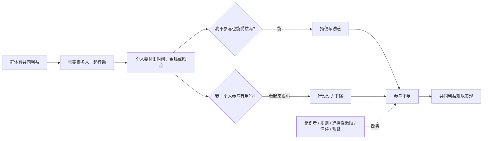
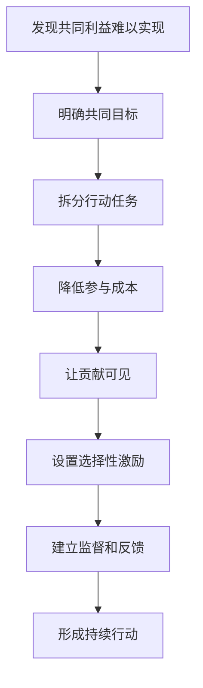

## 博弈思维筑基课: 集体行动困境
  
### 作者  
digoal  
  
### 日期  
2026-05-12
  
### 标签  
集体行动 , 公共资源 , 搭便车 , 组织成本 , 共同利益
  
----  
  
## 背景

> 面向对象: 初中生到高中生  
> 核心问题: 为什么一群人明明有共同利益，却常常组织不起来、行动不起来？  
> 先说结论: 集体行动困境是“个人理性不等于集体理性”在群体组织中的典型现象: 大家都希望公共好处出现，但每个人都可能觉得自己贡献太小、成本太高、别人可能搭便车，结果共同利益难以变成共同行动。

## 一张图先看懂



## 求真讲法

### 它到底说了什么

集体行动困境，说的是这样一种现象:

> 一群人有共同利益，但实现这个利益需要大家一起付出。问题是，每个个人都可能想少付出、等别人行动，或者觉得自己一个人改变不了结果。于是共同利益存在，集体行动却很难发生。

比如全班都希望教室安静、干净、有高质量共享资料。但安静需要每个人少说话，干净需要有人值日，资料需要有人整理。如果大家都想“别人会做吧”“我一个人不做也没关系”，最后公共好处就很难稳定出现。

这不是说大家不想要好结果，而是“想要结果”和“愿意组织行动”之间隔着成本、信任和协调。

### 它是怎么来的

集体行动困境常常由几个机制叠加而成。

第一，**个人贡献看起来很小**。  
群体越大，个人越容易觉得“少我一个也没差”。

第二，**公共好处难以排除不参与者**。  
如果行动成功，不参与的人也能享受成果，就会出现搭便车。

第三，**组织行动有成本**。  
要通知、开会、分工、监督、处理争议，这些都需要时间和精力。

第四，**信任不足**。  
你担心自己付出了，别人不付出；别人也担心你不付出。

可以用一个简单逻辑看:

```text
共同利益很大
  |
但个人贡献成本明确
  |
个人影响看起来很小
  |
不参与也可能享受成果
  |
很多人选择观望
  |
集体行动失败
```

它和相关概念的区别:

| 现象 | 关注重点 | 一句话区别 |
|---|---|---|
| 搭便车问题 | 个人不贡献也能享受 | 行为动机 |
| 公共品困境 | 公共品为什么供给不足 | 物品特征 |
| 集体行动困境 | 群体为什么组织不起来 | 组织过程 |
| 公地悲剧 | 公共资源为什么被过度使用 | 资源消耗 |

### 它依赖哪些假设

集体行动困境通常依赖这些前提:

| 前提 | 含义 | 如果不成立会怎样 |
|---|---|---|
| 存在共同利益 | 群体都能从行动成功中受益 | 如果没有共同利益，就不是集体行动问题 |
| 行动需要多人参与 | 单个人无法独立完成 | 如果一个人能完成，组织难度较低 |
| 参与有成本 | 时间、金钱、精力、风险或机会成本 | 如果几乎无成本，参与更容易 |
| 成果具有公共性 | 不参与的人也可能享受成果 | 如果能排除不参与者，搭便车减少 |
| 个人影响有限 | 每个人觉得自己不是关键 | 如果个人影响很大，动力更强 |
| 缺少组织机制 | 没有分工、监督、激励和信任机制 | 如果组织成熟，行动更容易发生 |

一句话判断:

```text
如果一个群体:
  有共同利益
  需要多人付出
  但个人贡献成本明确、影响看似很小
  且不参与者也能享受成果
那么集体行动困境就容易出现。
```

### 常见误解

**误解一: 大家有共同利益，就会自然行动。**  
不对。共同利益不等于共同组织。行动需要协调、信任、分工和激励。

**误解二: 不参与的人一定自私。**  
不一定。有些人不参与是因为信息不足、能力不足、时间不够，或者不相信行动会成功。

**误解三: 群体越大，力量一定越强。**  
不一定。群体越大，协调成本和搭便车问题也可能越大。

**误解四: 解决方法就是喊口号。**  
不够。口号能激发情绪，但长期行动需要组织结构和持续激励。

## 求存讲法

### 它有什么用

理解集体行动困境，可以帮你看懂很多“大家都想要，但没人推进”的事情:

- 班级都想安静，但没人愿意提醒破坏纪律的人。
- 小区都想改善环境，但业主会议很难凑齐。
- 用户都想开源项目稳定维护，但很少有人贡献代码、文档或资金。
- 大家都想减少污染，但单个企业或个人不想先承担成本。
- 团队都想流程更规范，但没人愿意写文档、建模板、做维护。

这些问题的难点不只是“有没有共同目标”，而是“谁来组织，谁来付出，谁来监督，谁来承担失败成本”。

### 它怎么迁移到熟悉领域



| 场景 | 集体行动难点 | 改进机制 |
|---|---|---|
| 班级卫生 | 人人受益，值日辛苦 | 轮值、记录、公开反馈 |
| 共享资料 | 都想使用，整理费时 | 分工、署名、贡献评分 |
| 社区治理 | 参与会议成本高 | 线上投票、代表制、议题清单 |
| 开源项目 | 用户多，维护者少 | 贡献指南、赞助、issue 模板 |
| 环境保护 | 成本在个人，收益在群体 | 监管、补贴、碳价、公共监督 |

### 它的适用范围和边界

适用时:

- 共同目标需要多人协作。
- 不参与者也能享受成果。
- 个人参与成本明确。
- 群体规模较大或成员分散。
- 缺少组织者、规则、激励和监督。

要谨慎时:

- 所谓“共同利益”并没有被大家真正同意。
- 行动成本在不同人身上不公平。
- 少数人用集体名义要求别人牺牲。
- 参与者能力和资源差异很大。
- 组织成本可能高于行动收益。

### 正例: 怎么用它提升能力

**例子: 让班级错题库从口号变成行动。**

全班都知道错题库有用，但如果只是说“大家都来贡献”，很可能只有少数人整理。因为每个人都能下载，整理却要花时间。

可以这样设计:

- 每周每组负责一个章节。
- 每人只提交一道高质量错题，降低单人成本。
- 统一模板，减少整理成本。
- 贡献者署名，优秀解析展示。
- 每月轮换校对组。
- 长期不贡献者不能优先获得精编版。

这样，共同目标被拆成小任务，贡献变得可见，搭便车有代价，集体行动才更可能持续。

### 反例: 前提不成立会怎样

**反例: 用集体行动压制合理差异。**

一个班级说“为了集体荣誉，所有人都必须参加周末额外训练”。但有些同学已经有家庭安排，有些同学身体不适，还有些同学并不参加相关比赛。

如果把不参加的人都说成“缺乏集体行动意识”，就是误用。

这里失败的前提是: “共同利益被所有人真正认可，且成本分担公平”。如果目标不是大家共同同意的，或者成本主要压在一部分人身上，就不能简单用集体行动困境来要求服从。

## 思考

集体行动困境最值得思考的地方，是它揭示了“知道应该做”和“真的组织起来做”之间的距离。

很多事情失败，不是因为没人懂道理:

```text
大家都知道环保重要
大家都知道公共卫生重要
大家都知道文档重要
大家都知道班级秩序重要
```

真正的问题是:

- 谁先行动？
- 谁持续维护？
- 谁承担成本？
- 谁处理搭便车？
- 谁解决争议？
- 谁保证行动不是少数人牺牲？

成熟的集体行动，不是靠一时热情，而是靠组织能力。要把大目标拆成小任务，把隐性贡献变成可见贡献，把一次性热情变成重复机制，把不公平成本变成可讨论的分担规则。

你可以继续追问:

1. 这个目标真的是共同利益吗？
2. 谁受益最多，谁承担成本最多？
3. 个人不参与是否仍能享受成果？
4. 如何降低参与门槛，让更多人能贡献？
5. 有没有监督、反馈、奖励和退出机制？

## 最后记住

1. 集体行动困境是群体有共同利益，但组织行动很难的现象。
2. 它常由搭便车、个人影响感低、组织成本高和信任不足共同造成。
3. 群体越大，不一定越容易行动，协调成本也会更高。
4. 解决它不能只靠口号，要靠分工、激励、监督、反馈和公平分担。
5. 也要警惕用“集体利益”压制合理差异，真正的共同利益需要被讨论和确认。

## 参考资料

- Mancur Olson, *The Logic of Collective Action*, Harvard University Press, 1965: 集体行动、公共利益和搭便车问题的经典著作。
- Elinor Ostrom, *Governing the Commons*, Cambridge University Press, 1990: 研究社区如何通过规则、监督和渐进惩罚实现公共资源治理。
- Russell Hardin, *Collective Action*, Johns Hopkins University Press, 1982: 系统讨论集体行动的逻辑和组织问题。
- Paul A. Samuelson, "The Pure Theory of Public Expenditure", Review of Economics and Statistics, 1954: 公共品理论经典论文，解释公共利益供给难题。
- Robert Gibbons, *Game Theory for Applied Economists*, Princeton University Press, 1992: 用博弈论解释公共品、搭便车和多人策略互动。
  
#### [PostgreSQL 解决方案集合](../201706/20170601_02.md "40cff096e9ed7122c512b35d8561d9c8")
  
  
#### [德哥 / digoal's Github - 公益是一辈子的事.](https://github.com/digoal/blog/blob/master/README.md "22709685feb7cab07d30f30387f0a9ae")
  
  
#### [About 德哥](https://github.com/digoal/blog/blob/master/me/readme.md "a37735981e7704886ffd590565582dd0")
  
  

  
