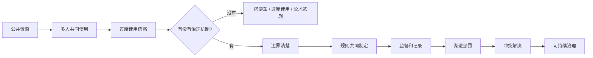
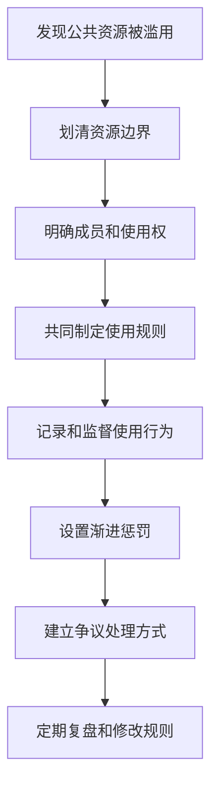

## 博弈思维筑基课: 公地治理成功案例
  
### 作者  
digoal  
  
### 日期  
2026-05-12
  
### 标签  
公地治理 , 公共资源 , 奥斯特罗姆 , 规则监督 , 渐进惩罚
  
----  
  
## 背景

> 面向对象: 初中生到高中生  
> 核心问题: 公共资源一定会被用坏吗？有没有办法让大家长期共同使用、共同维护？  
> 先说结论: 公地治理成功案例说明，公地悲剧不是必然命运。群体可以通过清晰边界、共同规则、监督、渐进惩罚、冲突解决和参与式决策，把公共资源从“人人想多占”变成“人人有规则地共享”。

## 一张图先看懂



## 求真讲法

### 它到底说了什么

“公地治理成功案例”研究的是一个重要问题:

> 当一片草地、一条河流、一座森林、一个渔场、一个共享资料库属于很多人共同使用时，大家有没有可能不靠完全私有化、不靠单纯外部强制，也能长期管好它？

答案是: 有可能，但需要制度。

诺贝尔经济学奖得主 Elinor Ostrom 研究了很多真实社区，发现一些群体能长期治理公共资源。它们不是靠每个人永远无私，也不是靠没人监管的自觉，而是靠一套清楚、可执行、可调整的规则。

比如一片公共草地，如果每个牧民都想多放羊，草地会退化。但如果村民共同规定:

- 谁有资格放羊。
- 每家最多放多少。
- 哪些季节不能放。
- 谁负责巡查。
- 违规第一次警告，重复违规逐步加重惩罚。
- 有争议时找谁处理。

这片草地就可能长期维持。

### 它是怎么来的

公地悲剧的基本逻辑是:

```text
公共资源大家能用
  |
个人多用一点，收益归自己
  |
资源退化的成本由大家分摊
  |
每个人都有过度使用诱惑
  |
资源被耗尽或变差
```

公地治理成功案例的逻辑，是把这条链条改掉:

```text
明确谁能使用
  |
规定每个人怎么使用
  |
让使用行为可被看见
  |
违规有逐步加重的代价
  |
守规则的人不吃亏
  |
资源长期可持续
```

关键不是一句“大家要有公德心”，而是让规则进入日常行动。

### 它依赖哪些假设

公地治理能成功，通常依赖这些条件:

| 前提 | 含义 | 如果不成立会怎样 |
|---|---|---|
| 资源边界清楚 | 知道治理的是哪片草地、哪条河、哪个资料库 | 边界不清会导致外人随意进入或责任不明 |
| 成员边界清楚 | 知道谁有使用权、谁有维护义务 | 不知道谁算成员，就难以分担责任 |
| 规则符合本地情况 | 规则要适合资源特点和使用者生活 | 外部硬套规则可能失效 |
| 使用行为可监督 | 能看见谁过度使用、谁违规 | 看不见行为，规则难执行 |
| 惩罚渐进且可信 | 小错轻罚，屡犯重罚 | 只重罚会激化冲突，只轻罚没有威慑 |
| 冲突能低成本解决 | 有地方处理争议 | 争议无法解决会破坏信任 |
| 使用者能参与制定规则 | 受规则影响的人有发言权 | 规则缺少正当性，执行会困难 |

一句话判断:

```text
公地治理不是靠一句自觉，
而是靠:
  清楚边界
  合适规则
  可见行为
  可信惩罚
  低成本冲突解决
  成员参与决策
```

### 常见误解

**误解一: 公地一定会悲剧。**  
不对。没有治理机制的公地容易悲剧，但有些社区能通过规则长期治理公共资源。

**误解二: 只有私有化才能解决公地问题。**  
不一定。私有化是一种办法，但社区自治、共同规则、政府监管和混合治理也可能有效。

**误解三: 只要政府强管就能解决。**  
不一定。如果外部规则不了解本地情况，或者执行成本太高，也可能失败。

**误解四: 成功治理靠大家品德高。**  
不完整。品德有帮助，但长期成功通常还需要制度、监督、惩罚和冲突处理机制。

## 求存讲法

### 它有什么用

这类案例最有用的地方，是告诉我们: 面对公共资源问题，不要只在两个极端之间选择。

```text
极端一: 完全靠自觉
极端二: 完全靠外部强制
```

很多时候，更有效的是混合治理:

- 成员共同制定规则。
- 规则和本地情况匹配。
- 有人负责监督。
- 违规有渐进惩罚。
- 有办法处理争议。
- 上级制度承认本地规则的合法性。

这套思路可以迁移到班级、宿舍、社区、开源项目、共享文档、团队知识库等场景。

### 它怎么迁移到熟悉领域



| 场景 | 公共资源 | 治理机制 |
|---|---|---|
| 班级错题库 | 共享资料 | 上传模板、署名、校对轮值、低质退回 |
| 宿舍公共空间 | 卫生和安静环境 | 轮值、安静时段、争议处理 |
| 社区停车位 | 公共车位 | 成员登记、使用时限、违规记录 |
| 开源项目 | 代码和文档 | 贡献规范、review、维护者权限 |
| 共享实验室 | 仪器设备 | 预约、记录、损坏赔偿、培训准入 |

### 它的适用范围和边界

适用时:

- 资源由一群人共同使用。
- 资源会因过度使用或维护不足而变差。
- 成员之间有一定重复互动。
- 使用行为能被观察和记录。
- 群体有能力制定和执行规则。

要谨慎时:

- 成员权力差距太大，规则可能被强者操控。
- 外部人能随意进入，成员规则难执行。
- 资源变化太快，规则需要频繁调整。
- 监督成本太高，超过资源价值。
- 所谓“共同规则”没有真正让受影响者参与。

### 正例: 怎么用它提升能力

**例子: 治理班级共享资料库。**

班级有一个共享资料库。开始时大家都能上传和下载，但慢慢出现问题: 有人上传重复资料，有人上传错误答案，有人只下载不贡献，认真整理的人越来越少。

可以按公地治理思路改造:

- **资源边界**: 资料库只收本学期课程相关资料。
- **成员边界**: 班级成员都能下载，也都有贡献义务。
- **共同规则**: 上传必须注明章节、来源、适用场景。
- **监督机制**: 每周两人轮值校对。
- **渐进惩罚**: 第一次低质上传退回修改，多次低质不计贡献。
- **冲突解决**: 对资料是否合格有争议，由轮值组和课代表共同判断。
- **定期复盘**: 每月删除过期资料，更新模板。

这样，资料库不再只靠少数人牺牲，而是变成有边界、有规则、有反馈的公共资源。

### 反例: 前提不成立会怎样

**反例: 没有成员边界的共享空间。**

假设一个社区花钱维护公共花园，但外来人员可以随意进入、采摘、踩踏，社区成员却要承担全部维护成本。即使社区内部规则再清楚，也可能治理失败。

这里失败的前提是: “成员边界清楚”。如果谁都能使用、但只有部分人承担维护成本，搭便车和过度使用就很难控制。

这不代表一定要完全封闭，而是说明治理必须回答: 谁能使用？谁来维护？外部使用者是否也要遵守规则或承担成本？

## 思考

公地治理成功案例最重要的启发，是它反驳了一个简单化想法:

> 公共资源不是只能走向悲剧，也不是只能靠私有化或强制命令。

真正难的是制度细节。一个公共资源能否长期维持，往往取决于这些看似朴素的问题:

- 边界是否清楚？
- 使用者是否参与制定规则？
- 规则是否适合本地情况？
- 违规是否能被看见？
- 惩罚是否渐进、可信、不过度？
- 争议能否低成本解决？
- 规则能否随着环境变化而调整？

这也提醒我们，治理不是一次性写一条规定，而是一个持续学习过程。好的规则不是天上掉下来的，而是在使用者的经验、冲突、修正和信任中慢慢形成的。

你可以继续追问:

1. 这个公共资源的边界在哪里？
2. 谁有使用权，谁有维护义务？
3. 当前规则是谁制定的，受影响者有没有参与？
4. 违规行为能不能被看见和记录？
5. 惩罚是否渐进，争议是否有解决渠道？

## 最后记住

1. 公地悲剧不是必然命运，缺少治理机制的公地才更容易悲剧。
2. 成功公地治理通常需要清晰资源边界和成员边界。
3. 规则要适合本地情况，并让使用者参与制定，才更容易执行。
4. 监督、渐进惩罚和低成本冲突解决，是维持合作的重要机制。
5. 好治理不是一次性规定，而是持续观察、反馈和调整的过程。

## 参考资料

- Elinor Ostrom, *Governing the Commons*, Cambridge University Press, 1990: 公共池资源治理的经典著作，提出长期成功治理的设计原则。
- Elinor Ostrom, "Beyond Markets and States", Nobel Prize Lecture, 2009: 总结公共资源治理不只依赖市场或国家的研究路径。
- Garrett Hardin, "The Tragedy of the Commons", Science, 1968: 公地悲剧的经典论文，是理解公地治理问题的起点。
- National Research Council, *The Drama of the Commons*, National Academies Press, 2002: 汇集公共资源治理、制度和集体行动研究。
- Mancur Olson, *The Logic of Collective Action*, Harvard University Press, 1965: 解释集体行动、公共利益和搭便车问题的经典著作。
  
#### [PostgreSQL 解决方案集合](../201706/20170601_02.md "40cff096e9ed7122c512b35d8561d9c8")
  
  
#### [德哥 / digoal's Github - 公益是一辈子的事.](https://github.com/digoal/blog/blob/master/README.md "22709685feb7cab07d30f30387f0a9ae")
  
  
#### [About 德哥](https://github.com/digoal/blog/blob/master/me/readme.md "a37735981e7704886ffd590565582dd0")
  
  

  
