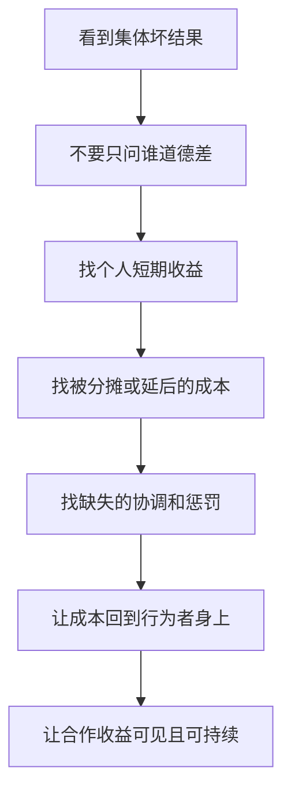

## 博弈思维筑基课: 个人理性不等于集体理性
  
### 作者  
digoal  
  
### 日期  
2026-05-12
  
### 标签  
博弈论 , 个人理性 , 集体理性 , 公共困境 , 制度设计
  
----  
  
## 背景

> 面向对象: 初中生到高中生  
> 核心问题: 为什么每个人都觉得自己没做错，最后大家却一起得到坏结果？  
> 先说结论: 个人理性不等于集体理性，是说每个人从自己角度做出的合理选择，叠加起来可能让整体更差；问题不一定出在人坏，而常常出在规则、激励和协调结构。

## 一张图先看懂


## 求真讲法

### 它到底说了什么

“个人理性不等于集体理性”不是说个人理性没用，也不是说人不该为自己考虑。它真正说的是:

> 在多人互动中，一个选择对单个人是合理的，不代表所有人都这样选以后，对整体仍然是合理的。

比如电影院里，前排有人站起来看得更清楚。对这个人来说，站起来是理性的。但如果每个人都站起来，大家都更累，视野也未必更好。单个人的“聪明选择”，变成了集体的“更差状态”。

博弈论关心的正是这种结构: 我的结果取决于你怎么选，你的结果也取决于我怎么选。只看个人局部利益，可能看不见整体叠加后的后果。

### 它是怎么来的

这个定律来自博弈论对多人决策的基本观察。普通个人决策里，你只要问“我怎样做最好”。但博弈决策里，还要问:

- 如果大家都这么做，会怎样？
- 我的选择会不会改变别人的选择？
- 别人也追求自利时，系统会停在哪里？
- 这个稳定结果是不是整体最优？

用一个简化逻辑看:

```text
单个人看:
  我多拿一点资源 -> 我更好

所有人都这样看:
  每个人都多拿一点资源
  公共资源被过度使用
  所有人未来都更差
```

这就是公地悲剧的基本逻辑。每个牧民多放一只羊，个人收益归自己；草地退化的成本由大家分摊。于是多放羊对个人有吸引力，但所有人都这样做，草地被毁，大家一起受损。

囚徒困境也类似。每个人背叛都是个人优势策略，但双方都背叛，比双方合作更差。

### 它依赖哪些假设

这条定律要成立，通常需要这些条件:

| 前提 | 含义 | 如果不成立会怎样 |
|---|---|---|
| 参与者互相影响 | 一个人的选择会改变别人的结果 | 如果互不影响，就只是个人选择问题 |
| 存在局部收益 | 单个人采取某行为能获得短期好处 | 如果个人没有收益，行为不会扩散 |
| 成本被分摊或延后 | 坏后果由大家承担，或未来才出现 | 如果成本立即由本人承担，个人会收敛 |
| 缺少协调机制 | 大家难以一起约定更好选择 | 如果能有效协调，集体理性可能实现 |
| 缺少可信惩罚 | 破坏集体利益的人代价不够 | 如果违规成本高，坏行为会减少 |
| 信息不完全 | 人们看不清整体后果或别人选择 | 如果信息透明，协调更容易 |

可以把它写成一个判断式:

```text
如果一种行为:
  对个人有短期好处
  但很多人都这样做会让整体变差
  且缺少协调、约束或补偿机制
那么个人理性就可能变成集体非理性。
```

### 常见误解

**误解一: 个人理性不等于集体理性，所以个人理性是错的。**  
不对。个人理性本身不是错，问题在于互动系统会产生外部后果。真正要改的是规则和协调机制。

**误解二: 只要大家讲奉献，问题就能解决。**  
不一定。如果奉献者总吃亏、破坏者总占便宜，合作很难长期稳定。

**误解三: 集体理性就是牺牲个人。**  
不对。好的集体理性不是压扁个人，而是设计规则，让个人追求自身利益时也不破坏整体。

**误解四: 所有自利行为都会伤害集体。**  
不对。在好的市场、团队或制度里，个人努力可以同时提升整体效率。关键看收益和成本是否对齐。

## 求存讲法

### 它有什么用

这条定律最大的用处，是让你看到很多坏结果背后的结构原因。

班级里如果每个人都想“我只讲一句话没事”，最后自习课会变吵。道路上如果每个人都想“我插队能快一点”，最后拥堵和事故增加。平台上如果每个创作者都想“标题夸张一点能多点点击”，最后内容环境变差，用户信任下降。

这些问题不能只靠骂个人。更有效的问题是:

- 个人为什么觉得这样做划算？
- 成本由谁承担？
- 有没有人看见整体损失？
- 有没有规则让好行为不吃亏？

### 它怎么迁移到熟悉领域

| 场景 | 个人理性 | 集体后果 | 可能的机制修正 |
|---|---|---|---|
| 自习课讲话 | 我只讲一句，影响不大 | 全班变吵 | 明确规则和即时反馈 |
| 小组作业偷懒 | 少做也拿同样分 | 大家都少做 | 记录个人贡献 |
| 公共厨房不清理 | 我省几分钟 | 环境越来越差 | 责任轮值和可见记录 |
| 商家价格战 | 降价抢顾客 | 行业利润一起下降 | 差异化、长期服务、规则约束 |
| 内容平台标题党 | 夸张标题带来点击 | 信任下降 | 奖励满意度和长期留存 |



### 它的适用范围和边界

适用时:

- 多个人行为叠加会改变整体结果。
- 每个人都有短期自利选择。
- 坏后果被分摊、隐藏或延后。
- 缺少有效协调、监督、惩罚或补偿。

要谨慎时:

- 问题主要来自能力不足，不是利益冲突。
- 参与者已经有强信任和长期合作。
- 个人行为不会显著影响整体。
- 所谓“集体利益”被少数人拿来压制合理个人权益。
- 集体目标本身没有经过讨论和同意。

### 正例: 怎么用它提升能力

**例子: 设计一个更好的小组作业规则。**

如果小组作业只看最终总分，偷懒的人可以少付出但分享成果。对个人来说，少做一点可能划算；但如果大家都少做，项目质量下降，所有人都吃亏。

用这条定律分析后，改法不是只说“大家要自觉”，而是调整结构:

- 每个人负责的模块写清楚。
- 每周记录进度。
- 展示时每个人讲自己的部分。
- 同伴评价影响个人分数。

这样，个人理性和集体理性更容易对齐: 想拿好分，就要真实贡献；真实贡献越多，小组整体也越好。

### 反例: 前提不成立会怎样

**反例: 把合理维权误判成集体非理性。**

假设一个学生在小组里承担了大部分任务，于是要求重新分工，并拒绝继续替别人兜底。表面看，他的行为让小组短期进度变慢，好像“个人利益伤害集体”。

但如果原来的规则长期让认真者吃亏、偷懒者获益，那么他的拒绝不是破坏集体，而是在暴露不公平结构。真正的问题不是他“不顾集体”，而是集体原本依赖不合理牺牲维持运转。

这里失败的前提是: “集体目标本身合理且经过公平分担”。如果所谓集体理性建立在少数人长期吃亏上，就不能简单要求个人服从。

## 思考

“个人理性不等于集体理性”最重要的启发，是让我们少一点道德化指责，多一点系统化设计。

当你看到一个坏结果时，可以先暂停判断:

```text
别急着说: 这些人怎么这么差?
先问:
  他们各自面对什么激励?
  谁获得短期好处?
  谁承担长期成本?
  有没有协调机制?
  有没有让破坏者付出代价?
```

真正成熟的解决方式，不是要求每个人都变成圣人，而是设计一种结构: 普通人按自己的合理目标行动时，也不会把整体推坏；愿意合作的人不会总吃亏；破坏规则的人不能长期占便宜。

这也能帮助你理解很多社会制度的意义。交通规则、排队规则、信用记录、环保监管、团队分工、合同责任，本质上都在处理同一个问题: 如何把个人选择和集体后果重新连接起来。

你可以继续追问:

1. 这个坏结果，是个人品质问题，还是激励结构问题？
2. 如果所有人都照这个个人理性行动，会发生什么？
3. 成本是不是被转嫁给了别人或未来？
4. 怎样让好行为不吃亏，坏行为不占便宜？
5. 所谓集体利益是否公平，还是让少数人承担了过多代价？

## 最后记住

1. 个人理性不等于集体理性，指的是局部最优可能合成整体劣解。
2. 囚徒困境、公地悲剧、搭便车和价格战，都是这条定律的典型表现。
3. 关键机制通常是: 个人得到短期好处，成本却由集体分摊或未来承担。
4. 解决方法不是只劝人无私，而是建立协调、监督、惩罚、补偿和可信承诺。
5. 也要警惕滥用“集体理性”压制合理个人权益，真正好的集体理性应当公平分担成本和收益。

## 参考资料

- Garrett Hardin, "The Tragedy of the Commons", Science, 1968: 公地悲剧的经典论文，说明个人理性使用公共资源可能导致集体损害。
- Mancur Olson, *The Logic of Collective Action*, Harvard University Press, 1965: 分析集体行动、搭便车和公共利益供给问题。
- Robert Gibbons, *Game Theory for Applied Economists*, Princeton University Press, 1992: 用囚徒困境、纳什均衡等工具解释个人策略与整体结果的关系。
- Avinash K. Dixit, Susan Skeath, David H. Reiley Jr., *Games of Strategy*, W. W. Norton: 常用博弈论教材，包含囚徒困境、协调、承诺和战略互动案例。
- Elinor Ostrom, *Governing the Commons*, Cambridge University Press, 1990: 研究社区如何通过规则治理公共资源，避免简单陷入公地悲剧。
  
#### [PostgreSQL 解决方案集合](../201706/20170601_02.md "40cff096e9ed7122c512b35d8561d9c8")
  
  
#### [德哥 / digoal's Github - 公益是一辈子的事.](https://github.com/digoal/blog/blob/master/README.md "22709685feb7cab07d30f30387f0a9ae")
  
  
#### [About 德哥](https://github.com/digoal/blog/blob/master/me/readme.md "a37735981e7704886ffd590565582dd0")
  
  

  
