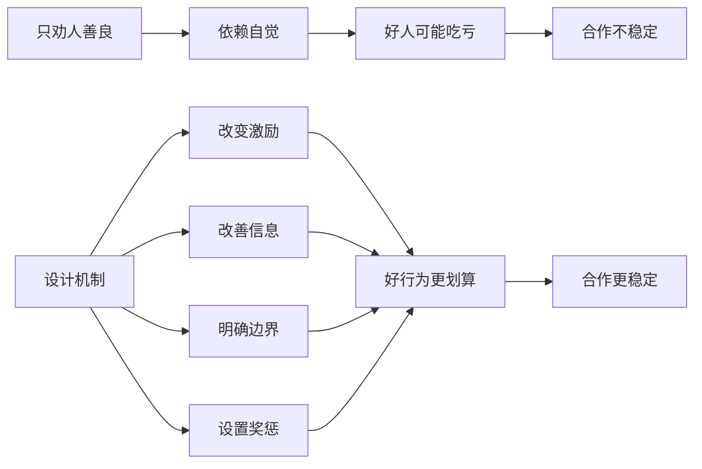
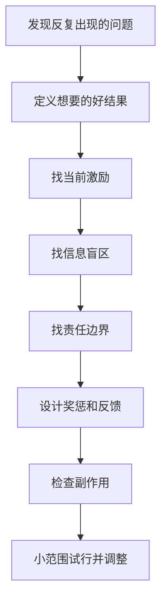

## 博弈思维筑基课: 设计机制，比劝人善良更可靠
  
### 作者  
digoal  
  
### 日期  
2026-05-12
  
### 标签  
博弈论 , 机制设计 , 激励相容 , 道德劝说 , 公共治理
  
----  
  
## 背景

> 面向对象: 初中生到高中生  
> 核心问题: 为什么很多问题靠反复讲道理解决不了，换一套规则却能明显改善？  
> 先说结论: 设计机制，比劝人善良更可靠，不是说善良没用，而是说稳定合作不能只依赖人的自觉；好机制能让正确行为更容易、更划算、更可见，让破坏行为更难占便宜。

## 一张图先看懂



## 求真讲法

### 它到底说了什么

“设计机制，比劝人善良更可靠”是博弈论和机制设计里的高层定律。它的意思是:

> 如果一个系统长期产出坏结果，不要只要求人变好，还要检查规则、激励、信息、边界和奖惩是否把人推向了坏选择。

善良当然重要。愿意合作、诚实、守信的人，是任何系统都需要的。但是，如果一个系统让诚实者吃亏、偷懒者占便宜、贡献者不可见、违规者无代价，那么只靠劝人善良很难持久。

比如小组作业中，老师反复说“大家要团结，要主动”。如果评分仍然只看小组总分，个人贡献不可见，偷懒没有后果，那么搭便车仍然容易发生。

更可靠的做法，是设计机制:

- 分工明确。
- 贡献可见。
- 过程有记录。
- 个人评价和贡献相关。
- 迟交和缺席有后果。
- 遇到困难有求助和修复通道。

这不是取消道德，而是让道德不再单独扛住整个系统。

### 它是怎么来的

博弈论研究多人互动时，会把一个问题拆成:

```text
谁参与?
各自能选什么?
各自知道什么?
每种选择有什么收益和代价?
谁能监督?
谁能惩罚?
谁能退出?
```

当这些条件设计不好时，坏结果会反复出现。机制设计则反过来问:

> 如果我们希望出现某种好结果，应该怎样设计规则，让参与者按照自己的合理目标行动时，也更容易把系统推向好结果？

这就是从“要求人做正确的事”，转向“让正确的事更容易发生”。

一个简单对照:

| 方式 | 核心做法 | 常见问题 |
|---|---|---|
| 劝人善良 | 讲道理、讲责任、讲奉献 | 依赖自觉，容易让认真者长期吃亏 |
| 设计机制 | 改激励、改信息、改规则、改反馈 | 需要理解系统，设计不好会有副作用 |

### 它依赖哪些假设

这条定律要成立，需要一些前提:

| 前提 | 含义 | 如果不成立会怎样 |
|---|---|---|
| 行为受环境影响 | 人会根据规则、成本和收益调整选择 | 如果行为完全不受环境影响，机制作用弱 |
| 机制能改变关键条件 | 能改变激励、信息、边界或奖惩 | 如果机制碰不到关键问题，效果有限 |
| 机制能被执行 | 规则不是口号，有执行和反馈 | 如果执行不了，机制会空转 |
| 目标被定义清楚 | 知道希望鼓励什么、减少什么 | 如果目标混乱，机制会乱导向 |
| 副作用被关注 | 指标不会严重扭曲真实目标 | 如果机制设计错，会制造新问题 |
| 人仍有道德和情感 | 机制不是替代人性，而是约束和支持人性 | 如果只把人当机器，会伤害信任 |

一句话判断:

```text
如果一个好行为:
  被看见
  被奖励
  不让人长期吃亏
而一个坏行为:
  会暴露
  有代价
  不能长期占便宜
那么这个机制更可能稳定地产生好结果。
```

### 常见误解

**误解一: 设计机制就是不相信人。**  
不对。机制不是否定善良，而是保护善良，让好人不必总靠牺牲维持合作。

**误解二: 有机制就不需要道德。**  
不对。机制能降低坏行为收益，但不能替代人的同理心、责任感和判断力。

**误解三: 机制越复杂越高级。**  
不一定。复杂机制会增加理解和执行成本。好机制通常抓住关键行为，尽量简单清楚。

**误解四: 只要奖惩够强，问题就能解决。**  
不一定。过强奖惩可能挤出内在动机，让人只为指标表演，甚至钻规则空子。

## 求存讲法

### 它有什么用

这条定律能帮你把问题从抱怨推进到设计。

看到坏行为，不只问:

```text
这个人为什么不自觉?
```

还要问:

```text
这个系统奖励了什么?
这个系统看不见什么?
谁承担了坏行为成本?
谁承担了好行为成本?
规则有没有执行?
有没有修复和退出机制?
```

这会让你从“批评者”变成“设计者”。

### 它怎么迁移到熟悉领域



| 场景 | 只劝人 | 设计机制 |
|---|---|---|
| 小组作业 | 大家要自觉 | 分工、记录、个人评价 |
| 班级纪律 | 不要讲话 | 明确规则、即时反馈、共同维护 |
| 学习计划 | 我要努力 | 固定时间、测试反馈、错题复盘 |
| 公司质量 | 要重视质量 | 把缺陷率、复购、投诉纳入考核 |
| 平台内容 | 创作者要负责 | 调整推荐指标、惩罚虚假内容 |

### 它的适用范围和边界

适用时:

- 问题反复发生，不是偶然失误。
- 个人劝说效果有限。
- 行为受规则、信息、激励和边界影响。
- 你能改变某些流程、反馈、评价或奖惩。

要谨慎时:

- 问题来自能力不足，需要训练而不是奖惩。
- 问题来自创伤、情绪或关系破裂，需要沟通和支持。
- 机制设计者权力过大，可能把机制变成控制工具。
- 指标太单一，导致人追指标而不追目标。
- 机制执行成本超过问题本身。

### 正例: 怎么用它提升能力

**例子: 改造低效学习小组。**

一个学习小组每周说好互相讲题，但经常变成两个人认真准备，其他人只来听。只劝“大家都要贡献”效果不稳定。

可以设计机制:

- 每人每周必须带一道自己讲得清楚的题。
- 题目提前一天发到共享文档。
- 每次随机抽一人讲解别人的题，检查是否听懂。
- 没准备的人下次不能优先获得整理资料。
- 如果确实有事，可以提前请假并补交。

这个机制让贡献可见，让搭便车有代价，也给临时困难留下修复通道。合作就更容易稳定。

### 反例: 前提不成立会怎样

**反例: 用机制解决能力问题。**

一个学生数学基础差，不会做题。家长设计了严格机制: 每错一题扣零花钱，每天必须刷 100 题。结果学生更焦虑，也更讨厌数学。

这里失败的前提是: “问题主要受激励影响”。真实问题是能力不足和反馈方式错误。此时更需要补概念、拆题型、降低难度、建立正反馈，而不是加重惩罚。

机制设计不是一味加强约束。它要先判断问题性质: 是动机问题、信息问题、能力问题，还是情绪和关系问题。

## 思考

“设计机制，比劝人善良更可靠”最重要的启发，是让你用结构眼光看世界。

很多坏结果不是因为每个人都坏，而是因为系统让好行为太贵、坏行为太便宜:

```text
说真话有风险 -> 大家报喜不报忧
认真贡献不可见 -> 搭便车增加
违规没有代价 -> 规则失去意义
只看短期指标 -> 长期质量被牺牲
退出没有机制 -> 合作变成消耗
```

真正好的机制，不是把人管死，而是让好的选择更自然地出现:

- 让信息更透明。
- 让贡献被看见。
- 让责任有边界。
- 让承诺可验证。
- 让违规有代价。
- 让改正有通道。
- 让退出有规则。

这也提醒我们，机制设计必须有伦理边界。机制可以引导人，但不能把人当成只会响应奖惩的工具。好机制应该同时追求效率、公平、尊严和可持续。

你可以继续追问:

1. 我现在是在劝人，还是在改变结构？
2. 好行为为什么没有稳定发生？
3. 坏行为为什么有利可图？
4. 机制会不会制造新的不公平或副作用？
5. 有没有小范围试行、观察、再调整的办法？

## 最后记住

1. 设计机制不是否定善良，而是保护善良、稳定合作。
2. 只劝人善良容易让好人长期吃亏，机制能让好行为更划算、更可见。
3. 好机制通常同时处理激励、信息、边界、承诺、惩罚和修复通道。
4. 机制不是越复杂越好，要简单、清楚、可执行，并注意副作用。
5. 机制设计也有伦理边界，不能用效率名义伤害公平、尊严和成长。

## 参考资料

- Leonid Hurwicz, "The Design of Mechanisms for Resource Allocation", American Economic Review, 1973: 机制设计理论的重要奠基文献。
- Eric S. Maskin, "Nash Equilibrium and Welfare Optimality", Review of Economic Studies, 1999: 机制设计中均衡实现问题的重要论文。
- Roger B. Myerson, *Game Theory: Analysis of Conflict*, Harvard University Press, 1991: 系统讨论博弈结构、机制、信息和均衡。
- Jean-Jacques Laffont and David Martimort, *The Theory of Incentives*, Princeton University Press, 2002: 激励理论和机制设计教材。
- Elinor Ostrom, *Governing the Commons*, Cambridge University Press, 1990: 研究公共资源治理中规则、边界、监督和渐进惩罚如何支持合作。
  
#### [PostgreSQL 解决方案集合](../201706/20170601_02.md "40cff096e9ed7122c512b35d8561d9c8")
  
  
#### [德哥 / digoal's Github - 公益是一辈子的事.](https://github.com/digoal/blog/blob/master/README.md "22709685feb7cab07d30f30387f0a9ae")
  
  
#### [About 德哥](https://github.com/digoal/blog/blob/master/me/readme.md "a37735981e7704886ffd590565582dd0")
  
  

  
