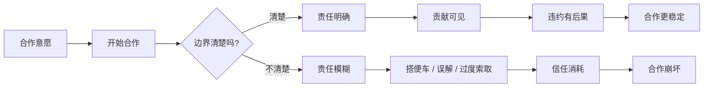
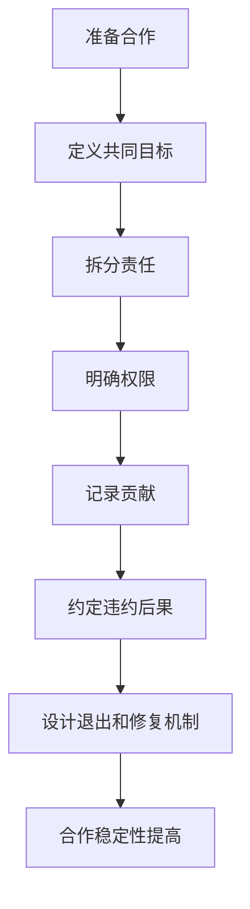

## 博弈思维筑基课: 边界清晰，合作才稳定
  
### 作者  
digoal  
  
### 日期  
2026-05-12
  
### 标签  
博弈论 , 合作边界 , 责任分工 , 稳定合作 , 组织治理
  
----  
  
## 背景

> 面向对象: 初中生到高中生  
> 核心问题: 为什么很多合作一开始靠热情，后来却因为责任不清、付出不均、退出困难而崩掉？  
> 先说结论: 边界清晰，合作才稳定，是说稳定合作需要明确谁负责什么、谁有何权限、贡献怎么算、违约怎么办、如何退出；边界不是不信任，而是降低误解、搭便车和情绪消耗。

## 一张图先看懂



## 求真讲法

### 它到底说了什么

“边界清晰，合作才稳定”是博弈论、组织协作和制度设计里的高层定律。它的意思是:

> 合作不是越模糊越有人情味。真正长期的合作，必须让参与者知道自己的责任、收益、权利、限制和退出方式。

比如小组作业中，大家一开始都说“我们一起做”。听起来很团结，但如果没有分工，后面就容易出现问题:

- 谁负责查资料？
- 谁做 PPT？
- 谁上台讲？
- 谁来整合？
- 有人没做怎么办？
- 临时有事能不能换任务？

这些边界不清楚，合作就会依赖少数人的自觉和忍耐。时间一长，认真者觉得被占便宜，拖延者觉得“反正有人兜底”，信任就会被消耗。

### 它是怎么来的

博弈论看合作，不只看大家有没有善意，还看合作结构是否可持续。

```text
边界模糊:
  责任不清
  贡献不可见
  违约无代价
  退出很尴尬
  |
  搭便车更容易
  误会更频繁
  认真者更累
  |
  合作不稳定

边界清晰:
  责任明确
  贡献可见
  违约有后果
  退出有规则
  |
  预期更稳定
  信任更便宜
  合作更可持续
```

边界的作用，是把合作从“靠感觉”变成“可预期”。可预期，才容易形成稳定均衡。

### 它依赖哪些假设

这条定律要成立，需要一些前提:

| 前提 | 含义 | 如果不成立会怎样 |
|---|---|---|
| 合作需要多人投入 | 结果依赖多方贡献 | 如果一个人能完成，边界问题较弱 |
| 责任可能被转嫁 | 有人可能少做、拖延或模糊贡献 | 如果贡献天然可分，问题较小 |
| 贡献需要被识别 | 大家要知道谁做了什么 | 如果贡献看不见，评价会失真 |
| 违约会影响他人 | 一个人不做会增加别人负担 | 如果互不影响，不太需要协作边界 |
| 关系需要持续 | 合作不是一次性临时行为 | 如果只合作一次，边界仍重要但长期影响较小 |
| 退出需要规则 | 有人无法继续时要有处理方式 | 如果不能退出，合作可能变成消耗 |

一句话判断:

```text
如果一个合作中:
  谁负责什么不清楚
  谁贡献多少不清楚
  谁能决定什么不清楚
  没做到怎么办不清楚
那么这个合作很难长期稳定。
```

### 常见误解

**误解一: 关系好就不需要边界。**  
不对。关系越想长期维持，越需要边界保护。边界能减少猜疑和委屈。

**误解二: 讲边界就是不信任。**  
不对。边界不是否定信任，而是让信任不必承受过多模糊成本。

**误解三: 边界越细越好。**  
不一定。过度细化会增加沟通成本，让合作变僵硬。边界要覆盖关键责任和风险。

**误解四: 合作稳定靠一个人多担待。**  
不对。长期依赖某个人兜底，会把合作变成单方面牺牲，最后反而更不稳定。

## 求存讲法

### 它有什么用

这条定律能帮你在合作开始前，先问几个关键问题:

- 目标是什么？
- 每个人负责什么？
- 权限边界在哪里？
- 贡献如何记录？
- 延误或违约怎么办？
- 有人退出怎么处理？
- 争议由谁决定？

这些问题不提前说清楚，后面就会变成情绪问题。很多合作不是败给能力，而是败给边界模糊。

### 它怎么迁移到熟悉领域



| 场景 | 边界不清 | 边界清晰 |
|---|---|---|
| 小组作业 | 大家一起做，最后少数人兜底 | 每人模块、截止时间和评价清楚 |
| 朋友借东西 | 什么时候还不明确 | 约定归还时间和损坏责任 |
| 家庭分工 | 谁看见谁就做 | 固定责任和临时替换规则 |
| 团队项目 | 谁都能改需求 | 需求入口、决策人和版本规则明确 |
| 合伙创业 | 只谈愿景不谈分配 | 股权、职责、退出和争议机制明确 |

### 它的适用范围和边界

适用时:

- 合作会持续一段时间。
- 参与者贡献不同。
- 任务相互依赖。
- 责任、收益或风险可能不均。
- 需要减少搭便车和误会。

要谨慎时:

- 合作很小，过度设规则反而浪费时间。
- 情况变化很快，边界需要保留弹性。
- 边界被用来逃避合理互助。
- 权力不平等时，强者可能把不公平边界强加给弱者。
- 过度量化会伤害创造性和关系温度。

### 正例: 怎么用它提升能力

**例子: 让小组项目不再靠一个人兜底。**

一个四人小组要做展示。以前总是最后一个认真同学通宵整合，因为其他人交得晚、格式乱、内容重复。

这次他们先定边界:

- A 负责背景资料，周二前提交。
- B 负责案例，周三前提交。
- C 负责图表，周三前提交。
- D 负责整合，但只整合按格式提交的内容。
- 迟交内容不保证进入最终版本。
- 每个人展示自己负责的部分。

这套边界让合作更稳定，因为责任可见、违约有后果、兜底不再无限。

### 反例: 前提不成立会怎样

**反例: 用边界包装不合作。**

一个同学在小组里只说“这不是我的边界”，拒绝回答任何接口问题，也不告诉别人自己的部分怎么连接。结果大家虽然各自完成了任务，但最终作品拼不起来。

这里失败的前提是: “边界服务于合作”。边界不是把自己封起来，而是明确责任和接口。真正好的边界应该同时说明“我负责什么”和“我怎样与别人连接”。

如果边界只用来拒绝沟通，它会破坏合作，而不是稳定合作。

## 思考

“边界清晰，合作才稳定”最重要的启发，是让你重新理解信任。

很多人以为信任就是:

```text
不用说太细
不用计较
出了问题互相体谅
能者多劳
```

短期看，这样似乎温和。长期看，它可能把压力压给最负责的人，把模糊留给最会逃避的人。

更成熟的信任是:

```text
目标说清楚
责任说清楚
接口说清楚
代价说清楚
修复方式说清楚
然后彼此在清楚边界内放心合作
```

边界不是合作的敌人，而是合作的骨架。没有骨架，善意容易塌成委屈；有了骨架，善意才有地方生长。

你可以继续追问:

1. 这个合作里，谁负责什么是否清楚？
2. 谁有决定权，谁有执行权？
3. 贡献如何被看见和评价？
4. 违约、迟交、质量不达标怎么办？
5. 如果有人退出，怎样减少对其他人的伤害？

## 最后记住

1. 边界清晰不是不信任，而是让信任更容易维持。
2. 稳定合作需要明确责任、权限、贡献、违约后果和退出机制。
3. 边界模糊会鼓励搭便车、制造误会，并消耗认真者。
4. 边界不是越细越好，要覆盖关键风险，同时保留必要弹性。
5. 好边界既说明“我负责什么”，也说明“我怎样与你连接”。

## 参考资料

- Elinor Ostrom, *Governing the Commons*, Cambridge University Press, 1990: 研究公共资源治理中清晰边界、规则执行和集体合作机制。
- Oliver E. Williamson, *The Economic Institutions of Capitalism*, Free Press, 1985: 从交易成本和治理结构角度解释合同、边界和机会主义。
- Robert Gibbons, *Game Theory for Applied Economists*, Princeton University Press, 1992: 应用博弈论教材，解释激励、合作和重复互动中的策略结构。
- Avinash K. Dixit, Susan Skeath, David H. Reiley Jr., *Games of Strategy*, W. W. Norton: 常用博弈论教材，包含合作、承诺、惩罚和策略互动案例。
- Michael C. Jensen and William H. Meckling, "Theory of the Firm", Journal of Financial Economics, 1976: 讨论委托代理、责任边界和激励冲突。
  
#### [PostgreSQL 解决方案集合](../201706/20170601_02.md "40cff096e9ed7122c512b35d8561d9c8")
  
  
#### [德哥 / digoal's Github - 公益是一辈子的事.](https://github.com/digoal/blog/blob/master/README.md "22709685feb7cab07d30f30387f0a9ae")
  
  
#### [About 德哥](https://github.com/digoal/blog/blob/master/me/readme.md "a37735981e7704886ffd590565582dd0")
  
  

  
