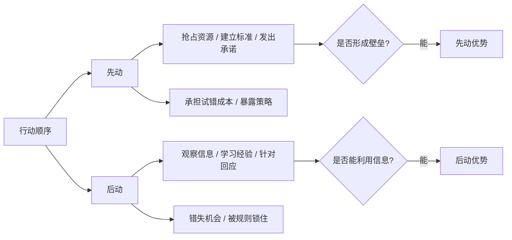
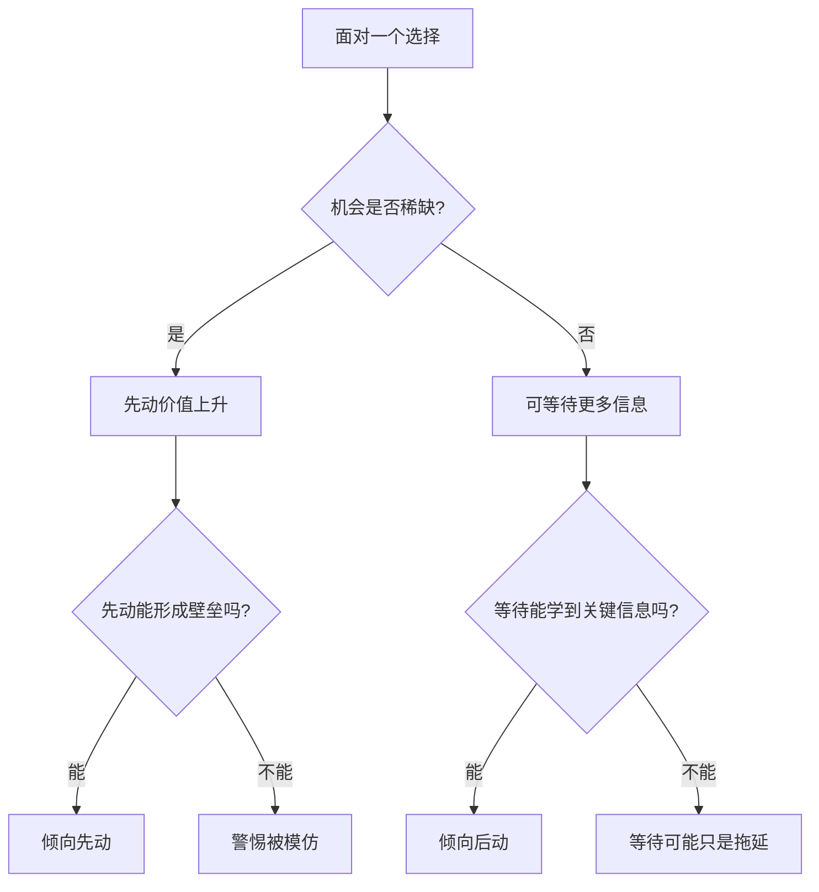

## 博弈思维筑基课: 先动和后动各有优势
  
### 作者  
digoal  
  
### 日期  
2026-05-12
  
### 标签  
博弈论 , 先动优势 , 后动优势 , 动态博弈 , 行动顺序
  
----  
  
## 背景

> 面向对象: 初中生到高中生  
> 核心问题: 为什么有些时候先出手能占优势，有些时候等别人先动反而更聪明？  
> 先说结论: 先动和后动各有优势，是说行动顺序会改变信息、承诺、选择空间和风险承担；先动可能抢占位置和塑造规则，后动可能观察信息和避免试错。

## 一张图先看懂



## 求真讲法

### 它到底说了什么

“先动和后动各有优势”是博弈论和战略分析里的高层定律。它的意思是:

> 在多人互动中，谁先行动、谁后行动，会改变每个人掌握的信息、能选择的策略、能否承诺、承担的风险，以及最后的均衡。

先动不是永远好，后动也不是永远怂。关键要看场景。

先动可能有优势:

- 先占座位、先注册名字、先抢市场。
- 先制定标准，让后来者按你的规则配合。
- 先投入资源，向别人发出“我不会轻易退出”的信号。

后动也可能有优势:

- 观察先动者哪里成功、哪里失败。
- 避免早期试错成本。
- 针对对方策略做回应。
- 等信息更清楚后再选择。

### 它是怎么来的

博弈论里有一类叫动态博弈，参与者不是同时行动，而是有先后顺序。行动顺序一变，推理方式也会变。

```text
同时行动:
  我不知道你会选什么
  你也不知道我会选什么

先后行动:
  先动者先暴露选择
  后动者看到后再回应
  但先动者也可能通过行动锁定局面
```

比如两个同学选展示题目。如果甲先选了一个热门题目并已经开始做资料，乙后面可能避开重复题目。甲获得了题目优先权，这就是先动优势。

但如果甲先选的题目太难，准备过程中发现资料不足，乙观察到这个问题后选择另一个更稳的题目，乙就获得了后动优势。

所以行动顺序真正改变的是两个东西:

| 顺序 | 得到什么 | 失去什么 |
|---|---|---|
| 先动 | 抢占、承诺、塑造预期 | 信息少、试错多、暴露早 |
| 后动 | 观察、学习、针对回应 | 机会少、空间窄、可能被锁定 |

### 它依赖哪些假设

这条定律要成立，需要一些前提:

| 前提 | 含义 | 如果不成立会怎样 |
|---|---|---|
| 行动有先后顺序 | 参与者不是完全同时行动 | 如果完全同时，先后优势不明显 |
| 先动能影响后动选择 | 先动会改变资源、规则或预期 | 如果先动无影响，优势很弱 |
| 后动能观察信息 | 后动者能看到先动者行动或结果 | 如果看不到，后动优势下降 |
| 机会会被占用 | 有些资源、位置、标准先到先得 | 如果资源无限，先动优势弱 |
| 试错有成本 | 先行动可能承担错误代价 | 如果试错免费，先动风险低 |
| 承诺能被相信 | 先动投入能让别人相信你会坚持 | 如果承诺不可信，先动未必有用 |

一句话判断:

```text
如果先动能形成壁垒、标准或可信承诺，先动更有优势。
如果后动能获得重要信息、低成本模仿或针对回应，后动更有优势。
```

### 常见误解

**误解一: 凡事先下手为强。**  
不对。信息不足、方向不明、试错成本很高时，先动可能只是先踩坑。

**误解二: 后动就是被动。**  
不对。后动可以是主动等待信息，再进行更精准的选择。

**误解三: 先动者一定能保持领先。**  
不一定。如果没有壁垒，后来者可以学习你的经验、避开你的错误、用更低成本追上。

**误解四: 等信息完全清楚再行动最好。**  
也不对。等到信息完全清楚，机会可能已经被别人占走。

## 求存讲法

### 它有什么用

这条定律能帮你判断: 现在应该先动，还是后动？

不要只问“快不快”，而要问:

- 这个机会会不会被抢走？
- 先动能不能形成壁垒？
- 后动能不能获得关键学习？
- 试错成本高不高？
- 对手看到我行动后，能不能轻易模仿？
- 我是否能通过先动发出可信承诺？

### 它怎么迁移到熟悉领域



| 场景 | 先动优势 | 后动优势 |
|---|---|---|
| 抢座位 | 先占好位置 | 观察哪里更安静 |
| 小组题目 | 先选热门题 | 看别人方向后避开重复 |
| 创业产品 | 先占用户和品牌 | 学习先行者错误 |
| 技术标准 | 先建立生态 | 等标准成熟再接入 |
| 学习方法 | 先开始积累 | 观察适合自己的方法 |

### 它的适用范围和边界

适用时:

- 决策有明显先后顺序。
- 先动会影响后续选择。
- 资源、位置、注意力或标准有稀缺性。
- 后动者能从先动者行动中学习。

要谨慎时:

- 行动顺序并不重要，真正重要的是能力或资源。
- 先动者只是曝光早，没有建立壁垒。
- 后动者只是拖延，并没有获得新信息。
- 先动会把自己锁进错误路径。
- 后动会错过不可逆机会。

### 正例: 怎么用它提升能力

**例子: 小组展示选题。**

如果老师规定每组题目不能重复，而且热门题目资料多、容易做，那么先动选题有优势。你越早确定题目，越能抢到更好的方向。

但如果题目难度不清楚，先选的人可能会发现资料不足、范围太大。此时后动者可以观察先动者遇到的问题，再选择更稳的题目。

成熟做法不是机械先抢或机械等待，而是判断:

- 题目是否稀缺？
- 先选后能否锁定？
- 锁定后是否能换？
- 观察别人能获得多少信息？
- 先动试错成本是否可承受？

如果热门题目稀缺且可锁定，先动更好。  
如果题目风险很大且可选择很多，后动观察更好。

### 反例: 前提不成立会怎样

**反例: 把“早开始”误当成先动优势。**

一个学生很早开始背一套作文模板，以为自己先动就有优势。但考试题型变化后，这套模板不适用；后来开始准备的同学反而根据新题型练习表达和结构，效果更好。

这里失败的前提是: “先动能形成壁垒或正确积累”。如果早行动只是把自己锁进错误方向，先动不是优势，而是路径负担。

所以先动前要先问: 我早做的东西，未来还有效吗？它会变成积累，还是变成沉没成本？

## 思考

“先动和后动各有优势”最重要的启发，是让你停止迷信单一口号。

```text
先发制人
后来居上
抢占先机
看清再动
```

这些话都可能对，也都可能错。关键不在口号，而在结构。

先动适合:

- 资源稀缺。
- 标准尚未确定。
- 承诺能改变别人预期。
- 早期积累会形成壁垒。
- 试错成本可承受。

后动适合:

- 信息还很不清楚。
- 先行者试错成本高。
- 模仿和改进成本低。
- 机会不会很快消失。
- 对方策略暴露后容易被回应。

真正成熟的策略，是分清自己面对的是“抢占型机会”，还是“学习型机会”。抢占型机会要快，学习型机会要准。快而不准会踩坑，准而太慢会错过。

## 最后记住

1. 行动顺序会改变信息、承诺、选择空间和风险承担。
2. 先动优势来自抢占资源、建立标准、形成壁垒和发出可信承诺。
3. 后动优势来自观察信息、学习经验、避免试错和针对回应。
4. 先动不等于一定领先，后动不等于被动拖延。
5. 判断先动还是后动，要看机会是否稀缺、信息是否关键、试错成本是否可承受。

## 参考资料

- Thomas C. Schelling, *The Strategy of Conflict*, Harvard University Press, 1960: 讨论承诺、先发行动、威胁和战略互动。
- Heinrich von Stackelberg, *Market Structure and Equilibrium*, 1934: Stackelberg 竞争模型展示先动企业和后动企业的策略关系。
- Jean Tirole, *The Theory of Industrial Organization*, MIT Press, 1988: 产业组织教材，讨论进入、先动优势、承诺和市场竞争。
- Robert Gibbons, *Game Theory for Applied Economists*, Princeton University Press, 1992: 应用博弈论教材，解释动态博弈、先后行动和逆向归纳。
- Avinash K. Dixit, Susan Skeath, David H. Reiley Jr., *Games of Strategy*, W. W. Norton: 常用博弈论教材，包含序贯博弈、承诺、威胁和先动/后动案例。
  
#### [PostgreSQL 解决方案集合](../201706/20170601_02.md "40cff096e9ed7122c512b35d8561d9c8")
  
  
#### [德哥 / digoal's Github - 公益是一辈子的事.](https://github.com/digoal/blog/blob/master/README.md "22709685feb7cab07d30f30387f0a9ae")
  
  
#### [About 德哥](https://github.com/digoal/blog/blob/master/me/readme.md "a37735981e7704886ffd590565582dd0")
  
  

  
