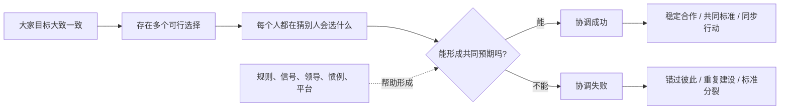
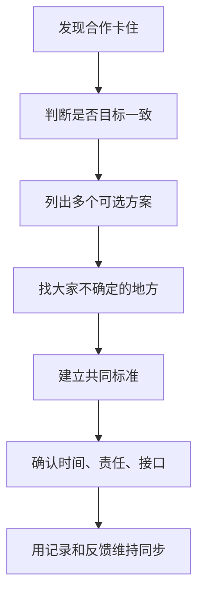

## 博弈思维筑基课: 协调有时比竞争更难
  
### 作者  
digoal  
  
### 日期  
2026-05-12
  
### 标签  
博弈论 , 协调博弈 , 共同预期 , 多重均衡 , 标准制定
  
----  
  
## 背景

> 面向对象: 初中生到高中生  
> 核心问题: 为什么有些事情大家目标并不冲突，却还是很难一起做好？  
> 先说结论: 协调有时比竞争更难，是说很多问题的难点不在于“我赢你输”，而在于大家要选到同一个标准、同一个时间、同一个行动；缺少共同预期时，好选择也可能落不了地。

## 一张图先看懂



## 求真讲法

### 它到底说了什么

“协调有时比竞争更难”是博弈论里的高层定律。它说的是:

> 有些博弈里，参与者并不是彼此敌对，大家都希望配合成功；真正困难的是大家必须相信别人也会选择同一个方案。

比如两个同学约见面，但手机没电了。图书馆和操场都可以，只要两人去同一个地方就行。问题不是他们利益冲突，而是他们不知道对方会去哪。

这类问题叫**协调博弈**。它的关键不是“谁打败谁”，而是“大家能不能对齐”。

### 它是怎么来的

普通竞争问题里，难点常常是利益冲突:

```text
我多得一点
你少得一点
所以我们竞争
```

协调问题里，难点不一定是利益冲突，而是共同预期:

```text
我希望和你选一样
你也希望和我选一样
但我们不知道彼此会选哪个
所以可能错开
```

一个简单收益表可以这样看:

|  | 乙去图书馆 | 乙去操场 |
|---|---:|---:|
| 甲去图书馆 | 甲 10，乙 10 | 甲 0，乙 0 |
| 甲去操场 | 甲 0，乙 0 | 甲 8，乙 8 |

图书馆和操场都可能成为稳定结果。图书馆收益更高，但如果甲不确定乙会去图书馆，甲可能选择自己觉得更可能碰上的地方。

这就引出一个重要概念: **多重均衡**。当多个选择都可能稳定时，真正稀缺的不是努力，而是共同预期。

### 它依赖哪些假设

这条定律要成立，通常需要这些前提:

| 前提 | 含义 | 如果不成立会怎样 |
|---|---|---|
| 参与者目标部分一致 | 大家都希望配合成功 | 如果目标完全相反，更像竞争博弈 |
| 存在多个可行选择 | 不止一种方案能成功 | 如果只有唯一方案，协调难度较低 |
| 选择需要对齐 | 单独选对没用，要和别人一致 | 如果个人独立完成即可，就不是协调问题 |
| 缺少充分沟通 | 无法直接确认别人选择 | 如果能清楚沟通，协调更容易 |
| 缺少共同标准 | 没有默认规则、惯例或焦点 | 如果有公认标准，大家更容易聚合 |
| 错配有成本 | 选错会浪费时间、资源或机会 | 如果错配无成本，协调压力较小 |

一句话判断:

```text
如果一个问题:
  大家都想成功
  但有多个可能选择
  且成功依赖大家选到同一个
那么它主要是协调问题，不只是竞争问题。
```

### 常见误解

**误解一: 只要大家目标一致，就一定能合作。**  
不对。目标一致只是开始。没有共同标准、沟通和同步机制，仍然可能失败。

**误解二: 协调失败就是有人不配合。**  
不一定。很多协调失败来自信息不清、时间错位、标准不一，而不是恶意。

**误解三: 最优方案会自然被大家选择。**  
不一定。如果大家不相信别人会选最优方案，可能退到一个较差但更容易预期的方案。

**误解四: 协调就是开会。**  
不对。开会只是工具。真正的协调是形成共同预期、共同标准和可执行分工。

## 求存讲法

### 它有什么用

这条定律能帮你看懂很多“明明大家都想做好，却就是做不好”的场景。

比如:

- 小组作业里，大家都想拿高分，但没人知道最终格式、截止节奏和分工标准。
- 技术团队里，大家都想提高效率，但使用不同工具、接口和命名规范。
- 城市交通里，大家都想安全到达，但如果没有红绿灯和通行规则，就会互相干扰。
- 内容平台里，创作者和读者都想高质量内容，但如果评价标准混乱，劣质内容可能占据注意力。

这些问题的关键，不是喊“大家要努力”，而是建立协调机制。

### 它怎么迁移到熟悉领域



| 场景 | 协调难点 | 解决机制 |
|---|---|---|
| 小组作业 | 不知道谁做什么 | 明确分工和截止时间 |
| 班级活动 | 大家时间不一致 | 统一日程和负责人 |
| 软件开发 | 接口标准不同 | API 文档和代码规范 |
| 交通出行 | 通行预期不同 | 红绿灯、车道、标志 |
| 行业标准 | 多种格式互不兼容 | 共同协议和主导平台 |

### 它的适用范围和边界

适用时:

- 大家有共同目标。
- 成功依赖多人行动对齐。
- 存在多个可行方案。
- 缺少共同标准、沟通或同步机制。

要谨慎时:

- 表面是协调，实质是利益冲突。
- 强行统一标准会压制合理多样性。
- 协调成本高于统一带来的收益。
- 领导者用“协调”名义要求别人单方面让步。
- 过度协调导致行动变慢、创新减少。

### 正例: 怎么用它提升能力

**例子: 让小组展示不再混乱。**

一个小组要做 10 分钟展示。大家都想做好，但每个人按自己的理解做: 有人写长文，有人做图片，有人查数据，有人准备演讲。最后材料重复、风格不一、时间超出。

这不是典型竞争问题，而是协调问题。

更好的做法是先建立共同预期:

- 确定展示主题和一句话结论。
- 规定每人负责一个模块。
- 统一 PPT 风格和引用格式。
- 设定每部分时间。
- 提前彩排一次，发现接口问题。

这样，大家不是更努力才变好，而是更对齐才变好。

### 反例: 前提不成立会怎样

**反例: 把利益冲突误判成协调问题。**

两个同学分配奖金。甲认为按贡献分，乙认为平均分。他们不是不知道怎么同步，而是对分配原则有冲突。此时如果只说“大家协调一下”，往往无效。

这里失败的前提是: “参与者目标部分一致”。如果各方对收益分配、权利边界或价值标准有根本分歧，问题就不只是协调，而是谈判、补偿和规则设计。

## 思考

“协调有时比竞争更难”最重要的启发，是让你不要把所有失败都解释成“不努力”或“不团结”。

很多系统失败，是因为大家没有共同预期:

```text
各自都在努力
但方向不同
各自都想配合
但时间错开
各自都觉得自己做对了
但标准不一
```

真正的协调能力，不是让所有人都听一个人的，而是让关键问题变清楚:

- 我们共同目标是什么？
- 有哪些可选方案？
- 默认选哪个？
- 谁负责什么？
- 什么时候交付？
- 接口和标准是什么？
- 如果情况变化，谁来更新规则？

同时也要警惕，协调不是越多越好。协调有成本。小事情过度协调会拖慢行动；复杂系统强行统一会压制创新。成熟的判断是: 在必须对齐的地方建立标准，在可以多样的地方保留自由。

## 最后记住

1. 协调问题的难点不是打败对方，而是形成共同预期。
2. 目标一致不等于自动合作，多个可行选择会带来多重均衡。
3. 标准、惯例、信号、领导、平台和规则，都能帮助人们聚合到同一个选择。
4. 协调失败不一定来自恶意，也可能来自信息不清、时间错位和标准不一。
5. 也要分清协调问题和利益冲突，不能用“协调”掩盖真实分配矛盾。

## 参考资料

- Thomas C. Schelling, *The Strategy of Conflict*, Harvard University Press, 1960: 讨论协调、焦点、承诺和战略互动。
- David K. Lewis, *Convention: A Philosophical Study*, Harvard University Press, 1969: 研究惯例如何帮助人们在协调问题中形成共同预期。
- Robert Gibbons, *Game Theory for Applied Economists*, Princeton University Press, 1992: 应用博弈论教材，解释协调博弈、多重均衡和策略互动。
- Avinash K. Dixit, Susan Skeath, David H. Reiley Jr., *Games of Strategy*, W. W. Norton: 常用博弈论教材，包含协调、承诺、焦点和多重均衡案例。
- Roger B. Myerson, *Game Theory: Analysis of Conflict*, Harvard University Press, 1991: 系统讨论博弈结构、均衡和信息条件。
  
#### [PostgreSQL 解决方案集合](../201706/20170601_02.md "40cff096e9ed7122c512b35d8561d9c8")
  
  
#### [德哥 / digoal's Github - 公益是一辈子的事.](https://github.com/digoal/blog/blob/master/README.md "22709685feb7cab07d30f30387f0a9ae")
  
  
#### [About 德哥](https://github.com/digoal/blog/blob/master/me/readme.md "a37735981e7704886ffd590565582dd0")
  
  

  
