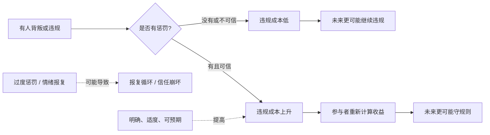
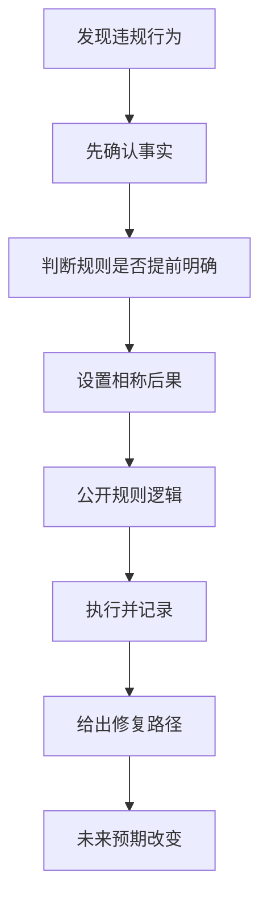

## 博弈思维筑基课: 惩罚不是为了报复, 而是为了改变预期
  
### 作者  
digoal  
  
### 日期  
2026-05-12
  
### 标签  
博弈论 , 惩罚机制 , 预期管理 , 规则执行 , 合作治理
  
----  
  
## 背景

> 面向对象: 初中生到高中生  
> 核心问题: 为什么有效惩罚不是“让对方痛”，而是让对方以后不再轻易破坏规则？  
> 先说结论: 在博弈论里，惩罚的核心作用不是报复过去，而是改变未来预期: 让参与者相信背叛、偷懒、违规会有真实代价，从而让合作和守规则更稳定。

## 一张图先看懂



## 求真讲法

### 它到底说了什么

“惩罚不是为了报复，而是为了改变预期”是博弈论和制度设计里的高层定律。它的意思是:

> 惩罚真正有效，不在于让违规者难受，而在于让所有参与者预期到: 破坏规则会付出代价，合作和守规则才更值得。

比如小组作业中有人长期不交任务。如果大家只是生气、抱怨、冷嘲热讽，但他最后仍然拿同样分数，那么他的预期不会变: 偷懒仍然便宜。

相反，如果规则提前说清楚: 个人贡献会记录，未完成任务会影响个人评分，下次分工会减少信任，那么惩罚就改变了预期。偷懒不再是低成本选择。

所以，惩罚的对象虽然是过去行为，但目标是未来行为。

### 它是怎么来的

博弈论关心的是参与者如何根据收益和代价选择策略。没有惩罚时，背叛可能很划算:

```text
背叛收益 > 背叛成本
  |
背叛更有吸引力
```

加入可信惩罚后，计算会变:

```text
背叛收益 - 惩罚成本 < 合作收益
  |
合作更有吸引力
```

这就是惩罚改变预期的机制。它不只是惩罚已经违规的人，也是在给其他人发信号: 规则不是装饰，破坏规则会产生后果。

但惩罚必须满足几个条件，才有战略价值:

| 条件 | 含义 | 为什么重要 |
|---|---|---|
| 明确 | 大家知道什么行为会被惩罚 | 避免随意和恐惧 |
| 可信 | 惩罚真的会执行 | 否则只是空话 |
| 适度 | 惩罚与行为后果相称 | 避免报复循环 |
| 可预期 | 同类行为得到类似处理 | 形成稳定规则 |
| 可修复 | 改正后有回到合作的路径 | 防止永久对立 |

### 它依赖哪些假设

这条定律要成立，需要这些前提:

| 前提 | 含义 | 如果不成立会怎样 |
|---|---|---|
| 参与者会对代价有反应 | 人会因为成本上升而调整行为 | 如果对方完全不在乎代价，惩罚作用弱 |
| 行为能被观察 | 能判断谁违规、谁守规则 | 如果看不清，容易误罚 |
| 惩罚能被执行 | 规则有执行者或自动机制 | 如果无法执行，威慑无效 |
| 惩罚与目标相关 | 惩罚能减少未来违规 | 如果只为泄愤，可能伤害关系 |
| 惩罚成本可承受 | 执行惩罚不会让系统付出过高代价 | 如果成本太高，惩罚不可持续 |
| 有恢复机制 | 被惩罚者改正后能重新合作 | 如果没有出口，可能激化对抗 |

一句话判断:

```text
有效惩罚 =
  能被看见
  能被执行
  代价适度
  改变未来收益计算
  留下修复通道
```

### 常见误解

**误解一: 惩罚越重越有效。**  
不一定。过重惩罚可能让人反抗、隐瞒、报复，甚至破坏合作关系。有效惩罚要足够改变预期，但不应失控。

**误解二: 不惩罚才是善良。**  
不一定。如果不惩罚让破坏规则的人持续占便宜，守规则的人会受伤，合作也会瓦解。

**误解三: 惩罚就是报复。**  
不对。报复关注“让你为过去痛苦”，有效惩罚关注“让未来规则更可信”。

**误解四: 惩罚只影响被惩罚者。**  
不对。惩罚也是给旁观者的信号，会改变整个群体对规则的预期。

## 求存讲法

### 它有什么用

这条定律能帮你区分两种完全不同的处理方式:

```text
情绪报复:
  你让我不舒服
  我也要让你不舒服
  结果可能升级冲突

战略惩罚:
  你破坏了规则
  我让违规承担代价
  目的是让未来合作更稳定
```

它适用于班级管理、小组合作、家庭约定、平台治理、商业合同、公共规则等场景。

比如迟到。如果一个人迟到后没有任何后果，其他人会预期“准时不重要”。如果迟到会自动减少发言顺序、影响分工或需要补偿等待者，大家会重新计算准时的价值。

### 它怎么迁移到熟悉领域



| 场景 | 无效反应 | 有效惩罚 |
|---|---|---|
| 小组拖延 | 事后抱怨 | 进度公开，延误影响个人评价 |
| 班级纪律 | 老师情绪发火 | 规则提前说明，同类行为同类处理 |
| 商业违约 | 口头争吵 | 合同约定违约金和补救方式 |
| 平台刷假数据 | 偶尔封一个账号 | 规则透明、检测稳定、收益清零 |
| 借东西不还 | 生闷气 | 记录归还时间，违约后暂停借用 |

### 它的适用范围和边界

适用时:

- 规则需要被维护。
- 违规行为会伤害合作或公平。
- 行为能被观察和验证。
- 惩罚能改变未来行为预期。
- 惩罚后仍希望保留合作可能。

要谨慎时:

- 事实不清，可能误罚。
- 规则事先没有讲清楚。
- 对方不是故意违规，而是能力不足或信息不足。
- 惩罚成本高于收益。
- 惩罚触及尊严、安全或法律边界。

### 正例: 怎么用它提升能力

**例子: 让学习小组不再长期拖延。**

一个学习小组约定每周分享错题，但有人经常最后一分钟才交，影响大家复盘。如果只是批评他“你怎么总这样”，效果可能有限。

更有效的做法是把惩罚设计成改变预期:

- 周三前必须上传题目，过期就不能占用周末讲解时间。
- 连续两次迟交，下周不再分配别人整理好的资料。
- 如果提前说明困难并补交，可以恢复正常参与。

这不是为了羞辱迟交的人，而是为了让所有人知道: 准时贡献有价值，拖延会影响自己的未来收益，同时改正后仍能回到合作。

### 反例: 前提不成立会怎样

**反例: 在事实不清时急着惩罚。**

一个同学没有按时提交小组材料，组长立刻在群里批评他“故意拖后腿”，并取消他的展示资格。后来发现，他已经提交到另一个共享文件夹，只是链接没有同步。

这里失败的前提是: “行为能被观察和验证”。事实不清时的惩罚会破坏信任，让人觉得规则不公。未来大家可能不是更守规则，而是更害怕、更防备、更不愿承担任务。

有效惩罚必须先确认事实。否则它改变的不是“违规预期”，而是“被误伤预期”。

## 思考

“惩罚不是为了报复，而是为了改变预期”最重要的启发，是把惩罚从情绪工具变成制度工具。

你可以用一个问题区分它们:

```text
如果这个惩罚不能改善未来行为，
也不能保护守规则的人，
只是让我出口气，
那它很可能是报复，不是有效惩罚。
```

好的惩罚机制保护的是合作。它告诉守规则的人: 你不会一直吃亏。它告诉破坏规则的人: 你可以修复，但不能无成本地继续破坏。它告诉旁观者: 规则会被执行，不是看心情。

但惩罚也必须受到约束。没有惩罚，规则会空心化；惩罚失控，规则会暴力化。成熟的系统要同时做到三件事:

- 对违规有真实后果。
- 对误会有澄清机制。
- 对改正有恢复通道。

你可以继续追问:

1. 我想惩罚，是为了改变未来行为，还是为了发泄情绪？
2. 规则是否提前说清楚了？
3. 事实是否已经被验证？
4. 惩罚是否适度、可执行、可预期？
5. 对方改正后，是否有恢复合作的路径？

## 最后记住

1. 有效惩罚的目标不是报复过去，而是改变未来预期。
2. 惩罚要让背叛、偷懒、违规不再便宜，同时保护守规则的人。
3. 惩罚必须明确、可信、适度、可预期，否则容易变成空话或报复。
4. 事实不清时急着惩罚，会破坏信任和规则正当性。
5. 好惩罚要有修复通道，让人能从错误回到合作。

## 参考资料

- Thomas C. Schelling, *The Strategy of Conflict*, Harvard University Press, 1960: 讨论威胁、承诺、惩罚可信性和战略互动。
- Robert Axelrod, *The Evolution of Cooperation*, Basic Books, 1984: 通过重复囚徒困境说明惩罚与宽恕如何支持合作。
- Robert Gibbons, *Game Theory for Applied Economists*, Princeton University Press, 1992: 解释重复博弈、惩罚策略和均衡条件。
- Avinash K. Dixit, Susan Skeath, David H. Reiley Jr., *Games of Strategy*, W. W. Norton: 常用博弈论教材，包含可信威胁、惩罚、承诺和策略互动。
- Elinor Ostrom, *Governing the Commons*, Cambridge University Press, 1990: 研究公共资源治理中渐进惩罚、规则执行和合作维持机制。
  
#### [PostgreSQL 解决方案集合](../201706/20170601_02.md "40cff096e9ed7122c512b35d8561d9c8")
  
  
#### [德哥 / digoal's Github - 公益是一辈子的事.](https://github.com/digoal/blog/blob/master/README.md "22709685feb7cab07d30f30387f0a9ae")
  
  
#### [About 德哥](https://github.com/digoal/blog/blob/master/me/readme.md "a37735981e7704886ffd590565582dd0")
  
  

  
