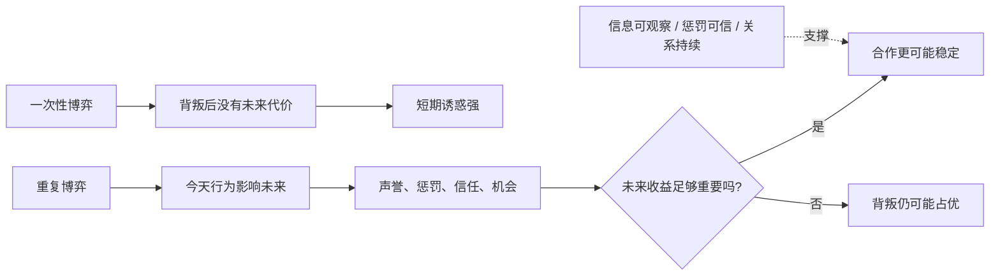
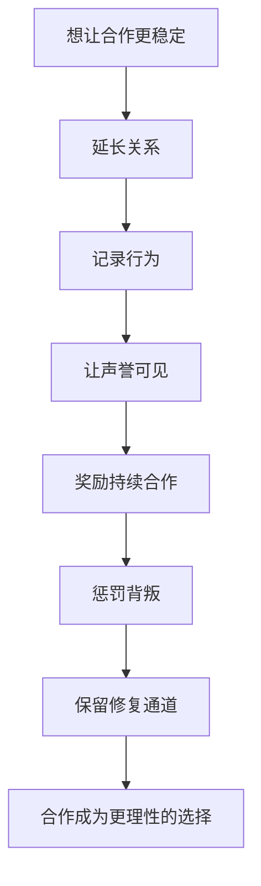

## 博弈思维筑基课: 重复博弈让合作成为可能
  
### 作者  
digoal  
  
### 日期  
2026-05-12
  
### 标签  
博弈论 , 重复博弈 , 长期合作 , 声誉 , 信任机制
  
----  
  
## 背景

> 面向对象: 初中生到高中生  
> 核心问题: 为什么一次性关系里容易背叛，长期关系里却更容易合作？  
> 先说结论: 重复博弈让合作成为可能，是说当同一批人会反复互动时，今天的背叛会影响明天的机会、声誉和回报；未来足够重要时，合作就可能从“道德选择”变成“理性选择”。

## 一张图先看懂



## 求真讲法

### 它到底说了什么

“重复博弈让合作成为可能”是博弈论里的重要高层定律。它说的是:

> 当人们不只互动一次，而是未来还会继续遇见、交易、合作或竞争时，当前行为会改变未来收益。于是，短期背叛不一定划算，长期合作可能更理性。

一次性囚徒困境里，背叛常常有吸引力。因为你今天占便宜后，明天可能再也不用面对对方。

但如果你们还要反复合作，情况就变了:

- 你今天背叛，对方明天可能不再合作。
- 你今天守信，未来可能获得更多信任。
- 你今天偷懒，声誉会影响以后分工。
- 你今天公平，别人更愿意继续与你合作。

所以重复博弈不是让人突然变善良，而是把“未来”放进今天的计算。

### 它是怎么来的

博弈论区分一次性博弈和重复博弈。

一次性博弈只看当前这一轮:

```text
今天背叛 -> 立刻多得一点
未来没有关系 -> 代价很小
背叛更有吸引力
```

重复博弈会把未来加进来:

```text
今天背叛 -> 立刻多得一点
未来被惩罚、失去信任、失去机会
如果未来价值很大 -> 背叛未必划算
```

这就是“未来之影”。当未来足够长、足够重要、足够可预期时，人会更在乎长期关系。合作也就有了支撑。

可以用一个简单表格比较:

| 条件 | 一次性博弈 | 重复博弈 |
|---|---|---|
| 是否还有未来互动 | 没有或很弱 | 有，而且重要 |
| 背叛代价 | 通常较低 | 会损失未来机会 |
| 声誉作用 | 很弱 | 很强 |
| 惩罚可能性 | 较弱 | 可在后续轮次出现 |
| 合作稳定性 | 较弱 | 可能更强 |

### 它依赖哪些假设

重复博弈能促进合作，不是无条件成立。它需要一些前提:

| 前提 | 含义 | 如果不成立会怎样 |
|---|---|---|
| 未来互动存在 | 双方以后还会继续遇到 | 如果只见一次，未来约束消失 |
| 未来足够重要 | 未来收益能超过当前背叛诱惑 | 如果只看眼前，合作难稳定 |
| 行为可观察 | 能知道对方合作还是背叛 | 如果看不见，惩罚和奖励会失准 |
| 惩罚可信且适度 | 背叛会带来真实代价 | 如果惩罚不能执行，背叛仍便宜 |
| 合作收益可持续 | 长期合作确实能带来好处 | 如果合作没有长期价值，没人坚持 |
| 误会能修复 | 偶然失误不会变成永久仇恨 | 如果误会频繁，容易陷入报复循环 |

一句话判断:

```text
如果:
  未来关系重要
  行为能被观察
  背叛会被惩罚
  合作会被回报
那么重复博弈更容易支持合作。
```

### 常见误解

**误解一: 重复互动一定会带来合作。**  
不对。如果未来不重要、行为不可观察、惩罚不可信，重复也可能只是反复互害。

**误解二: 合作只靠善良。**  
不对。善良有价值，但稳定合作还需要声誉、规则、惩罚、回报和修复机制。

**误解三: 惩罚越重，合作越稳。**  
不一定。过重惩罚可能引发报复循环。有效惩罚要明确、适度、可预期。

**误解四: 只要长期认识，就一定可信。**  
不一定。长期关系也可能产生利用、依赖和不公平。关键是行为是否可观察、成本收益是否对齐。

## 求存讲法

### 它有什么用

这条定律能帮你理解，为什么很多制度都在把“一次性关系”变成“长期关系”。

比如:

- 商家重视品牌，因为今天欺骗顾客会损害未来生意。
- 平台保留评价记录，因为声誉会影响未来交易。
- 班级小组固定合作一段时间，因为长期相处让偷懒有代价。
- 老师记录平时表现，因为一次考试不能代表全部。
- 朋友之间讲信用，因为未来还要继续互相帮助。

这些机制都在做同一件事: 让今天的行为影响明天的收益。

### 它怎么迁移到熟悉领域



| 场景 | 一次性思维 | 重复博弈思维 |
|---|---|---|
| 小组作业 | 这次少做也许没人发现 | 贡献记录会影响下次合作 |
| 商家服务 | 今天多赚一点 | 留住长期客户更重要 |
| 同学互助 | 借一次不还也没事 | 信用会影响未来关系 |
| 团队管理 | 只冲本月数据 | 长期质量和信任更值钱 |
| 内容创作 | 标题骗一次点击 | 长期信任决定复访 |

### 它的适用范围和边界

适用时:

- 参与者未来还会反复互动。
- 长期合作收益大于短期背叛收益。
- 行为记录可以保存和传播。
- 惩罚与奖励能被执行。
- 关系有修复机制，不会因一次误会崩掉。

要谨慎时:

- 未来关系很短，背叛者不在乎声誉。
- 行为难以观察，无法判断谁合作。
- 强者利用长期关系压迫弱者。
- 过度追求稳定合作，掩盖了不公平。
- 退出机制缺失，长期关系变成绑定和消耗。

### 正例: 怎么用它提升能力

**例子: 让学习互助小组稳定合作。**

如果四个同学只临时组队一天，可能有人只想拿资料，不想贡献。但如果他们约定连续八周一起复盘，并且每周记录每个人贡献，策略就会变。

可以这样设计:

- 每周固定一次错题讲解。
- 每个人必须带一道自己真正弄懂的题。
- 讲解质量被记录。
- 缺席或不准备会影响下周分工。
- 如果某次没准备，可以补交，避免一次失误变成长期排斥。

这样，合作不是靠口号维持，而是靠未来关系、声誉记录、适度惩罚和修复通道维持。

### 反例: 前提不成立会怎样

**反例: 只有重复，没有可观察行为。**

一个小组每周都合作，但任务贡献看不见，谁查资料、谁整理、谁真正理解都没有记录。久而久之，认真做的人觉得吃亏，偷懒的人继续占便宜。

这时虽然互动是重复的，合作仍然难稳定。

这里失败的前提是: “行为可观察”。如果看不见合作和背叛，就无法奖励合作者，也无法惩罚搭便车者。重复博弈需要信息机制配合，否则长期关系可能只是长期消耗。

## 思考

“重复博弈让合作成为可能”最重要的启发，是让你重新理解信任。

信任不是凭空来的。稳定信任常常来自一套结构:

```text
未来还会相遇
行为会被看见
好行为会被回报
坏行为会有代价
误会可以被澄清
关系可以被修复
```

所以，想让合作发生，不要只劝人“要有信任”。更有效的是设计让信任可积累、让背叛有代价、让修复有通道的关系。

但重复博弈也有阴影。长期关系有时会变成小圈子、报复链、利益捆绑，甚至让人不敢退出。因此，好的重复关系不仅要能奖励合作，也要允许合理退出，防止“合作”变成强迫。

你可以继续追问:

1. 这个关系是一次性的，还是会反复互动？
2. 未来收益是否足以约束今天的背叛？
3. 合作和背叛是否能被观察和记录？
4. 惩罚是否可信、适度、可预期？
5. 有没有修复误会和合理退出的机制？

## 最后记住

1. 重复博弈让合作成为可能，因为今天的行为会影响未来收益。
2. 未来越重要，声誉、信任和惩罚越能约束短期背叛。
3. 重复本身不保证合作，还需要行为可观察、惩罚可信、合作有回报。
4. 稳定合作需要修复通道，避免误会演变成报复循环。
5. 好的长期关系既能奖励合作，也允许合理退出，防止长期绑定变成消耗。

## 参考资料

- Robert Axelrod, *The Evolution of Cooperation*, Basic Books, 1984: 通过重复囚徒困境竞赛解释合作如何在长期互动中出现。
- Robert Axelrod and William D. Hamilton, "The Evolution of Cooperation", Science, 1981: 从重复互动和演化角度讨论合作机制。
- Drew Fudenberg and Jean Tirole, *Game Theory*, MIT Press, 1991: 系统讨论重复博弈、声誉和均衡。
- Robert Gibbons, *Game Theory for Applied Economists*, Princeton University Press, 1992: 应用博弈论教材，解释重复博弈和合作条件。
- Avinash K. Dixit, Susan Skeath, David H. Reiley Jr., *Games of Strategy*, W. W. Norton: 常用博弈论教材，包含囚徒困境、重复互动、可信承诺和策略分析。
  
#### [PostgreSQL 解决方案集合](../201706/20170601_02.md "40cff096e9ed7122c512b35d8561d9c8")
  
  
#### [德哥 / digoal's Github - 公益是一辈子的事.](https://github.com/digoal/blog/blob/master/README.md "22709685feb7cab07d30f30387f0a9ae")
  
  
#### [About 德哥](https://github.com/digoal/blog/blob/master/me/readme.md "a37735981e7704886ffd590565582dd0")
  
  

  
