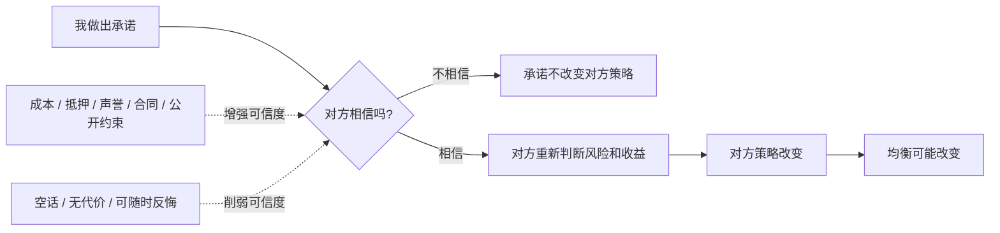
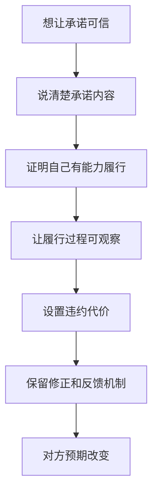

## 博弈思维筑基课: 承诺必须可信
  
### 作者  
digoal  
  
### 日期  
2026-05-12
  
### 标签  
博弈论 , 可信承诺 , 策略互动 , 声誉机制 , 合同约束
  
----  
  
## 背景

> 面向对象: 初中生到高中生  
> 核心问题: 为什么有些承诺别人会信，有些承诺听起来再漂亮也没用？  
> 先说结论: 承诺必须可信，是说承诺只有在别人相信你未来真的会执行时，才会改变对方策略；可信承诺通常需要成本、抵押、声誉、合同、公开约束或自我限制。

## 一张图先看懂



## 求真讲法

### 它到底说了什么

“承诺必须可信”是博弈论和战略互动里的高层定律。它的意思是:

> 承诺不是说出口就有效。只有当承诺让别人相信你未来真的会按它行动时，它才会改变对方的选择。

比如两个同学约好一起做小组作业。甲说:“我这次一定认真做。”这句话本身不一定有用。乙会想: 你上次也这么说，但最后没做。如果甲把任务写进共享文档、设定每天进度、愿意让个人贡献影响分数，这个承诺才更可信。

所以可信承诺的重点不是“说得真诚”，而是“反悔会有代价”或“履行能被验证”。

### 它是怎么来的

博弈论关心的是策略互动。一个承诺要改变博弈，必须改变对方的预期。

```text
没有可信承诺:
  你说会合作
  但反悔没有代价
  对方仍然担心你背叛
  对方不敢改变策略

有可信承诺:
  你说会合作
  反悔会损失押金、声誉、合同权益或未来机会
  对方相信你更可能履行
  对方策略改变
```

这也是为什么“威胁”也必须可信。你说“如果你迟到，我就再也不合作”，但对方知道你离不开这次合作，这个威胁就不可信。相反，如果规则提前写清楚，迟到会自动影响评分或取消资格，威胁才有力量。

可信承诺常见有几类:

| 类型 | 怎么让承诺可信 | 例子 |
|---|---|---|
| 成本承诺 | 先付出真实成本 | 报名费、押金、预付款 |
| 声誉承诺 | 反悔会损害长期信用 | 公开承诺、评价记录 |
| 合同承诺 | 第三方可以执行 | 合同、规则、仲裁 |
| 自我约束 | 主动减少未来反悔空间 | 截止日前公开提交、锁定选择 |
| 重复关系 | 未来合作会惩罚违约 | 长期搭档、固定客户 |

### 它依赖哪些假设

这条定律要成立，需要几个前提:

| 前提 | 含义 | 如果不成立会怎样 |
|---|---|---|
| 对方会根据预期行动 | 对方会判断你未来是否履行 | 如果对方不在乎你的承诺，承诺无效 |
| 履行或违约能被观察 | 大家能看见你有没有做到 | 如果无法验证，承诺难可信 |
| 违约有代价 | 反悔会损失金钱、声誉、机会或权利 | 如果反悔免费，承诺像空话 |
| 执行机制存在 | 合同、规则、关系或第三方能让代价落地 | 如果没人执行，惩罚不可信 |
| 承诺者有能力履行 | 不是只有意愿，还要有资源和能力 | 如果做不到，再真诚也不可信 |
| 承诺内容清楚 | 对方知道你具体承诺什么 | 如果含糊不清，事后容易争议 |

一句话判断:

```text
一个承诺越满足:
  可观察
  可验证
  违约有代价
  履行有能力
  内容清楚
它就越可信。
```

### 常见误解

**误解一: 真诚表达就等于可信承诺。**  
不对。真诚有价值，但在博弈中，对方还会看你有没有能力履行、违约有没有代价。

**误解二: 承诺越狠越可信。**  
不一定。过狠但无法执行的威胁反而不可信。可信来自可执行，不来自语气强。

**误解三: 签了字就一定可信。**  
不一定。合同要有执行机制、证据和违约成本。如果执行不了，纸面承诺也可能失效。

**误解四: 不信任别人就是道德差。**  
不一定。有时不信任是理性反应，因为承诺没有成本、没有记录、没有验证方式。

## 求存讲法

### 它有什么用

这条定律能帮你理解谈判、合作、管理、学习计划和人际关系里的一个关键问题:

> 想让别人相信你，不要只加强语气，要增加可信机制。

比如你想让父母相信你会认真学习。只说“我以后一定努力”效果有限。更可信的做法是:

- 每天固定时间提交学习记录。
- 每周用错题和测试结果复盘。
- 主动减少干扰，比如把手机放到客厅。
- 让计划可检查，而不是只靠口头保证。

这不是把信任变成监控，而是让承诺变得可观察、可验证、可持续。

### 它怎么迁移到熟悉领域



| 场景 | 空承诺 | 更可信的承诺 |
|---|---|---|
| 学习计划 | 我以后会努力 | 每天 20:00 前提交错题复盘 |
| 小组作业 | 我会负责 | 领取明确模块并公开进度 |
| 商业交易 | 我质量很好 | 提供质保、试用、退款规则 |
| 借东西 | 我肯定还 | 约定归还时间并留下记录 |
| 团队管理 | 我会重视长期质量 | 把复购、投诉、缺陷率纳入考核 |

### 它的适用范围和边界

适用时:

- 双方存在不信任或不确定性。
- 一方未来可能反悔。
- 对方策略取决于他是否相信你。
- 可以设置成本、记录、声誉、合同或执行机制。

要谨慎时:

- 承诺内容本身不合理。
- 承诺者没有能力履行。
- 过度担保会让自己承担无法承受的风险。
- 监督成本高于合作收益。
- 关系需要弹性，过度刚性会伤害合作。

### 正例: 怎么用它提升能力

**例子: 让小组成员相信你会按时完成。**

你负责小组展示里的数据部分。只说“放心，我会做完”不够，因为别人不知道你进度如何。

更可信的做法是:

- 当天把任务拆成数据收集、清洗、图表、结论四步。
- 在共享文档里写出每步截止时间。
- 每完成一步就上传结果。
- 如果卡住，提前 24 小时说明。
- 最终展示由你讲解数据部分。

这样，你的承诺不再只是语言，而变成了可观察的行动路径。别人会更愿意围绕你的交付安排自己的工作。

### 反例: 前提不成立会怎样

**反例: 许下自己无法控制的承诺。**

一个学生对同桌说:“我保证这次全班一定拿第一。”这句话听起来很有气势，但并不可信。因为全班成绩不只由他控制，还取决于其他同学、考试难度、临场状态等很多因素。

这里失败的前提是: “承诺者有能力履行”。可信承诺应该承诺自己能控制的行为，比如“我负责整理全班错题清单，并在周五前发给大家”，而不是承诺自己无法控制的结果。

## 思考

“承诺必须可信”最重要的启发，是区分愿望、表达和机制。

很多人以为承诺就是态度:

```text
我很认真
我一定做到
你要相信我
这次绝对不会出问题
```

但在博弈中，别人会继续问:

- 你反悔会损失什么？
- 我怎么知道你做到了？
- 你有没有能力做到？
- 如果情况变化，谁承担后果？
- 有没有第三方或规则能执行？

这并不冷漠。恰恰相反，可信承诺能保护合作。它让信任不必完全依赖情绪和口头保证，而是建立在可观察、可验证、可执行的机制上。

同时也要记住，承诺不是越多越好。轻易承诺会透支信用，过度承诺会把自己锁死。成熟的人会少许空承诺，多做可验证的小承诺；少喊口号，多建立能兑现的路径。

你可以继续追问:

1. 我现在给出的承诺，别人为什么应该相信？
2. 这个承诺是否清楚、可观察、可验证？
3. 如果我违约，会有什么真实代价？
4. 我是否有能力控制承诺结果？
5. 有没有办法把大承诺拆成多个可验证的小承诺？

## 最后记住

1. 承诺必须可信，才会改变别人的策略和最终均衡。
2. 可信承诺通常需要成本、抵押、声誉、合同、公开记录或自我约束。
3. 没有代价、无法验证、随时可反悔的承诺，很难真正影响博弈。
4. 威胁也必须可信；不能执行的狠话通常没有战略价值。
5. 成熟的合作不是靠空话维持，而是靠可观察、可验证、可执行的承诺机制维持。

## 参考资料

- Thomas C. Schelling, *The Strategy of Conflict*, Harvard University Press, 1960: 系统讨论承诺、威胁、可信性和战略互动。
- Robert Gibbons, *Game Theory for Applied Economists*, Princeton University Press, 1992: 应用博弈论教材，解释动态博弈、承诺和子博弈精炼均衡。
- Avinash K. Dixit, Susan Skeath, David H. Reiley Jr., *Games of Strategy*, W. W. Norton: 常用博弈论教材，包含可信承诺、威胁、策略行动和重复博弈案例。
- Roger B. Myerson, *Game Theory: Analysis of Conflict*, Harvard University Press, 1991: 系统讨论博弈结构、信息、承诺和均衡分析。
- Oliver E. Williamson, *The Economic Institutions of Capitalism*, Free Press, 1985: 从交易成本和治理结构角度解释合同、机会主义和可信承诺。
  
#### [PostgreSQL 解决方案集合](../201706/20170601_02.md "40cff096e9ed7122c512b35d8561d9c8")
  
  
#### [德哥 / digoal's Github - 公益是一辈子的事.](https://github.com/digoal/blog/blob/master/README.md "22709685feb7cab07d30f30387f0a9ae")
  
  
#### [About 德哥](https://github.com/digoal/blog/blob/master/me/readme.md "a37735981e7704886ffd590565582dd0")
  
  

  
