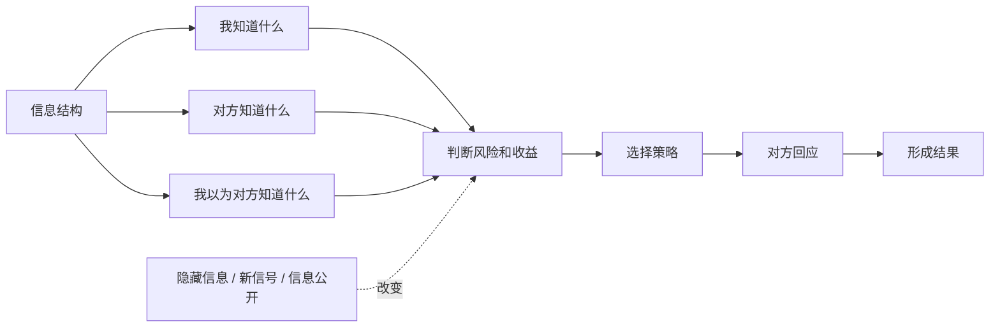
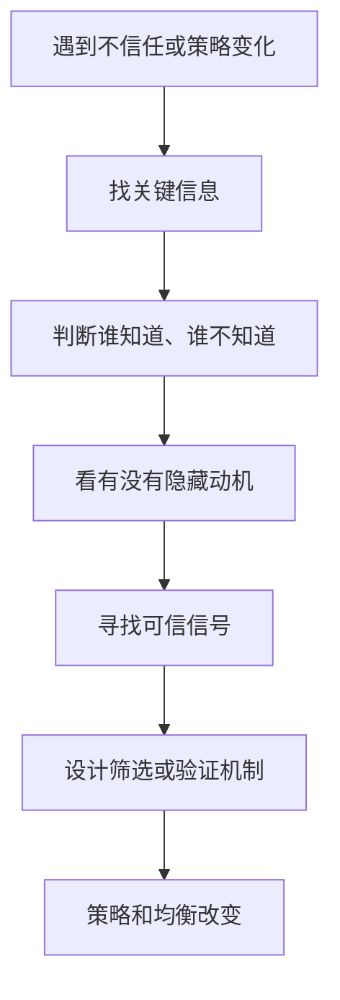

## 博弈思维筑基课: 信息改变策略
  
### 作者  
digoal  
  
### 日期  
2026-05-12
  
### 标签  
博弈论 , 信息结构 , 信息不对称 , 策略选择 , 信号机制
  
----  
  
## 背景

> 面向对象: 初中生到高中生  
> 核心问题: 为什么同一个人、同一个目标，只要掌握的信息不同，选择就会完全不同？  
> 先说结论: 信息改变策略，是说在博弈中，人们不只是根据目标行动，还会根据自己知道什么、不知道什么、相信别人知道什么来行动；信息结构一变，最佳策略和最终均衡都可能改变。

## 一张图先看懂



## 求真讲法

### 它到底说了什么

“信息改变策略”是博弈论里的高层定律。它的意思是:

> 策略不是只由目标决定，还由信息决定。同样想赢、想合作、想少吃亏的人，在不同信息条件下，会选择不同策略。

比如买二手自行车。买家想买到好车，卖家想卖出好价。如果买家不知道车有没有暗病，就会担心买亏，于是压价。好车卖家觉得价格太低，不愿意卖；坏车卖家反而愿意卖。最后市场上好车变少，坏车变多。

这里的问题不只是“买家小气”或“卖家不诚实”，而是信息不对称改变了双方策略。

### 它是怎么来的

博弈论分析策略时，不只问“收益是多少”，还会问“谁知道收益是多少”。信息结构至少包括三层:

```text
第一层: 我知道什么?
第二层: 你知道什么?
第三层: 我知道你知道什么吗?
```

这三层会改变行动。

例如考试前复习:

- 如果你知道考试范围，你会重点复习。
- 如果你不知道范围，你会分散复习或猜重点。
- 如果你知道别人都知道范围，你会预判竞争更激烈。
- 如果只有一部分人知道范围，公平性和策略都会改变。

在博弈论里，信息常常通过三种方式改变策略:

| 机制 | 含义 | 例子 |
|---|---|---|
| 隐藏信息 | 一方知道，另一方不知道 | 二手车质量、应聘者能力 |
| 信号 | 知情方用行动传递信息 | 学历、质保、押金、公开承诺 |
| 筛选 | 不知情方设计规则让信息暴露 | 试用期、考试、分级套餐 |

所以信息不是“附加材料”，而是直接塑造策略的核心条件。

### 它依赖哪些假设

这条定律要成立，需要几个前提:

| 前提 | 含义 | 如果不成立会怎样 |
|---|---|---|
| 信息会影响收益判断 | 知道更多会改变风险和机会判断 | 如果信息无关紧要，策略不会变 |
| 参与者会根据认知行动 | 人会用已知信息调整选择 | 如果人完全随机行动，信息作用弱 |
| 信息分布不完全相同 | 有人多知道，有人少知道 | 如果所有人完全同知，问题变成完全信息博弈 |
| 信息可以被隐藏或传递 | 信号、记录、承诺能改变别人判断 | 如果无法传递，信任很难建立 |
| 信号有成本或可验证 | 假信号不能无限便宜 | 如果造假无成本，信号会失效 |
| 参与者会推测别人 | 我不仅看事实，也看别人可能怎么想 | 如果没有策略推理，博弈性会下降 |

一句话判断:

```text
如果一个新信息会改变:
  我对收益的估计
  我对风险的估计
  我对对方类型的判断
  我对对方行动的预期
那么它就可能改变我的策略。
```

### 常见误解

**误解一: 信息越多越好。**  
不一定。信息太多、真假混杂、成本太高，会让决策变慢甚至更混乱。关键是有效信息。

**误解二: 公开信息一定带来好结果。**  
不一定。有些信息公开会改善信任，有些信息公开会引发恐慌、模仿或策略性操纵。

**误解三: 信号就是广告。**  
不对。真正有用的信号通常要有成本或可验证性。谁都能随便说的承诺，信息量很低。

**误解四: 信息不对称只是不公平。**  
不只是不公平。它还会改变交易、合作和竞争结构，甚至让本来有价值的合作无法发生。

## 求存讲法

### 它有什么用

这条定律能帮你理解很多“为什么不信任”的场景。

别人不跟你合作，不一定是他坏，也可能是他不知道你是否可靠。买家压价，不一定是他贪便宜，也可能是他无法判断质量。老师设置考试，不只是为了给分，也是在筛选学生是否真的掌握。

当你看到策略变化时，可以问:

- 谁知道关键信息？
- 谁不知道？
- 谁有动机隐藏信息？
- 什么信号可信？
- 能不能设计规则让真实信息暴露？

### 它怎么迁移到熟悉领域



| 场景 | 信息问题 | 策略变化 | 改善方式 |
|---|---|---|---|
| 二手交易 | 买家不知道质量 | 压价或不买 | 检测、质保、评价记录 |
| 小组合作 | 不知道谁会认真 | 少投入、防被坑 | 公开进度、分工记录 |
| 招聘 | 不知道真实能力 | 面试、试用、背调 | 作品集、试用任务 |
| 学习 | 不知道自己哪里不会 | 盲目刷题 | 测验、错题归因 |
| 平台内容 | 用户不知道内容质量 | 依赖标题和推荐 | 评价、完读率、可信来源 |

### 它的适用范围和边界

适用时:

- 参与者掌握的信息不同。
- 信任、质量、能力、意图或风险难以直接观察。
- 人们会根据新信息调整策略。
- 信号或验证机制能改变判断。

要谨慎时:

- 信息本身不准确或被操纵。
- 信息公开会伤害隐私、安全或公平。
- 信号成本太低，谁都能伪装。
- 信息太复杂，参与者无法正确理解。
- 问题真正来自利益冲突，而不是信息不足。

### 正例: 怎么用它提升能力

**例子: 让小组合作更可信。**

一个小组里，大家都担心别人偷懒，所以每个人都不愿意先投入太多。表面看是不合作，背后是信息问题: 每个人都不知道别人是否可靠。

可以引入几个信息机制:

- 把任务拆成可见的小模块。
- 每两天同步一次进度。
- 共享文档记录修改历史。
- 遇到困难及时标注，而不是最后才说。
- 每个人展示自己负责的部分。

这些做法不是为了监视，而是为了让可靠性变得可观察。信息更清楚后，大家的策略会变: 从防备和少投入，转向更稳定的合作。

### 反例: 前提不成立会怎样

**反例: 用更多信息解决价值冲突。**

假设两个人分配奖金。甲认为应该按贡献分，乙认为应该平均分。他们已经知道所有工作记录，也知道彼此理由，但仍然争执。

这时继续收集更多信息未必能解决问题。因为核心矛盾不是信息不足，而是价值标准不同: 到底按贡献、公平、需要，还是团队和谐来分？

这里失败的前提是: “问题来自信息不足”。当冲突来自利益和价值排序时，信息只能帮助澄清，不能自动给出共同答案。

## 思考

“信息改变策略”提醒我们: 很多行为不是由事实本身决定，而是由人们对事实的认知决定。

同一件事，在不同信息条件下会产生不同策略:

```text
知道质量 -> 愿意出高价
不知道质量 -> 压价或退出

知道对方可靠 -> 愿意合作
不知道对方可靠 -> 防备和试探

知道规则会执行 -> 遵守规则
不知道会不会执行 -> 观望或钻空子
```

所以，想改变策略，有时不需要先改变人的目标，而要改变信息结构: 让好行为可见，让坏行为留下记录，让承诺可验证，让风险可计算，让误会能澄清。

但信息也有边界。过度透明可能伤害隐私，过度监控可能破坏信任，错误指标可能让人为了显示“好信号”而表演。真正好的信息机制，不是把一切暴露出来，而是让关键事实被合适的人、以合适方式看见。

你可以继续追问:

1. 这个局面里，最关键的信息是什么？
2. 谁知道，谁不知道，谁有动机隐瞒？
3. 当前信号是否可信，是否容易伪造？
4. 能不能用验证、记录、试用或担保降低不确定性？
5. 信息问题解决后，是否还剩下利益或价值冲突？

## 最后记住

1. 信息改变策略，因为人会根据已知信息、未知风险和对他人的预期来行动。
2. 信息不对称会制造不信任，甚至让好交易和好合作无法发生。
3. 可信信号通常需要成本、记录或可验证性，否则容易变成空话。
4. 筛选机制能帮助不知情方识别质量、能力和可靠性。
5. 信息不是万能药；当问题来自利益冲突或价值冲突时，还需要协商、规则和分配机制。

## 参考资料

- George A. Akerlof, "The Market for Lemons", Quarterly Journal of Economics, 1970: 信息不对称和逆向选择的经典论文。
- Michael Spence, "Job Market Signaling", Quarterly Journal of Economics, 1973: 信号理论经典论文，解释教育等信号如何影响雇佣市场。
- Joseph E. Stiglitz, "The Theory of Screening, Education, and the Distribution of Income", American Economic Review, 1975: 筛选理论的重要论文。
- Roger B. Myerson, *Game Theory: Analysis of Conflict*, Harvard University Press, 1991: 系统讨论不完全信息、策略推理和机制设计。
- Avinash K. Dixit, Susan Skeath, David H. Reiley Jr., *Games of Strategy*, W. W. Norton: 常用博弈论教材，包含信息、信号、承诺和战略互动案例。
  
#### [PostgreSQL 解决方案集合](../201706/20170601_02.md "40cff096e9ed7122c512b35d8561d9c8")
  
  
#### [德哥 / digoal's Github - 公益是一辈子的事.](https://github.com/digoal/blog/blob/master/README.md "22709685feb7cab07d30f30387f0a9ae")
  
  
#### [About 德哥](https://github.com/digoal/blog/blob/master/me/readme.md "a37735981e7704886ffd590565582dd0")
  
  

  
