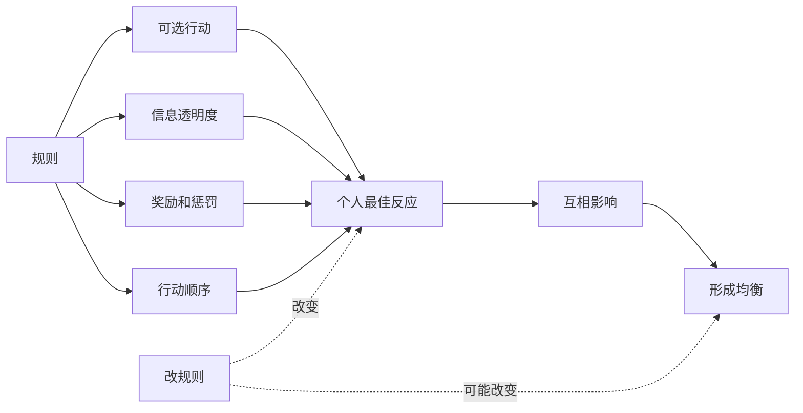
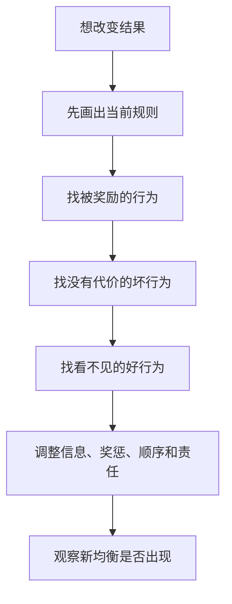

## 博弈思维筑基课: 规则塑造均衡
  
### 作者  
digoal  
  
### 日期  
2026-05-12
  
### 标签  
博弈论 , 规则设计 , 均衡 , 激励结构 , 机制设计
  
----  
  
## 背景

> 面向对象: 初中生到高中生  
> 核心问题: 为什么同一批人，在不同规则下会表现出完全不同的行为？  
> 先说结论: 规则塑造均衡，是说规则决定参与者能做什么、知道什么、得到什么、承担什么代价；当这些条件改变，人们的最佳反应会改变，最后稳定下来的结果也会改变。

## 一张图先看懂



## 求真讲法

### 它到底说了什么

“规则塑造均衡”是博弈论和机制设计里的高层原则。它不是说规则能控制每个人的每个动作，而是说:

> 规则会改变人的可选行动、收益结构、信息条件和违约成本，从而改变大家更可能采取的策略，最终改变稳定结果。

比如同样是小组作业:

- 如果只给小组总分，不记录个人贡献，搭便车容易稳定。
- 如果任务拆清楚，贡献可见，个人分数和贡献相关，认真合作更容易稳定。

人可能还是同一批人，但规则一变，行为的收益和代价变了，最后的均衡也会变。

### 它是怎么来的

博弈论分析一个局面，通常会先写清楚四件事:

```text
参与者: 谁在做决策?
策略: 每个人能选什么?
信息: 每个人知道什么?
收益: 每种结果对每个人意味着什么?
```

这些东西大多不是自然长出来的，而是由规则规定或影响的。

例如考试规则会影响学习方式。只考记忆，学生会更重视背诵；考解释和迁移，学生会更重视理解。平台推荐规则会影响创作者。只奖励点击，标题党会增加；奖励长期满意度，高质量内容更有机会。

所以，规则不是背景板。规则本身就是博弈的一部分。

可以用一个简化模型看:

```text
规则 A:
  背叛收益高
  背叛代价低
  合作贡献不可见
结果:
  背叛更可能成为稳定选择

规则 B:
  合作收益高
  背叛代价明确
  贡献可见且被奖励
结果:
  合作更可能成为稳定选择
```

### 它依赖哪些假设

这条定律要成立，需要一些前提。

| 前提 | 含义 | 如果不成立会怎样 |
|---|---|---|
| 参与者会响应规则 | 人会根据收益、成本、信息调整行为 | 如果人完全不在乎后果，规则作用会弱 |
| 规则能被理解 | 大家知道什么可做、什么不可做 | 如果规则模糊，行为会混乱 |
| 规则能被执行 | 违规有可预期后果 | 如果无人执行，规则会变成口号 |
| 规则覆盖关键行为 | 真正影响结果的行为被纳入 | 如果关键行为看不见，均衡仍会失真 |
| 规则副作用可控 | 指标不会严重扭曲目标 | 如果指标设计错，会塑造坏均衡 |
| 参与者能学习和适应 | 人会从反馈中调整策略 | 如果反馈太慢，规则效果难出现 |

一句话判断:

```text
如果规则改变了:
  什么行为有收益
  什么行为有代价
  什么信息能被看见
  什么承诺能被相信
那么它就可能改变均衡。
```

### 常见误解

**误解一: 规则一改，结果马上变好。**  
不一定。人需要时间学习新规则，旧习惯和旧利益也会抵抗。规则还需要执行和反馈。

**误解二: 有规则就等于有秩序。**  
不对。不能执行、没人相信、奖惩不清的规则，常常只停留在纸面上。

**误解三: 坏行为全是个人品质问题。**  
不一定。很多坏行为是规则奖励出来的。如果系统奖励刷数据，就会有人刷数据。

**误解四: 规则越严越好。**  
不对。过度严格可能增加成本、压制创造力，甚至让人把精力用在规避规则上。

## 求存讲法

### 它有什么用

这条定律能帮你从“责怪人”升级到“设计系统”。

如果一个班级总是吵，不只问“谁不自觉”，还要问:

- 安静的人有没有收益？
- 讲话的人有没有代价？
- 规则是否清楚？
- 老师和同学是否一致执行？
- 有没有让大家共同受益的安排？

如果一个团队总是拖延，不只问“谁懒”，还要问:

- 任务边界是否清楚？
- 进度是否可见？
- 延误是否有后果？
- 提前完成是否有奖励？
- 求助是否方便？

### 它怎么迁移到熟悉领域

| 场景 | 旧规则塑造的均衡 | 新规则可能塑造的均衡 |
|---|---|---|
| 小组作业 | 搭便车稳定 | 贡献可见后，合作稳定 |
| 自习纪律 | 讲话成本低 | 规则清楚后，安静稳定 |
| 学习评价 | 只刷题量 | 奖励解释和复盘 |
| 内容平台 | 标题党占优 | 长期满意度占优 |
| 公司考核 | 短期冲业绩 | 长期质量和复购被重视 |



### 它的适用范围和边界

适用时:

- 行为反复出现，不是偶然事件。
- 参与者会根据收益和代价调整行为。
- 当前结果明显受规则影响。
- 你有能力改变规则、反馈或执行方式。

要谨慎时:

- 问题主要来自能力不足，不是规则错误。
- 规则改变成本高于收益。
- 新规则会制造更严重副作用。
- 规则没有执行资源。
- 规则伤害公平、尊严或基本权利。

### 正例: 怎么用它提升能力

**例子: 把班级讨论从“抢话”改成“高质量发言”。**

如果课堂讨论只奖励声音最大、反应最快的人，最后可能形成抢话均衡。反应慢但思考深的人会沉默，讨论质量下降。

可以改规则:

- 发言前先给 1 分钟独立思考。
- 每人先写一句观点。
- 发言要引用理由或例子。
- 每轮优先邀请还没发言的人。
- 好问题和补充也算贡献。

这样，规则改变了“什么行为被看见和奖励”。稳定结果可能从抢话，转向更均衡、更有质量的讨论。

### 反例: 前提不成立会怎样

**反例: 只改口号，不改收益结构。**

一个小组总有人拖延。组长宣布新规则:“大家以后必须积极主动。”但任务仍然不拆分，进度仍然不可见，拖延没有代价，提前完成也没有任何收益。

结果很可能不变。

这里失败的前提是: “规则能改变关键行为的收益和代价”。如果所谓规则只是口号，没有信息、责任、奖惩和执行，它就不能塑造新均衡。

## 思考

“规则塑造均衡”最重要的启发，是把问题从“怎样让人变好”推进到“怎样让好行为更容易发生”。

很多时候，同一个人会在不同规则下表现不同:

```text
排队规则清楚 -> 多数人排队
插队没有代价 -> 插队变多

贡献可见 -> 更多人贡献
贡献不可见 -> 搭便车变多

说真话安全 -> 信息更真实
说真话有风险 -> 人人报喜不报忧
```

这不是为坏行为开脱，而是提醒我们: 如果一个系统长期产出坏结果，就要检查它是不是正在奖励坏行为、惩罚好行为、隐藏关键信息，或者让承诺变得不可信。

但规则设计也需要谦卑。规则不是越多越好，也不是越严越好。好规则应该尽量简单、可理解、可执行、能反馈，并且尊重人的真实动机。它的目标不是把人变成工具，而是让个人选择和整体结果更容易对齐。

你可以继续追问:

1. 当前规则到底奖励了什么？
2. 哪些好行为没有被看见？
3. 哪些坏行为没有代价？
4. 新规则会不会被钻空子？
5. 谁来执行规则，执行成本由谁承担？

## 最后记住

1. 规则通过行动、信息、收益、惩罚和顺序塑造均衡。
2. 同一批人，在不同规则下可能形成完全不同的稳定行为。
3. 坏行为反复出现时，要检查系统是否奖励了坏行为或惩罚了好行为。
4. 规则必须清楚、可执行、有反馈，否则只是口号。
5. 好规则不是越严越好，而是让正确行为更容易、更划算、更可持续。

## 参考资料

- John F. Nash Jr., "Equilibrium Points in N-Person Games", Proceedings of the National Academy of Sciences, 1950: 均衡思想说明参与者最佳反应如何形成稳定结果。
- Roger B. Myerson, *Game Theory: Analysis of Conflict*, Harvard University Press, 1991: 系统讨论博弈结构、机制和均衡分析。
- Eric S. Maskin, "Nash Equilibrium and Welfare Optimality", Review of Economic Studies, 1999: 机制设计理论的重要论文，讨论规则如何实现目标结果。
- Jean-Jacques Laffont and David Martimort, *The Theory of Incentives*, Princeton University Press, 2002: 激励理论和机制设计教材，解释规则如何改变行为。
- Elinor Ostrom, *Governing the Commons*, Cambridge University Press, 1990: 研究公共资源治理中规则如何帮助群体形成可持续均衡。
  
#### [PostgreSQL 解决方案集合](../201706/20170601_02.md "40cff096e9ed7122c512b35d8561d9c8")
  
  
#### [德哥 / digoal's Github - 公益是一辈子的事.](https://github.com/digoal/blog/blob/master/README.md "22709685feb7cab07d30f30387f0a9ae")
  
  
#### [About 德哥](https://github.com/digoal/blog/blob/master/me/readme.md "a37735981e7704886ffd590565582dd0")
  
  

  
