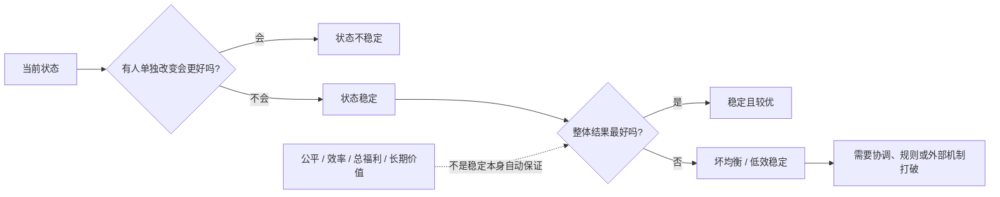
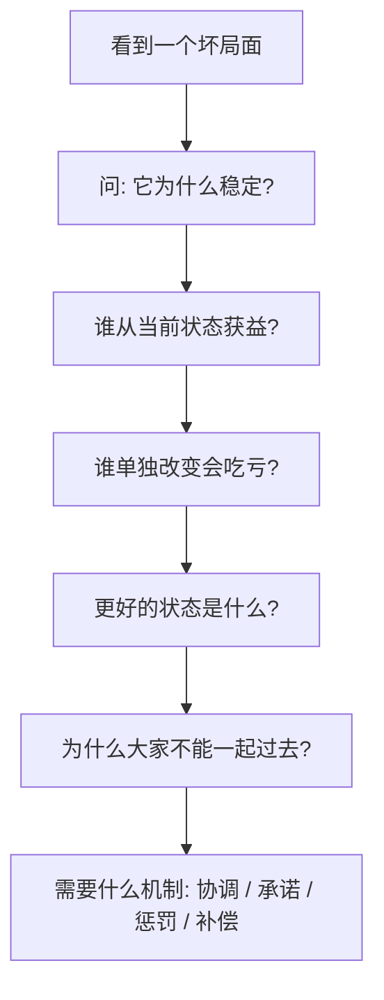

## 博弈思维筑基课: 稳定不等于最优
  
### 作者  
digoal  
  
### 日期  
2026-05-12
  
### 标签  
博弈论 , 纳什均衡 , 稳定状态 , 最优性 , 坏均衡
  
----  
  
## 背景

> 面向对象: 初中生到高中生  
> 核心问题: 为什么有些坏局面能长期存在，甚至看起来很难改变？  
> 先说结论: 稳定不等于最优，是说一个状态能持续存在，只说明参与者没有足够动力单独改变，不说明它公平、高效或整体最好。

## 一张图先看懂



## 求真讲法

### 它到底说了什么

“稳定不等于最优”是博弈论里非常重要的高层判断。它的意思是:

> 一个局面能维持下来，不代表它是最好的；它可能只是没人能靠单独行动把自己变好。

比如一个班级自习很吵。每个人都知道安静更好，但在别人都讲话时，自己一个人安静也很难学习，还可能显得不合群。于是大家继续讲话。这个状态很差，但它可能稳定。

这里的“稳定”类似纳什均衡: 在别人不改变时，自己单独改变没有明显好处。  
这里的“最优”则是另一个问题: 如果大家能一起换到更好的规则或行动，整体是不是会更好？

这两个问题不能混在一起。

### 它是怎么来的

博弈论研究多人互动时，会区分两个层次:

```text
稳定性问题:
  在别人不变时，我有没有动力单独改变?

最优性问题:
  是否存在另一个状态，让大家整体更好，
  或至少让一些人更好且没人更差?
```

很多坏局面之所以难改，不是因为人们喜欢它，而是因为“单独改变”太吃亏，“一起改变”又缺少协调。

囚徒困境就是典型例子:

| 结果 | 是否稳定 | 是否整体更好 |
|---|---|---|
| 双方都背叛 | 稳定，因为谁单独合作都会更差 | 不是最优 |
| 双方都合作 | 整体更好 | 在一次性囚徒困境中不稳定 |

这说明一个残酷事实: **好结果如果没有支撑机制，可能不稳定；坏结果如果互相锁住，可能很稳定。**

### 它依赖哪些假设

这条定律要成立，需要先分清“稳定”和“最优”的判断标准。

| 前提 | 含义 | 如果不成立会怎样 |
|---|---|---|
| 存在多个参与者 | 每个人的选择会影响别人 | 如果只有一个人，问题更像个人优化 |
| 单独改变和集体改变不同 | 一个人改会吃亏，大家一起改才更好 | 如果个人改也更好，坏状态不会稳定 |
| 缺少协调机制 | 大家难以同时转向更好状态 | 如果能协调，低效稳定可能被打破 |
| 缺少可信承诺 | 没人敢确定别人也会改 | 如果承诺可信，合作更可能稳定 |
| 当前状态有自我维持力量 | 习惯、规则、成本、声誉或惩罚让人不动 | 如果没有维持力量，状态会自然变化 |
| 最优标准需要另行定义 | 最优可能指效率、公平、总收益或长期价值 | 如果不定义最优，就容易争论不清 |

可以用一句判断式:

```text
如果一个状态:
  没人愿意单独改变
  但存在另一个大家一起改变后更好的状态
那么它就是稳定但不最优的状态。
```

### 常见误解

**误解一: 能长期存在的东西一定合理。**  
不对。长期存在只说明它有维持机制，不说明它公平、高效或正确。

**误解二: 不稳定就一定不好。**  
不一定。有些好改革在初期不稳定，是因为旧规则、旧习惯、旧利益还在拉扯。

**误解三: 最优状态会自动出现。**  
不对。最优状态常常需要协调、信任、惩罚、补偿、规则和外部推动。

**误解四: 打破稳定只要有人勇敢带头。**  
不一定。如果带头者会先吃亏，又没有补偿和保护，单靠勇气很难持续。

## 求存讲法

### 它有什么用

这条定律能帮你识别“坏局面为什么不自己消失”。

比如:

- 行业价格战让所有商家利润下降，但谁先涨价谁先丢客户。
- 小组作业人人少做，但谁先多做谁容易被占便宜。
- 平台内容越来越夸张，但谁先不夸张谁可能少流量。
- 班级纪律不好，但谁先认真可能被干扰、被嘲笑。

这些场景的共同点是: 大家可能都知道另一个状态更好，但缺少一起移动过去的机制。

### 它怎么迁移到熟悉领域

看到一个长期存在的问题，可以按这个流程分析:



也可以用一个对照表:

| 问题 | 稳定原因 | 更优状态 | 打破方式 |
|---|---|---|---|
| 自习课吵 | 单独安静收益小 | 大家都安静 | 明确规则和共同执行 |
| 小组搭便车 | 偷懒成本低 | 按贡献合作 | 贡献记录和个人评分 |
| 商家价格战 | 单独涨价会丢客户 | 减少恶性竞争 | 差异化、长期服务、合规规则 |
| 标题党内容 | 夸张标题有点击 | 高质量内容 | 改推荐指标和用户反馈 |

### 它的适用范围和边界

适用时:

- 一个状态长期存在但结果不好。
- 参与者单独改变会吃亏。
- 大家一起改变可能更好。
- 缺少协调、承诺、补偿或惩罚机制。

要谨慎时:

- 你所谓“最优”只是自己偏好的结果。
- 当前稳定状态对某些人其实有合理保护作用。
- 打破稳定的成本高于改进收益。
- 更优状态没有被证明，只是想象。
- 强行追求“最优”可能破坏已有信任和秩序。

### 正例: 怎么用它提升能力

**例子: 改善低效小组合作。**

一个小组长期低效: 大家都等别人先做，最后临近截止日期才赶工。这个状态不好，但稳定，因为谁先认真推进，谁就可能承担更多工作。

用“稳定不等于最优”分析，可以先承认: 这不是简单的懒惰问题，而是坏均衡。

改法是加机制:

- 把任务拆成小块。
- 每个人领取明确责任。
- 每两天同步一次进度。
- 未完成部分及时暴露。
- 最终评价和个人贡献挂钩。

这样一来，认真推进不再等于替别人兜底，低效稳定状态就有机会被打破。

### 反例: 前提不成立会怎样

**反例: 把稳定的安全规则误判成低效。**

有些学生觉得实验室安全流程麻烦: 进门登记、穿防护、检查仪器、记录操作。它确实让行动变慢，而且长期稳定存在。

如果只说“稳定不等于最优，所以要打破这些旧规则”，就是误用。

这里失败的前提是: “当前稳定状态不好”。安全规则的稳定，可能是在防止严重事故。它不是坏均衡，而是用一些效率成本换取安全底线。

所以判断“稳定不等于最优”时，必须先问: 当前稳定保护了什么？打破它会带来什么风险？

## 思考

“稳定不等于最优”最容易改变人的地方，是让你不再把现实当成天然合理。

很多人看到一个局面长期存在，就会说:

```text
既然一直这样，肯定有道理。
既然没人改变，说明改不了。
既然大家都接受，说明它还不错。
```

这三句话都可能错。长期存在的原因可能只是协调失败、既得利益、信息不透明、惩罚不对称、路径依赖，或者单个改变者代价太高。

但反过来，也不能把所有稳定都当成落后。有些稳定来自经验积累、安全边界、信任秩序和低摩擦协作。成熟的判断不是“稳定就维护”或“稳定就推翻”，而是分清:

- 它为什么稳定？
- 它保护了什么？
- 它牺牲了什么？
- 有没有更好状态？
- 从当前状态到更好状态，谁会承担转型成本？
- 有没有机制保护先改变的人？

## 最后记住

1. 稳定只说明没人愿意或没人能够单独改变，不说明结果最优。
2. 纳什均衡、囚徒困境、搭便车和价格战，都可能出现稳定但低效的状态。
3. 坏局面能长期存在，常常因为单独改变会吃亏，而集体改变缺少协调机制。
4. 打破坏稳定，需要承诺、规则、补偿、惩罚、信息透明和共同预期。
5. 也要警惕误把有保护作用的稳定当成低效，改革前必须看清它保护了什么。

## 参考资料

- John F. Nash Jr., "Equilibrium Points in N-Person Games", Proceedings of the National Academy of Sciences, 1950: 纳什均衡概念说明稳定策略组合不必等于整体最优。
- Robert Gibbons, *Game Theory for Applied Economists*, Princeton University Press, 1992: 应用博弈论教材，解释纳什均衡、囚徒困境和稳定策略。
- Avinash K. Dixit, Susan Skeath, David H. Reiley Jr., *Games of Strategy*, W. W. Norton: 常用博弈论教材，讨论均衡、承诺、协调和策略互动。
- Thomas C. Schelling, *The Strategy of Conflict*, Harvard University Press, 1960: 讨论协调、承诺、威胁和战略稳定。
- Douglass C. North, *Institutions, Institutional Change and Economic Performance*, Cambridge University Press, 1990: 解释制度、路径依赖和低效制度为何可能长期存在。
  
#### [PostgreSQL 解决方案集合](../201706/20170601_02.md "40cff096e9ed7122c512b35d8561d9c8")
  
  
#### [德哥 / digoal's Github - 公益是一辈子的事.](https://github.com/digoal/blog/blob/master/README.md "22709685feb7cab07d30f30387f0a9ae")
  
  
#### [About 德哥](https://github.com/digoal/blog/blob/master/me/readme.md "a37735981e7704886ffd590565582dd0")
  
  

  
