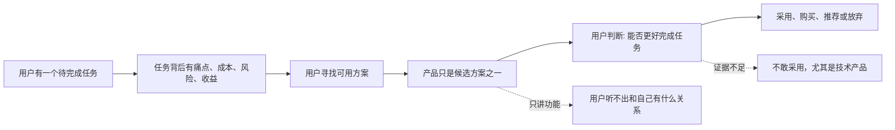
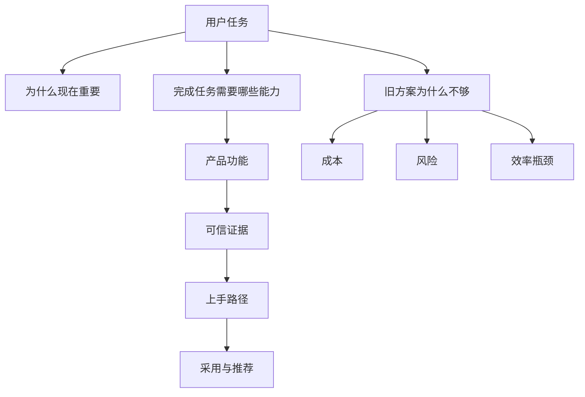

## 产品运营思维筑基课: 产品运营的底层公理: 用户不关心产品，用户关心自己的任务
  
### 作者  
digoal  
  
### 日期  
2026-05-13
  
### 标签  
用户任务 , 产品运营 , Jobs To Be Done , 用户价值 , 任务场景 , 技术产品 , 需求洞察 , 运营公理 , 产品认知 , 价值表达
  
----  
  
## 背景 

> 面向对象: 高中生、大学生、刚入门的产品运营同学、技术产品市场与运营新人  
> 核心问题: 为什么很多产品明明功能很多、技术很强，用户却没有兴趣？  
> 先说结论: 用户表面上在看产品，实际上在判断这个产品能不能帮自己完成任务、减少麻烦、降低风险、获得收益。产品运营不是把产品说得更热闹，而是把产品和用户任务之间的关系说清楚、做扎实、验证出来。

## 一张图先看懂



这条公理可以换成一句更口语的话:

```text
用户不是想买一把电钻，
用户是想在墙上打一个洞；
用户甚至不是想要一个洞，
用户是想把架子挂稳，把生活安排好。
```

放到技术产品里也是一样:

```text
用户不是想买数据库、AI 平台、监控系统、低代码工具。
用户想要的是: 查询更快、开发更省事、系统更稳定、成本更低、业务更可靠。
```

## 求真讲法

### 它到底说了什么

“用户不关心产品，用户关心自己的任务”不是说用户完全不看产品，而是说:

产品只有在帮助用户完成任务时，才真正有意义。

这里的“任务”不是狭义的待办事项，而是用户想达成的进步。它可能是一个功能性任务，也可能是情绪性任务、社会性任务、组织性任务。

| 任务类型 | 用户真正想完成什么 | 技术产品例子 |
|---|---|---|
| 功能性任务 | 把事情做成 | 让检索更准、让系统更稳、让报表更快 |
| 经济性任务 | 降低成本或提高收益 | 降低云资源费用、减少人力维护 |
| 风险性任务 | 避免事故或损失 | 避免宕机、数据丢失、安全漏洞 |
| 组织性任务 | 让团队更容易协作和决策 | 统一开发平台、统一监控口径 |
| 身份性任务 | 证明自己专业、先进、可靠 | 架构师选择被行业认可的技术方案 |

所以，用户看产品时，心里真正问的不是:

```text
你有哪些功能？
```

而是:

```text
你能不能帮我更好地完成我的任务？
你凭什么让我相信？
我换成你，会不会带来新的麻烦？
```

### 它是怎么来的

这条公理来自一个朴素观察: 人的注意力、时间、预算、信任都是有限的。用户不会因为一个产品“存在”就关心它。用户只会在某个任务变得重要、困难、昂贵或危险时，开始寻找工具和方案。

它也和几个经典营销与产品思想相通:

- “营销近视症”提醒企业不要只盯着自己卖的产品类别，而要看顾客真正需要的价值。
- “Jobs To Be Done”理论强调，用户是在“雇佣”产品来完成某个任务。
- 现代产品管理强调从用户问题、场景和结果出发，而不是从功能清单出发。

把这些思想压缩成一条运营公理，就是:

> 产品是手段，任务才是目的。

这不是一个能在系统内部被“证明”的数学定理，而是一个产品运营者选择接受的出发点。接受它以后，运营工作的重点会从“宣传我有什么”转向“证明我能帮你完成什么”。

### 它依赖哪些假设

这条公理要成立，依赖几个前提:

1. 用户有真实任务，而不是纯随机行动。
2. 用户的注意力有限，不会主动理解所有产品细节。
3. 用户会在多个方案之间比较，包括不买、自己做、继续用旧方案。
4. 用户采用产品时要付出成本，比如学习成本、迁移成本、金钱成本、组织说服成本。
5. 技术产品的价值需要证据支撑，不能只靠口号。

如果这些前提不成立，这条公理就要调整。例如，收藏品、奢侈品、粉丝经济产品，有时用户确实会直接关心“产品本身”所承载的身份、情绪或象征意义。但即使如此，用户背后仍然有身份表达、情绪满足、社交展示等任务。

### 常见误解

**误解一: 用户不关心产品，所以产品不重要。**

错。产品非常重要。只是产品重要的原因，不是因为它“属于你”，而是因为它能完成用户任务。产品能力、稳定性、体验、价格、服务，都是用户判断任务能否完成的证据。

**误解二: 只要讲用户痛点，就不用讲技术。**

错。技术产品必须讲技术，但技术要服务于任务解释。比如不能只说“我们采用分布式向量索引”，还要说它让什么场景更快、更准、更省、更稳。

**误解三: 用户说什么任务，我们就做什么。**

不一定。用户常常说的是表层需求，背后任务需要运营和产品一起拆解。用户说“我要一个报表按钮”，真实任务可能是“我需要每周向老板解释业务变化”。

**误解四: 产品运营就是把用户语言翻译一下。**

不够。真正的产品运营还要设计证据链: 场景、案例、数据、Demo、文档、客户证言、迁移路径、风险说明。尤其是技术产品，用户相信你之前，不会轻易把生产系统交给你。

## 求存讲法

### 它有什么用

这条公理能帮助产品运营避免三个常见错误:

1. 功能堆砌: 只讲产品有什么，不讲用户能完成什么。
2. 技术自嗨: 只讲架构多先进，不讲业务结果和采用条件。
3. 流量幻觉: 只追曝光和阅读，不追用户是否理解、试用、采用和推荐。

它把运营工作的核心问题改写为:

```text
目标用户是谁？
他正在完成什么任务？
这个任务为什么重要？
现在的方案有什么成本或风险？
我们的产品如何让任务完成得更好？
用户需要哪些证据才敢相信？
```

### 它怎么迁移到熟悉领域

假设你是学生，要向同学推荐一款笔记软件。

低水平说法是:

```text
这个软件支持 Markdown、双链、标签、云同步、插件。
```

任务导向说法是:

```text
如果你经常复习时找不到以前写过的知识点，
这个软件可以把课堂笔记、错题、知识卡片连起来。
考试前你不是从头翻本子，而是按主题快速召回。
```

功能没有消失，但功能被放回了任务里。

技术产品也是如此。比如运营一个数据库产品:

低水平说法:

```text
我们支持云原生架构、读写分离、自动扩缩容、HTAP、向量检索。
```

任务导向说法:

```text
当业务高峰突然到来时，你不用提前买大量机器；
当数据增长后，查询不会明显拖慢；
当应用要接入 AI 检索时，不必再维护一套割裂的向量系统。
```

### 它的适用范围和边界

这条公理特别适用于:

- B2B 产品
- SaaS 产品
- 开发者工具
- 数据库、云服务、AI 平台、运维、安全、低代码等技术产品
- 需要长期信任和组织决策的复杂产品

它的边界是:

| 场景 | 仍然有用的地方 | 需要补充的地方 |
|---|---|---|
| 奢侈品 | 用户仍有身份表达任务 | 需要理解审美、稀缺性、文化符号 |
| 娱乐产品 | 用户有放松、沉浸、社交任务 | 需要理解情绪和内容吸引力 |
| 低价冲动消费 | 用户任务可能很轻 | 需要重视即时刺激和购买便利 |
| 垄断或强制采购 | 用户选择空间小 | 需要理解制度、渠道和关系约束 |
| 极早期技术 | 用户任务尚未被清楚表达 | 需要教育市场，创造新分类认知 |

技术产品运营尤其要注意: 用户不仅关心任务能否完成，还关心“采用你之后会不会出事”。所以技术产品的任务解释必须同时包含收益和风险控制。

### 正例: 怎么用它提升能力

假设你负责运营一个面向企业开发者的 AI 数据库产品。

如果从产品出发，文章标题可能是:

```text
《某某数据库发布全新向量检索能力》
```

这类标题只说明你做了什么。用户还要自己判断和他有什么关系。

如果从任务出发，标题可以变成:

```text
《为什么企业知识库接入大模型后，最先卡住的不是模型，而是检索质量》
```

然后文章结构可以是:

1. 企业想完成的任务: 让员工用自然语言查询内部知识。
2. 旧方案的问题: 文档分散、关键词检索不准、权限复杂、更新滞后。
3. 技术难点: 语义检索、结构化过滤、权限控制、实时更新、成本控制。
4. 产品能力: 向量检索、SQL 过滤、混合检索、权限集成、性能优化。
5. 证据: Demo、测试数据、架构图、客户案例、迁移步骤。

这样，技术没有被弱化，反而更容易被理解和相信。

### 反例: 前提不成立会怎样

反例一: 没有真实任务，只有概念热度。

某团队运营一个“企业级元宇宙协作平台”，一直强调 3D 空间、虚拟会议室、沉浸式办公。但目标客户的真实任务只是“远程团队更高效地开会、记录决策、跟进任务”。如果 3D 空间增加了学习成本，却没有提高会议效率，用户就不会长期使用。

这里失败的前提是:

```text
用户有真实任务，但产品叙事没有对准任务。
```

反例二: 用户有任务，但证据不足。

一个数据库产品宣称“性能提升 10 倍”，但没有说明测试数据量、硬件环境、查询类型、对比版本、是否开源可复现。技术用户的任务是“让生产系统稳定变快”，而不是“相信一句宣传语”。所以用户可能会围观，但不敢采用。

这里失败的前提是:

```text
技术产品的价值需要证据支撑。
```

反例三: 用户任务被误读。

用户说“我们想要一个更好看的数据大屏”。运营和产品团队立刻宣传可视化效果，做了很多炫酷图表。但用户真正的任务是“老板每周能快速发现经营异常并追责到部门”。如果大屏不能解释指标变化、不能下钻、不能对齐责任人，再好看也解决不了任务。

这里失败的前提是:

```text
用户表达的需求不一定等于真实任务。
```

## 思考

这条公理最值得思考的地方在于: 它迫使运营者从“我想说什么”转向“用户正在解决什么”。

可以用下面这张任务拆解图检查一个技术产品的运营内容:



你可以问自己几个问题:

1. 如果把产品名遮住，这篇内容还是否能清楚说明用户任务？
2. 如果用户只记住一句话，他能不能复述“这个产品帮谁解决什么问题”？
3. 如果用户已经有旧方案，我们有没有说明为什么值得切换？
4. 如果用户准备在生产环境使用，我们有没有给出足够证据？
5. 如果用户需要说服老板、同事、采购，我们有没有给他可转述的材料？

对技术影响力来说，这条公理意味着:

```text
技术影响力不是把技术名词堆高，
而是让技术人相信: 你真的理解问题，并且你的方案经得起验证。
```

对品牌影响力来说，这条公理意味着:

```text
品牌不是反复喊自己的名字，
而是当用户遇到某类任务时，能自然想起你。
```

## 最后记住

1. 用户表面看产品，实际判断任务能否更好完成。
2. 产品功能必须翻译成任务价值，否则用户听不出关系。
3. 技术产品不只要讲价值，还要给证据，因为采用风险高。
4. 好运营不是让用户觉得产品很厉害，而是让用户觉得“这正好解决我的问题”。
5. 品牌影响力的终点，是用户遇到某类任务时第一个想到你。

## 参考资料

- Theodore Levitt, “Marketing Myopia”, Harvard Business Review, 1960.
- Clayton M. Christensen, Taddy Hall, Karen Dillon, David S. Duncan, “Know Your Customers' Jobs to Be Done”, Harvard Business Review, 2016.
- Peter F. Drucker, *The Practice of Management*, 1954.
- Geoffrey A. Moore, *Crossing the Chasm*, 1991.
- Marty Cagan, *Inspired: How to Create Tech Products Customers Love*, 2008/2018.
- 本文也基于产品管理、B2B 技术营销、开发者关系和技术品牌运营中的通用实践经验整理；未使用实时联网资料。
  
#### [PostgreSQL 解决方案集合](../201706/20170601_02.md "40cff096e9ed7122c512b35d8561d9c8")
  
  
#### [德哥 / digoal's Github - 公益是一辈子的事.](https://github.com/digoal/blog/blob/master/README.md "22709685feb7cab07d30f30387f0a9ae")
  
  
#### [About 德哥](https://github.com/digoal/blog/blob/master/me/readme.md "a37735981e7704886ffd590565582dd0")
  
  

  
