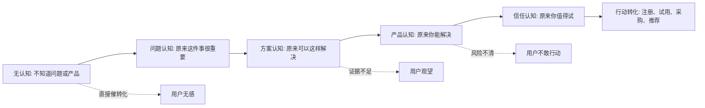
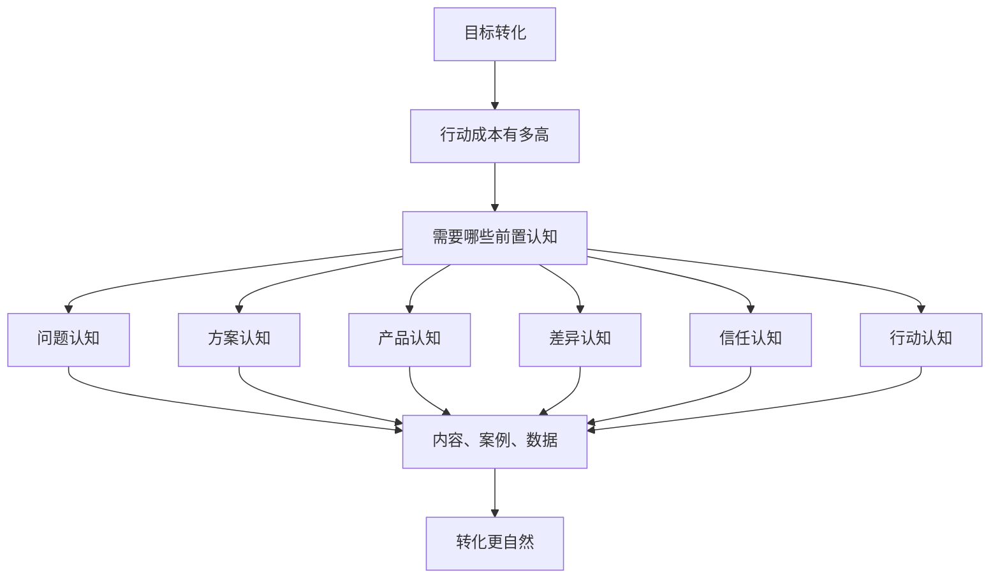

## 产品运营思维筑基课: 产品运营的底层公理: 认知先于转化
  
### 作者  
digoal  
  
### 日期  
2026-05-13
  
### 标签  
认知先于转化 , 产品运营 , 用户认知 , 转化路径 , 技术产品 , 品牌影响力 , 信任建立 , 内容运营 , 购买决策 , 运营公理
  
----  
  
## 背景 

> 面向对象: 高中生、大学生、产品运营新人、技术产品市场与运营同学  
> 核心问题: 为什么用户看到了产品、甚至觉得产品不错，却迟迟不注册、不试用、不采购、不推荐？  
> 先说结论: 转化不是被按钮“催”出来的，而是在用户形成足够认知之后自然发生的下一步。尤其是技术产品，用户必须先理解问题、理解方案、相信证据、判断风险可控，才会进入试用、采用、采购或推荐。

## 一张图先看懂



可以把它想成上楼梯:

```text
第 1 级: 我知道这个问题存在
第 2 级: 我知道这个问题和我有关
第 3 级: 我知道有一类方案能解决
第 4 级: 我知道你的产品属于这类方案
第 5 级: 我相信你比其他方案更适合我
第 6 级: 我愿意付出行动成本
```

很多运营失败，不是因为最后一级台阶不够漂亮，而是前面五级台阶缺失。

## 求真讲法

### 它到底说了什么

“认知先于转化”说的是:

用户在做出行动之前，通常需要先完成一系列理解和判断。

这里的“转化”不只是下单付款。对技术产品来说，转化可能是:

| 转化动作 | 用户实际承担的成本 |
|---|---|
| 点进官网 | 注意力成本 |
| 阅读文档 | 理解成本 |
| 注册账号 | 时间成本和隐私顾虑 |
| 跑通 Demo | 学习成本和环境成本 |
| 提交线索 | 被销售打扰的预期成本 |
| 发起 PoC | 团队协作成本和机会成本 |
| 生产采用 | 稳定性、安全性、迁移风险 |
| 内部推荐 | 个人声誉风险 |
| 采购付款 | 预算成本和组织决策成本 |

成本越高，用户越需要充分认知。一个人可以冲动买一瓶饮料，但很难冲动把生产数据库、AI 平台、监控系统、安全产品换掉。

所以技术产品运营要理解:

```text
转化按钮解决的是“怎么行动”，
认知建设解决的是“为什么行动、为什么现在行动、为什么选择你”。
```

### 它是怎么来的

这条公理来自一个基本事实: 人不会轻易为自己不理解、不相信、看不清收益或风险的东西付出行动成本。

在营销和传播理论中，这个思想有很多相近表达:

- AIDA 模型把用户路径概括为注意、兴趣、欲望、行动。
- 创新扩散理论强调，新技术被采用前，用户需要经历了解、说服、决策、实施、确认。
- “跨越鸿沟”提醒技术产品从早期采用者走向主流客户时，不能只靠新奇性，还要提供完整方案和可信案例。
- B2B 销售和产品营销通常强调教育市场、建立信任、证明价值，再推动线索和采购。

把这些思想压缩成一句产品运营公理，就是:

> 没有足够认知，转化就是强推；认知足够清楚，转化才像顺手的下一步。

它不是数学定理，而是运营者对用户行为的基本假设。接受这条公理以后，运营目标就不会只盯着“按钮点击率”，而会关心用户是否真的理解了问题、方案、产品和风险。

### 它依赖哪些假设

这条公理依赖几个前提:

1. 用户的行动有成本，不是零成本。
2. 用户面对多个选择，包括不行动、延后行动、继续用旧方案。
3. 用户的理解会影响判断，判断会影响行动。
4. 用户对高风险、高复杂度、高价格产品更谨慎。
5. 技术产品的价值通常不能一眼看懂，需要解释和证据。

如果行动成本很低，这条公理的表现会变弱。比如刷短视频、点一个表情、领取一个免费贴纸，用户可能不需要很深认知。但只要转化涉及预算、时间、声誉、系统稳定性、组织协作，认知就会变成前置条件。

### 常见误解

**误解一: 认知建设就是品牌曝光。**

不对。曝光只是“看见”，认知是“理解并形成判断”。一篇文章被很多人看到，不代表用户知道你解决什么问题、适合什么场景、凭什么可信。

**误解二: 认知越多越好。**

不对。认知要匹配转化阶段。让刚听说产品的人读 80 页白皮书，可能会把人吓走；让准备采购的人只看一句口号，又会显得证据不足。

**误解三: 转化不好，就应该加大优惠或增强销售催促。**

不一定。很多转化差的根源是用户没有完成关键认知: 不知道问题严重性、不理解方案差异、不相信效果、不清楚试用路径、不确定风险是否可控。

**误解四: 技术用户只看参数，不需要认知运营。**

错。技术用户更需要认知运营，只是他们需要的不是空泛宣传，而是更严谨的认知材料: 架构图、原理解释、Benchmark、复现实验、兼容性说明、失败边界、迁移路径。

## 求存讲法

### 它有什么用

这条公理能帮助产品运营把工作从“追结果”拆成“建设路径”。

如果只看转化，问题会变成:

```text
为什么用户不注册？
为什么用户不留资？
为什么客户不采购？
```

如果用“认知先于转化”来看，问题会变成:

```text
用户是否知道这个问题？
用户是否认为这个问题和自己有关？
用户是否理解旧方案的代价？
用户是否相信这类方案有效？
用户是否知道我们的差异？
用户是否看到足够证据？
用户是否知道下一步怎么做？
用户是否相信行动风险可控？
```

这会让运营动作更具体:

| 认知阶段 | 用户心里的问题 | 运营内容 |
|---|---|---|
| 问题认知 | 这件事重要吗？ | 趋势文章、痛点拆解、风险案例 |
| 方案认知 | 应该怎么解决？ | 方法论、架构图、选型指南 |
| 产品认知 | 你能解决吗？ | 功能解释、场景 Demo、产品页 |
| 差异认知 | 为什么是你？ | 对比分析、性能数据、独特能力 |
| 信任认知 | 我敢用吗？ | 客户案例、Benchmark、文档、开源代码 |
| 行动认知 | 下一步怎么做？ | 试用入口、教程、迁移指南、PoC 流程 |

### 它怎么迁移到熟悉领域

假设你想让同学参加一个数学学习小组。

直接催转化是:

```text
快报名！今晚截止！
```

如果同学还没形成认知，他可能会想:

```text
我为什么要参加？
我的数学问题到底在哪里？
这个小组和普通补课有什么不同？
我每周要花多少时间？
参加后真的有效吗？
```

认知先于转化的做法是:

1. 先让他意识到问题: 不是不会做题，而是知识点之间没有连起来。
2. 再解释方案: 小组用错题归因和专题复盘，而不是刷更多题。
3. 再证明有效: 展示一周复盘样例和同学改进记录。
4. 再降低行动成本: 先旁听一次，不需要立刻长期报名。

技术产品也是一样。比如运营一个面向企业的 AI 代码助手:

```text
直接催: 立即购买企业版。
认知路径: 先解释研发效率瓶颈在哪里，再说明 AI 如何进入代码评审、测试生成、文档生成流程，再证明安全和权限可控，最后给出试点方案。
```

### 它的适用范围和边界

这条公理特别适用于:

- 技术产品
- B2B 产品
- 高客单价产品
- 新品类产品
- 需要组织决策的产品
- 用户需要改变习惯或迁移系统的产品

它的边界是:

| 场景 | 为什么边界不同 | 仍可使用的方式 |
|---|---|---|
| 低价冲动消费 | 行动成本低，用户可先买后想 | 用简单认知触发即时行动 |
| 强促销场景 | 价格刺激会放大短期转化 | 仍需让用户知道为什么值得买 |
| 熟人推荐 | 信任被关系提前建立 | 仍需补齐产品和场景认知 |
| 垄断采购 | 用户选择少 | 仍需建立使用认知和组织配合 |
| 极成熟品类 | 用户已有基础认知 | 重点转向差异认知和信任认知 |

技术产品尤其要注意一个边界: 认知建设不能代替产品能力。如果产品无法真的解决问题，再好的认知运营也只会带来更快的失望。

### 正例: 怎么用它提升能力

假设你负责一个数据库产品的运营，目标是推动企业试用“向量检索能力”。

低水平做法是:

```text
官网首页放一个按钮: 免费试用向量数据库。
```

这不是错，但它只处理最后一步。对很多企业用户来说，前面还有一串认知没有完成:

```text
为什么普通关键词检索不够？
为什么大模型应用需要向量检索？
为什么向量检索不能随便找个组件拼上？
为什么数据库内置向量能力比外挂系统更适合某些场景？
性能、权限、事务、备份、成本怎么处理？
怎么从现有系统迁移？
```

更完整的运营路径可以是:

1. 问题认知: 写《企业知识库接入大模型后，为什么检索质量决定回答质量》。
2. 方案认知: 写《关键词、向量、混合检索分别解决什么问题》。
3. 产品认知: 做一个可跑通的 RAG Demo。
4. 差异认知: 给出内置向量检索与外挂向量服务的适用边界。
5. 信任认知: 发布测试方法、性能数据、客户案例、权限架构说明。
6. 行动认知: 提供 30 分钟跑通教程和 PoC 清单。

这时“免费试用”按钮才不是孤零零的按钮，而是用户认知完成后的自然下一步。

### 反例: 前提不成立会怎样

反例一: 用户没有问题认知，运营直接推产品。

某监控产品反复宣传“全链路可观测平台限时试用”。但目标用户所在公司还没有经历过复杂微服务故障，也没有意识到日志、指标、链路分散会导致排障时间变长。用户看到广告，只会觉得“我们现在也能查日志，暂时不需要”。

这里失败的前提是:

```text
用户尚未形成问题认知。
```

反例二: 用户有问题认知，但没有方案认知。

一家企业知道客服效率低，也知道知识库混乱，但它不理解 RAG、语义检索、权限过滤、知识更新之间的关系。此时直接推“企业级 AI 知识库平台”，用户可能觉得这是一个包装过的聊天机器人。

这里失败的前提是:

```text
用户没有理解方案机制，所以无法判断产品价值。
```

反例三: 用户理解方案，但没有信任认知。

一个数据库产品展示了漂亮 Demo，用户也理解它能解决查询性能问题。但产品没有公开稳定性数据、失败边界、兼容性说明、备份恢复方案。技术负责人可能会说:“看起来不错，但不能上生产。”

这里失败的前提是:

```text
高风险技术产品需要信任认知，不能只靠演示转化。
```

## 思考

“认知先于转化”最重要的启发是: 运营不是单点说服，而是认知路径设计。

可以用这张图检查一篇文章、一次活动、一个官网页面或一次发布会到底在解决哪个认知问题:



对技术影响力来说，这条公理意味着:

```text
技术影响力不是让别人听过你，
而是让别人理解你为什么重要、为什么可信、为什么值得被认真评估。
```

对品牌影响力来说，这条公理意味着:

```text
品牌不是一次曝光后的记忆，
而是用户多次接触后形成的稳定认知。
```

如果一个技术产品想建立长期影响力，它不能只做发布稿、活动海报、销售线索表单。它需要持续建设一条认知阶梯:

```text
问题解释 -> 方法解释 -> 技术解释 -> 场景解释 -> 证据解释 -> 行动路径
```

每一级都清楚，转化才会稳定；前面越模糊，后面越依赖催促和折扣。

## 最后记住

1. 转化不是运营的起点，而是用户认知达到某个阈值后的结果。
2. 行动成本越高，用户越需要问题、方案、产品、差异、信任和行动路径认知。
3. 技术产品的认知建设必须有证据，不能只靠口号、概念和热词。
4. 转化差不一定是按钮不够明显，可能是前置认知没有完成。
5. 品牌影响力的本质，是在用户心里沉淀稳定、可复述、可信任的认知。

## 参考资料

- Elias St. Elmo Lewis, AIDA model, commonly attributed to late 19th century advertising practice.
- Everett M. Rogers, *Diffusion of Innovations*, 1962.
- Geoffrey A. Moore, *Crossing the Chasm*, 1991.
- Philip Kotler and Kevin Lane Keller, *Marketing Management*, multiple editions.
- Robert B. Cialdini, *Influence: The Psychology of Persuasion*, 1984.
- 本文基于产品运营、B2B 技术营销、开发者关系、产品市场和技术品牌运营中的通用实践整理；未使用实时联网资料。
  
#### [PostgreSQL 解决方案集合](../201706/20170601_02.md "40cff096e9ed7122c512b35d8561d9c8")
  
  
#### [德哥 / digoal's Github - 公益是一辈子的事.](https://github.com/digoal/blog/blob/master/README.md "22709685feb7cab07d30f30387f0a9ae")
  
  
#### [About 德哥](https://github.com/digoal/blog/blob/master/me/readme.md "a37735981e7704886ffd590565582dd0")
  
  

  
