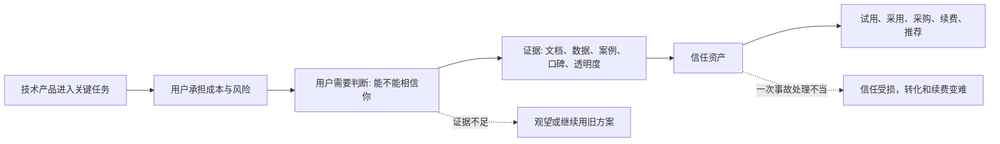
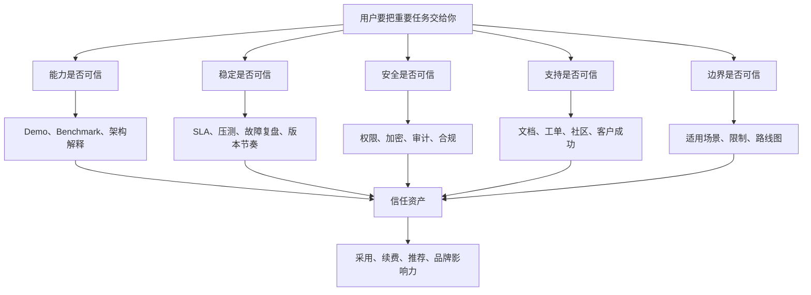

## 产品运营思维筑基课: 产品运营的底层公理: 信任是技术产品的核心资产
  
### 作者  
digoal  
  
### 日期  
2026-05-13
  
### 标签  
信任资产 , 技术产品 , 产品运营 , 品牌信任 , 可靠性 , 专业可信 , 用户决策 , 风险降低 , 长期关系 , 运营公理
  
----  
  
## 背景 

> 面向对象: 高中生、大学生、产品运营新人、技术产品市场与运营同学  
> 核心问题: 为什么技术产品不能只靠功能、价格、曝光和销售话术完成增长？  
> 先说结论: 技术产品一旦进入真实业务、生产系统或组织流程，用户承担的风险很高。用户采用你之前，必须相信你稳定、可靠、可解释、可支持、出问题能负责。信任不是一句“请相信我们”，而是长期证据积累出来的核心资产。

## 一张图先看懂



可以用一个生活类比理解:

```text
买一支笔，最多担心不好写。
选择一座桥，担心的是会不会塌。
技术产品越靠近核心系统，用户越像在选择桥，而不是选择笔。
```

对技术产品来说，信任不是锦上添花，而是采用的地基。

## 求真讲法

### 它到底说了什么

“信任是技术产品的核心资产”说的是:

用户采用技术产品时，买的不只是功能，也是在把一部分业务结果、系统稳定性、团队效率、数据安全和个人声誉交给你。

所以，技术产品的运营不能只回答:

```text
你有什么功能？
你多少钱？
你比别人快多少？
```

还必须回答:

```text
我为什么敢用你？
你出问题时我怎么办？
你的能力是否可验证？
你的边界是否透明？
别人是否已经在严肃场景里用过？
我推荐你，会不会损害我的专业判断？
```

技术产品里的“信任”至少包含五层:

| 信任层次 | 用户真正关心什么 | 常见证据 |
|---|---|---|
| 能力信任 | 你是否真的能解决问题 | Demo、Benchmark、功能说明、架构图 |
| 稳定信任 | 你是否能长期稳定运行 | SLA、故障记录、压测、版本节奏 |
| 安全信任 | 你是否保护数据和系统 | 安全白皮书、权限模型、合规认证 |
| 支持信任 | 出问题是否有人负责 | 文档、工单、社区、服务响应 |
| 诚实信任 | 你是否如实说明边界 | 已知限制、失败场景、路线图、变更日志 |

如果一个产品功能强但不可信，用户可能会围观、点赞、收藏，但不会轻易进入生产系统。

### 它是怎么来的

这条公理来自技术产品的采用特征。

普通消费品的试错成本有时很低。比如买一杯饮料，不好喝就算了。但技术产品不一样。一个数据库、云服务、AI 平台、监控系统、安全工具、低代码平台，一旦被接入真实业务，影响范围可能包括:

1. 系统可用性。
2. 数据安全。
3. 业务连续性。
4. 团队工作流。
5. 预算和采购责任。
6. 技术负责人的专业声誉。

因此，用户在采用之前会天然谨慎。这个谨慎不是“保守”，而是理性风险控制。

信任也不是靠一次宣传完成的。它更像一个账户:

```text
持续交付、透明沟通、可靠支持、真实案例、可复验证据 = 存入信任
夸大宣传、隐藏限制、事故甩锅、文档混乱、承诺失真 = 支出信任
```

当信任余额足够高时，用户才愿意把更重要的任务交给你。

### 它依赖哪些假设

这条公理依赖几个前提:

1. 技术产品的采用会带来真实风险，而不是零风险尝鲜。
2. 用户不是只为功能买单，还要为可靠性、安全性、可维护性负责。
3. 用户很难完全看穿技术产品内部质量，所以需要外部证据。
4. 组织采购通常涉及多人决策，信任需要被传递和复述。
5. 技术品牌的长期价值来自稳定预期，而不是单次曝光。

如果产品只用于玩具项目、个人实验或一次性任务，信任门槛会降低。但只要产品进入团队协作、业务流程、生产系统、客户数据、长期预算，信任就会变成核心约束。

### 常见误解

**误解一: 信任就是知名度。**

不对。知名度是“听说过你”，信任是“敢把重要任务交给你”。一个产品很出名，但如果用户觉得它不稳定、不透明、支持差，仍然不会放心采用。

**误解二: 信任就是客户案例越多越好。**

不够。客户案例是证据之一，但还要看案例是否真实、场景是否相似、指标是否清楚、用户是否能复用经验。空泛的 Logo 墙不能替代严肃证据。

**误解三: 技术强就自然有信任。**

不一定。技术能力需要被用户理解、验证和持续感知。源码、文档、测试、案例、路线图、社区响应，都是把技术能力转化为信任资产的过程。

**误解四: 出事故就一定失去信任。**

不一定。复杂系统不可能永远不出问题。真正伤害信任的，往往不是事故本身，而是隐瞒、拖延、甩锅、解释不清、不复盘、不改进。

## 求存讲法

### 它有什么用

这条公理能帮助技术产品运营从“制造声量”转向“建设可信度”。

如果只追声量，运营会问:

```text
这篇文章能不能爆？
这场发布会能不能刷屏？
这个口号够不够响？
```

如果以信任为核心资产，运营会问:

```text
用户看完后是否更敢试用？
技术负责人是否能拿去说服团队？
采购是否能降低顾虑？
开发者是否能独立复现效果？
客户是否知道出问题找谁？
我们的边界是否讲清楚？
```

这会改变运营资产的优先级:

| 低信任资产 | 高信任资产 |
|---|---|
| 口号海报 | 可复现 Benchmark |
| 模糊宣传稿 | 场景化技术白皮书 |
| 只展示成功结果 | 同时说明适用边界 |
| 只讲功能发布 | 给出迁移指南和兼容说明 |
| 只放客户 Logo | 写清客户场景、问题、方案、结果 |
| 只做短期活动 | 持续维护文档、社区和版本日志 |

### 它怎么迁移到熟悉领域

想象你要选择一个同学当小组项目的负责人。

你不会只看他说“我很强”。你会观察:

1. 他以前是否按时完成任务。
2. 他遇到问题是否及时沟通。
3. 他是否能解释计划。
4. 他是否愿意承认不会的地方。
5. 他是否能在别人遇到困难时提供支持。

这就是信任的形成。它来自可观察行为，而不是自我声明。

技术产品也是一样。一个产品说“高性能、高可靠、企业级”，这只是自我声明。用户真正需要的是:

```text
性能如何测？
可靠性如何保证？
哪些场景不适合？
谁已经用过？
如何迁移？
如何回滚？
故障如何处理？
版本如何演进？
```

能回答这些问题，信任才会增长。

### 它的适用范围和边界

这条公理特别适用于:

- 数据库、云服务、操作系统、中间件
- AI 平台、RAG 平台、开发者工具
- 安全、监控、运维、备份、灾备产品
- 企业 SaaS、低代码、协同办公系统
- 任何会进入生产系统、组织流程或客户数据的产品

它的边界是:

| 场景 | 信任权重 | 说明 |
|---|---:|---|
| 个人娱乐工具 | 较低 | 用户主要看新鲜、有趣、低成本 |
| 一次性小工具 | 较低 | 失败影响有限 |
| 个人开发实验 | 中等 | 用户愿意尝鲜，但仍关心文档和可用性 |
| 团队内部工具 | 较高 | 影响协作效率和团队责任 |
| 企业生产系统 | 极高 | 影响业务连续性、安全和采购责任 |
| 金融、医疗、政企等关键行业 | 极高 | 合规、审计、稳定性和责任边界更重要 |

信任不是所有场景里唯一重要的东西。价格、性能、体验、生态、渠道都重要。但在高风险技术产品里，如果信任不足，其他优势很难转化成采用。

### 正例: 怎么用它提升能力

假设你运营一个面向企业的数据库产品，想建立技术影响力。

低水平做法是:

```text
反复宣传: 新一代、高性能、云原生、企业级、国产领先。
```

这些词可能带来注意力，但很难单独建立信任。

更好的做法是围绕信任资产建设内容:

1. 能力信任: 发布清晰的架构文章，解释为什么在高并发场景下更稳。
2. 稳定信任: 给出压测方法、故障切换机制、备份恢复流程。
3. 安全信任: 说明权限模型、审计能力、数据加密、合规边界。
4. 支持信任: 建立问题响应机制、FAQ、最佳实践、迁移手册。
5. 诚实信任: 明确哪些场景适合，哪些场景暂时不建议使用。

这类内容短期可能不如热点文章热闹，但会持续降低用户采用风险。它们会成为销售、售前、社区、客户成功和品牌传播共同使用的底层资产。

### 反例: 前提不成立会怎样

反例一: 产品有声量，但没有能力证据。

某 AI 平台大量投放“企业 AI 转型首选平台”的广告，但官网只有概念介绍，没有 Demo、文档、API 示例、权限说明、部署架构、真实案例。技术负责人看完后不知道如何评估，也无法向团队解释为什么值得试。

这里失败的前提是:

```text
技术产品的能力信任需要可验证证据。
```

反例二: 产品功能强，但边界不透明。

某数据库产品在发布会上强调查询性能极高，却没有说明测试条件、适用查询类型、数据规模、硬件配置和不适合的场景。用户试用后发现自己的复杂事务场景并不匹配，于是认为宣传夸大。

这里失败的前提是:

```text
诚实说明边界是信任的一部分。
```

反例三: 产品出故障后处理不当。

某云服务发生长时间故障。团队没有及时发布状态更新，也没有解释影响范围、恢复进展和后续改进。即使问题最终解决，客户仍然担心下一次事故会再次失控。

这里失败的前提是:

```text
稳定信任不仅来自不出故障，也来自故障发生后的透明处理。
```

## 思考

“信任是技术产品的核心资产”最值得思考的地方在于: 它把产品运营从“让别人注意你”提升到“让别人敢依赖你”。

可以用下面这张图检查一个技术产品的信任建设是否完整:



对技术影响力来说，这条公理意味着:

```text
技术影响力不是把自己说得先进，
而是让专业用户相信你的先进性可理解、可验证、可复现、可依赖。
```

对品牌影响力来说，这条公理意味着:

```text
品牌不是用户记住你的名字，
而是用户在关键决策时愿意把你放进可信候选名单。
```

可以进一步追问:

1. 我们的宣传中，哪些是自我声明，哪些是可验证证据？
2. 用户如果要说服老板、同事、采购，我们给了他哪些材料？
3. 我们是否敢公开说明产品的适用边界？
4. 当产品出问题时，我们的沟通机制是在存入信任，还是支出信任？
5. 如果一个用户一年后才采购，今天的哪些内容还能继续帮他建立信任？

## 最后记住

1. 技术产品越靠近核心系统，用户越需要信任，而不是只看功能。
2. 信任不是口号，而是能力、稳定、安全、支持、诚实边界的证据总和。
3. 技术影响力要让用户觉得“可验证、可复现、可依赖”。
4. 事故不一定毁掉信任，隐瞒、拖延、甩锅和不复盘才更伤信任。
5. 品牌影响力的高阶结果，是用户在关键决策时愿意把你列入可信候选。

## 参考资料

- Niklas Luhmann, *Trust and Power*, 1979.
- Rachel Botsman, *Who Can You Trust?*, 2017.
- Robert B. Cialdini, *Influence: The Psychology of Persuasion*, 1984.
- Geoffrey A. Moore, *Crossing the Chasm*, 1991.
- Philip Kotler and Kevin Lane Keller, *Marketing Management*, multiple editions.
- Google SRE Book, *Site Reliability Engineering*, 2016.
- 本文基于技术产品运营、B2B 产品营销、开发者关系、SRE、客户成功和企业采购实践中的通用经验整理；未使用实时联网资料。
  
#### [PostgreSQL 解决方案集合](../201706/20170601_02.md "40cff096e9ed7122c512b35d8561d9c8")
  
  
#### [德哥 / digoal's Github - 公益是一辈子的事.](https://github.com/digoal/blog/blob/master/README.md "22709685feb7cab07d30f30387f0a9ae")
  
  
#### [About 德哥](https://github.com/digoal/blog/blob/master/me/readme.md "a37735981e7704886ffd590565582dd0")
  
  

  
