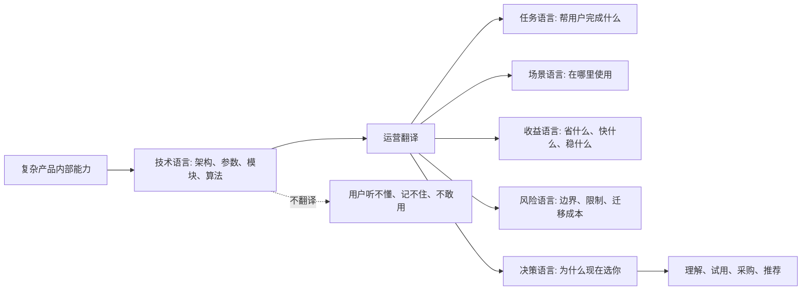
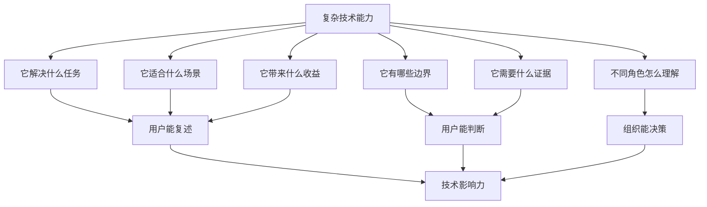

## 产品运营思维筑基课: 产品运营的底层公理: 复杂产品必须被翻译
  
### 作者  
digoal  
  
### 日期  
2026-05-13
  
### 标签  
复杂产品 , 产品翻译 , 技术产品 , 场景语言 , 用户理解 , 产品运营 , 认知降低 , 价值表达 , 技术传播 , 运营公理
  
----  
  
## 背景 

> 面向对象: 高中生、大学生、产品运营新人、技术产品市场与运营同学  
> 核心问题: 为什么复杂产品明明能力很强，用户却听不懂、记不住、不会用、也不愿意买？  
> 先说结论: 复杂产品的价值不会自动被用户理解。产品运营必须把产品内部的技术语言，翻译成用户能判断的任务语言、场景语言、收益语言、风险语言和决策语言。翻译不是把技术说浅，而是把复杂性放到用户能行动的语境里。

## 一张图先看懂



可以用一个简单类比理解:

```text
医生不能只对病人说一串专业术语。
医生要说明: 你哪里出了问题、为什么要治疗、有哪些方案、风险是什么、下一步怎么做。

技术产品运营也是这样:
不能只说技术名词，要把技术和用户的任务、风险、收益连接起来。
```

## 求真讲法

### 它到底说了什么

“复杂产品必须被翻译”说的是:

产品越复杂，用户越不能直接从功能和技术细节里自动看出价值。运营者要在产品能力和用户理解之间搭桥。

这里的“翻译”不是简单改写文案，也不是把技术讲得模糊。它至少包括五种翻译:

| 翻译类型 | 从什么翻译到什么 | 技术产品例子 |
|---|---|---|
| 任务翻译 | 从功能到用户要完成的事 | “向量检索”翻译成“让知识库按语义找答案” |
| 场景翻译 | 从通用能力到具体使用场景 | “实时计算”翻译成“风控规则秒级生效” |
| 收益翻译 | 从技术指标到业务结果 | “延迟降低 50%”翻译成“高峰期页面更快打开” |
| 风险翻译 | 从内部限制到用户决策边界 | “不适合强事务场景”翻译成“账务系统不要这样用” |
| 决策翻译 | 从产品卖点到选择理由 | “兼容 PostgreSQL”翻译成“现有应用迁移成本更低” |

复杂产品如果不被翻译，用户会遇到三层障碍:

```text
听不懂: 不知道这些词是什么意思。
连不上: 不知道这些能力和自己有什么关系。
不敢动: 不知道采用以后有什么成本和风险。
```

### 它是怎么来的

这条公理来自一个现实: 产品团队和用户处在不同的信息世界里。

产品团队长期生活在产品内部，熟悉架构、模块、参数、路线图、竞品差异。用户生活在自己的任务里，关心效率、风险、预算、团队协作、业务结果。双方使用的语言不同。

对产品团队来说，一个词可能很清楚:

```text
Serverless、HTAP、RAG、可观测性、云原生、湖仓一体、自动扩缩容。
```

但对用户来说，他真正想问的是:

```text
这能帮我少招人吗？
能不能让系统更稳？
会不会影响已有业务？
我现在为什么要换？
老板问 ROI 时我怎么解释？
出了问题谁负责？
```

所以，复杂产品需要翻译，是因为“产品内部真实”不等于“用户外部可理解”。运营的价值，就在于把内部真实转化成外部可理解、可验证、可传播、可决策的表达。

这条公理和几个经典思想相通:

- 定位理论强调进入用户心智，而不是只描述产品事实。
- Jobs To Be Done 强调用户关心任务进展，而不是产品本身。
- 技术传播和产品营销强调把复杂能力转化为清楚的价值主张、场景证据和采用路径。

### 它依赖哪些假设

这条公理依赖几个前提:

1. 产品确实存在一定复杂性，用户不能一眼理解全部价值。
2. 用户和产品团队之间存在信息不对称。
3. 用户采用产品需要判断收益、成本和风险。
4. 技术术语本身不能自动形成用户价值。
5. 用户需要把产品价值转述给同事、老板、采购或客户。

如果产品非常简单，比如一把雨伞、一瓶水、一支笔，翻译工作会少很多。但只要产品涉及新概念、多角色、多步骤、高风险或组织决策，翻译就会成为运营的基础工作。

### 常见误解

**误解一: 翻译就是把技术说得简单一点。**

不够。真正的翻译不是“降智”，而是建立映射: 技术能力对应什么任务、什么场景、什么收益、什么边界、什么决策理由。

**误解二: 技术用户不需要翻译。**

不对。技术用户也需要翻译，只是他们需要更精确的翻译。开发者要 API 示例、架构图、性能边界；CTO 要稳定性、成本和路线图；采购要风险和服务承诺。

**误解三: 翻译会损失技术深度。**

不一定。好的翻译会分层表达: 第一层讲清任务价值，第二层讲清技术机制，第三层给出可复验证据。它不是取消深度，而是安排理解顺序。

**误解四: 产品足够好，用户自然会懂。**

通常不会。用户没有义务替产品团队完成理解工作。越是复杂产品，越需要把理解成本从用户身上转移到运营内容、文档、Demo、案例和销售材料里。

## 求存讲法

### 它有什么用

这条公理能帮助技术产品运营避免“技术自嗨”。

如果没有翻译，运营内容常常长这样:

```text
新一代云原生多模态智能数据平台，支持 Serverless 架构、弹性伸缩、向量检索、HTAP、冷热分层、统一元数据管理。
```

这些词不一定错，但用户很难立刻判断:

```text
我是谁？
我为什么需要？
它解决什么具体问题？
和我现在的方案相比好在哪里？
我怎么开始？
风险是什么？
```

翻译后的表达应该更像:

```text
如果你的企业知识库接入大模型后，经常答非所问，
问题可能不在模型，而在检索。
这个方案把关键词检索、向量检索和权限过滤放在同一个数据库里，
让回答更容易命中正确文档，同时减少额外维护一套向量系统的成本。
```

技术没有消失，但它被放到了用户问题里。

### 它怎么迁移到熟悉领域

假设你要向同学解释一道复杂数学题。

低水平解释是:

```text
这里用辅助线、相似三角形、二次函数、判别式，最后代入即可。
```

听起来专业，但对不会的人没帮助。

翻译后的解释是:

```text
这道题表面问长度，其实是在问两个图形之间的比例关系。
先画辅助线，是为了把看不见的比例变成两个相似三角形。
相似关系出来后，长度就能用一个未知数表示。
最后用二次函数，是为了找到这个未知数的取值范围。
```

同样的知识点，但理解顺序变了:

```text
题目目标 -> 隐藏结构 -> 方法选择 -> 计算步骤
```

技术产品也需要这样的顺序:

```text
用户任务 -> 旧方案瓶颈 -> 技术机制 -> 产品能力 -> 证据 -> 行动路径
```

### 它的适用范围和边界

这条公理特别适用于:

- 数据库、AI 平台、云服务、中间件、开发者工具
- 安全、监控、运维、备份、灾备产品
- 企业 SaaS、低代码、数据平台、智能硬件
- 新品类、新概念、多角色决策产品
- 需要技术影响力和品牌影响力的产品

它的边界是:

| 场景 | 翻译重点 | 说明 |
|---|---|---|
| 极简单产品 | 少量翻译 | 直接展示用途即可 |
| 专家对专家 | 精确翻译 | 可以保留术语，但要讲清边界和证据 |
| 面向高层决策者 | 业务翻译 | 强调风险、收益、成本、战略价值 |
| 面向开发者 | 操作翻译 | 强调 API、示例、原理、可复现 |
| 面向采购 | 风险翻译 | 强调合规、服务、价格、责任边界 |
| 极早期新品类 | 分类翻译 | 先解释“这到底是什么”和“为什么需要” |

翻译也有风险。过度简化会误导用户，过度包装会透支信任。技术产品的翻译必须保留边界，不能把“适合某些场景”说成“万能解决方案”。

### 正例: 怎么用它提升能力

假设你运营一个“数据库内置向量检索”能力。

低水平表达是:

```text
我们支持 HNSW、IVFFlat、向量索引、混合检索、Embedding 存储。
```

这对懂的人有信息量，但对多数决策者还不够。可以分层翻译:

| 用户角色 | 他关心什么 | 翻译后的表达 |
|---|---|---|
| 开发者 | 怎么接入 | 用 SQL 存储和查询向量，不必额外维护一套向量服务 |
| 架构师 | 系统是否更简单 | 业务数据、权限过滤、语义检索可以放在同一套数据系统里 |
| 运维 | 是否增加维护负担 | 备份、监控、权限、扩容沿用现有数据库体系 |
| CTO | 为什么值得投入 | 降低 AI 应用的数据系统复杂度和长期维护成本 |
| 采购 | 风险是否可控 | 兼容现有数据库生态，迁移路径清晰，支持服务明确 |

这样同一个技术能力，就被翻译成了不同角色能理解和转述的语言。

如果继续做成运营资产，可以包括:

1. 面向开发者的 10 分钟 Demo。
2. 面向架构师的系统对比图。
3. 面向 CTO 的成本与风险说明。
4. 面向采购的安全、服务和兼容性材料。
5. 面向社区的技术原理文章和可复现实验。

### 反例: 前提不成立会怎样

反例一: 产品复杂，但只堆术语。

某数据平台宣传自己“支持湖仓一体、实时数仓、统一元数据、智能调度、多引擎联邦查询”。目标用户看完后不知道它到底优先解决哪个问题，也不知道应该从哪个场景开始试用。

这里失败的前提是:

```text
技术术语不能自动形成用户价值。
```

反例二: 翻译只讲收益，不讲边界。

某 AI 客服产品把“自动回答客户问题”翻译成“替代 80% 人工客服”。但没有说明适用行业、知识库质量要求、复杂投诉处理边界、人工兜底机制。客户上线后发现复杂问题仍需人工处理，于是认为产品夸大宣传。

这里失败的前提是:

```text
复杂产品的翻译必须包含边界和风险。
```

反例三: 同一套话术对所有角色说。

某安全产品对开发者、CISO、采购、业务负责人都讲同一套“零信任架构、统一安全底座、智能威胁检测”。开发者不知道怎么接入，采购不知道服务边界，业务负责人不知道为什么影响自己，CISO 缺少落地路线图。

这里失败的前提是:

```text
复杂产品通常有多角色决策，翻译必须按角色分层。
```

## 思考

“复杂产品必须被翻译”最重要的启发是: 好运营不是替产品包装一层漂亮话，而是替用户降低理解成本、判断成本和组织沟通成本。

可以用这张图检查一个复杂技术产品是否被翻译清楚:



对技术影响力来说，这条公理意味着:

```text
技术影响力不是让别人觉得你很复杂，
而是让专业用户清楚地理解你的复杂性为什么有价值。
```

对品牌影响力来说，这条公理意味着:

```text
品牌不是把很多能力塞进一个大词，
而是让用户在一个清晰位置上记住你、理解你、转述你。
```

可以进一步追问:

1. 用户能不能用一句话说出我们的产品解决什么任务？
2. 我们的技术词背后有没有对应的场景、收益和证据？
3. 我们是否给不同角色准备了不同层次的表达？
4. 我们有没有诚实说明不适合的场景？
5. 用户拿着我们的材料，能不能说服自己的同事和老板？

## 最后记住

1. 复杂产品的价值不会自动被用户理解，必须被翻译。
2. 翻译不是把技术说浅，而是把技术映射到任务、场景、收益、风险和决策。
3. 技术用户也需要翻译，只是他们需要更准确、更可验证的翻译。
4. 好翻译必须包含边界，否则会透支信任。
5. 技术影响力来自“复杂性被理解”，品牌影响力来自“价值被稳定复述”。

## 参考资料

- Al Ries and Jack Trout, *Positioning: The Battle for Your Mind*, 1981.
- Clayton M. Christensen, Taddy Hall, Karen Dillon, David S. Duncan, “Know Your Customers' Jobs to Be Done”, Harvard Business Review, 2016.
- Geoffrey A. Moore, *Crossing the Chasm*, 1991.
- Donald A. Norman, *The Design of Everyday Things*, revised edition, 2013.
- Chip Heath and Dan Heath, *Made to Stick*, 2007.
- 本文基于技术产品运营、产品营销、开发者关系、技术传播和企业级产品销售支持中的通用经验整理；未使用实时联网资料。
  
#### [PostgreSQL 解决方案集合](../201706/20170601_02.md "40cff096e9ed7122c512b35d8561d9c8")
  
  
#### [德哥 / digoal's Github - 公益是一辈子的事.](https://github.com/digoal/blog/blob/master/README.md "22709685feb7cab07d30f30387f0a9ae")
  
  
#### [About 德哥](https://github.com/digoal/blog/blob/master/me/readme.md "a37735981e7704886ffd590565582dd0")
  
  

  
