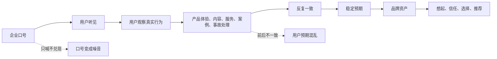
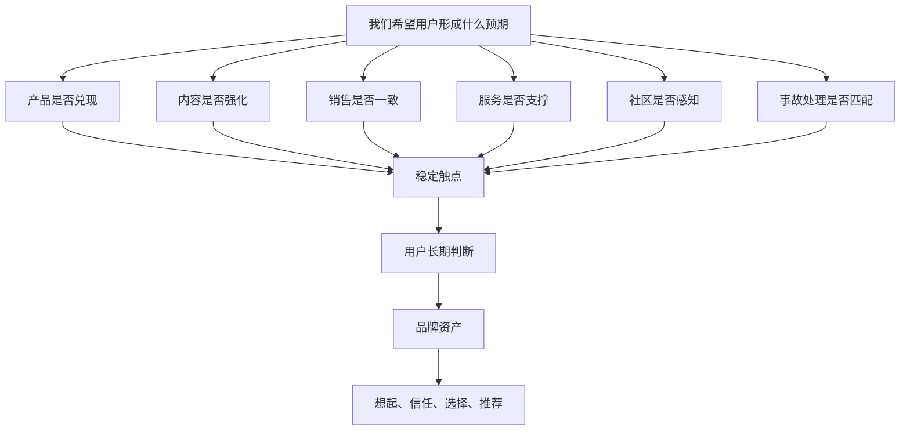

## 产品运营思维筑基课: 产品运营的底层公理: 品牌不是口号，是稳定预期
  
### 作者  
digoal  
  
### 日期  
2026-05-13
  
### 标签  
品牌 , 稳定预期 , 产品运营 , 技术品牌 , 用户心智 , 品牌资产 , 口号误区 , 信任建设 , 一致性 , 运营公理
  
----  
  
## 背景 

> 面向对象: 高中生、大学生、产品运营新人、技术产品市场与运营同学  
> 核心问题: 为什么有些产品天天喊口号，用户仍然记不住、信不过、想不起；而有些产品一句话不多说，用户却自然知道它代表什么？  
> 先说结论: 品牌不是企业自己喊出的口号，而是用户在长期接触中形成的稳定预期。技术产品的品牌尤其如此: 用户相信你会稳定地提供某类能力、坚持某种标准、兑现某种承诺，并在关键场景里自然把你列入候选。

## 一张图先看懂



可以用一个生活类比理解:

```text
一个同学天天说“我很靠谱”，这只是口号。
但如果他每次小组作业都准时交付、说到做到、出问题及时沟通，
大家就会形成稳定预期: 这个人可以托付。

品牌也是这样:
不是你说自己是谁，而是别人长期相信你会怎样表现。
```

## 求真讲法

### 它到底说了什么

“品牌不是口号，是稳定预期”说的是:

品牌的本质不在企业自我表达，而在用户心里的可预期判断。

用户想到一个品牌时，通常会快速产生某种判断:

```text
它贵不贵？
稳不稳？
专不专业？
适不适合我？
出了问题靠不靠谱？
是不是这个领域的代表性选择？
```

这些判断不是一次广告就能建立的，而是由长期一致的产品表现、内容表达、客户案例、服务体验、社区口碑、事故处理和外部评价共同形成。

对技术产品来说，品牌常常体现为几类稳定预期:

| 稳定预期 | 用户心里的意思 | 技术产品例子 |
|---|---|---|
| 技术领先 | 这个团队在关键技术上有深度 | 数据库内核、AI 框架、开发工具 |
| 稳定可靠 | 生产环境可以放心用 | 云服务、监控、备份、安全产品 |
| 开放友好 | 容易接入，社区愿意参与 | 开源项目、开发者平台 |
| 成本可控 | 不会越用越贵或迁移困难 | 云原生、SaaS、数据平台 |
| 行业专业 | 它懂某类行业的复杂问题 | 金融、医疗、制造、政企软件 |
| 服务负责 | 出问题有人响应，有清楚机制 | 企业软件、基础设施产品 |

所以，口号只是品牌表达的一小部分。真正的品牌，是用户在关键时刻不用重新研究太久，就能对你形成相对稳定的预期。

### 它是怎么来的

这条公理来自一个简单事实: 人的大脑需要降低判断成本。

世界上的产品太多，用户不可能每次都从零开始研究。品牌的作用，就是帮助用户快速形成初步判断。比如:

```text
我需要一个稳定的数据库，先想到谁？
我需要一个开发者友好的工具，先想到谁？
我需要一个低成本可扩展方案，先想到谁？
我需要一个安全可靠的企业服务，先想到谁？
```

如果用户对你没有稳定预期，你就很难被想起。即使被看见，也需要重新解释自己是谁、适合什么、凭什么可信。

这条公理和几个经典思想相通:

- 定位理论强调品牌要在用户心智中占据清晰位置。
- 品牌资产理论强调品牌能降低用户选择成本，并形成溢价、偏好和忠诚。
- 信号理论提醒我们，用户会从可观察行为中推断不可完全观察的质量。
- 技术产品营销强调长期一致的证据建设，而不是一次性的宣传爆发。

把这些思想压缩成一句话，就是:

> 品牌是用户对你未来表现的稳定预期。

它不是数学定理，而是产品运营和品牌建设中的基本选择。接受它以后，运营就不能只追短期热闹，而要持续管理用户预期。

### 它依赖哪些假设

这条公理依赖几个前提:

1. 用户面对选择时需要降低判断成本。
2. 用户会根据过去接触推断未来表现。
3. 产品、内容、服务和口碑会共同影响用户预期。
4. 长期一致性比单次口号更能形成记忆。
5. 技术产品的采用风险高，用户更依赖稳定预期来筛选候选。

如果产品是一次性、低风险、低价格、强冲动消费，品牌稳定预期的作用可能弱一些。但只要用户需要长期使用、组织决策、生产采用、预算投入或声誉背书，品牌预期就会变得重要。

### 常见误解

**误解一: 品牌就是一句 slogan。**

不对。Slogan 是表达，品牌是预期。口号可以帮助用户记忆，但如果真实体验和口号不一致，口号反而会加速失信。

**误解二: 品牌就是知名度。**

不够。知名度是“听说过”，品牌是“听说过之后知道你代表什么”。一个产品很有名，但用户不知道它到底适合什么场景，品牌预期仍然不清楚。

**误解三: 品牌是市场部的事。**

错。品牌由所有触点共同塑造: 产品质量、文档、客服、销售、价格、社区、故障处理、版本节奏、创始人表达、客户案例。市场部只能放大和组织这些信号，不能凭空制造长期预期。

**误解四: 技术产品只要技术强，不需要品牌。**

不对。技术越复杂，用户越需要品牌来降低初步筛选成本。品牌不能替代技术，但能让用户愿意认真评估你的技术。

## 求存讲法

### 它有什么用

这条公理能帮助产品运营从“制造口号”转向“管理预期”。

如果只把品牌当口号，运营会问:

```text
我们用什么词显得更厉害？
这次发布会喊什么主题？
海报上的一句话够不够燃？
```

如果把品牌当稳定预期，运营会问:

```text
我们希望用户想到我们时，稳定联想到什么？
我们的产品和服务是否持续兑现这个联想？
每次内容、活动、案例、发布是否在强化同一个预期？
有没有行为正在破坏这个预期？
用户能否用一句话把我们推荐给别人？
```

这会改变运营判断:

| 口号思维 | 稳定预期思维 |
|---|---|
| 追求一句话漂亮 | 追求用户长期能复述 |
| 每次活动换新主题 | 长期强化同一认知位置 |
| 什么热点都蹭 | 只参与和品牌预期相关的议题 |
| 只看曝光量 | 看是否提升想起、信任和选择 |
| 夸大能力吸引注意 | 稳定兑现承诺积累信任 |

### 它怎么迁移到熟悉领域

假设班里有三个同学:

```text
甲同学总说自己很努力，但经常迟交作业。
乙同学很少喊口号，但每次答应的事都准时完成。
丙同学有时表现很好，有时完全失踪。
```

一段时间后，大家会对他们形成不同预期:

```text
甲: 话很多，但不一定兑现。
乙: 稳定靠谱。
丙: 能力可能强，但不可预测。
```

这就是品牌的雏形。它来自重复行为，而不是自我介绍。

技术产品也是一样:

```text
如果你长期发布高质量技术文章、文档清楚、版本稳定、问题响应快，
用户会预期你专业可靠。

如果你每次都喊“革命性突破”，但文档混乱、Bug 多、案例空泛，
用户会预期你营销大于产品。
```

品牌不是说服用户一次，而是让用户在多次接触后形成一致判断。

### 它的适用范围和边界

这条公理特别适用于:

- 技术产品、企业软件、基础设施产品
- 需要长期服务和持续迭代的产品
- 高客单价、高风险、多人决策产品
- 开源项目、开发者工具、云服务、数据库、AI 平台
- 需要技术影响力和品牌影响力的公司

它的边界是:

| 场景 | 品牌稳定预期的重要性 | 说明 |
|---|---:|---|
| 一次性低价小商品 | 较低 | 用户可低成本试错 |
| 强促销商品 | 中等 | 价格可暂时压过品牌判断 |
| 娱乐内容 | 中等 | 新鲜感和情绪价值更强 |
| 开发者工具 | 高 | 文档、体验、社区会形成长期预期 |
| 企业基础设施 | 极高 | 用户需要对稳定性、安全和支持形成预期 |
| 关键行业产品 | 极高 | 品牌预期影响合规、采购和责任判断 |

但也要注意: 稳定预期不是僵化不变。产品可以升级定位、进入新市场、调整叙事，但必须有清楚过渡和连续证据。突然从“低成本工具”跳到“高端企业平台”，用户会困惑。

### 正例: 怎么用它提升能力

假设你运营一个面向开发者的数据库产品，希望建立“开发者友好、生产可靠”的品牌预期。

低水平做法是:

```text
每次宣传都写: 开发者首选、企业级可靠、性能领先。
```

更好的做法是让所有触点持续证明这两个预期:

| 目标预期 | 应该持续做什么 |
|---|---|
| 开发者友好 | 文档清楚、示例完整、安装简单、错误信息可理解 |
| 生产可靠 | 版本节奏稳定、故障复盘透明、备份恢复方案清楚 |
| 技术专业 | 原理文章扎实、Benchmark 可复现、边界说清楚 |
| 社区开放 | Issue 响应、路线图沟通、贡献流程友好 |
| 企业可信 | 客户案例真实、服务承诺明确、安全合规材料完整 |

这样，“开发者友好、生产可靠”就不只是一句口号，而会变成用户反复观察后形成的判断。

进一步说，运营内容也要围绕稳定预期组织:

1. 技术文章强化“专业”。
2. 文档和 Demo 强化“友好”。
3. 客户案例强化“可落地”。
4. 故障复盘强化“负责”。
5. 版本发布强化“持续进化”。

### 反例: 前提不成立会怎样

反例一: 口号很响，但体验相反。

某开发者平台长期宣传“开发者第一”，但文档过期、示例跑不通、SDK 版本混乱、社区问题无人回复。用户实际形成的预期不是“开发者第一”，而是“对开发者不友好”。

这里失败的前提是:

```text
品牌预期来自真实触点，而不是自我声明。
```

反例二: 每次传播都换定位。

某技术产品这个月说自己是“低成本替代方案”，下个月说自己是“高端企业级平台”，再下个月又说自己是“AI 原生基础设施”。每个说法都可能有道理，但缺少连续证据，用户不知道它到底代表什么。

这里失败的前提是:

```text
长期一致性比单次新鲜表达更能形成品牌记忆。
```

反例三: 过度承诺破坏预期。

某 AI 产品宣传“全面替代人工分析师”，但实际只能处理标准化报表和简单问答。用户试用后发现落差很大，即使产品本身有价值，也会觉得品牌不可信。

这里失败的前提是:

```text
稳定预期必须建立在可兑现承诺上。
```

## 思考

“品牌不是口号，是稳定预期”最重要的启发是: 品牌建设不是让用户今天被你打动，而是让用户明天、下个月、明年都能稳定地理解你。

可以用下面这张图检查一个技术产品的品牌预期是否清楚:



对技术影响力来说，这条公理意味着:

```text
技术影响力不是偶尔发一篇深度文章，
而是持续让用户预期你在某个技术问题上有深度、有方法、有证据。
```

对品牌影响力来说，这条公理意味着:

```text
品牌影响力不是用户听过你，
而是用户在特定问题出现时，稳定地想起你、理解你、相信你。
```

可以进一步追问:

1. 用户现在想到我们时，第一反应是什么？
2. 这个反应是我们希望的吗？
3. 我们的产品、内容、销售、服务是否在强化同一个预期？
4. 哪些短期增长动作正在破坏长期品牌预期？
5. 如果用户要把我们推荐给同事，他能否用一句稳定的话说清楚我们？

## 最后记住

1. 口号是企业说的话，品牌是用户形成的稳定预期。
2. 品牌来自长期一致的产品表现、内容表达、服务体验和外部口碑。
3. 技术产品越复杂、风险越高，用户越依赖品牌预期降低选择成本。
4. 稳定预期必须可兑现，过度承诺会反向损伤品牌。
5. 技术影响力和品牌影响力的共同基础，是长期一致地证明“你是谁、你擅长什么、你是否可信”。

## 参考资料

- Al Ries and Jack Trout, *Positioning: The Battle for Your Mind*, 1981.
- David A. Aaker, *Managing Brand Equity*, 1991.
- Kevin Lane Keller, *Strategic Brand Management*, multiple editions.
- Philip Kotler and Kevin Lane Keller, *Marketing Management*, multiple editions.
- Michael Spence, “Job Market Signaling”, 1973.
- Geoffrey A. Moore, *Crossing the Chasm*, 1991.
- 本文基于品牌定位、技术产品运营、B2B 产品营销、开发者关系和企业级产品采购实践中的通用经验整理；未使用实时联网资料。
  
#### [PostgreSQL 解决方案集合](../201706/20170601_02.md "40cff096e9ed7122c512b35d8561d9c8")
  
  
#### [德哥 / digoal's Github - 公益是一辈子的事.](https://github.com/digoal/blog/blob/master/README.md "22709685feb7cab07d30f30387f0a9ae")
  
  
#### [About 德哥](https://github.com/digoal/blog/blob/master/me/readme.md "a37735981e7704886ffd590565582dd0")
  
  

  
