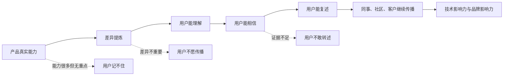
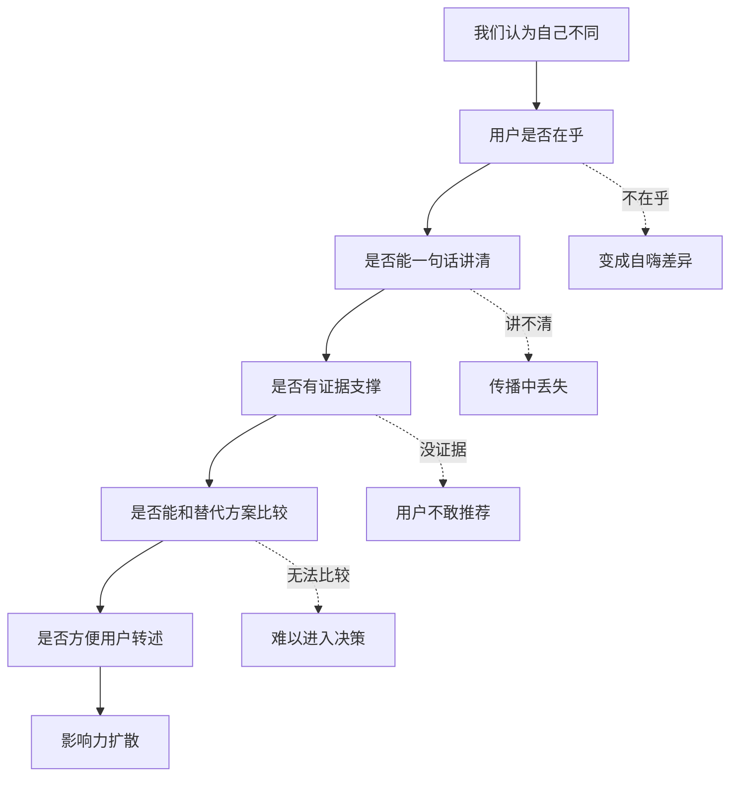

## 产品运营思维筑基课: 产品运营的底层公理: 影响力来自可复述的差异
  
### 作者  
digoal  
  
### 日期  
2026-05-13
  
### 标签  
影响力 , 可复述差异 , 产品定位 , 品牌传播 , 技术产品 , 用户心智 , 差异化 , 内容运营 , 产品运营 , 运营公理
  
----  
  
## 背景 

> 面向对象: 高中生、大学生、产品运营新人、技术产品市场与运营同学  
> 核心问题: 为什么有些产品说了很多，用户还是记不住；有些产品只抓住一个差异，却能被反复提起和推荐？  
> 先说结论: 影响力不是来自你表达了多少信息，而是来自目标用户能不能清楚复述“你和别人有什么不同、这个不同为什么重要、凭什么相信”。技术产品尤其如此: 复杂能力只有变成可复述的差异，才可能进入用户心智、社区讨论和组织决策。

## 一张图先看懂



可以用一句话理解:

```text
别人记住你的，不是你说过的全部内容，
而是他愿意替你说给第三个人听的那一句差异。
```

技术产品也是这样:

```text
“功能很多”不等于有影响力。
“在某个关键任务上，用一种可信方式，比旧方案明显更好”才容易被传播。
```

## 求真讲法

### 它到底说了什么

“影响力来自可复述的差异”说的是:

一个产品要形成影响力，不能只让用户知道“你存在”，还要让用户能说清楚“你为什么不同”。而这个不同，必须足够简单、重要、可信，能被用户转述给别人。

这里有三个关键词:

| 关键词 | 含义 | 反面 |
|---|---|---|
| 差异 | 和替代方案相比，清楚不同 | 什么都做，什么都不突出 |
| 可复述 | 用户能用自己的话讲给别人听 | 只有公司内部才懂 |
| 影响力 | 差异被记住、讨论、比较、推荐 | 只有曝光，没有心智位置 |

对技术产品来说，“可复述的差异”通常不是一句空泛口号，而是一个能被验证的判断:

```text
它适合谁？
解决什么关键问题？
和旧方案或竞品相比，差异在哪里？
这个差异为什么重要？
有什么证据？
```

比如下面两种说法，影响力完全不同:

```text
弱表达: 我们是新一代智能数据平台。
强表达: 我们让 PostgreSQL 用户不用迁移应用，就能获得云原生弹性和企业级管控。
```

第二句话更容易被复述，因为它包含对象、任务、差异和收益。

### 它是怎么来的

这条公理来自传播和决策的现实限制。

第一，人的记忆有限。用户不会记住一大堆功能点，只会记住少数清晰标签。

第二，传播会压缩信息。一个人向同事推荐产品时，不会复述官网全文，只会说一两句他认为最关键的差异。

第三，组织决策需要转述。技术产品常常不是一个人决定，开发者要说服架构师，架构师要说服 CTO，CTO 要说服老板或采购。如果差异不能被转述，就会在组织内部传播过程中丢失。

第四，市场竞争需要比较。用户很少孤立看一个产品，而是在旧方案、竞品、自研、不行动之间比较。没有差异，就很难被选择。

这条公理和几个经典思想相通:

- 定位理论强调产品要在用户心智中占据清晰位置。
- “Made to Stick”强调观点要简单、具体、可信、容易记住。
- 口碑传播理论强调信息必须便于转述，才会扩散。
- B2B 技术营销强调差异化价值主张和可验证证据。

把这些思想压缩成一句话，就是:

> 不能被用户复述的差异，很难变成真正的影响力。

### 它依赖哪些假设

这条公理依赖几个前提:

1. 用户注意力和记忆容量有限。
2. 用户会在多个替代方案之间比较。
3. 影响力需要经过用户、社区、同事、客户的二次传播。
4. 技术产品的采购和采用常常涉及多人决策。
5. 差异必须有证据支撑，否则用户不敢替你转述。

如果产品处于垄断、强渠道控制或强制采购场景，差异的传播作用可能下降。但只要用户有选择，或者产品想建立长期技术影响力和品牌影响力，可复述差异就是核心资产。

### 常见误解

**误解一: 差异就是别人没有的功能。**

不一定。功能不同只是差异的一种。真正有传播力的差异，必须和用户任务有关。一个别人没有但用户不在乎的功能，不会形成影响力。

**误解二: 可复述就是写一句好 slogan。**

不够。Slogan 只是表达形式。可复述差异必须背后有产品事实、场景价值和可信证据，否则用户不敢说给别人听。

**误解三: 差异越多越好。**

通常相反。差异太多会稀释记忆。运营要把大量能力组织成一个主差异，再用次级证据支撑，而不是让用户记住十几个卖点。

**误解四: 技术产品不需要简单表达，懂的人自然懂。**

不对。技术用户需要准确表达，不等于不要清晰表达。越是复杂技术，越需要一个可转述的主线，否则内部决策链会断。

## 求存讲法

### 它有什么用

这条公理能帮助产品运营从“堆卖点”转向“提炼可传播差异”。

如果没有这条公理，运营内容容易变成:

```text
高性能、高可靠、高可用、云原生、智能化、一体化、低成本、易扩展、安全合规、生态开放。
```

这些词都可能正确，但用户很难复述。因为它们没有明确回答:

```text
到底谁最该用？
最关键的不同是什么？
为什么这个不同重要？
证据在哪里？
我该怎么向别人解释？
```

可复述差异应该接近这个结构:

```text
对于 [目标用户]，
在 [关键任务/场景] 中，
我们通过 [独特机制/能力]，
比 [旧方案/替代方案] 更好地实现 [重要结果]，
证据是 [案例/数据/机制/体验]。
```

例如:

```text
对于已经大量使用 PostgreSQL 的企业，
在希望获得云原生弹性但又不想重写应用的场景中，
这个数据库通过高度兼容 PostgreSQL 协议和生态，
比重新选型一套新数据库更低迁移成本，
证据是现有应用、SQL、驱动和工具链可以大幅复用。
```

这类表达更长，但更容易被组织内部转述和判断。

### 它怎么迁移到熟悉领域

假设班里有几位同学都说自己学习好:

```text
甲: 我各科都不错。
乙: 我数学特别强，尤其擅长把复杂题拆成简单步骤。
丙: 我考试发挥稳定，但讲题不太行。
```

如果老师要找人给同学讲题，乙更容易被想起。不是因为乙一定整体最强，而是因为他的差异清楚、具体、可复述。

产品也是一样。

如果一个产品说:

```text
我们功能全面，性能强大，体验优秀。
```

用户很难替它传播。

如果它说:

```text
我们专门帮小团队在一天内搭好可用的内部审批系统，不需要写后端代码。
```

用户就更容易说给别人听:

```text
你们不是要快速做审批吗？有个工具就是干这个的。
```

影响力不是来自面面俱到，而是来自“别人知道什么时候该想起你”。

### 它的适用范围和边界

这条公理特别适用于:

- 技术产品定位
- 开源项目传播
- 开发者工具增长
- B2B 产品市场
- 企业级产品销售支持
- 技术品牌影响力建设
- 新品类或强竞争市场

它的边界是:

| 场景 | 差异的作用 | 说明 |
|---|---:|---|
| 垄断产品 | 较低 | 用户选择少，差异不是主要驱动 |
| 强渠道产品 | 中等 | 渠道能带来采用，但长期仍需清晰认知 |
| 低价冲动消费 | 中等 | 情绪和价格可能更重要 |
| 开源项目 | 高 | 社区传播高度依赖一句话说明项目价值 |
| 技术基础设施 | 高 | 多人决策需要可转述的差异 |
| 新品类产品 | 极高 | 用户需要先理解“你到底新在哪里” |

还要注意: 差异不能为了差异而差异。一个差异如果不重要、不可信、不可持续，反而会误导运营。真正有价值的差异，要同时满足:

```text
用户在乎 + 你确实能做到 + 竞争对手不容易复制 + 用户能讲清楚
```

### 正例: 怎么用它提升能力

假设你运营一个面向 AI 应用开发者的数据库产品。

低水平表达是:

```text
我们支持向量检索、全文检索、JSON、SQL、事务、权限、备份、弹性扩缩容。
```

这些能力很多，但用户不一定知道主差异是什么。

可以提炼为:

```text
我们让开发者在熟悉的 SQL 数据库里构建 RAG 应用，不必额外维护一套割裂的向量系统。
```

这句话可复述，因为它包含:

| 组成 | 内容 |
|---|---|
| 目标用户 | 开发者 |
| 任务 | 构建 RAG 应用 |
| 差异 | 在熟悉的 SQL 数据库里完成 |
| 替代方案 | 额外维护一套向量系统 |
| 价值 | 降低系统复杂度和维护成本 |

然后运营资产围绕这条差异展开:

1. 技术文章: 为什么 RAG 不只是向量检索，还涉及权限、过滤、更新和一致性。
2. Demo: 用 SQL 完成文档入库、向量检索、权限过滤和结果召回。
3. 对比图: 数据库内置向量能力与独立向量服务的适用边界。
4. 案例: 一个团队如何减少系统组件并降低运维复杂度。
5. 证据: 性能测试、架构说明、迁移指南、失败边界。

这样影响力就不会散落在功能点里，而会集中到一个可复述差异上。

### 反例: 前提不成立会怎样

反例一: 有能力，但差异不可复述。

某云平台同时宣传低成本、高性能、安全、AI 原生、生态开放、国产可控、开发者友好。每个点都写了一篇文章，但没有主线。用户看完后只记得“它好像什么都做”，却说不出为什么要优先选择它。

这里失败的前提是:

```text
用户注意力和记忆容量有限，不能同时记住大量平行卖点。
```

反例二: 差异能复述，但用户不在乎。

某开发工具强调“拥有行业最丰富的界面皮肤系统”。这句话很清楚，也容易复述。但目标用户真正关心的是代码生成质量、团队协作、权限、安全和集成能力。差异虽然存在，却不是关键任务差异。

这里失败的前提是:

```text
可复述差异必须和用户重要任务有关。
```

反例三: 差异很吸引人，但证据不足。

某数据库产品声称“比传统数据库快 100 倍”。这句话极易传播，但没有说明测试场景、数据规模、硬件环境、查询类型和复现方法。技术用户不敢把它转述给团队，因为一旦被追问就无法支撑。

这里失败的前提是:

```text
技术产品的可复述差异必须有证据，否则传播会停在围观层。
```

## 思考

“影响力来自可复述的差异”最重要的启发是: 产品运营不是把所有优点都说出来，而是帮助市场形成一个清楚、可信、可传播的判断。

可以用这张图检查一个技术产品的差异是否有传播力:



对技术影响力来说，这条公理意味着:

```text
技术影响力不是让别人知道你技术很多，
而是让别人能清楚说出你在哪个关键问题上有独特解法。
```

对品牌影响力来说，这条公理意味着:

```text
品牌影响力不是让用户记住你的名字，
而是让用户能把你的名字和一个清楚差异稳定绑定。
```

可以进一步追问:

1. 如果用户只能记住一句话，我们希望他记住什么？
2. 这句话是否包含目标用户、关键任务、替代方案和差异结果？
3. 用户是否愿意把这句话说给同事听？
4. 被追问“凭什么”时，我们有什么证据？
5. 这个差异是否能长期支撑内容、案例、活动、销售和产品路线？

## 最后记住

1. 影响力不是信息量，而是可复述的差异。
2. 好差异要满足: 用户在乎、你能做到、证据可信、别人能讲清。
3. 技术产品不能只堆功能，要提炼一个能被组织内部传播的主差异。
4. 没有证据的差异只会带来围观，不会带来信任和采用。
5. 品牌影响力的高阶形态，是用户把你的名字和一个清楚差异稳定绑定。

## 参考资料

- Al Ries and Jack Trout, *Positioning: The Battle for Your Mind*, 1981.
- Chip Heath and Dan Heath, *Made to Stick*, 2007.
- Geoffrey A. Moore, *Crossing the Chasm*, 1991.
- Everett M. Rogers, *Diffusion of Innovations*, 1962.
- Philip Kotler and Kevin Lane Keller, *Marketing Management*, multiple editions.
- 本文基于定位理论、技术产品运营、B2B 产品营销、开发者关系、口碑传播和企业级产品销售支持中的通用经验整理；未使用实时联网资料。
  
#### [PostgreSQL 解决方案集合](../201706/20170601_02.md "40cff096e9ed7122c512b35d8561d9c8")
  
  
#### [德哥 / digoal's Github - 公益是一辈子的事.](https://github.com/digoal/blog/blob/master/README.md "22709685feb7cab07d30f30387f0a9ae")
  
  
#### [About 德哥](https://github.com/digoal/blog/blob/master/me/readme.md "a37735981e7704886ffd590565582dd0")
  
  

  
