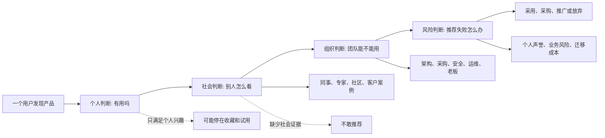
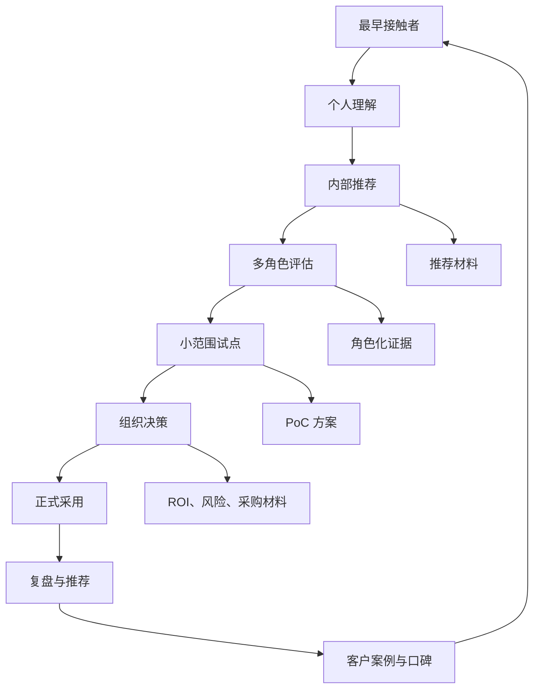

## 产品运营思维筑基课: 产品运营的底层公理: 采用行为是社会化的
  
### 作者  
digoal  
  
### 日期  
2026-05-13
  
### 标签  
采用行为 , 社会化 , 产品运营 , 技术采纳 , 社会证明 , 组织决策 , 口碑传播 , 用户群体 , 品牌影响力 , 运营公理
  
----  
  
## 背景 

> 面向对象: 高中生、大学生、产品运营新人、技术产品市场与运营同学  
> 核心问题: 为什么一个用户觉得产品不错，却不一定会真正采用；为什么技术产品的增长不能只盯着单个用户点击和注册？  
> 先说结论: 产品采用很少是一个人的孤立决定，尤其是技术产品。用户会参考同事、专家、社区、客户案例、行业共识和组织流程，也会考虑自己推荐失败后的声誉风险。产品运营要让用户“不只是自己理解”，还要能说服别人、获得支持、降低集体决策风险。

## 一张图先看懂



可以用一个学校里的例子理解:

```text
你发现一个学习工具很好用，不代表全班都会用。
你还要让同学相信它有用，让老师允许使用，让小组成员愿意配合。
如果你推荐失败，大家还可能觉得你判断不准。
```

技术产品也是这样:

```text
一个开发者喜欢某个工具，不等于公司会采用。
他还要说服架构师、运维、安全、采购、老板和未来维护这个系统的人。
```

## 求真讲法

### 它到底说了什么

“采用行为是社会化的”说的是:

用户采用产品时，尤其是采用复杂技术产品时，不只看自己的感受，还会看周围人的判断、组织的约束、行业的共识和推荐失败的后果。

这里的“社会化”不是只指社交媒体传播，而是指采用行为嵌在关系网络和组织结构中。

技术产品采用通常涉及多种角色:

| 角色 | 他关心什么 | 对采用的影响 |
|---|---|---|
| 开发者 | 好不好用、文档清不清楚、接入快不快 | 发现和试用 |
| 架构师 | 是否匹配系统架构、是否可扩展 | 技术选型 |
| 运维/SRE | 是否稳定、可观测、可恢复 | 生产运行 |
| 安全/合规 | 数据、权限、审计、合规风险 | 准入审核 |
| 业务负责人 | 是否提升效率、降低成本、支持目标 | 业务推动 |
| 采购/财务 | 价格、合同、服务、供应商风险 | 采购落地 |
| 高层管理者 | 战略价值、长期风险、组织收益 | 最终背书 |

所以，产品运营不能只回答一个人的问题，而要帮助不同角色形成共同判断。

### 它是怎么来的

这条公理来自一个现实: 人的选择会受他人影响，组织的选择更是集体行为。

个人消费者买一个低价小商品，可以很快决定。但技术产品通常有几个特点:

1. 影响多人工作流。
2. 进入生产系统或业务流程。
3. 需要长期维护。
4. 涉及预算和采购。
5. 失败后会影响推荐人的专业声誉。

因此，用户在采用之前会自然问:

```text
有没有别人用过？
有没有类似公司成功过？
社区活跃吗？
专家怎么看？
出了问题团队能不能接住？
我推荐给老板，会不会被质疑？
```

这条公理和几个经典思想相通:

- 创新扩散理论强调新技术采用会通过社会系统传播。
- 社会证明原则说明人会参考他人的行为来判断选择是否可靠。
- 跨越鸿沟理论指出，早期采用者和主流客户的采用依据不同，主流客户更看重完整方案和同类案例。
- B2B 采购理论强调企业购买通常是多人、多部门、多阶段决策。

把这些思想压缩成一句话，就是:

> 用户不是只在替自己选择产品，也是在替自己所在的关系网络和组织承担判断责任。

### 它依赖哪些假设

这条公理依赖几个前提:

1. 产品采用会影响不止一个人。
2. 用户需要说服或协调其他角色。
3. 用户会参考外部证据和他人经验。
4. 推荐失败会带来声誉、时间或业务损失。
5. 技术产品采用存在组织流程和风险审查。

如果产品是完全个人化、低风险、低价格、一次性使用的小工具，社会化程度会较低。但只要产品涉及团队协作、业务系统、预算、数据、安全、长期维护，采用就会显著社会化。

### 常见误解

**误解一: 用户喜欢，就会采用。**

不一定。用户喜欢只说明个人兴趣成立。技术产品还要经过团队配合、技术评估、安全审查、预算审批和内部说服。

**误解二: 有一个决策人就够了。**

不够。即使老板拍板，使用者、维护者、安全团队和采购流程也会影响落地。忽视任何关键角色，都可能导致采用失败。

**误解三: 社会化采用就是做社群运营。**

不完全。社群是社会化的一种形式，但还包括客户案例、专家评测、行业会议、同事推荐、内部分享材料、PoC 报告、采购模板、技术白皮书。

**误解四: 技术产品只要文档好，开发者自然会推动。**

文档重要，但开发者还需要能说服别人的材料。比如架构图、风险说明、成本测算、迁移方案、案例、对比表、失败边界。

## 求存讲法

### 它有什么用

这条公理能帮助产品运营从“单用户转化”升级到“多角色采用”。

如果只看单用户，运营会问:

```text
有多少人访问官网？
有多少人注册？
有多少人下载？
有多少人跑通 Demo？
```

这些指标有用，但不足够。社会化采用还要问:

```text
用户能不能把产品讲给同事听？
有没有材料帮他内部推动？
有没有同类客户案例降低风险？
社区和专家是否提供外部背书？
不同角色的顾虑是否被回答？
PoC 到采购之间的组织障碍是什么？
```

技术产品运营要准备“让别人帮你说服别人”的材料:

| 场景 | 用户需要什么材料 |
|---|---|
| 开发者向团队推荐 | 10 分钟 Demo、接入教程、API 示例 |
| 架构师评估 | 架构图、性能边界、对比分析 |
| 运维评估 | 监控、备份、故障恢复、SLA |
| 安全审查 | 权限模型、审计、合规、安全白皮书 |
| 老板审批 | ROI、成本收益、行业案例 |
| 采购流程 | 报价、服务承诺、合同条款、供应商资质 |

### 它怎么迁移到熟悉领域

假设你想让班级采用一个新的协作工具做小组作业。

你自己觉得它好用还不够。你还要面对:

```text
同学: 学起来麻烦吗？
组长: 能不能看到每个人进度？
老师: 会不会影响提交格式？
不熟悉电脑的同学: 我会不会用不明白？
```

如果你只说“这个工具很先进”，大家未必愿意用。

更有效的做法是:

1. 给同学看一个简单示例。
2. 告诉组长如何分配任务。
3. 告诉老师如何导出结果。
4. 给不熟悉的人准备操作步骤。
5. 先在一个小组试用，再把成功经验分享给全班。

这就是社会化采用: 让不同角色都觉得“这件事对我可行，对我们也可行”。

### 它的适用范围和边界

这条公理特别适用于:

- B2B 产品
- 技术基础设施
- 企业 SaaS
- 开发者工具
- 开源项目进入企业使用
- 数据库、云服务、AI 平台、安全、监控、运维产品
- 需要技术影响力和品牌影响力的产品

它的边界是:

| 场景 | 社会化程度 | 说明 |
|---|---:|---|
| 个人娱乐应用 | 较低到中等 | 朋友推荐有用，但个人可快速决定 |
| 低价个人工具 | 较低 | 个人试错成本低 |
| 开源开发工具 | 中等到高 | 个人可试用，团队采用仍需共识 |
| 企业 SaaS | 高 | 多角色、多部门、多流程 |
| 数据库/云/安全产品 | 极高 | 影响系统稳定、安全和长期成本 |
| 行业标准型产品 | 极高 | 采用受生态、合规、伙伴和行业共识影响 |

需要注意的是，社会化采用不是讨好所有人。一个产品仍要有清晰目标用户。运营要做的是识别关键影响者和阻碍者，而不是为每个边缘角色写一套完整叙事。

### 正例: 怎么用它提升能力

假设你运营一个企业级 AI 开发平台，希望推动客户从个人试用走向团队采用。

低水平做法是:

```text
只优化注册页和免费试用按钮。
```

这能提高个人试用，但未必能推动组织采用。

更符合社会化采用的做法是:

1. 给开发者: 快速上手教程、SDK 示例、真实项目模板。
2. 给架构师: 系统架构图、部署模式、扩展性说明。
3. 给安全团队: 数据隔离、权限、审计、模型调用边界。
4. 给业务负责人: 提效场景、成本收益、上线周期。
5. 给采购: 版本价格、服务 SLA、供应商资质。
6. 给内部推动者: 一页纸推荐材料、PoC 计划、汇报模板。

这时，最早发现产品的人不再孤军奋战。他可以拿着材料去说服团队，团队也能围绕同一套证据讨论。

技术影响力也会从“一个人觉得不错”变成“一群人愿意认真评估”。

### 反例: 前提不成立会怎样

反例一: 产品只打动开发者，没有打动组织。

某开源工具在开发者社区很受欢迎，安装简单、体验好。但企业采用时发现缺少权限管理、审计日志、长期支持和故障响应机制。开发者喜欢，却无法说服公司在生产环境使用。

这里失败的前提是:

```text
技术产品采用会影响不止一个人，组织角色的顾虑必须被回答。
```

反例二: 有客户案例，但没有相似性。

某产品展示了很多大客户 Logo，但目标客户是中型制造企业。案例没有说明行业、规模、部署方式、使用场景和结果。用户无法判断“别人用过”和“我也适合用”之间的关系。

这里失败的前提是:

```text
社会证明必须和用户场景相似，才能降低采用风险。
```

反例三: 用户愿意推荐，但没有转述材料。

一个技术负责人试用某数据库后觉得不错，想推荐给团队。但官网材料只有营销口号，没有架构对比、迁移清单、风险边界、成本测算。开会时被同事追问，他无法支撑自己的推荐，只好暂缓。

这里失败的前提是:

```text
用户需要材料替他完成内部说服。
```

## 思考

“采用行为是社会化的”最重要的启发是: 产品运营不是只让一个人喜欢你，而是帮助一群人围绕你形成共识。

可以用这张图检查技术产品的社会化采用路径:



对技术影响力来说，这条公理意味着:

```text
技术影响力不是只有单个技术人认可，
而是能进入团队讨论、社区比较、专家评价和组织决策。
```

对品牌影响力来说，这条公理意味着:

```text
品牌影响力不是用户私下觉得不错，
而是用户愿意在公开或组织场合替你背书。
```

可以进一步追问:

1. 谁是最早发现产品的人？
2. 谁会影响他能不能真正采用？
3. 每个角色最担心什么？
4. 我们有没有帮内部推动者准备转述材料？
5. 有没有相似客户案例和外部社会证据？
6. 如果用户推荐失败，他会承担什么声誉风险？

## 最后记住

1. 技术产品采用很少是一个人的孤立决定。
2. 用户不仅要自己理解产品，还要能说服同事、团队、老板和采购。
3. 社会证明必须相似、具体、可信，空泛 Logo 墙不够。
4. 好运营要准备“让别人帮你说服别人”的材料。
5. 技术影响力和品牌影响力的高阶表现，是用户愿意在组织和社区里替你背书。

## 参考资料

- Everett M. Rogers, *Diffusion of Innovations*, 1962.
- Robert B. Cialdini, *Influence: The Psychology of Persuasion*, 1984.
- Geoffrey A. Moore, *Crossing the Chasm*, 1991.
- Philip Kotler and Kevin Lane Keller, *Marketing Management*, multiple editions.
- Brent Adamson, Matthew Dixon, Nicholas Toman, “The End of Solution Sales”, Harvard Business Review, 2012.
- 本文基于创新扩散、社会证明、B2B 采购、开发者关系、技术产品运营和企业级销售支持中的通用经验整理；未使用实时联网资料。
  
#### [PostgreSQL 解决方案集合](../201706/20170601_02.md "40cff096e9ed7122c512b35d8561d9c8")
  
  
#### [德哥 / digoal's Github - 公益是一辈子的事.](https://github.com/digoal/blog/blob/master/README.md "22709685feb7cab07d30f30387f0a9ae")
  
  
#### [About 德哥](https://github.com/digoal/blog/blob/master/me/readme.md "a37735981e7704886ffd590565582dd0")
  
  

  
