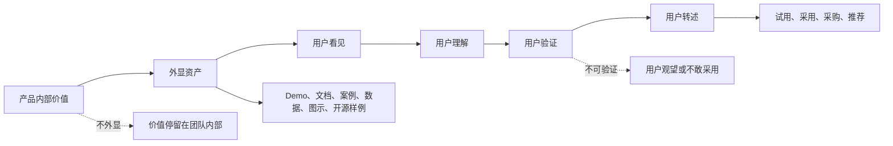
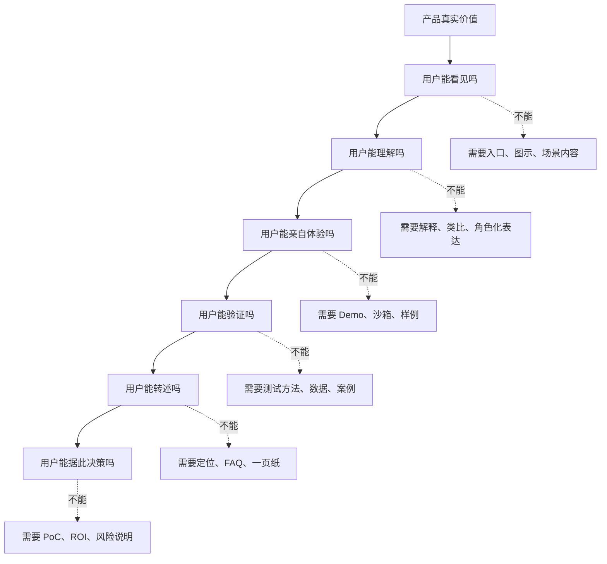

## 产品运营思维筑基课: 产品运营的底层公理: 产品价值必须被外显
  
### 作者  
digoal  
  
### 日期  
2026-05-13
  
### 标签  
产品价值 , 价值外显 , 产品运营 , 技术产品 , 用户感知 , 可视化证据 , 转化路径 , 价值表达 , 品牌影响力 , 运营公理
  
----  
  
## 背景 

> 面向对象: 高中生、大学生、产品运营新人、技术产品市场与运营同学  
> 核心问题: 为什么一个产品明明很有价值，用户却感知不到、相信不了、也不愿意采用？  
> 先说结论: 产品价值如果只藏在代码、架构、团队经验或内部能力里，就很难被用户感知。产品运营要把价值外显成用户能看见、能理解、能验证、能转述、能用于决策的证据资产。技术产品尤其如此: 看不见的能力，必须变成可观察的 Demo、文档、数据、案例、图示和实践路径。

## 一张图先看懂



可以用一个生活类比理解:

```text
一个学生说自己数学很好，这只是声明。
如果他能讲清解题过程、展示错题本、做出示范题、解释为什么这样做，
别人才能看见他的能力。

产品也是一样:
价值不能只说“我们很强”，而要让用户看见“强在哪里、怎么验证、怎么使用”。
```

## 求真讲法

### 它到底说了什么

“产品价值必须被外显”说的是:

产品真正有价值，不等于用户能感知到价值。用户只能根据自己接触到的外部信号来判断产品。

这里的“外显”不是夸大宣传，而是把内部价值转化为外部可观察证据。

| 内部价值 | 外显方式 | 用户获得的判断 |
|---|---|---|
| 架构设计好 | 架构图、技术文章、设计说明 | 为什么它更稳、更快或更易扩展 |
| 性能更强 | Benchmark、测试方法、复现实验 | 指标是否可信，是否适合自己场景 |
| 易用性好 | Demo、教程、交互视频、示例项目 | 自己能不能快速上手 |
| 稳定可靠 | SLA、故障复盘、压测报告、版本节奏 | 能不能进入生产环境 |
| 生态完善 | 插件、集成清单、开源样例、社区贡献 | 接入成本和长期可用性 |
| 客户价值真实 | 案例、访谈、前后对比、指标变化 | 是否和自己的问题相似 |

对技术产品来说，用户无法直接看见内部代码质量、架构取舍、工程能力和团队经验。他只能通过文档、接口、Demo、案例、社区响应、测试数据、版本记录等外部证据推断。

所以，运营要解决的不是“让产品看起来有价值”，而是“让真实价值变得可见、可懂、可信、可用”。

### 它是怎么来的

这条公理来自信息不对称。

产品团队知道自己做了什么:

```text
代码重构了、性能优化了、架构更稳了、故障恢复更快了、权限模型更细了。
```

但用户并不知道。用户只能看到:

```text
官网怎么说、文档是否清楚、Demo 是否跑得通、案例是否真实、社区是否有人回应、测试数据是否可信。
```

如果产品价值没有外显，市场会出现几种错位:

1. 好产品被低估。
2. 用户不知道适合什么场景。
3. 销售和运营只能靠口号解释。
4. 技术团队的努力无法沉淀成品牌资产。
5. 用户内部推动时缺少证据材料。

这条公理和几个经典思想相通:

- 信号理论说明，在信息不对称下，外部信号会帮助用户推断真实质量。
- 品牌资产理论强调用户对品牌的认知来自长期触点和可感知体验。
- 技术传播和产品营销强调把能力转化为可理解、可验证、可传播的内容资产。
- 开发者关系强调 Demo、文档、示例和社区互动是技术产品价值被感知的关键路径。

把这些思想压缩成一句话，就是:

> 没有外显的价值，很难成为用户认知中的价值。

### 它依赖哪些假设

这条公理依赖几个前提:

1. 用户无法直接观察产品的全部内部质量。
2. 用户需要证据来判断产品是否值得采用。
3. 技术产品的价值往往复杂、隐性、延迟显现。
4. 用户采用产品前，需要向同事、老板或采购转述价值。
5. 外显资产能降低理解成本、验证成本和组织沟通成本。

如果产品价值非常直观，比如一把椅子坐上去是否舒服、一盏灯是否明亮，外显成本会低一些。但只要产品价值藏在系统能力、长期稳定性、复杂工作流或组织收益里，就必须主动外显。

### 常见误解

**误解一: 外显就是宣传。**

不对。宣传可以没有证据，外显必须让价值可观察、可理解、可验证。技术产品的外显更接近“把证据摆出来”，而不是“把形容词堆起来”。

**误解二: 产品好，用户自然会发现。**

通常不会。用户注意力有限，也没有义务替你做研究。好产品如果没有清楚入口、文档、案例和证据，很可能被忽略。

**误解三: 外显只需要官网和发布稿。**

不够。官网和发布稿只是入口。技术产品还需要 Demo、教程、架构图、API 示例、测试报告、迁移指南、客户案例、FAQ、社区讨论等多种资产。

**误解四: 外显越多越好。**

不一定。外显要围绕用户任务和决策路径组织。如果资产很多但没有主线，用户仍然不知道从哪里看、看完如何判断。

## 求存讲法

### 它有什么用

这条公理能帮助产品运营从“说价值”转向“呈现价值”。

如果只说价值，运营内容常常是:

```text
我们性能领先、稳定可靠、简单易用、生态完善、企业级安全。
```

如果外显价值，就要回答:

```text
性能领先怎么测？
稳定可靠有什么证据？
简单易用能不能 10 分钟跑通？
生态完善有哪些集成？
企业级安全有哪些权限、审计和合规说明？
客户真的获得了什么结果？
```

技术产品的外显资产可以分成六类:

| 资产类型 | 解决什么问题 | 例子 |
|---|---|---|
| 理解资产 | 让用户知道你解决什么 | 场景文章、架构图、概念解释 |
| 体验资产 | 让用户亲手感受价值 | Demo、沙箱、示例项目 |
| 验证资产 | 让用户判断是否可信 | Benchmark、测试脚本、复现实验 |
| 决策资产 | 帮用户内部推动 | 对比表、ROI、PoC 清单、汇报材料 |
| 信任资产 | 降低采用风险 | 客户案例、SLA、故障复盘、安全白皮书 |
| 传播资产 | 方便用户转述 | 一句话定位、图示、FAQ、短视频、演讲稿 |

### 它怎么迁移到熟悉领域

假设你要申请加入学校的科技社团。

你只说:

```text
我编程能力很强，也很有责任心。
```

别人未必相信。

如果你把价值外显出来:

```text
我做过一个课程表小程序，这是代码仓库；
这里是功能演示；
这里是我修复 Bug 的记录；
这里是同学使用后的反馈；
如果加入社团，我可以负责报名系统的表单和后台。
```

这时，别人能看见、理解、验证你的价值。

技术产品也是一样。比如一个数据库产品不能只说“稳定可靠”，而要展示:

```text
如何备份恢复；
如何监控告警；
故障切换耗时；
真实客户如何部署；
不同数据规模下性能如何变化；
版本升级如何回滚。
```

价值一旦外显，就更容易被理解、相信和传播。

### 它的适用范围和边界

这条公理特别适用于:

- 技术产品
- B2B 产品
- 开源项目
- 开发者工具
- 数据库、云服务、AI 平台、安全、运维、监控产品
- 需要技术影响力和品牌影响力的产品

它的边界是:

| 场景 | 外显重点 | 说明 |
|---|---|---|
| 简单消费品 | 体验外显 | 直接试用、展示效果即可 |
| 娱乐产品 | 感受外显 | 预告、试玩、用户评价很重要 |
| 开发者工具 | 操作外显 | 文档、API、Demo、示例项目最关键 |
| 企业 SaaS | 结果外显 | 案例、流程、ROI、权限、服务 |
| 基础设施产品 | 风险外显 | 稳定性、安全、性能、恢复、边界 |
| 新品类产品 | 认知外显 | 先解释问题、类别、方法和适用场景 |

但外显也有边界。不能为了外显而泄露客户隐私、暴露安全细节、夸大指标或制造不可复现的表演。技术产品的外显必须诚实、可验证、可持续。

### 正例: 怎么用它提升能力

假设你运营一个面向企业的 RAG 数据平台。

低水平表达是:

```text
我们帮助企业快速构建高质量 AI 知识库。
```

这句话可以作为入口，但不够外显。用户还不知道你如何做到。

更好的外显路径是:

1. 问题外显: 写清企业知识库为什么会答非所问，问题在文档质量、切分、检索、权限和更新链路。
2. 机制外显: 用架构图说明文档入库、向量化、混合检索、权限过滤、答案生成的流程。
3. 体验外显: 提供一个可运行 Demo，让用户上传文档并看到检索结果。
4. 证据外显: 给出命中率、延迟、成本、数据规模的测试方法和结果。
5. 边界外显: 说明对低质量文档、强实时数据、复杂权限体系的限制和处理方案。
6. 决策外显: 提供 PoC 清单、部署架构、安全说明和内部汇报模板。

这时，用户不是被要求“相信你很强”，而是能一步步观察产品价值。

### 反例: 前提不成立会怎样

反例一: 产品价值真实，但没有外显。

某运维平台的告警降噪能力确实很强，内部算法能减少大量无效告警。但官网只写“智能告警、全面可观测”。没有展示告警前后对比、规则解释、误报率、接入示例和真实案例。用户看不出它和普通监控产品有什么不同。

这里失败的前提是:

```text
用户无法直接观察产品内部能力，需要外显证据来判断价值。
```

反例二: 外显只有结果，没有方法。

某数据库产品宣称“性能提升 10 倍”，但没有说明硬件环境、数据规模、查询类型、配置参数和复现脚本。这个结果看起来很强，却无法被技术用户认真评估。

这里失败的前提是:

```text
技术产品的价值外显必须可验证，而不只是展示结果。
```

反例三: 外显资产很多，但没有主线。

某 AI 平台有几十篇文章、很多活动视频、多个 Demo 和大量白皮书，但每个材料讲的主题不同。用户找不到最短理解路径，也不知道应该先看哪一个、看完如何试用。

这里失败的前提是:

```text
外显资产必须围绕用户任务和决策路径组织。
```

## 思考

“产品价值必须被外显”最重要的启发是: 运营不是替产品制造幻觉，而是把真实价值变成用户能感知和判断的证据系统。

可以用这张图检查一个技术产品的价值是否外显充分:



对技术影响力来说，这条公理意味着:

```text
技术影响力不是内部技术真的强就够了，
而是强的地方被专业用户看见、理解、验证和引用。
```

对品牌影响力来说，这条公理意味着:

```text
品牌影响力不是反复说自己有价值，
而是用户在多个触点持续看见可兑现的价值证据。
```

可以进一步追问:

1. 我们最重要的产品价值，用户是否真的看得见？
2. 用户能不能在 10 分钟内体验到一个关键价值？
3. 我们的性能、稳定、安全、易用是否有可验证证据？
4. 用户拿什么材料去说服同事、老板和采购？
5. 哪些内部能力很强，但还没有变成外部资产？

## 最后记住

1. 产品有价值，不等于用户能感知到价值。
2. 技术产品的价值必须外显为 Demo、文档、数据、案例、图示和可复验证据。
3. 外显不是夸大宣传，而是让真实价值可见、可懂、可信、可用。
4. 好的外显资产要围绕用户任务和决策路径组织。
5. 技术影响力和品牌影响力，来自用户持续看见并验证你的真实价值。

## 参考资料

- Michael Spence, “Job Market Signaling”, 1973.
- David A. Aaker, *Managing Brand Equity*, 1991.
- Kevin Lane Keller, *Strategic Brand Management*, multiple editions.
- Geoffrey A. Moore, *Crossing the Chasm*, 1991.
- Donald A. Norman, *The Design of Everyday Things*, revised edition, 2013.
- 本文基于信号理论、品牌资产、技术产品运营、开发者关系、产品营销和企业级采购支持中的通用经验整理；未使用实时联网资料。
  
#### [PostgreSQL 解决方案集合](../201706/20170601_02.md "40cff096e9ed7122c512b35d8561d9c8")
  
  
#### [德哥 / digoal's Github - 公益是一辈子的事.](https://github.com/digoal/blog/blob/master/README.md "22709685feb7cab07d30f30387f0a9ae")
  
  
#### [About 德哥](https://github.com/digoal/blog/blob/master/me/readme.md "a37735981e7704886ffd590565582dd0")
  
  

  
