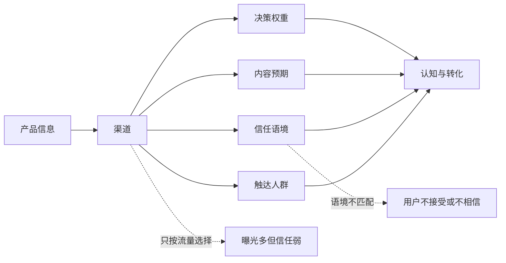
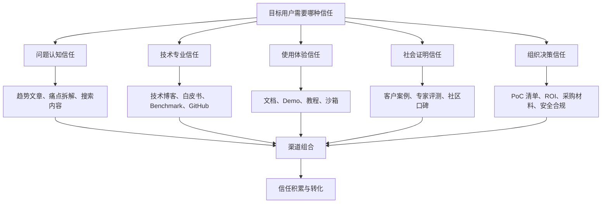

## 产品运营思维筑基课: 产品运营的底层公理: 渠道不是流量管道，而是信任场域
  
### 作者  
digoal  
  
### 日期  
2026-05-13
  
### 标签  
渠道 , 信任场域 , 产品运营 , 技术传播 , 内容渠道 , 社区运营 , 品牌信任 , 用户触达 , 流量误区 , 运营公理
  
----  
  
## 背景 

> 面向对象: 高中生、大学生、产品运营新人、技术产品市场与运营同学  
> 核心问题: 为什么同一篇内容、同一个产品信息，放在不同渠道里效果完全不同？为什么技术产品不能只用“哪里流量大”来选择渠道？  
> 先说结论: 渠道不只是把信息送到更多人面前的管道，它还自带信任关系、用户预期、内容语境和决策权重。技术产品运营选择渠道时，不只要问“有多少流量”，更要问“这里的人为什么相信、相信什么、会把什么带入决策”。

## 一张图先看懂



可以用学校里的例子理解:

```text
同一句“这个学习方法有效”，
如果是广告传单上写的，大家可能扫一眼就过去；
如果是成绩稳定提升的同学亲自分享，大家会认真听；
如果是老师在课堂上讲，可信度又不同。
```

内容没有变，渠道带来的信任语境变了。

技术产品也是这样:

```text
官网、GitHub、技术博客、客户案例、行业会议、专家评测、朋友圈、销售私聊，
每个渠道带来的信任含义都不同。
```

## 求真讲法

### 它到底说了什么

“渠道不是流量管道，而是信任场域”说的是:

渠道不只是信息传递路径，也是用户判断信息可信度的环境。用户看到一条产品信息时，会同时判断:

```text
这是谁说的？
在哪里说的？
为什么在这里说？
这个渠道平时靠谱吗？
这里的人是否懂这个问题？
这条信息是广告、经验、证据，还是同行共识？
```

所以，渠道至少有四种属性:

| 渠道属性 | 用户会判断什么 | 技术产品例子 |
|---|---|---|
| 触达属性 | 能让多少人看到 | 信息流、公众号、搜索、广告 |
| 信任属性 | 用户为什么相信 | GitHub、技术社区、专家评测、客户案例 |
| 语境属性 | 用户来这里期待什么 | 文档站期待解决问题，会议期待趋势和案例 |
| 决策属性 | 是否影响真实采用 | 同类客户案例、架构师推荐、PoC 报告 |

如果只把渠道当流量管道，就会只关心曝光、点击和转发。但技术产品的关键问题往往不是“有没有人看见”，而是“看见之后是否愿意相信、评估、试用、推荐、采购”。

### 它是怎么来的

这条公理来自一个现实: 信息从来不是孤立出现的。人会根据“信息出现在哪里”和“由谁传递”来判断它。

同样一句话:

```text
这个数据库在高并发场景下很稳定。
```

放在不同渠道里，意义不同:

| 渠道 | 用户可能怎么理解 |
|---|---|
| 广告海报 | 这是宣传语，需要打折看 |
| 官方文档 | 这是厂商承诺，要看细节 |
| 技术博客 | 可能有原理解释，值得读 |
| Benchmark 报告 | 可以评估，但要看方法是否严谨 |
| GitHub Issue | 能看到真实问题和维护响应 |
| 客户案例 | 说明有人用过，但要看场景是否相似 |
| 架构师朋友推荐 | 信任较高，因为有关系和专业判断 |
| 行业会议演讲 | 有公共背书，但仍需看证据 |

技术产品的采用风险高，所以用户不会只看信息本身，也会看信息所在的信任场域。

这条公理和几个经典思想相通:

- 传播学中的“媒介即信息”提醒我们，媒介会影响信息意义。
- 社会证明原则说明人会参考他人和场域来判断可信度。
- 信号理论说明，在信息不对称下，渠道本身也是质量信号。
- B2B 技术营销强调不同渠道在认知、信任、评估和决策阶段承担不同功能。

把这些思想压缩成一句话，就是:

> 渠道不只是把话传出去，它还决定这句话被如何理解和相信。

### 它依赖哪些假设

这条公理依赖几个前提:

1. 用户会根据渠道判断信息可信度。
2. 不同渠道聚集的人群、关系和内容预期不同。
3. 技术产品采用需要信任，而不只是曝光。
4. 用户在不同决策阶段需要不同证据。
5. 渠道选择会影响产品品牌预期和专业形象。

如果产品是低价、低风险、强冲动消费，流量的重要性会更高。但只要产品复杂、价格高、采用风险大、需要组织决策，渠道的信任属性就会变得非常重要。

### 常见误解

**误解一: 渠道越大越好。**

不一定。大流量渠道适合扩大认知，但未必能建立技术信任。一个低信任高流量渠道，可能带来很多围观，却很少带来严肃评估。

**误解二: 同一套内容可以全渠道分发。**

不够。不同渠道的用户预期不同。官网需要清晰定位，文档需要准确可执行，技术社区需要真问题和真证据，客户案例需要场景和结果。

**误解三: 渠道只是运营部门的投放选择。**

不对。渠道会影响品牌预期、用户信任、技术形象和销售线索质量。技术产品的渠道策略应该和产品定位、内容资产、客户路径一起设计。

**误解四: 私域社群一定比公域更好。**

不一定。私域关系近，但如果内容质量低、只发广告，也会消耗信任。公域技术社区如果证据扎实，反而可能建立更高专业信任。

## 求存讲法

### 它有什么用

这条公理能帮助产品运营从“找流量”转向“匹配信任场域”。

如果只按流量思维，运营会问:

```text
哪个渠道曝光最大？
哪个渠道点击最便宜？
哪个渠道能最快涨粉？
```

如果按信任场域思维，运营会问:

```text
目标用户在哪里形成专业判断？
他们相信什么类型的证据？
哪个渠道适合讲问题，哪个适合讲原理，哪个适合讲案例？
哪些渠道影响个人试用，哪些渠道影响组织采购？
这个渠道会强化还是稀释我们的品牌预期？
```

技术产品常见渠道可以这样理解:

| 渠道 | 主要价值 | 更适合承载什么 |
|---|---|---|
| 官网 | 官方定位和转化入口 | 一句话定位、产品页、案例、试用 |
| 文档站 | 使用信任 | 快速上手、API、FAQ、最佳实践 |
| 技术博客 | 专业认知 | 原理、架构、问题拆解、边界说明 |
| GitHub | 开放和工程信任 | 代码、Issue、版本、社区贡献 |
| 客户案例 | 社会证明 | 场景、过程、结果、相似性 |
| 行业会议 | 公共背书 | 趋势、方法、标杆实践 |
| 专家评测 | 第三方信任 | 对比、验证、独立判断 |
| 社群 | 关系信任 | 答疑、反馈、持续互动 |
| 搜索 | 需求捕获 | 问题解答、教程、选型指南 |

### 它怎么迁移到熟悉领域

假设你想证明自己英语学习方法有效。

你可以在不同地方讲:

```text
朋友圈: 朋友知道你在坚持，建立关系信任。
班级分享: 同学看到你的真实变化，建立相似性信任。
老师推荐: 借助权威信任。
学习笔记: 展示方法细节，建立可验证信任。
考试成绩: 展示结果证据，建立效果信任。
```

这些都不是简单“流量渠道”。每个渠道带来的信任不同。

技术产品也是一样。一个数据库产品想证明自己可靠，不能只买广告。它需要:

```text
官方文档说明能力；
技术文章解释原理；
Benchmark 提供验证；
客户案例说明落地；
社区互动展示维护态度；
行业会议形成公共讨论。
```

这些渠道共同构成信任场域。

### 它的适用范围和边界

这条公理特别适用于:

- 技术产品
- B2B 产品
- 开发者工具
- 开源项目
- 数据库、云服务、AI 平台、安全、监控、运维产品
- 需要技术影响力和品牌影响力的产品

它的边界是:

| 场景 | 流量属性权重 | 信任属性权重 |
|---|---:|---:|
| 低价冲动消费 | 高 | 中 |
| 娱乐内容 | 高 | 中 |
| 个人效率工具 | 中 | 中 |
| 开发者工具 | 中 | 高 |
| 企业 SaaS | 中 | 高 |
| 数据库/云/安全产品 | 中 | 极高 |
| 关键行业基础设施 | 低到中 | 极高 |

需要注意的是，信任场域不是说不要流量。没有触达，信任也无法发生。更准确的说法是:

```text
先判断需要什么信任，再选择能带来这种信任的渠道，
而不是先找最大流量，再硬塞所有内容。
```

### 正例: 怎么用它提升能力

假设你运营一个企业级数据库产品，要建立“生产可靠、开发者友好”的品牌影响力。

低水平做法是:

```text
把同一篇发布稿发到所有平台，标题都写“重磅发布，新一代企业级数据库”。
```

这可能有曝光，但很难在每个渠道建立合适信任。

更好的做法是按信任场域分配内容:

1. 官网: 明确产品定位、核心场景、试用入口。
2. 文档站: 提供 10 分钟上手、迁移指南、常见问题。
3. 技术博客: 解释架构设计、性能优化、故障恢复机制。
4. GitHub: 展示代码、Issue 响应、版本节奏和社区贡献。
5. 客户案例: 讲清行业、规模、问题、方案、结果。
6. 行业会议: 分享生产实践和架构方法，而不只是产品广告。
7. 专家评测: 接受第三方验证，展示可信对比。
8. 社群: 持续答疑，收集反馈，培养早期支持者。

这时，渠道不是简单分发管道，而是一组信任建设场景。用户从不同渠道看到的是同一个品牌预期的不同证据。

### 反例: 前提不成立会怎样

反例一: 高流量渠道带来低信任线索。

某企业安全产品在泛娱乐信息流平台大量投放，点击成本很低，线索数量不少。但大部分用户没有采购权，也不理解安全产品，销售跟进效率很低。

这里失败的前提是:

```text
渠道不只要看触达，还要看人群和信任语境是否匹配。
```

反例二: 技术社区被当广告位使用。

某数据库产品在技术社区频繁发布营销稿，标题夸张，内容缺少原理、代码、数据和边界。社区用户不但不信任，反而形成“只会营销”的负面预期。

这里失败的前提是:

```text
技术社区的信任来自真实问题、专业证据和开放讨论，不来自广告式表达。
```

反例三: 客户案例缺少信任细节。

某产品发布客户案例，只写“某头部客户选择我们，实现数字化升级”。没有行业背景、原始问题、部署方式、效果指标和客户证言。案例看起来像宣传稿，无法成为决策证据。

这里失败的前提是:

```text
客户案例渠道的信任来自相似性和细节，而不是 Logo 本身。
```

## 思考

“渠道不是流量管道，而是信任场域”最重要的启发是: 产品运营不是把内容倒进渠道，而是把合适证据放到合适的信任环境里。

可以用这张图检查技术产品的渠道策略:



对技术影响力来说，这条公理意味着:

```text
技术影响力不是哪里人多就去哪里喊，
而是在专业用户形成判断的场域里持续提供可验证证据。
```

对品牌影响力来说，这条公理意味着:

```text
品牌影响力不是全网刷存在感，
而是在关键渠道里形成一致、可信、可复述的预期。
```

可以进一步追问:

1. 我们现在最依赖的渠道，带来的是什么信任？
2. 哪些渠道只有曝光，没有决策影响？
3. 哪些渠道能让技术用户真正评估我们？
4. 我们是否把广告内容误投到了需要专业证据的渠道？
5. 用户从不同渠道看到我们时，形成的品牌预期是否一致？

## 最后记住

1. 渠道不只是流量入口，也是用户判断可信度的场域。
2. 同一条信息在不同渠道里，会被赋予不同信任含义。
3. 技术产品要按信任需求选择渠道，而不是只按流量大小选择渠道。
4. 技术社区、文档、GitHub、客户案例、专家评测各自承载不同信任。
5. 技术影响力和品牌影响力，来自在关键渠道里长期提供一致且可信的证据。

## 参考资料

- Marshall McLuhan, *Understanding Media: The Extensions of Man*, 1964.
- Robert B. Cialdini, *Influence: The Psychology of Persuasion*, 1984.
- Michael Spence, “Job Market Signaling”, 1973.
- Everett M. Rogers, *Diffusion of Innovations*, 1962.
- Geoffrey A. Moore, *Crossing the Chasm*, 1991.
- Philip Kotler and Kevin Lane Keller, *Marketing Management*, multiple editions.
- 本文基于传播学、信号理论、社会证明、技术产品运营、开发者关系和 B2B 产品营销中的通用经验整理；未使用实时联网资料。
  
#### [PostgreSQL 解决方案集合](../201706/20170601_02.md "40cff096e9ed7122c512b35d8561d9c8")
  
  
#### [德哥 / digoal's Github - 公益是一辈子的事.](https://github.com/digoal/blog/blob/master/README.md "22709685feb7cab07d30f30387f0a9ae")
  
  
#### [About 德哥](https://github.com/digoal/blog/blob/master/me/readme.md "a37735981e7704886ffd590565582dd0")
  
  

  
