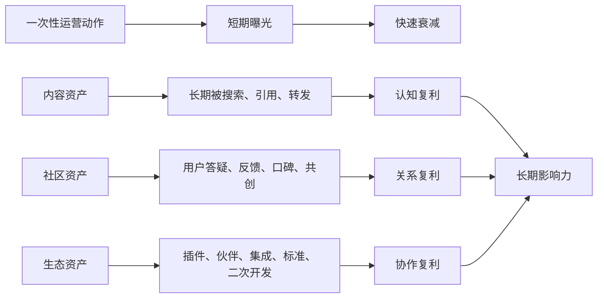
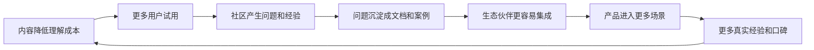
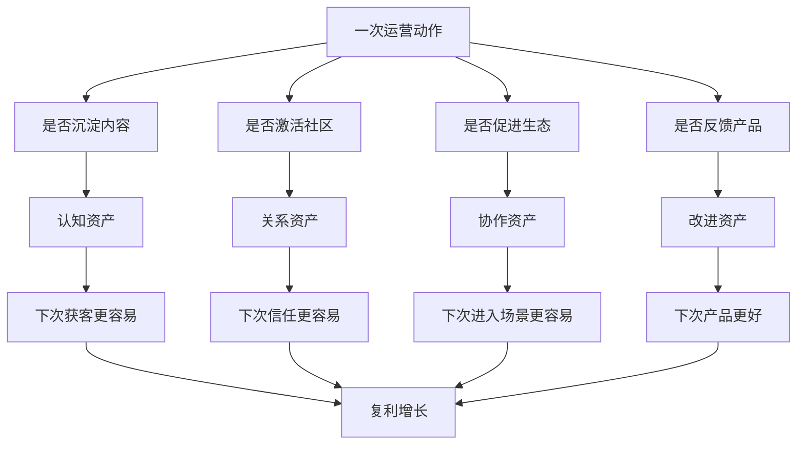

## 产品运营思维筑基课: 产品运营的底层公理: 复利来自内容、社区和生态
  
### 作者  
digoal  
  
### 日期  
2026-05-13
  
### 标签  
复利 , 内容运营 , 社区运营 , 生态建设 , 产品运营 , 技术品牌 , 长期资产 , 影响力增长 , 飞轮 , 运营公理
  
----  
  
## 背景 

> 面向对象: 高中生、大学生、产品运营新人、技术产品市场与运营同学  
> 核心问题: 为什么有些产品运营越做越轻松，影响力越滚越大；而有些产品每次增长都要重新花钱、重新吆喝、重新开始？  
> 先说结论: 一次活动、一次投放、一次发布会通常会衰减；高质量内容、活跃社区和开放生态却能长期沉淀认知、信任、关系和外部协作。技术产品的运营复利，来自这些会反复产生价值的资产，而不是只来自短期流量。

## 一张图先看懂



可以用学习类比理解:

```text
考前临时刷一晚题，效果会很快衰减。
但如果你整理错题、建立笔记、和同学互相讲题、形成学习小组，
这些东西会不断帮助你以后学得更快。
```

产品运营也是这样:

```text
一次活动像临时刷题。
内容、社区和生态像笔记系统、学习小组和知识网络。
```

## 求真讲法

### 它到底说了什么

“复利来自内容、社区和生态”说的是:

产品运营里有些动作只产生一次性效果，有些资产会反复产生效果。长期影响力来自后者。

这里的“复利”不是金融里的严格利息计算，而是一个运营类比: 今天积累的资产，会降低明天获客、教育、信任、支持和传播的成本。

| 资产 | 沉淀什么 | 复利表现 |
|---|---|---|
| 内容 | 认知、方法、证据、搜索入口 | 一篇好文章长期带来理解和线索 |
| 社区 | 关系、反馈、口碑、归属感 | 用户互相帮助，降低支持和传播成本 |
| 生态 | 集成、插件、伙伴、应用场景 | 外部力量帮产品进入更多场景 |

对技术产品来说，这三类资产尤其重要:

```text
内容让复杂技术被理解；
社区让用户不再孤立；
生态让产品不只靠自己扩张。
```

所以，技术产品运营不能只问:

```text
这次活动带来多少流量？
```

还要问:

```text
这次动作有没有留下可复用资产？
有没有让用户下次更容易理解我们？
有没有让社区更活跃？
有没有让伙伴更容易基于我们做东西？
```

### 它是怎么来的

这条公理来自运营资产的时间差异。

一次性动作通常有明显峰值:

```text
发布会当天热闹，几天后衰减；
广告投放一停，流量下降；
短期促销结束，转化回落；
热点文章过期，关注消失。
```

而内容、社区、生态有长期沉淀能力:

```text
教程会被搜索；
案例会被销售复用；
技术文章会被社区引用；
FAQ 会减少重复答疑；
插件会带来新用户；
伙伴集成会进入新场景；
用户之间会互相推荐和支持。
```

这条公理和几个经典思想相通:

- 复利思维强调长期积累和再投资。
- 网络效应说明参与者越多，系统价值可能越高。
- 创新扩散理论强调新技术通过社会系统扩散。
- 开发者关系和开源运营强调文档、社区、贡献和生态对技术产品长期增长的作用。
- 内容营销强调高质量内容能成为长期获客和教育市场的资产。

把这些思想压缩成一句话，就是:

> 短期运营买来注意力，长期运营沉淀复利资产。

### 它依赖哪些假设

这条公理依赖几个前提:

1. 产品有长期经营价值，而不是一次性交易。
2. 用户会持续搜索、学习、讨论、比较和推荐。
3. 内容、社区和生态资产能够被反复使用。
4. 技术产品需要长期教育、信任和支持。
5. 外部用户、开发者、伙伴和客户能参与价值创造。

如果产品生命周期很短、复购很低、没有学习成本、没有社区关系、也不需要生态协作，复利空间会较小。但技术产品通常复杂、长期、多人使用、持续迭代，因此更适合做复利资产。

### 常见误解

**误解一: 复利就是慢慢做，不看短期结果。**

不对。复利不是拒绝短期目标，而是让短期动作尽量留下长期资产。一次发布会也可以沉淀成视频、文章、FAQ、案例、销售材料和社区讨论。

**误解二: 内容越多，复利越强。**

不一定。低质量、无主线、不可搜索、不可复用的内容会制造噪音。真正产生复利的是能长期解决问题、建立认知、提供证据的内容。

**误解三: 社区就是拉一个群。**

不够。群只是容器。社区的核心是持续互动、共同问题、互助机制、身份认同和贡献路径。

**误解四: 生态是大公司才有的事。**

不对。小产品也可以有轻生态，比如模板、插件、API、示例项目、伙伴集成、教程作者、第三方服务商。生态的本质是让外部力量围绕产品创造价值。

## 求存讲法

### 它有什么用

这条公理能帮助产品运营从“做完即结束”转向“每次都沉淀资产”。

如果没有复利思维，运营动作容易变成:

```text
发一篇稿，热度过去就结束。
办一场活动，结束后资料散落。
做一次投放，钱花完就归零。
回答一次用户问题，下次同样问题再答一遍。
接一个伙伴集成，经验没有文档化。
```

如果有复利思维，同样动作会变成:

| 一次性动作 | 复利化处理 |
|---|---|
| 发布会 | 拆成文章、视频、FAQ、销售材料、社区话题 |
| 用户答疑 | 沉淀进文档、知识库、教程和案例 |
| 客户 PoC | 总结成行业方案、检查清单、最佳实践 |
| 技术分享 | 变成原理文章、Demo、代码样例 |
| 伙伴合作 | 变成集成文档、联合案例、解决方案页 |
| 社区讨论 | 提炼成产品反馈、路线图输入、公开答疑 |

技术产品运营要反复问:

```text
这件事做完以后，还留下些什么？
下一个用户能不能因此更容易理解、试用、采用或推荐？
```

### 它怎么迁移到熟悉领域

假设你要学编程。

低复利做法是:

```text
遇到一个问题，搜答案，复制代码，解决后就忘。
```

高复利做法是:

```text
记录问题原因；
整理成笔记；
写一个最小示例；
分享给同学；
把常用代码封装成模板；
以后遇到类似问题可以快速复用。
```

第一次看起来慢，后面会越来越快。

产品运营也是一样。比如技术团队解决了一个客户迁移问题:

低复利做法:

```text
私下帮客户解决，事情结束。
```

高复利做法:

```text
沉淀迁移文档；
补充 FAQ；
写成匿名案例；
做成迁移检查清单；
让销售和客户成功复用；
把共性问题反馈给产品。
```

这就是运营复利。

### 它的适用范围和边界

这条公理特别适用于:

- 技术产品
- 开源项目
- 开发者工具
- 企业 SaaS
- 数据库、云服务、AI 平台、安全、监控、运维产品
- 需要长期技术影响力和品牌影响力的产品

它的边界是:

| 场景 | 复利空间 | 说明 |
|---|---:|---|
| 一次性活动 | 低到中 | 如果不沉淀资产，很快衰减 |
| 低价冲动消费 | 中 | 内容和社区可能有用，但不是全部核心 |
| 标准化 SaaS | 高 | 文档、案例、模板、社区能持续复用 |
| 开发者工具 | 极高 | 文档、代码、插件、社区贡献是增长核心 |
| 开源项目 | 极高 | 社区和生态直接影响项目生命力 |
| 企业基础设施 | 高 | 案例、最佳实践、伙伴生态长期降低采用风险 |

也要注意: 复利资产不是越大越好。社区如果没有治理会失控，生态如果没有标准会碎片化，内容如果没有维护会过期。复利需要持续维护，否则资产会折旧。

### 正例: 怎么用它提升能力

假设你运营一个面向开发者的数据库产品。

低水平做法是:

```text
每个月追热点，写几篇宣传文，办一场线上活动。
```

这可能带来短期流量，但难以形成长期壁垒。

复利化运营可以这样设计:

1. 内容资产: 持续建设查询优化、迁移实践、故障排查、AI 检索等主题文章。
2. 文档资产: 把用户问题沉淀成 FAQ、教程、最佳实践和排错手册。
3. 社区资产: 鼓励用户分享场景、插件、案例和问题解决经验。
4. 生态资产: 建设驱动、插件、模板、可观测集成、云市场镜像。
5. 案例资产: 把 PoC、上线、优化过程沉淀成可复用行业方案。
6. 反馈资产: 把社区问题转化为产品路线图和内容选题。

这会形成一个飞轮:



这时，运营不再只是不断消耗预算买流量，而是在建设越来越厚的影响力底座。

### 反例: 前提不成立会怎样

反例一: 只做活动，不做沉淀。

某技术产品每月办线上直播，报名人数不错，但直播结束后没有整理文字稿、Demo、FAQ、代码样例和后续社群讨论。几个月后，新用户仍然要从零理解产品，销售也没有可复用材料。

这里失败的前提是:

```text
一次性动作如果不沉淀资产，就很难产生复利。
```

反例二: 有社区容器，没有社区机制。

某产品建了多个用户群，但群里主要是官方发广告，用户问题无人系统回答，也没有精华沉淀、贡献激励和经验分享。时间久了，群变成低质量通知渠道。

这里失败的前提是:

```text
社区复利来自互动、互助、贡献和治理，不来自群本身。
```

反例三: 生态开放但没有标准。

某平台开放 API，鼓励伙伴开发插件，但文档不清楚、版本经常破坏兼容、审核规则混乱。伙伴开发成本高，用户也不敢依赖插件。

这里失败的前提是:

```text
生态复利需要稳定接口、清晰规则和长期信任。
```

## 思考

“复利来自内容、社区和生态”最重要的启发是: 产品运营不是每次都从零开始获取注意力，而是不断把注意力转化为未来还能使用的资产。

可以用这张图检查一个技术产品是否具备运营复利:



对技术影响力来说，这条公理意味着:

```text
技术影响力不是偶尔一次出圈，
而是长期有内容可被搜索、有社区可被讨论、有生态可被接入。
```

对品牌影响力来说，这条公理意味着:

```text
品牌影响力不是一次传播峰值，
而是用户在不同时间、不同场景、不同关系里反复遇见同一种可信价值。
```

可以进一步追问:

1. 我们最近一次运营动作留下些什么长期资产？
2. 哪些内容会在半年后仍然有用？
3. 用户之间是否能互相帮助，还是所有问题都依赖官方？
4. 外部伙伴是否能基于我们创造新价值？
5. 我们的社区和生态是在增强产品，还是只是在消耗运营人力？

## 最后记住

1. 一次性流量会衰减，内容、社区和生态能沉淀复利。
2. 内容沉淀认知，社区沉淀关系，生态沉淀外部协作。
3. 技术产品越复杂，越需要长期资产降低理解、信任和采用成本。
4. 复利不是慢，而是让每次运营动作都留下可复用资产。
5. 技术影响力和品牌影响力的长期壁垒，来自持续可搜索、可讨论、可接入、可共创的资产网络。

## 参考资料

- Everett M. Rogers, *Diffusion of Innovations*, 1962.
- Geoffrey A. Moore, *Crossing the Chasm*, 1991.
- Robert Metcalfe, Metcalfe's Law, commonly associated with network value effects.
- Brian Balfour, growth loops and growth model writings.
- David A. Aaker, *Managing Brand Equity*, 1991.
- Philip Kotler and Kevin Lane Keller, *Marketing Management*, multiple editions.
- 本文基于内容营销、开发者关系、开源社区、生态建设、网络效应和技术产品运营中的通用经验整理；未使用实时联网资料。
  
#### [PostgreSQL 解决方案集合](../201706/20170601_02.md "40cff096e9ed7122c512b35d8561d9c8")
  
  
#### [德哥 / digoal's Github - 公益是一辈子的事.](https://github.com/digoal/blog/blob/master/README.md "22709685feb7cab07d30f30387f0a9ae")
  
  
#### [About 德哥](https://github.com/digoal/blog/blob/master/me/readme.md "a37735981e7704886ffd590565582dd0")
  
  

  
